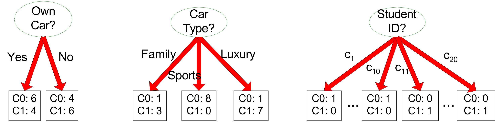
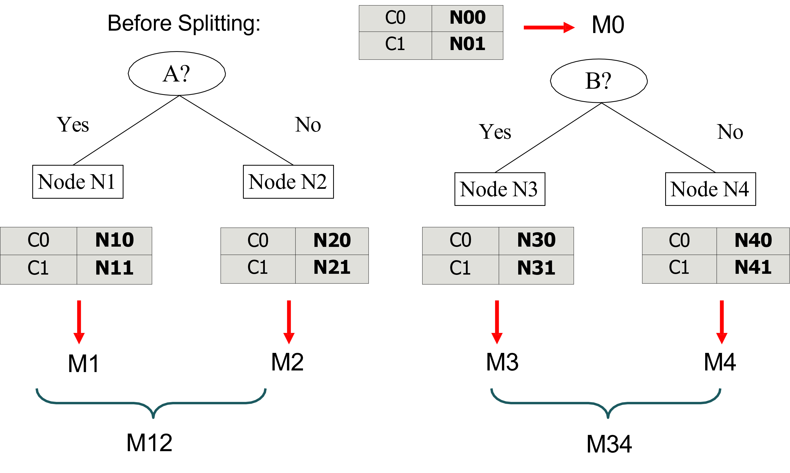
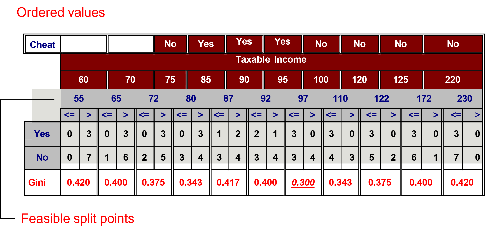
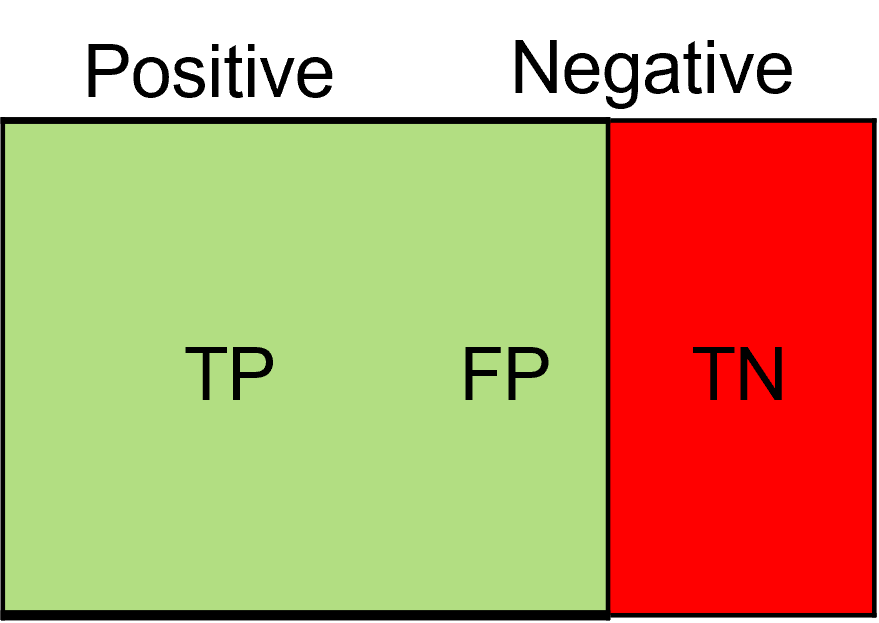
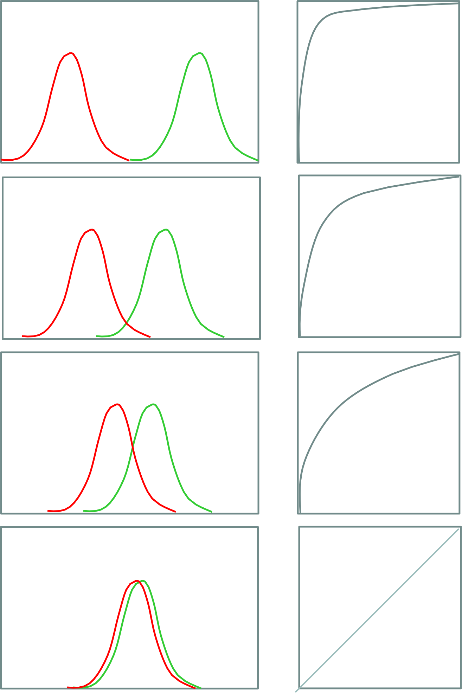
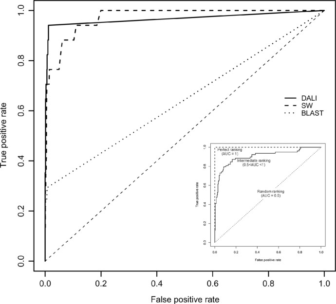
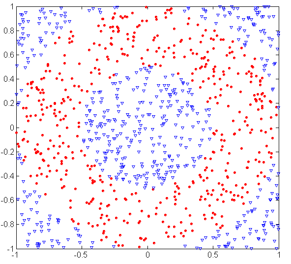
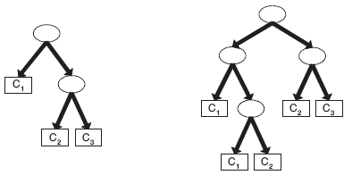
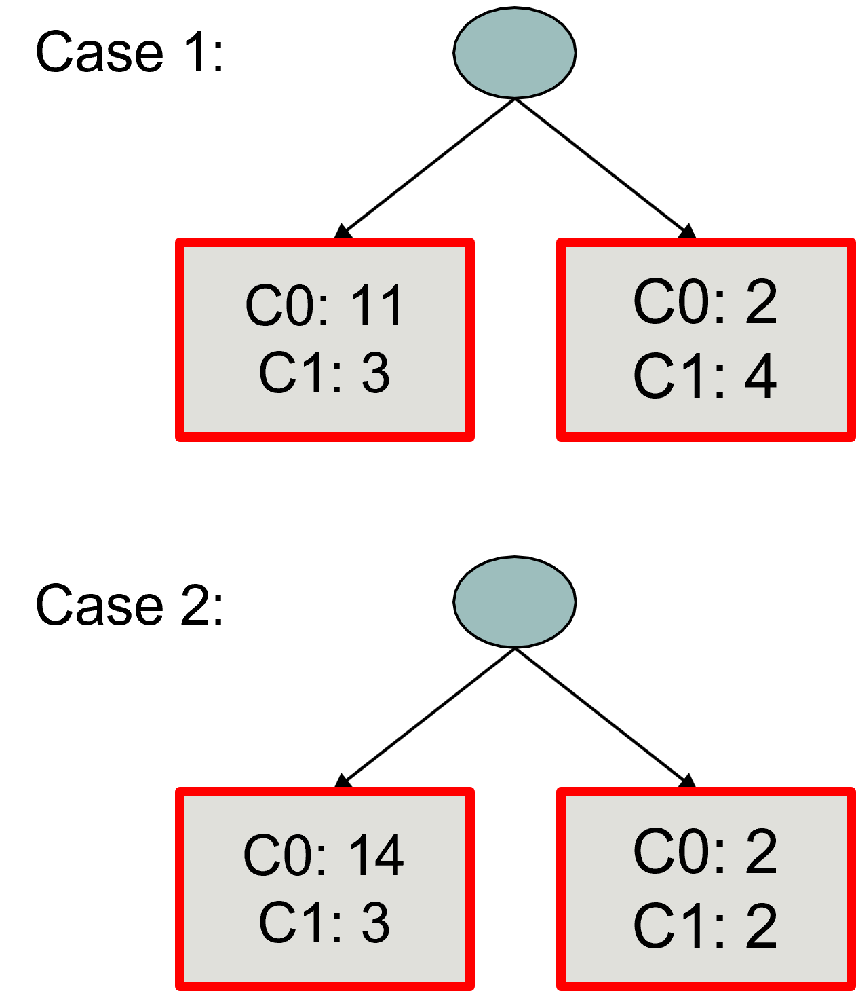

# Motivating problem: who will churn?

**Customer churn** is a critical metric when it is much less expensive to retain existing customers than it is to acquire new customers.

- Let us assume that this is our dataset to train a decision tree for predicting customer churn
- This is a *supervised learning* task since the dataset contains a *label* (or *class*) to predict (**`churn`**)
- ... as a function of *other* customer suscriptions' attributes (`months_subscribed`, ..., `auto_pay`)
- Each *row* (or *data item/record*) is customer subscription, each *column* is an *attribute* (or *feature*)

| `months_subscribed` | `monthly_watch_hours` | `tickets` | `type` | `auto_pay` | **`churn`** |
| ----------------- | ------------------- | --------------- | --------- | -------- | ----- |
| 2                 | 3                   | 2               | basic     | no       | *yes*   |
| 4                 | 6                   | 1               | basic     | no       | *yes*   |
| 6                 | 15                  | 0               | standard  | yes      | *no*    |
| 12                | 22                  | 0               | premium   | yes      | *no*    |
| 3                 | 4                   | 3               | basic     | no       | *yes*   |
| 8                 | 18                  | 0               | standard  | yes      | *no*    |
| 5                 | 7                   | 1               | basic     | yes      | *no*    |
| 1                 | 2                   | 2               | basic     | no       | *yes*   |
| 10                | 20                  | 0               | premium   | yes      | *no*    |
| 7                 | 12                  | 1               | standard  | yes      | *no*    |
| 2                 | 5                   | 2               | basic     | no       | *yes*   |
| 9                 | 16                  | 0               | premium   | yes      | *no*    |

# Learning objectives

By the end of this lecture, you will be able to:

- **Explain** how a decision tree turns feature tests into a prediction
- **Build** a small classification tree by selecting and evaluating candidate splits
- **Compute and interpret** impurity, gain, and classification metrics
- **Diagnose** overfitting and choose an appropriate validation or pruning strategy

# Training and test sets

First we need to split the dataset into *training* and *test sets*

__Holdout__

- Randomly use $\frac{2}{3}$ (or $\frac{4}{5}$) of training and $\frac{1}{3}$ (or $\frac{1}{5}$) for testing.
- They are not overlapping
- Disadvantages:
    - It works with a reduced set of training
    - The result depends on the composition of the training set and test set

# Training and test sets

*Training test*: used for training the model

| `months_subscribed` | `monthly_watch_hours` | `tickets` | `type` | `auto_pay` | **`churn`** |
| ----------------- | ------------------- | --------------- | --------- | -------- | ----- |
| 2                 | 3                   | 2               | basic     | no       | *yes*   |
| 4                 | 6                   | 1               | basic     | no       | *yes*   |
| 6                 | 15                  | 0               | standard  | yes      | *no*    |
| 12                | 22                  | 0               | premium   | yes      | *no*    |
| 3                 | 4                   | 3               | basic     | no       | *yes*   |
| 8                 | 18                  | 0               | standard  | yes      | *no*    |
| 5                 | 7                   | 1               | basic     | yes      | *no*    |
| 1                 | 2                   | 2               | basic     | no       | *yes*   |
| 10                | 20                  | 0               | premium   | yes      | *no*    |

*Test test*: used for testing the generalization capability of the model

| `months_subscribed` | `monthly_watch_hours` | `tickets` | `type` | `auto_pay` | **`churn`** |
| ----------------- | ------------------- | --------------- | --------- | -------- | ----- |
| 7                 | 12                  | 1               | standard  | yes      | *no*    |
| 2                 | 5                   | 2               | basic     | no       | *yes*   |
| 9                 | 16                  | 0               | premium   | yes      | *no*    |

# Supervised learning: decision trees

```{mermaid}
%%| echo: false
flowchart LR
    A[("Training set
<pre>
+-----+----------+-------+
| ... | type     | churn |
+-----+----------+-------+
| ... | basic    | yes   |
| ... | basic    | yes   |
| ... | standard | no    |
| ... | ...      | ...   |
</pre>")]
G[("Test set
<pre>
+-----+---------+
| ... | type    |
+-----+---------+
| ... | basic   |
| ... | basic   |
| ... | premium |
</pre>")]
F[("
Predicted class
<pre>
+-------+
| churn |
+-------+
| yes   |
| yes   |
| no    |
</pre>")]
    A -->|Induction| B[Learn Model]
    C(DT Algorithm) --> B
    B --> D[DT Model]
    D -->|Deduction| F
    G --> D

    style D fill:#f78c8c,stroke:#000
```

# Intuition: divide the feature space

::::{.columns}
:::{.column width=60%}
A decision tree solves a difficult classification problem through a sequence of simpler questions.

- Each internal node asks one question about one feature:
  - Which question best separates customers who churn from those who stay?
- Each answer restricts the set of possible records
- A root-to-leaf path behaves like an **if–then rule**
- Training searches for questions that make the resulting groups as pure as possible

:::
:::{.column width=40%}

```{mermaid}
%%| echo: false
flowchart TD
    A[monthly_watch_hours] -->|<= 8| B[auto_pay]
    A -->|>8| C((no))
    style C fill:#a3f7a3,stroke:#000,stroke-width:1px

    B -->|no| D((yes))
    B -->|yes| E[tickets]
    style D fill:#f78c8c,stroke:#000,stroke-width:1px

    E -->|>= 2| F((yes))
    E -->|< 2| G((no))
    style F fill:#f78c8c,stroke:#000,stroke-width:1px
    style G fill:#a3f7a3,stroke:#000,stroke-width:1px
```
:::
::::

# Formal definition: decision tree

::::{.columns}
:::{.column width=60%}
One of the most widely used classification techniques

- It represents a set of classification rules with a *tree*.
- A hierarchical structure consisting of *nodes* connected by labeled and oriented *arcs*.
- Each root-leaf path represents a classification rule.

There are two types of nodes:

- *Leaf nodes* (i.e., nodes with no children) identify the predicted classes
- The other nodes are attribute-based split conditions that that partitions the records.
    - The partitioning criterion represents the label of the arcs


:::
:::{.column width=40%}

```{mermaid}
%%| echo: false
flowchart TD
    A[monthly_watch_hours] -->|<= 8| B[auto_pay]
    A -->|>8| C((no))
    style C fill:#a3f7a3,stroke:#000,stroke-width:1px

    B -->|no| D((yes))
    B -->|yes| E[tickets]
    style D fill:#f78c8c,stroke:#000,stroke-width:1px

    E -->|>= 2| F((yes))
    E -->|< 2| G((no))
    style F fill:#f78c8c,stroke:#000,stroke-width:1px
    style G fill:#a3f7a3,stroke:#000,stroke-width:1px
```
:::
::::


# Tree learned from the training data
::::{.columns}
:::{.column width=70%}
| `months_subscribed` | `monthly_watch_hours` | `tickets` | `type` | `auto_pay` | **`churn`** |
| ----------------- | ------------------- | --------------- | --------- | -------- | ----- |
| 2                 | 3                   | 2               | basic     | no       | yes   |
| 4                 | 6                   | 1               | basic     | no       | yes   |
| 6                 | 15                  | 0               | standard  | yes      | no    |
| 12                | 22                  | 0               | premium   | yes      | no    |
| 3                 | 4                   | 3               | basic     | no       | yes   |
| 8                 | 18                  | 0               | standard  | yes      | no    |
| 5                 | 7                   | 1               | basic     | yes      | no    |
| 1                 | 2                   | 2               | basic     | no       | yes   |
| 10                | 20                  | 0               | premium   | yes      | no    |
:::
:::{.column width=30%}
```{mermaid}
%%| echo: false
flowchart TD
    A[monthly_watch_hours] -->|<= 8| B[auto_pay]
    A -->|>8| C((no))
    style C fill:#a3f7a3,stroke:#000,stroke-width:1px

    B -->|no| D((yes))
    B -->|yes| E[tickets]
    style D fill:#f78c8c,stroke:#000,stroke-width:1px

    E -->|>= 2| F((yes))
    E -->|< 2| G((no))
    style F fill:#f78c8c,stroke:#000,stroke-width:1px
    style G fill:#a3f7a3,stroke:#000,stroke-width:1px
```
:::
::::

# Reading a decision tree and predicting the class

What is the predicted class for the following test data?

| `months_subscribed` | `monthly_watch_hours` | `tickets` | `type` | `auto_pay` | `churn` |
| ----------------- | ------------------- | --------------- | --------- | -------- | ----- |
| 1                 | 2                   | 2               | basic     | no       | ?   |

# Reading a decision tree and predicting the class

What is the predicted class for the following test data?

| `months_subscribed` | **`monthly_watch_hours`** | `tickets` | `type` | `auto_pay` | **`churn`** |
| ----------------- | ------------------- | --------------- | --------- | -------- | ----- |
| 1                 | **2**                   | 2               | basic     | no       | ?   |

```{mermaid}
%%| echo: false
flowchart TD
    A[monthly_watch_hours] -->|<= 8| B[auto_pay]
    A -->|>8| C((no))

    B -->|no| D((yes))
    B -->|yes| E[tickets]

    E -->|>= 2| F((yes))
    E -->|< 2| G((no))

    style A stroke:#ff0000,stroke-width:3px
    linkStyle 0 stroke:#ff0000,stroke-width:3px

    style C fill:#a3f7a3,stroke:#000
    style D fill:#f78c8c,stroke:#000
    style F fill:#f78c8c,stroke:#000
    style G fill:#a3f7a3,stroke:#000
```

# Reading a decision tree and predicting the class

What is the predicted class for the following test data?

| `months_subscribed` | `monthly_watch_hours` | `tickets` | `type` | **`auto_pay`** | **`churn`** |
| ----------------- | ------------------- | --------------- | --------- | -------- | ----- |
| 1                 | 2                   | 2               | basic     | **no**       | ?   |

```{mermaid}
%%| echo: false
flowchart TD
    A[monthly_watch_hours] -->|<= 8| B[auto_pay]
    A -->|>8| C((no))

    B -->|no| D((yes))
    B -->|yes| E[tickets]

    E -->|>= 2| F((yes))
    E -->|< 2| G((no))

    style A stroke:#ff0000,stroke-width:3px
    linkStyle 0 stroke:#ff0000,stroke-width:3px
    style B stroke:#ff0000,stroke-width:3px
    linkStyle 2 stroke:#ff0000,stroke-width:3px

    style C fill:#a3f7a3,stroke:#000
    style D fill:#f78c8c,stroke:#000
    style F fill:#f78c8c,stroke:#000
    style G fill:#a3f7a3,stroke:#000
```

# Reading a decision tree and predicting the class

What is the predicted class for the following test data?

| `months_subscribed` | `monthly_watch_hours` | `tickets` | `type` | `auto_pay` | **`churn`** |
| ----------------- | ------------------- | --------------- | --------- | -------- | ----- |
| 1                 | 2                   | 2               | basic     | no       | **yes**   |

```{mermaid}
%%| echo: false
flowchart TD
    A[monthly_watch_hours] -->|<= 8| B[auto_pay]
    A -->|>8| C((no))

    B -->|no| D((yes))
    B -->|yes| E[tickets]

    E -->|>= 2| F((yes))
    E -->|< 2| G((no))

    style A stroke:#ff0000,stroke-width:3px
    linkStyle 0 stroke:#ff0000,stroke-width:3px
    style B stroke:#ff0000,stroke-width:3px
    linkStyle 2 stroke:#ff0000,stroke-width:3px

    style D stroke:#ff0000,stroke-width:3px
    style C fill:#a3f7a3,stroke:#000
    style D fill:#f78c8c,stroke:#000
    style F fill:#f78c8c,stroke:#000
    style G fill:#a3f7a3,stroke:#000
```

# Supervised learning: decision trees

```{mermaid}
%%| echo: false
flowchart LR
    A[("Training set")]
    G[("Test set")]
    F[("Predicted class")]

    A -->|Induction| B[Learn Model]
    C(DT Algorithm) --> B
    B --> D[DT Model]
    D -->|Deduction| F
    G --> D

    style B fill:#f78c8c,stroke:#000
    style C fill:#f78c8c,stroke:#000
```

# Learning the model

The decision tree grows exponentially with the number of attributes. Algorithms generally use greedy techniques that locally make the "best" choice.

Many algorithms are available:

- Hunt's Algorithm
- CART
- ID3, **C4.5**
- Sliq, SPRINT

Different issues have to be addressed.

- Data Fragmentation
- Search Criteria
- Expression
- Choice of the split policy
- Choice of the stop policy
- Underfitting/Overfitting
- Replication of trees

# Hunt's algorithm

::::{.columns}
:::{.column width=85%}
Recursive approach that progressively subdivides a set of $D_t$ records into pure record sets

- Let $D_t$ be the set of records of the training set corresponding to $node_t$ and $y_t = \{y_1, ..., y_k\}$ the possible class labels
- If $D_t$
    - Contains records of the $y_j$ class only, then $node_t$ is a leaf with label $y_j$
    - Is an empty set, then $node_t$ is a leaf node to which a parent node class is assigned
    - Contains records of several classes, we need an _attribute_ and a _split policy_ to partition them
- Apply the current procedure for each subset recursively
:::
:::{.column width=15%}
```{mermaid}
%%| echo: false
flowchart TD
    A["Parent"]-->B
    B["D_t"]

    style B stroke:#ff0000,stroke-width:3px
```
:::
::::

::::{.columns}
:::{.column width=50%}
:::{.fragment}
```{mermaid}
%%| echo: false
flowchart TD
    A["Parent"]-->B
    B(("node_t"))
```
:::
:::
:::{.column width=50%}
:::{.fragment}
```{mermaid}
%%| echo: false
flowchart TD
    A["Parent"]-->B
    B["node_t"]-->C
    B-->D
    B-->E
```
:::
:::
::::

# Pseudocode

| // Let E be the training set and F the attributes
| result = **PostPrune**(*TreeGrowth*(E, F));
|
| *TreeGrowth*(E, F)
|     `if` **StoppingCond**(E, F) = TRUE `then`
|         leaf = CreateNode();
|         leaf.label = **Classify**(E);
|         `return` leaf;
|     `else`
|         root = CreateNode();
|         root.test_cond = **FindBestSplit**(E, F);
|         `let` V = {v | v is a possible outcome of root.test_cond}
|         `for each` v $\in$ V `do`
|             Ev = {e | root.test_cond (e) = v and e $\in$ E}
|             child = *TreeGrowth*(Ev, F);
|             add child as descendants of root and label edge (root $\rightarrow$ child) as v
|         `end for`
|     `end if`
|     `return` root;
| `end`;

# Further remarks...

Finding an optimal decision tree is an NP-Complete problem, but many heuristic algorithms are available and very efficient.

- Most approaches run a top-down recursive partition based on greedy criteria

Classification using a decision tree is extremely fast and provides easy interpretation of the criteria.

- The worst case is $O(w)$ where $w$ is the depth of the tree

Decision trees are robust enough to handle strongly correlated attributes.

- One of the two attributes will not be considered
- It is also possible to try to discard one of the preprocessing attributes through appropriate feature selection techniques

# Further remarks...

Decision tree expressivity is limited to the possibility of performing search space partitions with conditions that involve only one attribute at a time.


# Further remarks...

This split is not feasible with traditional decision trees


# Characteristic features {background-color="#121011"}

Starting from the basic logic to completely define an algorithm for building decision trees, it is necessary to define:

- **The split condition**
- The criterion defining the best split
- The criterion for interrupting splitting

# Defining the split condition

Depends on the type of attribute

- Nominal
- Ordinal
- Continuous

Depends on the number of splits applicable to attribute values

- Binary splits
- $N$-ary splits

# Splitting *nominal* attributes

::::{.columns}
:::{.column width=50%}
*N-ary split*: creates as many partitions as there are attribute values

```{mermaid}
%%| echo: false
flowchart TD
    A["CarType"]-->|Family| B[" "]
    A-->|Sport| C[" "]
    A-->|Luxury| D[" "]

    style B stroke:#fff,stroke-width:0px,fill:#fff
    style C stroke:#fff,stroke-width:0px,fill:#fff
    style D stroke:#fff,stroke-width:0px,fill:#fff
```

:::
:::{.column width=50%}
*Binary split*: creates two partitions only. The attribute value that optimally splits the dataset must be found.

```{mermaid}
%%| echo: false
flowchart TD
    A["CarType"]-->|"{Family}"| B[" "]
    A-->|"{Sport, Luxury}"| C[" "]

    style B stroke:#fff,stroke-width:0px,fill:#fff
    style C stroke:#fff,stroke-width:0px,fill:#fff
```

```{mermaid}
%%| echo: false
flowchart TD
    X["CarType"]-->|"{Sport}"| Y[" "]
    X-->|"{Family, Luxury}"| Z[" "]

    style Y stroke:#fff,stroke-width:0px,fill:#fff
    style Z stroke:#fff,stroke-width:0px,fill:#fff
```
:::
::::

# Splitting *ordinal* attributes

::::{.columns}
:::{.column width=50%}
*N-ary split*: creates as many partitions as there are attribute values

```{mermaid}
%%| echo: false
flowchart TD
    A["Size"]-->|Small| B[" "]
    A-->|Medium| C[" "]
    A-->|Large| D[" "]

    style B stroke:#fff,stroke-width:0px,fill:#fff
    style C stroke:#fff,stroke-width:0px,fill:#fff
    style D stroke:#fff,stroke-width:0px,fill:#fff
```
:::
:::{.column width=50%}
*Binary split*: creates two partitions only. The attribute value that optimally splits the dataset must be found.

```{mermaid}
%%| echo: false
flowchart TD
    A["Size"]-->|"{Small, Medium}"| B[" "]
    A-->|"{Large}"| C[" "]

    style B stroke:#fff,stroke-width:0px,fill:#fff
    style C stroke:#fff,stroke-width:0px,fill:#fff
```

```{mermaid}
%%| echo: false
flowchart TD
    X["Size"]-->|"{Small}"| Y[" "]
    X-->|"{Medium, Large}"| Z[" "]

    style Y stroke:#fff,stroke-width:0px,fill:#fff
    style Z stroke:#fff,stroke-width:0px,fill:#fff
```
:::
::::

# Splitting continuous attributes

::::{.columns}
:::{.column width=50%}
*N-ary split*: The split condition can be expressed as a Boolean test that results in multiple ranges of values. The algorithm must consider the entire possible range of values as possible split points

```{mermaid}
%%| echo: false
flowchart TD
    A["Taxable income"]-->|< 10K| B[" "]
    A-->|"[10K, 25K)]"| C[" "]
    A-->|> 25K| D[" "]

    style B stroke:#fff,stroke-width:0px,fill:#fff
    style C stroke:#fff,stroke-width:0px,fill:#fff
    style D stroke:#fff,stroke-width:0px,fill:#fff
```
:::
:::{.column width=50%}
*Binary split*: The split condition can be expressed as a binary comparison test. The algorithm must consider all values as possible split points

```{mermaid}
%%| echo: false
flowchart TD
    A["Taxable income"]-->|"<= 20K"| B[" "]
    A-->|"> 20K"| C[" "]

    style B stroke:#fff,stroke-width:0px,fill:#fff
    style C stroke:#fff,stroke-width:0px,fill:#fff
```
:::
::::

# Splitting *continuous* attributes

A discretization technique can be used to manage the complexity of the search for optimal split points.

- __Static:__ discretization takes place only once before applying the algorithm
- __Dynamic:__ discretization takes place at each recursion step by exploiting information about the distribution of input data to the $D_t$ node.

# Characteristic features {background-color="#121011"}

Starting from the basic logic to completely define an algorithm for building decision trees, it is necessary to define:

- The split condition
- **The criterion defining the best split**
- The criterion for interrupting splitting

# How do we determine the best split value?

Before splitting a single class with 10 records in the C0 class and 10 records in the C1 class



The split criterion must allow you to determine more pure classes. It needs a measure of purity.

* Gini index
* Entropy
* Misclassification error

# How do we determine the best split value?



# Impurity measures

Given a node $p$ with records belonging to $k$ classes and its partitioning into $n$ child nodes

* $M$ = record number in parent node $p$
* $M_i$ = number of records in child node $i$

__ATTENTION: do not confuse the number of classes ($k$) and of the child nodes ($n$)__

Several indices can be adopted.

* $GINI(i) = 1 - \sum_{j=1}^kp( j | i)^2$ (adopted in CART, SLIQ, and SPRINT)
* $Entropy(i) = - \sum_{j=1}^k p(j | i) log(p(j | i))$ (adopted in ID3 e C4.5)
* $Misclassification~Error(i) = 1 - max_{j \in K} p(j|i)$

The total impurity of the split is given by the following formula, where meas () is one of the measures introduced so far.

* $Impurity_{split} = \sum_{i=1}^{n}\frac{m_i}{m}meas(i)$

# Comparing impurity measures


# Computing Gini for *binary* attributes


- $Gini(N3) = 1 - (\frac{5}{7})^2 - (\frac{2}{7})^2 = 0.408$
- $Gini(N4) = 1 - (\frac{1}{5})^2 - (\frac{4}{5})^2 = 0.320$
- $Impurity= \frac{7}{12} \cdot 0.408 + \frac{5}{12} \cdot 0.320= 0.371$

# Computing Gini for *categorical* attributes

It is usually more efficient to create a "count matrix" for each distinct value of the classification
attribute and then perform calculations using that matrix

::::{.columns}
:::{.column width=33%}
| | CarType | |
| :-: | :-: | :-: |
| | __{Sports, Luxury}__ | __{Family}__ |
| __C1__ | 3 | 1 |
| __C2__ | 2 | 4 |
| Gini | __0.400__ | |
:::
:::{.column width=33%}
| | CarType | |
| :-: | :-: | :-: |
| | __{Sports}__ | __{Family, Luxury}__ |
| __C1__ | 2 | 2 |
| __C2__ | 1 | 5 |
| Gini | __0.419__ | |
:::
:::{.column width=33%}
| | CarType | | |
| :-: | :-: | :-: | :-: |
| | __Family__ | __Sports__ | __Luxury__ |
| __C1__ | 1 | 2 | 1 |
| __C2__ | 4 | 1 | 1 |
| Gini | __0.393__ | | |
:::
::::

# Computing Gini for *continuous* attributes

It requires defining the split point using a binary condition.

- The number of possible conditions is equal to the number of distinct values of the attribute.
- Can calculate a matrix count for each split value.
    - The matrix will count the elements of each class for attribute values greater than or less than the split value.

A naive approach:

- For each split $v$ value, read the DB (with $N$ records) to build the count matrix and calculate the Gini index
- Computationally inefficient $O(N^2)$:
    - Scan DB: $O(N)$
    - Repeat for each value of $v$ (i.e., $v \cdot O(N)$)

# Computing Gini for *continuous* attributes

A more efficient solution is to:

- Sort records by attribute value
- Read the values sorted and update the count matrix, then calculate the Gini index
- Choose as the split point the value that minimizes the index



Further optimizations?

# Gain-based split

Using class impurity measures such as Gini and Entropy requires choosing the split value that maximizes the "gain" in terms of reducing the impurity of the classes after the split.

For example, considering entropy, the gain of partitioning of a node into child nodes is:

$GAIN_{split}=Entropy(p)-(\sum_{i=1}^{n}\frac{m_i}{m}Entropy(i))$

Selecting the split value that maximizes GAIN tends to determine split criteria that generate a very large number of very pure classes, but with few records.

- Partitioning students according to their enrollment guarantees that all classes (formed by only one student) are totally pure

# Split based on split infor

To avoid the problem of spraying classes, it is preferable to maximize the Gain Ratio:

- $N$ = number of child nodes
- $M$ = record number in father $p$
- $m_i$ = number of records in child node $i$

$GainRATIO_{split}=\frac{GAIN_{split}}{SplitINFO}$

$SplitINFO=-\sum_{i=1}^n\frac{m_i}{m}log\frac{m_i}{m}$

The higher the number of children, the greater the value of SplitInfo, with a consequent  reduction in the GainRatio

- For example, assuming that each child node contains the same number of records, SplitInfo = log n.
- C4.5 uses the SplitINFO-based criterion

# Split based on split info

To avoid the problem of spraying classes, it is preferable to maximize the Gain Ratio:

- $n \in [2, 64]$
- $m = 100$
- $m_i = \frac{m}{n}$


# Characteristic features {background-color="#121011"}

Starting from the basic logic to completely define an algorithm for building decision trees, it is necessary to define:

- The split condition
- The criterion defining the best split
- **The criterion for interrupting splitting**

# Stopping criteria for decision-tree induction

- Stop splitting a node when all its records belong to the same class
- Stop splitting a node when all its records have similar values on all attributes
    - Classification would be unimportant and dependent on small fluctuations in values
- Stop splitting when the number of records in the node is below a certain threshold (data fragmentation)
    - The selected criterion would not be statistically relevant

# Model evaluation

```{mermaid}
%%| echo: false
flowchart LR
    A[("Training set")]
    G[("Test set")]
    F[("Predicted class")]
    A -->|Induction| B[Learn Model]
    C(DT Algorithm) --> B
    B --> D[DT Model]

    G -->D
    D -->|Deduction| F
    F --> I[Evaluation]
    H[(Real Class)] --> I
    I --> J((Performance))

    style I fill:#f78c8c,stroke:#000
    style J fill:#f78c8c,stroke:#000
```

# Metrics for model evaluation

The Confusion Matrix evaluates the ability of a classifier based on the following indicators.

- $TP$ (true positive): records correctly classified as the Yes class
- $FN$ (false negative): Incorrectly classified records as class No
- $FP$ (false positive): Incorrectly classified records as class Yes
- $TN$ (true negative) records correctly classified as class No

| Predicted $\downarrow$ / Expected $\rightarrow$ | **Class=+** | **Class=-** |
| :-: | :-: | :-: |
| **Class=+** | TP | FN |
| **Class=-** | FP | TN |

If the classification uses $n$ classes, the confusion matrix will be $n \cdot n$

# Accuracy

Accuracy is the most widely used metric to synthesize the information of a confusion matrix.

$Accuracy=\frac{TP + TN}{TP + TN + FP + FN}$

Equally, the frequency of the error could be used.

$Error~rate=\frac{FP + FN}{TP + TN + FP + FN}$

# Accuracy limitations

Accuracy is not an appropriate metric if the classes contain a very different number of records. Consider a binary classification problem in which

- #Record of class 0 = 9990
- #Record of class 1 = 10

A model that always returns class 0 will have an accuracy of $\frac{9990}{10000}$ = 99.9%

In the case of binary classification problems, the class "rare" is also called a positive class.

# Precision and recall

Precision and Recall are two metrics used in applications where _the correct classification of positive class records is more important_

- __Precision__ ($Precision = \frac{TP}{TP + FP}$) measures the fraction of record results that are actually positive among all those who were classified as such.
    - High values indicate that few negative class records were incorrectly classified as positive.
- __Recall__ ($Recall = \frac{TP}{TP + FN}$) measures the fraction of positive records correctly classified
    - High values indicate that few records of the positive class were incorrectly classified as negatives.


# Precision and recall

::::{.columns}
:::{.column width=50%}
$Precision = 1$ if all the positive records were actually detected


:::
:::{.column width=50%}
$Recall = 1$ if there are no false negatives


:::
::::

If both are valid 1, the predetermined classes coincide with the real ones.

# F-measure

A metric that summarizes precision and recall is called the F-measure ($\text{F-measure} = \frac{2 \cdot Precision \cdot Recall}{Precision + Recall} = \frac{2 \cdot TP}{2 \cdot TP + FP + FN}$).


F-measure represents the harmonic mean of precision and recall.

- The harmonic average between two x and y numbers tends to be close to the smallest of the two numbers.
- So if the harmonic average is high, it means both precision and recall are.
- ... so there have been no false negatives or false positives

# Cost-based evaluation

Accuracy, Precision, Recall, and F-measure classify an instance as positive if $P(+, i)>P(-, i)$.

- They assume that FN and FP have the same weight, thus they are Cost-Insensitive
- In many domains, this is not true!
    - For a cancer screening test, for example, we may be prepared to put up with a relatively high false positive rate in order to get a high true positive; it is most important to identify possible cancer sufferers
    - For a follow-up test after treatment, however, a different threshold might be more desirable, since we want to minimize false negatives; we don't want to tell a patient they're clear if this is not actually the case.


# The cost matrix

The cost matrix encodes the penalty that a classifier incurs in classifying a record in a different class.

A negative penalty indicates the "prize" that is obtained for a correct classification.

$C(M)=TP \cdot C(+|+) + FP \cdot C(+|- ) + FN \cdot C(- |+) + TN \cdot C(- |- )$


| Predicted $\downarrow$ / Expected $\rightarrow$ | **Class=+** | **Class=-** |
| :-: | :-: | :-: |
| **Class=+** | C(+\|+) | C(+\|-) |
| **Class=-** | C(-\|+) | C(-\|-) |

A model constructed by structuring, as a purity function, a cost matrix, will tend to provide a model with a minimum cost over the specified weights.

# Computing the cost

::::{.columns}
:::{.column width=33%}

Costs

| Predicted $\downarrow$ / Expected $\rightarrow$ | **Class=+** | **Class=-** |
| :-: | :-: | :-: |
| **Class=+** | -1 | 100 |
| **Class=-** | 1 | 0 |
:::
:::{.column width=33%}

:::{.fragment}
Predictions of Model M1

| Predicted $\downarrow$ / Expected $\rightarrow$ | **Class=+** | **Class=-** |
| :-: | :-: | :-: |
| **Class=+** | 150 | 40 |
| **Class=-** | 60 | 250 |

- Accuracy = 80%
- Cost = 3910
:::

:::
:::{.column width=33%}

:::{.fragment}
Predictions of Model M2

| Predicted $\downarrow$ / Expected $\rightarrow$ | **Class=+** | **Class=-** |
| :-: | :-: | :-: |
| **Class=+** | 250 | 45 |
| **Class=-** | 5 | 200 |

- Accuracy = 90%
- Cost = 4255
:::

:::
::::

# ROC curves compare sensitivity with false alarms

::::{.columns}
:::{.column width=55%}
A ROC curve plots:

$$
\mathrm{TPR}=\frac{TP}{TP+FN}
\qquad
\mathrm{FPR}=\frac{FP}{FP+TN}
$$

- **True-positive rate (TPR):** fraction of positives correctly detected
- **False-positive rate (FPR):** fraction of negatives incorrectly classified as positive
- One classifier threshold produces one point $(\mathrm{FPR},\mathrm{TPR})$
:::
:::{.column width=45%}

:::
::::

# Changing the threshold traces the ROC curve

Many classifiers output a **score** rather than only a class.

Predict positive when:

$$
\operatorname{score}(i)\geq x
$$

- Lowering $x$ usually detects more positives but also creates more false alarms
- Raising $x$ usually reduces both true positives and false positives
- Varying $x$ traces the complete ROC curve


# Better curves approach the upper-left corner

::::{.columns}
:::{.column width=45%}

:::
:::{.column width=55%}
- $(0,1)$ represents perfect classification
- The diagonal represents random ranking: $\mathrm{TPR}=\mathrm{FPR}$
- **AUC** summarizes performance across all thresholds
    - $1.0$: perfect ranking
    - $0.5$: random ranking
- Greater class overlap makes discrimination harder
:::
::::

# Compare models where the operating point matters

::::{.columns}
:::{.column width=55%}

:::
:::{.column width=45%}
- A curve above another performs better across those thresholds
- If curves cross, the best model depends on the tolerated FPR and required TPR
- AUC is useful as a summary, but it does not select the operating threshold
- ROC rates are normalized within each class; precision and cost can still change with class prevalence
:::
::::

# Classification errors {background-color="#121011"}

- __Training error:__ are mistakes that are made on the training set
- __Generalization error:__ errors are made on the test set (i.e., records that have not been trained on the system).
- __Underfitting:__ The model is too simple and does not allow a good classification of the training set or test set
- __Overfitting:__ The model is too complex, it allows a good classification of the training set, but a poor classification of the test set

    - The model fails to generalize because it is based on the specific peculiarities of the training set that are not found in the test set (e.g., noise present in the training set)

# Underfitting and overfitting

::::{.columns}
:::{.column width=50%}

:::
:::{.column width=50%}

:::
::::

- 500 circles and 500 triangles
- Circular points: $0.5 < sqrt(x12+x22) \le 1$
- Triangular points: $sqrt(x12+x22) > 0.5~or~sqrt(x12+x22) < 1$

# Failure case: overfitting to noise


# Overfitting due to the reduced size of the training set

Lack of points at the bottom of the chart makes it difficult to find a proper classification for that portion of the region.


# Handling overfitting: pre-pruning (early stopping)

Stop splitting before you reach a deep tree.

A node can not be split further if:

- Node does not contain instances
- All instances belong to the same class
- All attributes have the same values

More restrictive conditions potentially applicable are:

- Stop splitting if the number of instances in the node is less than a fixed amount
- Stop splitting if the distribution of instances between classes is independent of attribute values
- Stop splitting if you do not improve the purity measure (e.g., Gini or information gain).

# Handling overfitting: post-pruning (reduced-error pruning)

- Run all possible splits
- Examine the decision tree nodes obtained with a bottom-up logic
- Collate a sub tree in a leaf node if this allows to reduce the generalization error (i.e., on the validation set)
    - Choose to collapse the sub-tree that determines the maximum error reduction (N.B. greedy choice)

Instances in the new leaf can be tagged.

- Based on the label that appears most frequently in the sub-trees
- According to the label that occurs most frequently in the instances of the training set that belong to the sub-tree

Post-pruning is more effective but involves more computational cost. It is based on the evidence of the result of a complete tree.

# Notes on overfitting

Overfitting results in more complex decision-making trees than necessary

The classification error done on the training set does not provide accurate estimates about tree behavior on unknown records.

It requires new techniques to estimate generalization errors.

# Estimating generalization error

A decision tree should minimize the error on the real data set; unfortunately, during construction, only the training set is available.

Then the real-time data error must be estimated.

- __Re-substitution error:__ number of errors in the training set
- __Generalization error:__ number of errors in the real data set

The methods for estimating the generalization error are:

- __Optimistic approach:__ $e'(t) = e(t)$
- __Pessimistic approach__
- __Minimum Description Length (MDL)__
- __Using the test set:__ The generalization error is equal to the error on the test set.

    - Normally, the test set is obtained by extracting from the initial training set 1/3 of the records
    - It offers good results, but the risk is to work with a too small training set

# Occam's razor

Given two models with a similar generalization error, always choose the simplest one.

- For complex models, it is more likely that errors are caused by accidental data conditions

It is therefore useful to consider the complexity of the model when evaluating the goodness of a decision tree.

Note: The methodological principle was expressed in the 14th century by the English Franciscan philosopher and friar William of Ockham

# Minimum description length

Given two models, choose the one that minimizes the cost to describe a classification. To describe the model, I can:

- Sequentially send class $O(n)$
- Build a classifier, and send the description along with a detailed description of the mistakes it makes

$Cost(model, data)=Cost(model)+Cost(data|model)$

# Minimum description length



Datasets with $n$ records described by 16 binary attributes and 3 class values

- Each inner node is modeled with the ID of the used attribute: $log_2(16)=4$ bits
- Each leaf is modeled with the ID of the class: $log_2(3)=2$ bits
- Each error is modeled with its position in the training set, considering $n$ record: $log_2(n)$

Cost:

- Cost(Tree1)= $4 \cdot 2 + 2 \cdot 3 + 7 \cdot log_2(n) = 14 + 7 \cdot log_2(n)$
- Cost(Tree2)= $4 \cdot 4 + 2 \cdot 5 + 4 \cdot log_2(n) = 26 + 4 \cdot log_2(n)$
- Overall: Cost(Tree1) < Cost(Tree2) if $n$ < 16

# Pessimistic approach

The generalization error is estimated by adding to the error on the training set a penalty related to the complexity of the model.

- $e(t_i)$: classification errors on leaf $i$

    - $\Sigma(t_i)$: leaf-related penalty $i$
    - $n(t_i)$ number of records in the training set belonging to leaf $i$

$E(T)=\frac{\sum_{i=1}^k e(t_i)+\Sigma(t_i)}{\sum_{i=1}^k n(t_i)}$

For binary trees, a penalty equal to 0.5 implies that a node should always be expanded into the two child nodes if it improves the classification of at least one record.

# Post-pruning example

::::{.columns}
:::{.column width=50%}
| Class | Instances|
| :-: | :-: |
| Class = Yes | 20 |
| Class = No | 10 |

:::
:::{.column width=50%}

:::
::::

- Training error (before split) = $\frac{10}{30}$
- Pessimistic error = $\frac{10 + 0.5}{30} = \frac{10.5}{30}$
- Training error (after split) = $\frac{9}{30}$
- Pessimistic error (after splitting) = $\frac{9 + 4 \cdot 0.5}{30} = \frac{11}{30}$

PRUNE!

# Post-pruning example

::::{.columns}
:::{.column width=50%}
Optimistic error?

- Do not cut in any of the cases

Pessimistic error (penalty 0.5)?

- Do not cut in case 1, cut in case 2

Pessimistic error (penalty 1)?
:::
:::{.column width=50%}

:::
::::

# Building the test set

__Holdout__

Use $\frac{2}{3}$ of the training records and $\frac{1}{3}$ for validation.

Disadvantages:

* It works with a reduced set of training
* The result depends on the composition of the training set and test set

__Random subsampling__

It consists of a repeated execution of the holdout method, in which the training dataset is randomly selected.

# Building the test set

__Cross validation__

- Partition the records into separate $k$ subdivisions
- Run the training on $k-1$ partitions and test the remainder
- Repeat the test $k$ times and calculate the average accuracy
- CAUTION: cross-validation creates $k$ different classifiers. Thus, validation indicates how much the type of classifier and its parameters are appropriate for the specific problem
- Built decision trees can have different split attributes and conditions depending on the character of the $k$-th training set

# Bootstrap

Unlike previous approaches, the extracted records are replaced. If the initial dataset consists of $N$records, you can create an $N$-record set in which each record has approximately a 63.2% probability of appearing (with $N$sufficiently large)

$1 - (1 - \frac{1}{N})^N = 1 - e^{-1} = 0.632$

- Records that are not used even once in the current training set form the validation set

The procedure is repeated $b$ times. Commonly, the model's accuracy is calculated as:

$Acc_{boot} = \frac{1}{b} \sum_{i=1}^b 0.632 \cdot Acc_i + 0.368 \cdot Acc_s$

where $Acc_i$ is the accuracy of the $i$-th bootstrap, $Acc_s$ is the accuracy of the complete dataset

The bootstrap does not create a (new) dataset with more information, but it can stabilize the obtained results of the available dataset. It is therefore particularly useful for small datasets.

# C4.5

Widely used Decision Tree algorithm. It extends ID3 and the Hunt Algorithm.

__Features:__

- Use GainRatio as a criterion for determining the split attribute
- It manages the continuous attributes by determining a split point that divides the range of values into two
- It manages data with missing values. Missing attributes are not considered to calculate GainRatio.
- It can handle attributes that are associated with different weights
- Run post-pruning of the created tree

__The tree construction stops when:__

- The node contains records belonging to a single class
- No attribute allows for determining a positive GainRatio
- Node does not contain records.

# Summary: when should I use a decision tree?

**Use a decision tree when:**

- You need an interpretable model expressed as rules
- Non-linear interactions are likely, but extensive preprocessing is undesirable

**Be careful when:**

- Small data changes produce very different trees
- The tree grows deep enough to memorize noise
- Accuracy hides class imbalance or unequal error costs

**Remember:** choose splits on training data, tune and prune with validation data, and report performance only on untouched test data.
