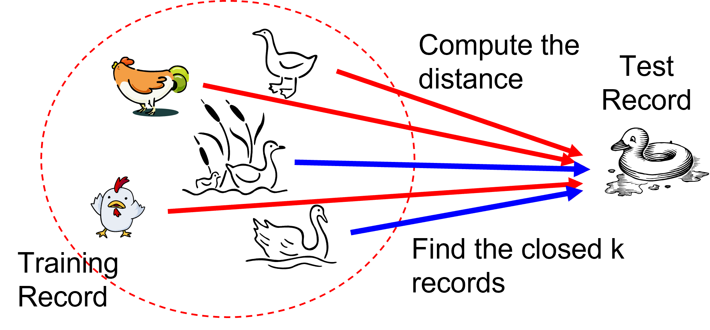
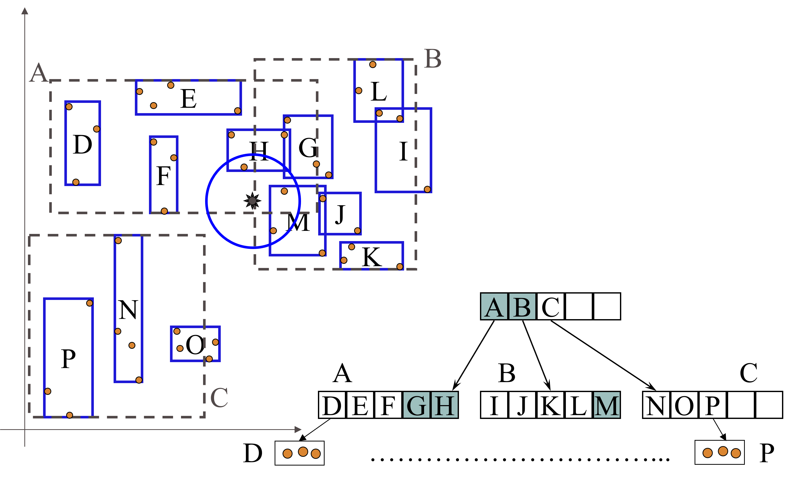

# Motivating problem: classify by similar cases

A streaming service receives a new customer with no churn label.

- We already know the behavior and outcome of many previous customers
- Customers with similar usage patterns often have similar outcomes
- Can we predict the new customer's class without learning an explicit model?

**k-NN answer:** find the most similar known customers and let their labels vote.

# Learning objectives

By the end of this lecture, you will be able to:

- **Explain** instance-based learning and the role of a distance metric
- **Compute** a k-NN prediction, with and without distance weighting
- **Select** a suitable value of $k$ using validation data
- **Recognize** why feature scaling is essential for distance-based learning
- **Diagnose** failure cases caused by irrelevant features and high dimensionality

# Intuition: nearby points tend to behave alike

K-nearest neighbors is an **instance-based** method.

- Training is mostly memorization: store the labeled examples
- Prediction is local: inspect the neighborhood of the new record
- The learned boundary can be nonlinear because each region can vote differently



# Lazy learning

k-NN is often called a **lazy learner**.

- Eager learners, such as trees and neural networks, build a model before prediction
- Lazy learners postpone most of the work until a new query arrives
- The prediction cost can therefore be high for large training sets

The key question becomes:

> What does "similar" mean for these records?

# Nearest-neighbor classifier


Requirements:

- A labeled training set
- A distance or similarity measure
- A value of $k$, the number of neighbors
- A voting rule

# Prediction workflow

For a new record $z$:

1. Calculate the distance from $z$ to every training record
2. Sort the training records by distance
3. Select the first $k$ records
4. Predict the class with the largest vote

The result depends on both the **data representation** and the **distance metric**.

# Common distance metrics

For two records $x_i$ and $z$ with $d$ numeric features:

Euclidean distance:

$$
dist(x_i,z)=\sqrt{\sum_{j=1}^{d}(x_{ij}-z_j)^2}
$$

Manhattan distance:

$$
dist(x_i,z)=\sum_{j=1}^{d}|x_{ij}-z_j|
$$

Both are sensitive to the units used to measure each feature.

# Formal definition: majority vote

Let $D_z$ be the set of the $k$ closest training records to a query record $z$.

The predicted class is:

$$
\hat{y}=\arg\max_{y \in Y}\sum_{(x_i,y_i)\in D_z} I(y_i=y)
$$

- $Y$ is the set of possible class labels
- $I(\cdot)$ is 1 if the condition is true and 0 otherwise
- Each selected neighbor has the same vote

# Worked example: majority vote

Suppose the three nearest training records to a new point $z$ are:

| Neighbor | Distance from $z$ | Class |
|---:|---:|:---:|
| $x_1$ | 0.8 | stay |
| $x_2$ | 1.1 | churn |
| $x_3$ | 1.3 | churn |

- With $k=1$, predict **stay**
- With $k=3$, predict **churn** by a 2-to-1 majority

The prediction is local: a different neighborhood may follow a different rule.

# Distance-weighted vote

Sometimes closer neighbors should count more.

A common weighted vote is:

$$
\hat{y}=\arg\max_{y \in Y}\sum_{(x_i,y_i)\in D_z} \frac{I(y_i=y)}{dist(x_i,z)}
$$

- Very close neighbors receive a larger weight
- Distant neighbors still contribute, but less
- Implementations usually handle zero-distance cases explicitly

# Worked example: weighted vote

Using the same three neighbors:

| Neighbor | Distance from $z$ | Class | Weight $1/dist$ |
|---:|---:|:---:|---:|
| $x_1$ | 0.8 | stay | 1.25 |
| $x_2$ | 1.1 | churn | 0.91 |
| $x_3$ | 1.3 | churn | 0.77 |

Total weighted vote:

- stay: $1.25$
- churn: $0.91 + 0.77$

Prediction: **stay**.

# Choosing the value of $k$

The choice of $k$ controls how local the prediction is.

- Small $k$: flexible, sensitive to noise, higher variance
- Large $k$: smoother, more stable, higher bias
- Odd values of $k$ can avoid ties in binary classification

Choose $k$ using validation data or cross-validation, not the test set.

# The $k$ value: visual intuition

With $k=1$, every training point can create its own tiny region.

With a larger $k$, the boundary becomes smoother because each prediction averages over a wider neighborhood.

This is the same bias-variance trade-off seen in many classifiers:

- too local: follows noise
- too global: misses real local structure

# Feature scaling is not optional

k-NN compares records using distances.

If features have very different numeric ranges, large-scale features dominate the distance even when they are not more informative.

Example:

- `age`: 18 to 80
- `weekly_sessions`: 0 to 20
- `annual_income`: 10,000 to 1,000,000

Without scaling, income can dominate Euclidean distance.

# Scaling example

Compare two customers with a query customer:

| Customer | Age difference | Income difference |
|---:|---:|---:|
| A | 2 years | 20,000 EUR |
| B | 20 years | 500 EUR |

Euclidean distance on raw values is dominated by income:

$$
dist(A) \approx 20000,\qquad dist(B) \approx 500
$$

The model may treat B as closer, even if age is the predictive feature.

# Standardization

Standardization converts each feature to:

$$
x'=\frac{x-\mu}{\sigma}
$$

- $\mu$ is the feature mean
- $\sigma$ is the feature standard deviation
- The transformed feature has mean 0 and standard deviation 1 on the training set

Fit the scaler on the **training set only**.

# Min-max scaling

Min-max scaling converts each feature to:

$$
x'=\frac{x-\min(x)}{\max(x)-\min(x)}
$$

- Values are usually mapped to $[0,1]$
- It preserves the shape of the distribution
- It can be sensitive to outliers

The right scaler is a modeling choice and should be evaluated with validation data.

# Avoiding data leakage

Incorrect workflow:

1. Scale the whole dataset
2. Split into train and test sets
3. Evaluate the model

This leaks information from the test set into preprocessing.

Correct workflow:

1. Split into train and test sets
2. Fit the scaler on the training set
3. Transform train and test with the fitted scaler
4. Evaluate once on the test set

# Use pipelines

In scikit-learn, use a pipeline:

```python
from sklearn.pipeline import Pipeline
from sklearn.preprocessing import StandardScaler
from sklearn.neighbors import KNeighborsClassifier

model = Pipeline([
    ("scaler", StandardScaler()),
    ("knn", KNeighborsClassifier(n_neighbors=5)),
])
```

The pipeline fits preprocessing only on the training folds during cross-validation.

# Failure case: irrelevant features

Scaling fixes unequal units, but it does not remove useless dimensions.

If we add many irrelevant features:

- each feature contributes noise to the distance
- truly similar records may appear far apart
- prediction can degrade even after scaling

k-NN benefits from feature selection, dimensionality reduction, or careful feature engineering.

# Failure case: high dimensionality

In high-dimensional spaces, distances often become less informative.

This is part of the **curse of dimensionality**.

- Points become sparse
- The nearest and farthest points can have surprisingly similar distances
- A huge number of examples may be needed to cover the space well

k-NN is strongest when the chosen features make neighborhoods meaningful.

# Practical model-selection checklist

For k-NN, validate:

- Number of neighbors: `n_neighbors`
- Weighting: uniform or distance-weighted
- Distance metric: Euclidean, Manhattan, or a domain-specific metric
- Scaling method: standardization, min-max scaling, or another transformation
- Feature set: remove irrelevant or redundant features

Keep the test set untouched until the final evaluation.

# Computational cost

Naive prediction requires computing distances to many training records.

For $n$ training records and $d$ features:

- one prediction costs $O(nd)$ with a brute-force search
- storing the training data costs $O(nd)$
- prediction can be slower than for eager models

Index structures can reduce the search cost in some low-dimensional settings.

# The R-tree index structure (Guttman, 1984)

R-trees are extensions of B+-trees to multi-dimensional spaces.

B+-trees organize objects into:

- A set of nonoverlapping one-dimensional intervals
- Recursively nested pages from leaves to root

R-trees organize objects into:

- Overlapping multi-dimensional rectangles
- Recursively nested bounding regions

# R-tree basic idea

- Recursively aggregate objects using minimum bounding rectangles (MBRs)
- Regions can overlap
- A 2-D range query can ignore regions that cannot contain relevant objects



# k-NN: strengths

- Very simple baseline
- No expensive training phase
- Naturally supports nonlinear decision boundaries
- Easy to adapt to multiclass classification
- Can work well when the distance metric matches the domain

# k-NN: weaknesses

- Requires a meaningful distance metric
- Requires preprocessing for feature scaling
- Sensitive to noise and irrelevant features
- Prediction cost can be high for large datasets
- Performance may degrade in high-dimensional spaces

# Check your understanding

A query point has five nearest-neighbor labels:

`A, A, B, B, B`

1. What is the prediction for $k=3$? What about $k=5$?
2. Could distance weighting change either answer?
3. Which dataset split should you use to choose $k$?
4. What preprocessing must be fitted on the training set before computing distances?

# Summary: when should I use k-NN?

**Use k-NN when:**

- Similar cases are expected to have similar outputs
- The dataset is not too large, or an efficient neighbor search is available
- You want a flexible nonlinear baseline with almost no training time

**Be careful when:**

- Features use different scales
- Many features are irrelevant
- Prediction latency matters
- Data are sparse or high-dimensional

**Remember:** scale features, select the metric and $k$ with validation data, and keep the test set untouched.
