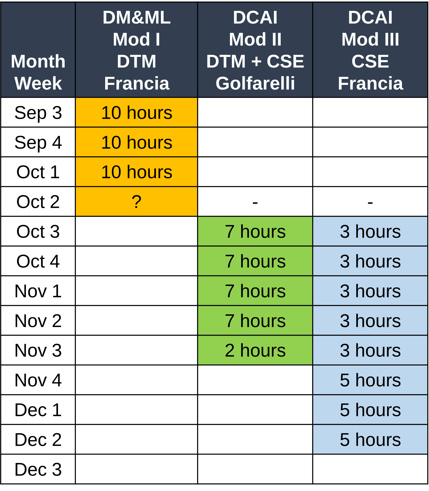
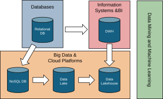
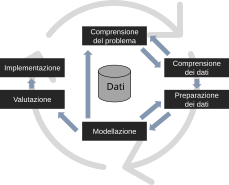
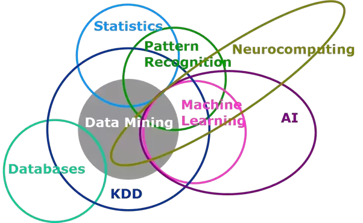
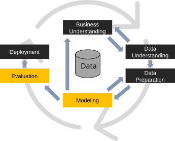

# Modules

::::{.columns}
:::{.column width="60%"}
*Module I (DM&ML), 30h*: (Prof. Francia)

- Goal: Introduction to Machine Learning

*Module II (DM&ML + DCAI), 30h*: DTM + CSE (Prof. Golfarelli)

- Goal: Data-Centric AI and the importance of data quality and understanding

*Module III (DCAI), 30h*: CSE (Prof. Francia)

- Goal: Laboratory and advanced aspects of Data-Centric AI

:::
::: {.column width="40%"}

:::
::::

# Context

# Machine learning is more than running an algorithm

By the end of the course, you should be able to carry out the whole data mining process.

- Understand machine learning techniques for structured data
- Understand data quality and its impact on machine learning
- Develop judgment when applying ML techniques in real business contexts
- Apply the concepts through case studies and exercises

::::{.columns}
:::{.column width="50%"}

:::
:::{.column width="50%"}

:::
::::

# Exam: Book each oral exam when you are ready

The final grade is the average of the two oral exam grades.

- Complete the two oral exams—one with Prof. Francia and one with Prof. Golfarelli—within 15 days.
- There are no scheduled dates: book each exam when you are prepared.

You will take two separate and independent oral exams:

- Prof. Francia: use the [booking page](https://outlook.office.com/book/DTMMachineLearningModule@live.unibo.it/) at least one week in advance and no more than 45 days in advance
- Prof. Golfarelli: book via email

*Check your email* in case of last minute updates before the exam!

# Exam: The oral exam covers the whole course

Questions cover **all theoretical and practical aspects** of the course, including your **assignment**.

- *How can you check whether you are prepared?*
    - Open a slide at random and read its title.
    - Can you explain the topic in a clear, self-contained presentation?
- Active, relevant participation during lectures and labs is considered in the final evaluation.

# What happens on exam day

Each oral exam:

- Takes place **in person**
- Lasts approximately **30 minutes**
- Includes **three questions** on different topics from the whole program
- Begins with a slide-supported discussion of your **assignment**

According to University regulations:

- After an unsuccessful attempt, you must wait **one month** before trying again.
- You may decline an awarded grade only once.

# Final Assignment

You must do an assignment among two possible options:

- *Option 1*: Study of an algorithm among those in the literature (read, understand, summarize, test a paper)
- *Option 2*: Analysis of a dataset following the CRISP-DM methodology

# Final Assignment: Option 1 (study of an advanced ML algorithm)

Ask me for a list of possible papers to study; each proposed paper has an available implementation.

1. Study the paper
1. Apply the algorithm to a real dataset

# Final Assignment: Option 2 (build a full data-driven solution)

Build an AI system...

1. Find a problem of your interest
1. Find a public dataset containing real data
1. Define your analysis and modeling strategy
1. Explain the insights obtained from your analysis

... individually or in a group of at most two students.

- If in group, all group members must book the exam on the same day.

# Final Assignment: Before starting Option 2

1. Email me a project proposal of approximately 300 words:
    - Describe the dataset
    - Link to the public dataset
    - Identify the main challenges
    - The dataset must require some pre-processing
1. Wait for my approval
1. Register the group and project using the [registration form](https://forms.gle/aZ4L7azCF43qqpzk6)
1. Develop the project in Google Colab

# Final Assignment: You must understand and defend your code

You may use documentation, libraries, examples, and AI assistants, but you remain responsible for every part of your submission.

- Understand and explain the code
- Justify your technical and methodological choices
- Verify that the complete assignment runs without errors

If you cannot explain your work or submit work that is not your own, you will have to retake the exam.

# Final Assignment: Both options require the same deliverables

Once the project is completed:

1. Write a **four-page paper** in LaTeX using [Overleaf](https://www.overleaf.com/) and the [IEEE conference template](https://ieeecs-media.computer.org/assets/zip/ieeetran-final_sub.zip)
1. Prepare a **10-minute presentation** with no more than 10–12 slides
1. Ensure that the assignment runs in Google Colab without errors
1. Upload the paper, code, and presentation to a GitHub repository
1. Share the repository with me

# Final Assignment: Paper structure depends on your option

| Section | Option 1 | Option 2 |
|:---:|:---:|:---:|
| Introduction | ~0.5 page: application context | ~1 page: context, group organization, and individual contributions |
| Main content | ~2 pages: algorithm summary | ~1.5 pages: pipeline description |
| Results | ~1 page: results and insights | ~1 page: results and insights |
| Conclusions | ~0.5 page: summary | ~0.5 page: summary |

# Teaching material

You will find all you need on Virtuale.

- Slides and Python notebooks to be opened on Google Colab

However, **keeping up the pace with machine learning and data mining is hard**

- There is a rapid development of trends and technologies, and not all of them will survive
- Books are easily outdated with respect to cutting-edge services and technologies
- Research papers (often) describe solutions that are not commercial yet
- (IRL) You will need to deal with a lot of (bad) documentation, online articles, etc.

Rule of thumb

- Understand the general concepts and fundamentals
- ... and ask questions!

# Books

:::: {.columns}
::: {.column width="60%"}

Slides provide a sufficient preparation.

- You can find them on the Virtuale platform ([https://virtuale.unibo.it/](https://virtuale.unibo.it/))

However, I suggest you read the books:

- Aurélien Géron. *Hands-on Machine Learning with Scikit-Learn, Keras & TensorFlow*.
- Pang-Ning Tan, Michael Steinbach, and Vipin Kumar. *Introduction to Data Mining*. Pearson International, 2006.
- Ian H. Witten and Eibe Frank. *Data Mining: Practical Machine Learning Tools and Techniques*, 2nd ed. Morgan Kaufmann, 2005.

Some notes:

- The books are intended as a support
- The books are available for free in the library
- Check the table of contents and focus on the topics covered in the course

:::
::: {.column width="40%"}

:::
::::

# (My) Office hours

Lectures start/end 10 minutes later/earlier than the time stated in the teaching calendar.

- Please, **arrive on time** to avoid interruptions

Office hours:

- *Short questions*: before/after each lecture
- *Longer questions*: send an email to book an appointment

If you need help with coding and labs, *you can ask me and the designated tutor*

# Tentative outline (slides are frequently updated)

:::: {.columns}
::: {.column width="60%"}

- [Introduction to AI and machine learning](01-ml.qmd)
- Supervised learning
    - Classifiers
        - [Decision trees](02-dt.qmd)
        - [Neural networks](05-neuralnetworks.qmd)
        - [k-NN](03-knn.qmd)
        - [Bayesian classifier](04-bayes.qmd)
        - [Ensemble methods](06-multi-classifier.qmd)
- Unsupervised learning
    - [Clustering](09-clustering.md)
    - Association rules
- [Anomaly detection](08-anomaly.md)

:::
::: {.column width="40%"}

:::
::::
