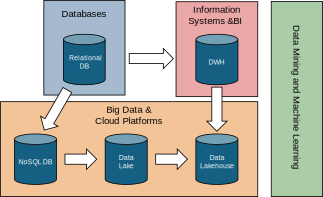

# Modules

::::{.columns}
:::{.column width="60%"}
*Module I (DM&ML), 30h*: (Prof. Francia)

- Goal: ???
- Introduction to Data Mining and Machine Learning: areas of applicability
- Data mining and machine learning techniques
- Case studies analysis

*Module II (DM&ML + DCAI), 30h*: DTM + ISI (Prof. Golfarelli)

- Goal: ???
- CRISP-DM Methodology
- Data understanding and preparation
- Data Science Pipelines

*Module III (DCAI), 30h*: ISI (Prof. Francia)

- Goal: ???
- ???
:::
::: {.column width="40%"}

:::
::::

# Data Mining and Machine Learning: Course Goals

Being able to carry out the whole data mining process, that is more complex than just  running ML algorithms

- Creating/broadening a tool box of machine learning algorithms
- ML algorithms related to structured data (e.g., association rules)
- Gain sensitivity in applying ML techniques in real business contexts
- Case studies and exercises

::::{.columns}
:::{.column width="50%"}

:::
:::{.column width="50%"}

:::
::::

# (Oral) Exam

Questions on **all (theoretical and practical) aspects** of the course and an **assignment**

- *Be prepared*: you have to wait 1 month before trying again (in any case)
- *How do you know if you are prepared*?
    - Open random slides and check the titles. Can you expose them and make a self-contained speech?
- *Interaction* during the lectures/labs is considered in the final evaluation

# (Oral) Exam

Two separate and independent exam sessions (the other w/ Prof. Golfarelli), the final grade is the average of the two exams

- No scheduled dates, just **book when you are prepared**
    - Prof. Francia: use the [Booking](https://outlook.office.com/book/DTMMachineLearningModule@live.unibo.it/) page (at least one week in advance, no later than 45 days)
    - Prof. Golfarelli: via e-mail
- The two modules must be discussed within 15 days

According to the University's regulation

- Exams must be in presence
- Cannot refuse a grade more than once

On the day of the exam (~30 minutes per person):

- 3 questions on different topics about the whole program
- The 1st question is a discussion with slides about your assignment

# Final Assignment

You must do an assignment among two possible options:

- *Option 1*: Study of an algorithm among those in the literature (read, understand, summarize, test a paper)
- *Option 2*: Analysis of a dataset following the CRISP-DM methodology

# Final Assignment: Option 1

Ask me for a list of possible papers to study (with available implementation)

1. Study the paper
1. Apply the algorithm to a real dataset

# Final Assignment: Option 2

The assignment on Machine Learning is about coding an AI system (in a group of 2 people, at maximum)

1. Find a problem of your interest
1. Get the data (a public dataset with real data)
1. Define your strategy (algorithms)
1. Describe the insights you extracted from your analysis

Once defined your project:

1. Send me an email to discuss the details of your project
    - ~300 words, including the datasets description, a link to the public dataset, and the main challenges
    - The dataset must require some pre-processing
1. After my approval, register the group and the project here: [https://forms.gle/aZ4L7azCF43qqpzk6](https://forms.gle/aZ4L7azCF43qqpzk6)
1. Now you can start your project on Google Colab

**You are responsible for your code** ("I do not know how to program" is not a valid excuse!)

- If you cannot explain your code and your choices...
- ... and/or you copied and pasted it from colleagues or LLMs
- ... you will retake the exam

**When the material is ready, group members must book the exam on the same day**

# Final Assignment: apply to both options

Once the project is completed:

- Write a 4-page paper about the assignment. Mandatory points:
    - Use Latex ([https://www.overleaf.com/](https://www.overleaf.com/))
    - Use this template ([https://ieeecs-media.computer.org/assets/zip/ieeetran-final_sub.zip](https://ieeecs-media.computer.org/assets/zip/ieeetran-final_sub.zip))
    - Option 1, sections:
      1. Introduction (~0.5 page; the context of application of the algorithm)
      2. Summary of the algorithm (~2 pages; what did you do and how)
      3. Results (~1 page; results and insights)
      4. Conclusions (~0.5 pages; summary)
    - Option 2, sections:
      1. Introduction (~1 page; including group organization and the work done by each member)
      2. Pipeline description (~1.5 pages; what did you do and how)
      3. Results (~1 page; results and insights)
      4. Conclusions (~0.5 pages; summary)
- Upload the paper, assignment, and presentation into a GitHub repository
    - Presentation must be 10-minute long (no more than 10/12 slides)
    - The assignment must be executable on Google Colab without errors
- Share (with me) the GitHub repository

# Teaching material

You will find all you need on Virtuale.

- Slides and Python notebooks to be opened on Google Colab

However, **keeping up the pace with machine learning and data mining is hard**

- There is a rapid development of trends and technologies, and not all of them will survive
- Books are easily outdated with respect to cutting-edge services and technologies
- Research papers (often) describe solutions that are not commercial yet
- (IRL) You will need to deal with a lot of (bad) documentation, online articles, etc.
 
Rule of thumb

- Understand the general concepts and fundamentals
- ... and ask questions!

# Books

:::: {.columns}
::: {.column width="60%"}

Slides and notes are sufficient to prepare for the final exam.

- You can find them on the Virtuale platform ([https://virtuale.unibo.it/](https://virtuale.unibo.it/))

However, I suggest you read the books:

- Aurélien Géron. Hands-on Machine Learning with Scikit-Learn, Keras & TensorFlow.
- Pang-Ning Tan, Michael Steinbach, Vipin Kumar Introduction to Data Mining. Pearson International, 2006.
- Ian H. Witten and Eibe Frank. Data Mining: Practical Machine Learning Tools and Techniques, IInd Ed. Morgan Kaufmann, 2005.

Some notes:

- The books are intended as a support
- The books are available for free in the library
- Carefully check the summary and select our topics

:::
::: {.column width="40%"}

:::
::::

# (My) Office hours

Lectures start/end 10 minutes later/earlier than the time stated in the teaching calendar.

- Please, **arrive on time** to avoid interruptions

Office hours:

- *Short questions*: before/after each lecture
- *Longer questions*: send an email to book an appointment

If you need help with coding and labs, *you can ask me and the designated tutor*

- Remember, "I do not know how to code" is not a valid excuse!

# Context

# Why Mining Data?

The amount of data stored on computer is constantly increasing

* IoT data
* Social data
* Data on purchases / tax receipts
* Banking and credit card transactions

Hardware becomes more powerful and cheaper each day

Competitive pressure is constantly growing

* The information resource is a precious asset to overcoming competitors

# Why Mining Data?

:::: {.columns}
::: {.column width="50%"}

:::
::: {.column width="50%"}
- Most of the information on the data is not directly apparent
- Human analysis can take weeks to find useful information
- Most of the data has never been analyzed
:::
::::

# AI, Machine Learning & Data Mining

:::: {.columns}
::: {.column width="50%"}
Although strongly interrelated, the term "machine learning" is distinct from "data mining"

- Data mining indicates the computational process of pattern discovery in large datasets using machine learning methods, artificial intelligence, statistics and databases.
- Apart from the actual analysis phase, it covers:
    - Data management and pre-processing
    - Modeling
    - Identification of metrics of interest
    - Visualization
::: 
::: {.column width="50%"}

:::
::::

# Data Mining Definitions

Complex extraction of implicit, previously unknown and potentially useful data from the information.

Exploration and analysis, using automated and semi-automatic systems, of large amounts of data in order to find significant patterns



# AI, Machine Learning & Data Mining

# Pattern

A pattern is a synthetic representation rich in semantics of a set of data; usually expresses a recurring pattern in data, but can also express an exceptional pattern

A pattern must be:

* Valid on data with a certain degree of confidence
* It can be understood from the syntax and semantic point of view, so that the user can interpret it
* Previously unknown and potentially useful, so that the user can take actions accordingly

# Example

People who received a loan

x: missed to return a rate

o: met the deadlines

Pattern:

* IF  salary < k  THEN  missed rate

# Pattern Types

Association rules

* Let you determine the logical implications of the dataset, and then identify the groups of affinity between objects

Classifiers

* Allow you to derive a model for classifying data according to a set of a priori assigned classes

* Decision trees

* Are special type of classifiers that allow to identify, in order of importance, the causes that lead to an event occurring

Clustering

Groups elements in a set, depending on their characteristics, of apriori unknow classes

Time series

They allow the detection of recurring or atypical patterns in complex data sequences

# What is NOT Data Mining

What is not Data Mining

* Look for a number in the phone book

* Query a search engine to search for information on "Amazon"

What Data Mining is

* Discover that some surnames are more common in certain regions (eg Casadei, Casadio,... in Romagna)

* Group documents returned by a search engine based on context information (eg "Amazon rainforest", "Amazon.com")

# What is NOT Data Mining

We look for correlation between surnames and  all the person attributes

What is not Data Mining

* Look for a number in the phone book

* Query a search engine to search for information on "Amazon"

What Data Mining is

* Discover that some surnames are more common in certain regions (eg Casadei, Casadio,... in Romagna)

* Group documents returned by a search engine based on context information (eg "Amazon rainforest", "Amazon.com")

SQL is sufficient

# Where Data Mining Comes from?

This discipline stands in the middle between several areas

* Machine learning / artificial intelligence

* Pattern recognition

* Statistics

* Databases

* Traditional analytical techniques are unsuitable for many reasons

* Quantity of data

* High dimensionality of data

* Heterogeneity of data

# Data Mining Applications

__Predictive__  __ __  __systems__

* Exploit some features to predict the unknown values of other features

  * Classification

  * Regression

  * Outlier detection

__Descriptive__  __ __  __systems__

* Find user-readable patterns that can be understood by human users

  * Clustering

  * Association rules

  * Sequential pattern

# A Definition for Classification

Given a record set ( _training set_  _ _ )

* Each record is composed by a set of  _attributes_, where one ot them represents the  _class _ of the record.

Find a  _model _ for the class attribute expressing the attribute value as a function of the remaining attributes/features

Goal: unclassified record must be assigned to a class in the most accurate way

* A  _test set_  is used to determine the model accuracy. Typically, the data set is split in training set and test set. The first one is used to build the model, the second one to validate it.

# An Example

Learn

Classifier

# Classification: Application 1

Direct Marketing

* Goal: Reduce the cost of email marketing by  _defining_  _ _ the set of customers that, with the highest probability, will buy a new product

* Technique:

  * Exploit the data collected during the launch of similar products

  * We know which  customers bought and which one did not buy

  * Such information  _{buy, not buy}_  becomes the  _class attribute_

  * Collect all the available information about each customers: demographics, life style, previous contact with the company

    * Job, Income, age, gender, etc.

    * Use such information as an input to as input attributes to train the model

# Classification: Application 2

Fraud detection

* Goal: predict the fraudulent use of credit cards

* Approach:

  * Use past transactions and information about their owners as attributes

    * When a user buy, what does she buy, does she pay late, etc.

  * Label past transactions as  _fraudulent_  or  _legitimate_

  * This information is the classification attribute

  * Build a model for the two classes of transactions

  * Use the model to detect fraudolent behaviors of the next transactions for a specific credit card

# Classification: Application 2

Fraud detection

* Goal: predict the fraudulent use of credit cards

* Approach:

  * Use past transactions and information about their owners as attributes

    * When a user buy, what does she buy, does she pay late, etc.

  * Label past transactions as  _fraudulent_  or  _legitimate_

  * This information is the classification attribute

  * Build a model for the two classes of transactions

  * Use the model to detect fraudolent behaviors of the next transactions for a specific credit card

# Classification: Application 3

Churn detection

* Goal: Predict customers who are willing to go to a competitor.

* Approach:

  * Use the purchasing data of individual users (present and past) to find the relevant attributes

  * How often does the user contact the company, where he calls, at what times of day he calls more frequently, what is his financial situation, is married, etc.

  * Label users as  _loyal_  or  _not loyal_

  * Find a pattern that defines loyalty

# A Definition for Clustering

Given a set of points, each featuring a set of attributes, and having a similarity measure between points, find subset (i.e. cluster) of points such that:

Points belonging to a cluster are more similar to each other than those belonging to other clusters

* Similarity measures

* Euclidean distance is applicable if point attributes assume continuous values

* Many other measures are available or can be defined for each specific domain

# Cluster representation

A 3D clustering found using the Euclidean distance

Inter-cluster distances are maximized

Intra-cluster distances are minimized

# Clustering: Application 1

Market Segmentation:

* Goal: Split customers into distinct subsets to target specific marketing activities

* Approach:

  * Gather information about customer lifestyle and geographic location

  * Find clusters of similar customer

  * Measure cluster quality by verifying whether the purchasing patterns of customers belonging to the same cluster are more similar to those of distinct clusters

# Clustering: Application 2

Document Clustering

* Goal: Find clusters of documents that are similar on the basis of the most relevant terms that they contain

* Approach:

  * Identify the terms that occur most frequently in the different documents.

  * Define a frequency-based similarity measure and use it to create clusters.

# Clustering: Application 2

Points to be clustered: 3204 Los Angeles Times articles

Similarity measure: number of common words between two documents (excluding some common words).

# A Definition for Association Rules

Given a set of records each consisting of multiple elements belonging to a given collection

It produces rules of dependence that predict the occurrence of one of the elements in the presence of others.

Rule:

{Milk} --> {Coke}

{Diapers, Milk} --> {Beer}

# Association Rules: Application 1

Marketing and sales promotion:

* Suppose you have discovered the association rule

* _{_  _Bagels_  _, ... } --> {Potato Chips}_

* _Potato Chips _  _as_  _ a _  _consequent_ : the information can be used to understand what actions to take to increase its sales

* Bagels as an antecedent: the information can be used to understand which products might be affected if the store interrupts the sale of Bagels

# Association Rules: Application 2

Arrangement of the goods.

* Goal: Identify products purchased together from a sufficiently large number of customers.

* Approach: uses data from tax receipts to find dependencies between products.

* A famous association rule

  * If a customer buys diapers and milk then they will most likely buy bee

  * So do not be surprised if you find the beers beside the diapers!

# Association Rules: Application 3

Inventory management:

* Goal: A household repair company wants to study the relationship between reported malfunctions and spare parts required to properly equip their vehicles and reduce visits to their homes.

* Approach: Processes the data about the spare parts used in the previous assistances to look for co-occurrence patterns.

# A Definition for Regression

Predict the value of a continuous variable based on values of other variables assuming a linear / nonlinear dependency pattern.

Examples:

* Predict the sales revenue of a new product based on advertising investments.Predict the wind speed depending on temperature, humidity, atmospheric pressure

* Prediction of the stock market trend.

# A Definition for Outlier Detection

Identify deviations from normal behavior

Applications:

* Identification of fraud in the use of credit cards

* Identification of network intrusions

# Data Mining Bets

* Scalability

* Run on the edge (devices with limited computational capabilities)

* Multidimensionality of the data set

* Complexity and heterogeneity of the data

* Data quality

* Data Properties

* Privacy Keeping

* Processing in real-time

# A Methodology for Data Mining: CRISP-DM

A Data mining project requires a structured approach; choosing the best algorithm is only one of the success factors

The  __CRISP-DM __ methodology is one of the most structured proposals to define the fundamental steps of a Data Mining project

The six stages of the life cycle are not strictly sequential.

Turning back on activities already done it is often necessary

http://www.crisp-dm.org/

# CRISP-DM steps

__Understanding the Application Domain: __ understanding project goals from the user's point of view, translate the user's problem into a data mining problem, and define a project plan

__Understanding the data: __ preliminary data collection aimed at identifying quality problems and conducting preliminary analyzes to identify the salient characteristics

__Data Preparation: __ includes all the tasks needed to create the final dataset: selecting attributes and records, transforming and cleaning data

# CRISP-DM steps

__Model Creation: __ Several data mining techniques are applied to the dataset also with different parameters in order to identify what makes the model more accurate

__Evaluation of Model and Results: __ The model(s) obtained from the previous phase are analyzed to verify that they are sufficiently precise and robust to respond adequately to the user's objectives

__Deployment: __ The built-in model and acquired knowledge must be made available to users. This phase can therefore simply lead to the creation of a report or may require implementation of a user-controlled controllable data mining system

