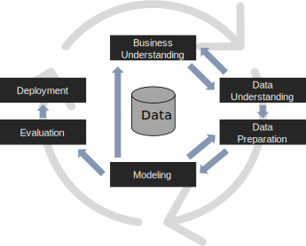
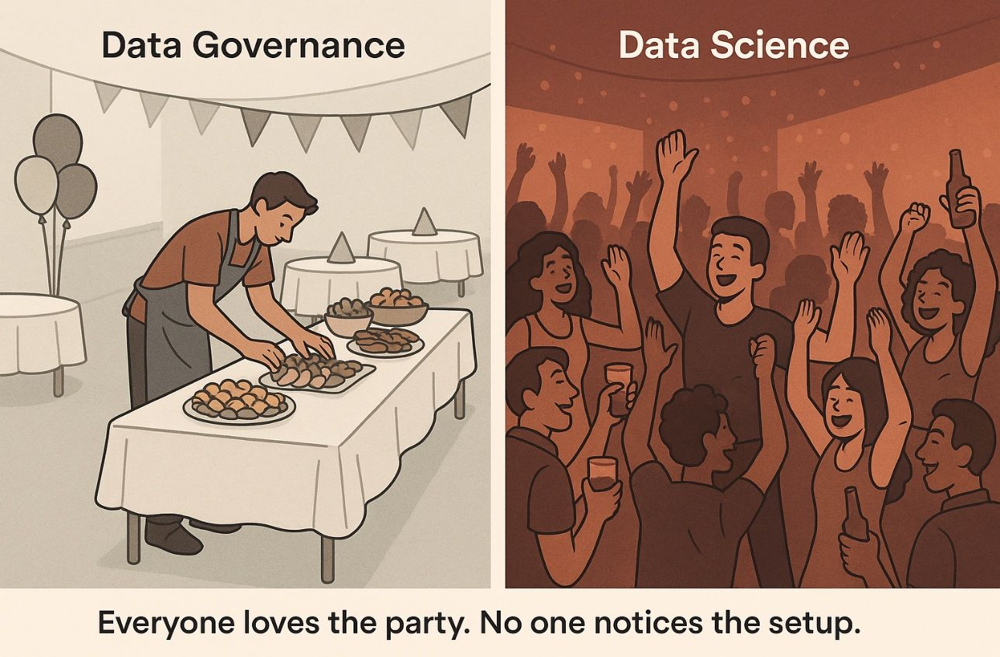



#

# CRISP-DM

:::: {.columns}

::: {.column width="60%"}

**CRISP-DM** (CRoss-Industry Standard Process for Data Mining) [@shearer2000crisp]

> A non-proprietary, documented, and freely available data mining model.
>
> Developed by industry leaders with input from more than 200 data mining users [...] and service providers, CRISP-DM is an *industry-, tool-, and application-neutral* model.
>
> This model encourages best practices and offers organizations the structure needed to realize better, faster results from data mining.
>
> CRISP-DM organizes the data mining process into phases [...] that help organizations understand the data mining process and provide a road map to follow while planning and carrying out a data mining project.

:::
::: {.column width="40%"}

:::
::::

#

:::: {.columns}
::: {.column width="60%"}

**CRISP-DM** breaks down the life cycle of a data mining project into **six phases**:

1. business understanding,
1. data understanding,
1. data preparation,
1. modeling,
1. evaluation,
1. and deployment.

**Arrows**

- Indicate the most important and frequent dependencies between the phases
- The outer circle symbolizes the cyclical nature of data mining itself
- ... lessons learned during the data mining process trigger new, often more focused business questions

:::
::: {.column width="40%"}

:::
::::

# Disclaimer 1

This course is orthogonal to:

- Information Systems
- Big Data and Cloud Platforms

# Disclaimer 2

:::: {.columns}
::: {.column width="60%"}

*We don't do machine learning (only) for the sake of training machine learning models*

- We have real problems to solve and questions to answer
- A data scientist must understand the data and the domain before trying any model
- Machine learning is not a simple copy and paste of code
    - *Code generation can be easily automated and outperform you*!
    - The added value of a data scientist is the understanding of the problem and the data
- Data mining/Machine learning is not a course on `scikit-learn`

:::
::: {.column width="40%"}

:::
::::

#  Vibe Coding and Automation {background-color="#121011"}

**Vibe coding** is an AI-assisted software development technique popularized in February 2025.

- A chatbot-based approach to creating software where the developer describes a project or task to a large language model (LLM)
- The LLM generates code based on the prompt.
- The developer does not review or edit the code, but solely uses tools and execution results to evaluate it and asks the LLM for improvements.
- The developer avoids examination of the code, accepts AI-suggested completions without review, and focuses more on iterative experimentation.

](https://www.northcoders.com/app/uploads/2025/06/vibe-coding-vs-real-coding-comparison-table-1.png)

# Automating Data Science

Read:

- [CACM: Automating Data Science](https://cacm.acm.org/research/automating-data-science/)
- [Gen Z face a more competitive job market than their predecessors](https://www.weforum.org/stories/2025/09/gen-z-are-competitive-job-market-randstad/)
- [L'IA già ruba il lavoro ai giovani della Gen Z](https://www.ilsole24ore.com/art/l-intelligenza-artificiale-gia-ruba-lavoro-giovani-gen-z-AHgfnmz?refresh_ce=1)
- [The Future of Work: How AI is Transforming Jobs and the Workplace](https://www.bcg.com/publications/2024/future-of-work-how-ai-is-transforming-jobs-and-the-workplace)

# Glossary [@sammut2017encyclopedia]

:::: {.columns}

::: {.column width="60%"}

**Data**

> Facts and statistics collected together for reference or analysis.
>
> Synonyms: data point, observation, data sample, instance, tuple, etc.

**Dataset (data set)**

> A collection of data used for some specific purpose.

:::
::: {.column width="40%"}

:::
::::

**Feature**

> Properties of things, ways that we, as humans, might describe them.
>
> Synonyms: characteristic; attribute; property; trait, etc.

**(Database) Query**

> A request for information

**Query Language** [@liu2009encyclopedia]

> A specialized programming language (e.g., SQL) for searching and changing the contents of a database.


