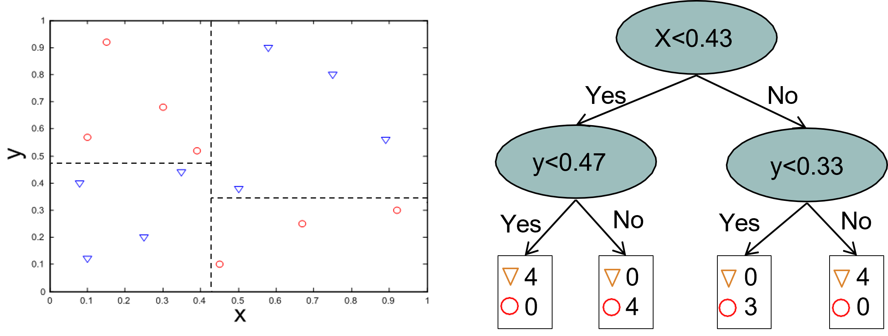
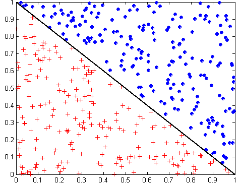
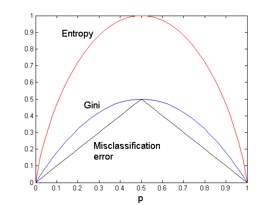
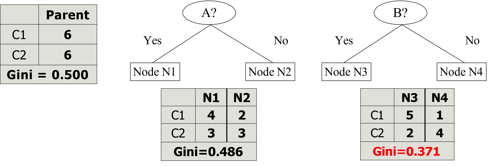
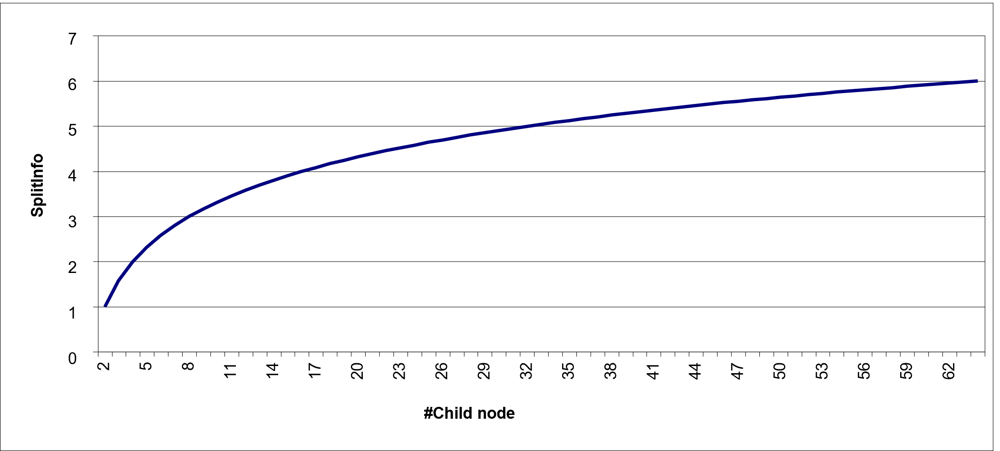
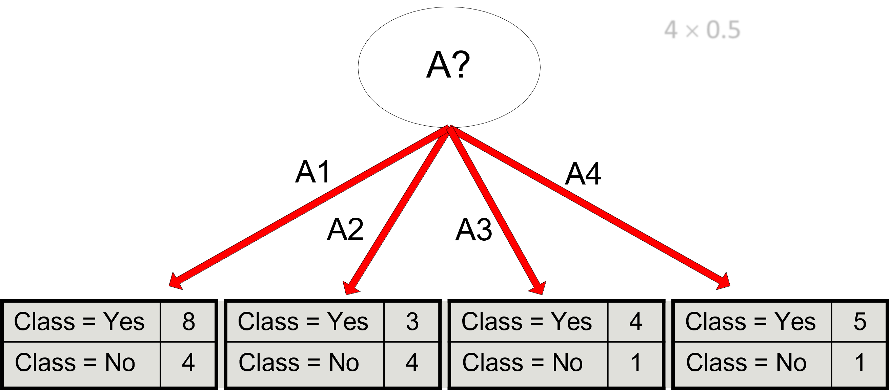

# Learning objectives

By the end of this lecture, you will be able to:

- **Explain** how a decision tree turns feature tests into a prediction
- **Build** a small classification tree by selecting and evaluating candidate splits
- **Compute and interpret** impurity and gain
- **Diagnose** overfitting and choose an appropriate pruning strategy

# Learning priorities

| Priority | What students should be able to do |
|---|---|
| **Core** | Explain the tree representation, root-to-leaf rules, split conditions, impurity, and overfitting |
| **Practice** | Compute Gini, Entropy, Gain, and GainRatio on a small candidate split |
| **Extension** | C4.5 details, MDL, and pessimistic pruning |

# Project lifecycle checkpoint

| Project question | Decision-tree answer |
|---|---|
| Business question | Do we need an interpretable set of rules or explanations? |
| Data requirements | Labeled examples with meaningful predictors and a clear target |
| Preprocessing | Often less scaling than distance-based models, but missing values and categorical encoding still matter |
| Modeling | Choose split criteria, stopping rules, and pruning strategy |
| Evaluation | Use the shared evaluation workflow from [Data Splits, Evaluation, and Leakage](evaluation) |
| Failure modes | Deep trees can memorize noise and small data changes can change the tree |
| Assignment angle | Defend both the predictive performance and the interpretability of the learned rules |

# Motivating problem: who will churn?

**Customer churn** is a critical metric when it is much less expensive to retain existing customers than it is to acquire new customers.


# Learn by doing!


# Learn by doing!

This is a *supervised learning* task since the *dataset* contains a *label* (or *class*) to predict (`churn`)

- ... as a function of *other* customer subscriptions' attributes (`months_subscribed`, ..., `auto_pay`)

Each *row* (or *data item/record*) is a customer subscription, each *column* is an *attribute* (or *feature*)

| `months_subscribed` | `monthly_watch_hours` | `tickets` | `type` | `auto_pay` | `churn` |
| :-----------------: | :-------------------: | :---------------: | :---------: | :--------: | :-----: |
| 2                 | 3                   | 2               | basic     | no       | *yes*   |
| 4                 | 6                   | 1               | basic     | no       | *yes*   |
| 6                 | 15                  | 0               | standard  | yes      | *no*    |
| 12                | 22                  | 0               | premium   | yes      | *no*    |
| 3                 | 4                   | 3               | basic     | no       | *yes*   |
| 8                 | 18                  | 0               | standard  | yes      | *no*    |
| 5                 | 7                   | 1               | basic     | yes      | *no*    |
| 1                 | 2                   | 2               | basic     | no       | *yes*   |
| 10                | 20                  | 0               | premium   | yes      | *no*    |
| 7                 | 12                  | 1               | standard  | yes      | *no*    |
| 2                 | 5                   | 2               | basic     | no       | *yes*   |
| 9                 | 16                  | 0               | premium   | yes      | *no*    |

# Training and test sets

First we need to split the dataset into *training* and *test sets*

# Training and test sets

**Holdout**

- **Randomly** use $\frac{2}{3}$ (or $\frac{4}{5}$) of training and $\frac{1}{3}$ (or $\frac{1}{5}$) for testing.
- Training and test sets are not overlapping

Disadvantages:

- It works with a reduced set of training
- The result depends on the composition of the training set and test set

# Training and test sets

*Training set*: used for training the model

| `months_subscribed` | `monthly_watch_hours` | `tickets` | `type` | `auto_pay` | `churn` |
| :-----------------: | :-------------------: | :---------------: | :---------: | :--------: | :-----: |
| 2                 | 3                   | 2               | basic     | no       | *yes*   |
| 4                 | 6                   | 1               | basic     | no       | *yes*   |
| 6                 | 15                  | 0               | standard  | yes      | *no*    |
| 12                | 22                  | 0               | premium   | yes      | *no*    |
| 3                 | 4                   | 3               | basic     | no       | *yes*   |
| 8                 | 18                  | 0               | standard  | yes      | *no*    |
| 5                 | 7                   | 1               | basic     | yes      | *no*    |
| 1                 | 2                   | 2               | basic     | no       | *yes*   |
| 10                | 20                  | 0               | premium   | yes      | *no*    |

*Test set*: used for testing the generalization capability of the model

| `months_subscribed` | `monthly_watch_hours` | `tickets` | `type` | `auto_pay` | `churn` |
| :-----------------: | :-------------------: | :---------------: | :---------: | :--------: | :-----: |
| 7                 | 12                  | 1               | standard  | yes      | *no*    |
| 2                 | 5                   | 2               | basic     | no       | *yes*   |
| 9                 | 16                  | 0               | premium   | yes      | *no*    |

# Supervised learning: decision trees

```{mermaid}
%%| echo: false
flowchart LR
    A[("Training set
<pre>
+-----+----------+-------+
| ... | type     | churn |
+-----+----------+-------+
| ... | basic    | yes   |
| ... | basic    | yes   |
| ... | standard | no    |
| ... | ...      | ...   |
</pre>")]
G[("Test set
<pre>
+-----+---------+
| ... | type    |
+-----+---------+
| ... | basic   |
| ... | basic   |
| ... | premium |
</pre>")]
F[("
Predicted class
<pre>
+-------+
| churn |
+-------+
| yes   |
| yes   |
| no    |
</pre>")]
    A -->|Induction| B[Learn Model]
    C(DT Algorithm) --> B
    B --> D[DT Model]
    D -->|Deduction| F
    G --> D

    style D fill:#f78c8c,stroke:#000
```

# Intuition: divide the feature space

::::{.columns}
:::{.column width=60%}
Decision trees solve difficult classification problems through sequences of simpler questions.

- Each internal node asks one question about one feature:
    - *which question best separates customers who churn from those who stay?*
- Each answer restricts the set of possible records
- A root-to-leaf path behaves like an **if-then rule**
- Training searches for questions that make the resulting groups as pure as possible

:::
:::{.column width=40%}

```{mermaid}
%%| echo: false
flowchart TD
    A[monthly_watch_hours] -->|<= 8| B[auto_pay]
    A -->|>8| C((no))
    style C fill:#a3f7a3,stroke:#000,stroke-width:1px

    B -->|no| D((yes))
    B -->|yes| E[tickets]
    style D fill:#f78c8c,stroke:#000,stroke-width:1px

    E -->|>= 2| F((yes))
    E -->|< 2| G((no))
    style F fill:#f78c8c,stroke:#000,stroke-width:1px
    style G fill:#a3f7a3,stroke:#000,stroke-width:1px
```
:::
::::

# Formal definition: decision tree

::::{.columns}
:::{.column width=60%}
One of the most widely used classification techniques

- It represents a set of classification rules with a *tree*.
- A hierarchical structure consisting of *nodes* connected by labeled and oriented *arcs*.
- Each root-leaf path represents a classification rule.

There are two types of nodes:

- *Leaves* (i.e., nodes with no children) identify the predicted classes
- *Split conditions* that partitions the records based on attribute values
    - The partitioning criterion represents the label of the arcs

:::
:::{.column width=40%}

```{mermaid}
%%| echo: false
flowchart TD
    A[monthly_watch_hours] -->|<= 8| B[auto_pay]
    A -->|>8| C((no))
    style C fill:#a3f7a3,stroke:#000,stroke-width:1px

    B -->|no| D((yes))
    B -->|yes| E[tickets]
    style D fill:#f78c8c,stroke:#000,stroke-width:1px

    E -->|>= 2| F((yes))
    E -->|< 2| G((no))
    style F fill:#f78c8c,stroke:#000,stroke-width:1px
    style G fill:#a3f7a3,stroke:#000,stroke-width:1px
```
:::
::::

# Tree learned from the training data
::::{.columns}
:::{.column width=70%}
| `months_subscribed` | `monthly_watch_hours` | `tickets` | `type` | `auto_pay` | `churn` |
| :-----------------: | :-------------------: | :---------------: | :---------: | :--------: | :-----: |
| 2                 | 3                   | 2               | basic     | no       | yes   |
| 4                 | 6                   | 1               | basic     | no       | yes   |
| 6                 | 15                  | 0               | standard  | yes      | no    |
| 12                | 22                  | 0               | premium   | yes      | no    |
| 3                 | 4                   | 3               | basic     | no       | yes   |
| 8                 | 18                  | 0               | standard  | yes      | no    |
| 5                 | 7                   | 1               | basic     | yes      | no    |
| 1                 | 2                   | 2               | basic     | no       | yes   |
| 10                | 20                  | 0               | premium   | yes      | no    |
:::
:::{.column width=30%}
```{mermaid}
%%| echo: false
flowchart TD
    A[monthly_watch_hours] -->|<= 8| B[auto_pay]
    A -->|>8| C((no))
    style C fill:#a3f7a3,stroke:#000,stroke-width:1px

    B -->|no| D((yes))
    B -->|yes| E[tickets]
    style D fill:#f78c8c,stroke:#000,stroke-width:1px

    E -->|>= 2| F((yes))
    E -->|< 2| G((no))
    style F fill:#f78c8c,stroke:#000,stroke-width:1px
    style G fill:#a3f7a3,stroke:#000,stroke-width:1px
```
:::
::::

# Supervised learning: decision trees

```{mermaid}
%%| echo: false
flowchart LR
    A[("Training set")]
    G[("Test set")]
    F[("Predicted class")]
    A -->|Induction| B[Learn Model]
    C(DT Algorithm) --> B
    B --> D[DT Model]

    G -->D
    D -->|Deduction| F

    style F fill:#f78c8c,stroke:#000
```

# What is the predicted class for the following test data?

| `months_subscribed` | `monthly_watch_hours` | `tickets` | `type` | `auto_pay` | `churn` |
| :-----------------: | :-------------------: | :---------------: | :---------: | :--------: | :-----: |
| 1                 | 2                   | 2               | basic     | no       | ?   |

# What is the predicted class for the following test data?

| `months_subscribed` | **`monthly_watch_hours`** | `tickets` | `type` | `auto_pay` | `churn` |
| :-----------------: | :-------------------: | :---------------: | :---------: | :--------: | :-----: |
| 1                 | **2**                   | 2               | basic     | no       | ?   |

```{mermaid}
%%| echo: false
flowchart TD
    A[monthly_watch_hours] -->|<= 8| B[auto_pay]
    A -->|>8| C((no))

    B -->|no| D((yes))
    B -->|yes| E[tickets]

    E -->|>= 2| F((yes))
    E -->|< 2| G((no))

    style A stroke:#ff0000,stroke-width:3px
    linkStyle 0 stroke:#ff0000,stroke-width:3px

    style C fill:#a3f7a3,stroke:#000
    style D fill:#f78c8c,stroke:#000
    style F fill:#f78c8c,stroke:#000
    style G fill:#a3f7a3,stroke:#000
```

# What is the predicted class for the following test data?

| `months_subscribed` | `monthly_watch_hours` | `tickets` | `type` | **`auto_pay`** | `churn` |
| :-----------------: | :-------------------: | :---------------: | :---------: | :--------: | :-----: |
| 1                 | 2                   | 2               | basic     | **no**       | ?   |

```{mermaid}
%%| echo: false
flowchart TD
    A[monthly_watch_hours] -->|<= 8| B[auto_pay]
    A -->|>8| C((no))

    B -->|no| D((yes))
    B -->|yes| E[tickets]

    E -->|>= 2| F((yes))
    E -->|< 2| G((no))

    style A stroke:#ff0000,stroke-width:3px
    linkStyle 0 stroke:#ff0000,stroke-width:3px
    style B stroke:#ff0000,stroke-width:3px
    linkStyle 2 stroke:#ff0000,stroke-width:3px

    style C fill:#a3f7a3,stroke:#000
    style D fill:#f78c8c,stroke:#000
    style F fill:#f78c8c,stroke:#000
    style G fill:#a3f7a3,stroke:#000
```

# What is the predicted class for the following test data?

| `months_subscribed` | `monthly_watch_hours` | `tickets` | `type` | `auto_pay` | `churn` |
| :-----------------: | :-------------------: | :---------------: | :---------: | :--------: | :-----: |
| 1                 | 2                   | 2               | basic     | no       | **yes**   |

```{mermaid}
%%| echo: false
flowchart TD
    A[monthly_watch_hours] -->|<= 8| B[auto_pay]
    A -->|>8| C((no))

    B -->|no| D((yes))
    B -->|yes| E[tickets]

    E -->|>= 2| F((yes))
    E -->|< 2| G((no))

    style A stroke:#ff0000,stroke-width:3px
    linkStyle 0 stroke:#ff0000,stroke-width:3px
    style B stroke:#ff0000,stroke-width:3px
    linkStyle 2 stroke:#ff0000,stroke-width:3px

    style D stroke:#ff0000,stroke-width:3px
    style C fill:#a3f7a3,stroke:#000
    style D fill:#f78c8c,stroke:#000
    style F fill:#f78c8c,stroke:#000
    style G fill:#a3f7a3,stroke:#000
```

# Supervised learning: decision trees

```{mermaid}
%%| echo: false
flowchart LR
    A[("Training set")]
    G[("Test set")]
    F[("Predicted class")]

    A -->|Induction| B[Learn Model]
    C(DT Algorithm) --> B
    B --> D[DT Model]
    D -->|Deduction| F
    G --> D

    style B fill:#f78c8c,stroke:#000
    style C fill:#f78c8c,stroke:#000
```

# Learning the tree

The decision tree grows exponentially with the number of attributes.

Many algorithms are available:

- Algorithms generally use greedy techniques that locally make the "best" choice.
- Hunt's Algorithm, CART, ID3, **C4.5**, etc.

Different issues have to be addressed.

- Data Fragmentation
- Search Criteria
- Expression
- Choice of the split policy
- Choice of the stop policy
- Underfitting/Overfitting
- Replication of trees

# Hunt's algorithm

::::{.columns}
:::{.column width=85%}
Recursive approach that progressively subdivides a set of $D_t$ records into pure record sets

- Let $D_t=\{x_1, ..., x_k\}$ be the set of records of the training set corresponding to $node_t$ and $y_t = \{y_1, ..., y_k\}$ the possible class labels
- If $D_t$
    - Contains records of the $y_j$ class only, then $node_t$ is a leaf with label $y_j$
    - Is an empty set, then $node_t$ is a leaf node to which a parent node class is assigned
    - Contains records of several classes, we need an _attribute_ and a _split policy_ to partition them
- Apply the current procedure for each subset recursively
:::
:::{.column width=15%}
```{mermaid}
%%| echo: false
flowchart TD
    A["parent"]-->B
    B["node_t"]

    style B stroke:#ff0000,stroke-width:3px
```
:::
::::

::::{.columns}
:::{.column width=50%}
:::{.fragment}
```{mermaid}
%%| echo: false
flowchart TD
    A["Parent"]-->B
    B(("node_t"))
```
:::
:::
:::{.column width=50%}
:::{.fragment}
```{mermaid}
%%| echo: false
flowchart TD
    A["Parent"]-->B
    B["node_t"]-->C
    B-->D
    B-->E
```
:::
:::
::::

# Pseudocode

| // Let E be the training set and F the attributes
| result = **PostPrune**(*TreeGrowth*(E, F));
|
| *TreeGrowth*(E, F)
|     `if` **StoppingCond**(E, F) = TRUE `then`
|         leaf = CreateNode();
|         leaf.label = **Classify**(E);
|         `return` leaf;
|     `else`
|         root = CreateNode();
|         root.test_cond = **FindBestSplit**(E, F);
|         `let` V = {v | v is a possible outcome of root.test_cond}
|         `for each` v $\in$ V `do`
|             Ev = {e | root.test_cond (e) = v and e $\in$ E}
|             child = *TreeGrowth*(Ev, F);
|             add child as descendants of root and label edge (root $\rightarrow$ child) as v
|         `end for`
|     `end if`
|     `return` root;
| `end`;

# Further remarks...

Finding an optimal decision tree is an NP-Complete problem, but many heuristic algorithms are available and very efficient.

- Most approaches run a top-down recursive partition based on greedy criteria

Classification using a decision tree is extremely fast and provides easy interpretation of the criteria.

- The worst case is $O(w)$ where $w$ is the depth of the tree

Decision trees are robust enough to handle strongly correlated attributes.

- One of the two attributes will not be considered
- It is also possible to try to discard one of the preprocessing attributes through appropriate feature selection techniques

# Further remarks...

Decision tree expressivity is limited to the possibility of performing search space partitions with conditions that involve only one attribute at a time.



# Further remarks...

This split is not feasible with traditional decision trees



# Characteristic features {background-color="#121011"}

Starting from the basic logic to completely define an algorithm for building decision trees, it is necessary to define:

- **The split condition**
- The criterion defining the best split
- The criterion for interrupting splitting

# Defining the split condition

Depends on the type of attribute

- Nominal
- Ordinal
- Continuous

Depends on the number of splits applicable to attribute values

- Binary splits
- $N$-ary splits

# Splitting *nominal* attributes

::::{.columns}
:::{.column width=50%}
*N-ary split*: creates as many partitions as there are attribute values

```{mermaid}
%%| echo: false
flowchart TD
    A["CarType"]-->|Family| B[" "]
    A-->|Sport| C[" "]
    A-->|Luxury| D[" "]

    style B stroke:#fff,stroke-width:0px,fill:#fff
    style C stroke:#fff,stroke-width:0px,fill:#fff
    style D stroke:#fff,stroke-width:0px,fill:#fff
```

:::
:::{.column width=50%}
*Binary split*: creates two partitions only. The attribute value that optimally splits the dataset must be found.

```{mermaid}
%%| echo: false
flowchart TD
    A["CarType"]-->|"{Family}"| B[" "]
    A-->|"{Sport, Luxury}"| C[" "]

    style B stroke:#fff,stroke-width:0px,fill:#fff
    style C stroke:#fff,stroke-width:0px,fill:#fff
```

```{mermaid}
%%| echo: false
flowchart TD
    X["CarType"]-->|"{Sport}"| Y[" "]
    X-->|"{Family, Luxury}"| Z[" "]

    style Y stroke:#fff,stroke-width:0px,fill:#fff
    style Z stroke:#fff,stroke-width:0px,fill:#fff
```
:::
::::

# Splitting *ordinal* attributes

::::{.columns}
:::{.column width=50%}
*N-ary split*: creates as many partitions as there are attribute values

```{mermaid}
%%| echo: false
flowchart TD
    A["Size"]-->|Small| B[" "]
    A-->|Medium| C[" "]
    A-->|Large| D[" "]

    style B stroke:#fff,stroke-width:0px,fill:#fff
    style C stroke:#fff,stroke-width:0px,fill:#fff
    style D stroke:#fff,stroke-width:0px,fill:#fff
```
:::
:::{.column width=50%}
*Binary split*: creates two partitions only. The attribute value that optimally splits the dataset must be found.

```{mermaid}
%%| echo: false
flowchart TD
    A["Size"]-->|"{Small, Medium}"| B[" "]
    A-->|"{Large}"| C[" "]

    style B stroke:#fff,stroke-width:0px,fill:#fff
    style C stroke:#fff,stroke-width:0px,fill:#fff
```

```{mermaid}
%%| echo: false
flowchart TD
    X["Size"]-->|"{Small}"| Y[" "]
    X-->|"{Medium, Large}"| Z[" "]

    style Y stroke:#fff,stroke-width:0px,fill:#fff
    style Z stroke:#fff,stroke-width:0px,fill:#fff
```
:::
::::

# Splitting *continuous* attributes

::::{.columns}
:::{.column width=50%}
*N-ary split*: The split condition can be expressed as a Boolean test that results in multiple ranges of values. The algorithm must consider the entire possible range of values as possible split points

```{mermaid}
%%| echo: false
flowchart TD
    A["Taxable income"]-->|< 10K| B[" "]
    A-->|"[10K, 25K)]"| C[" "]
    A-->|> 25K| D[" "]

    style B stroke:#fff,stroke-width:0px,fill:#fff
    style C stroke:#fff,stroke-width:0px,fill:#fff
    style D stroke:#fff,stroke-width:0px,fill:#fff
```
:::
:::{.column width=50%}
*Binary split*: The split condition can be expressed as a binary comparison test. The algorithm must consider all values as possible split points

```{mermaid}
%%| echo: false
flowchart TD
    A["Taxable income"]-->|"<= 20K"| B[" "]
    A-->|"> 20K"| C[" "]

    style B stroke:#fff,stroke-width:0px,fill:#fff
    style C stroke:#fff,stroke-width:0px,fill:#fff
```
:::
::::

# Splitting *continuous* attributes

A discretization technique can be used to manage the complexity of the search for optimal split points.

- **Static:** discretization takes place only once before applying the algorithm
- **Dynamic:** discretization takes place at each recursion step by exploiting information about the distribution of input data to the $D_t$ node.

# Characteristic features {background-color="#121011"}

Starting from the basic logic to completely define an algorithm for building decision trees, it is necessary to define:

- The split condition
- **The criterion defining the best split**
- The criterion for interrupting splitting

# What makes a split good?

A good split creates child nodes that are more class-pure than the parent node.

- Before the split, the parent node contains mixed classes
- After the split, each child node should mostly contain one class
- We compare candidate splits by measuring how much impurity decreases

Choose:

- the split with **lowest weighted impurity**, or equivalently
- the split with **highest gain**

The split criterion must allow you to determine more pure classes. It needs a measure of purity.

* Gini index
* Entropy
* Misclassification error

# Impurity measures

Given a parent node $p$ with records belonging to $k$ classes and a candidate partition into $n$ child nodes:

* $m$ = number of records in parent node $p$
* $m_i$ = number of records in child node $i$

**ATTENTION: do not confuse the number of classes ($k$) and of the child nodes ($n$)**

Several indices can be adopted to measure the impurity of one node $i$.

* $Gini(i) = 1 - \sum_{j=1}^k p(j | i)^2$ (adopted in CART, SLIQ, and SPRINT)
* $Entropy(i) = - \sum_{j=1}^k p(j | i) log(p(j | i))$ (adopted in ID3 and C4.5)
* $Misclassification~Error(i) = 1 - max_{j=1,\ldots,k} p(j|i)$

The impurity of the whole split is the weighted average of the child impurities. **Lower is better.**

* $Impurity_{split} = \sum_{i=1}^{n}\frac{m_i}{m}meas(i)$

The gain of a split is the improvement from the parent to the children. **Higher is better.**

* $Gain_{split} = meas(p) - Impurity_{split}$

# Comparing impurity measures



# How do we determine the best split value?

Before splitting the churn training set, the root contains 4 `yes` (churn) and 5 `no` (not churn) records.

$$
Gini(root)=1-\left(\frac{4}{9}\right)^2-\left(\frac{5}{9}\right)^2=0.494
$$

# How do we determine the best split value?

For the training set, compare candidate questions for the root node:

| Candidate split | Child nodes | Weighted Gini | Gini gain |
| :- | :- | :-: | :-: |
| `auto_pay` | `no`: 4 yes (churn), 0 no (not churn); `yes`: 0 yes, 5 no | **0.000** | **0.494** |
| `monthly_watch_hours <= 8` | `<= 8`: 4 yes, 1 no; `> 8`: 0 yes, 4 no | 0.178 | 0.316 |
| `tickets <= 1` | `<= 1`: 1 yes, 5 no; `> 1`: 3 yes, 0 no | 0.185 | 0.309 |

The best root split is `auto_pay` because it creates the purest child nodes.

# Computing Gini for *binary* attributes



- $Gini(N3) = 1 - (\frac{5}{7})^2 - (\frac{2}{7})^2 = 0.408$
- $Gini(N4) = 1 - (\frac{1}{5})^2 - (\frac{4}{5})^2 = 0.320$
- $Impurity= \frac{7}{12} \cdot 0.408 + \frac{5}{12} \cdot 0.320= 0.371$

# Computing Gini for *categorical* attributes

It is usually more efficient to create a "count matrix" for each candidate split:

- Rows represent the classes
- Columns represent the child nodes created by the split
- The reported Gini is the weighted impurity of the candidate split

<div></div>

::::{.columns}
:::{.column width=33%}
| | CarType | |
| :-: | :-: | :-: |
| | **{Sports, Luxury}** | **{Family}** |
| **C1** | 3 | 1 |
| **C2** | 2 | 4 |
| Gini | **0.400** | |
:::
:::{.column width=33%}
| | CarType | |
| :-: | :-: | :-: |
| | **{Sports}** | **{Family, Luxury}** |
| **C1** | 2 | 2 |
| **C2** | 1 | 5 |
| Gini | **0.419** | |
:::
:::{.column width=33%}
| | CarType | | |
| :-: | :-: | :-: | :-: |
| | **Family** | **Sports** | **Luxury** |
| **C1** | 1 | 2 | 1 |
| **C2** | 4 | 1 | 1 |
| Gini | **0.393** | | |
:::
::::

# Computing Gini for *continuous* attributes

It requires defining the split point using a binary condition.

- The number of possible conditions is equal to the number of distinct values of the attribute.
- We can calculate a count matrix for each split value.
    - The matrix counts the elements of each class for attribute values greater than or less than the split value.

A naive approach:

- For each split $v$ value, read the dataset (with $N$ records) to build the count matrix and calculate the Gini index
- Computationally inefficient $O(N^2)$:
    - Scan dataset: $O(N)$
    - Repeat for each value of $v$ (i.e., $v \cdot O(N)$)

# Computing Gini for *continuous* attributes

A more efficient solution is to:

- Sort records by attribute value
- Read the values sorted and update the count matrix, then calculate the Gini index
- Choose as split point the value that minimizes the weighted Gini impurity


Further optimizations?

# Gain-based split

Using impurity measures such as Gini and Entropy requires comparing how much each split reduces impurity.

For entropy, this reduction is called **Information Gain**:

$Gain_{split}=Entropy(p)-(\sum_{i=1}^{n}\frac{m_i}{m}Entropy(i))$

A good split has high gain because its child nodes are purer than the parent node.

However, maximizing raw $Gain$ can favor attributes with many distinct values.

- Splitting customers by a unique `customer_id` would create one child per customer
- Each child would be perfectly pure, but the rule would not generalize to future customers

# Split based on $SplitInfo$

To avoid the problem of spraying records into many tiny branches, C4.5 maximizes the $GainRatio$.

- $n$ = number of child nodes
- $m$ = number of records in parent node $p$
- $m_i$ = number of records in child node $i$

$GainRatio_{split}=\frac{Gain_{split}}{SplitInfo}$

$SplitInfo=-\sum_{i=1}^n\frac{m_i}{m}log\frac{m_i}{m}$

$SplitInfo$ is the entropy of the **branch sizes**, not of the class labels.

The more a split fragments the records, the larger $SplitInfo$ becomes, reducing the $GainRatio$.

- For example, assuming that each child node contains the same number of records, $SplitInfo = log(n)$.
- Thus, among splits with similar gain, $GainRatio$ prefers the less fragmented one

# Split based on $SplitInfo$

With balanced child nodes, $SplitInfo$ grows as the number of children grows.

- $n \in [2, 64]$
- $m = 100$
- $m_i = \frac{m}{n}$

For the same $Gain$, a larger $SplitInfo$ produces a smaller $GainRatio$.



# Split based on $SplitInfo$

In the churn example, a unique identifier would look perfect if we considered only raw gain.

| Candidate split | Children | Entropy gain | SplitInfo | GainRatio |
| :- | :-: | :-: | :-: | :-: |
| `auto_pay` | 2 | 0.991 | 0.991 | **1.000** |
| `customer_id` | 9 | 0.991 | 3.170 | 0.313 |

Both splits make pure leaves on the training set, but `customer_id` fragments the data into one-record branches. $GainRatio$ penalizes this behavior.

# Characteristic features {background-color="#121011"}

Starting from the basic logic to completely define an algorithm for building decision trees, it is necessary to define:

- The split condition
- The criterion defining the best split
- **The criterion for interrupting splitting**

# Stopping criteria for decision-tree induction

Stop splitting a node

- All its records belong to the same class
- All its records have similar values on all attributes
    - Classification would be unimportant and dependent on small fluctuations in values
- The number of records in the node is below a certain threshold (data fragmentation)
    - The selected criterion would not be statistically relevant

# Decision-tree response to overfitting

Decision trees can overfit because repeated splits make the decision boundary increasingly specific to the training data.

- The shared evaluation lecture defines underfitting, overfitting, and generalization error
- Here we focus on tree-specific controls: stopping criteria, pre-pruning, post-pruning, and complexity penalties

# Handling overfitting: pre-pruning (early stopping)

Stop splitting before you reach a deep tree.

A node can not be split further if:

- Node does not contain instances
- All instances belong to the same class
- All attributes have the same values

More restrictive conditions potentially applicable are:

- Stop splitting if the number of instances in the node is less than a fixed amount
- Stop splitting if the distribution of instances between classes is independent of attribute values
- Stop splitting if you do not improve the purity measure (e.g., Gini or information gain).

# Handling overfitting: post-pruning (reduced-error pruning)

- Run all possible splits
- Examine the decision tree nodes obtained with a bottom-up logic
- Replace a subtree with a leaf if this reduces the generalization error (i.e., on the validation set)
    - Choose to collapse the sub-tree that determines the maximum error reduction (N.B. greedy choice)

Instances in the new leaf can be tagged.

- Based on the label that appears most frequently in the sub-trees
- According to the label that occurs most frequently in the instances of the training set that belong to the sub-tree

Post-pruning is more effective but involves more computational cost. It is based on the evidence of the result of a complete tree.

# Notes on overfitting

Overfitting results in more complex decision-making trees than necessary

The classification error done on the training set does not provide accurate estimates about tree behavior on unknown records.

It requires new techniques to estimate generalization errors.

# Estimating tree generalization error

A decision tree should minimize the error on real data but, during construction, only the training set is available.

For pruning, the real-data error must be estimated without trusting the training error alone.

- **Re-substitution error:** number of errors in the training set
- **Generalization error:** number of errors on real data

The methods for estimating the generalization error are:

- **Optimistic approach:** $e'(t) = e(t)$
- **Pessimistic approach**
- **Minimum Description Length (MDL)**
- **Validation set:** estimate whether simplifying the tree improves generalization

# Occam's razor

Given two models with a similar generalization error, always choose the simplest one.

- For complex models, it is more likely that errors are caused by accidental data conditions

It is therefore useful to consider the complexity of the model when evaluating the goodness of a decision tree.

Note: The methodological principle was expressed in the 14th century by the English Franciscan philosopher and friar William of Ockham

# Minimum description length {visibility="hidden"}

Given two models, choose the one that minimizes the cost to describe a classification. To describe the model, I can:

- Sequentially send class $O(n)$
- Build a classifier, and send the description along with a detailed description of the mistakes it makes

$Cost(model, data)=Cost(model)+Cost(data|model)$

# Minimum description length {visibility="hidden"}


Datasets with $n$ records described by 16 binary attributes and 3 class values

- Each inner node is modeled with the ID of the used attribute: $log_2(16)=4$ bits
- Each leaf is modeled with the ID of the class: $log_2(3)=2$ bits
- Each error is modeled with its position in the training set, considering $n$ record: $log_2(n)$

Cost:

- Cost(Tree1)= $4 \cdot 2 + 2 \cdot 3 + 7 \cdot log_2(n) = 14 + 7 \cdot log_2(n)$
- Cost(Tree2)= $4 \cdot 4 + 2 \cdot 5 + 4 \cdot log_2(n) = 26 + 4 \cdot log_2(n)$
- Overall: Cost(Tree1) < Cost(Tree2) if $n$ < 16

# Pessimistic approach

The generalization error is estimated by adding to the error on the training set a penalty related to the complexity of the model.

- $e(t_i)$: classification errors on leaf $i$

    - $\Sigma(t_i)$: leaf-related penalty $i$
    - $n(t_i)$ number of records in the training set belonging to leaf $i$

$E(T)=\frac{\sum_{i=1}^k e(t_i)+\Sigma(t_i)}{\sum_{i=1}^k n(t_i)}$

For binary trees, a penalty equal to 0.5 implies that a node should always be expanded into the two child nodes if it improves the classification of at least one record.

# Post-pruning example

::::{.columns}
:::{.column width=50%}
| Class | Instances|
| :-: | :-: |
| Class = Yes | 20 |
| Class = No | 10 |

:::
:::{.column width=50%}

:::
::::

- Training error (before split) = $\frac{10}{30}$
- Pessimistic error = $\frac{10 + 0.5}{30} = \frac{10.5}{30}$
- Training error (after split) = $\frac{9}{30}$
- Pessimistic error (after splitting) = $\frac{9 + 4 \cdot 0.5}{30} = \frac{11}{30}$

PRUNE!

# Post-pruning example

::::{.columns}
:::{.column width=50%}
Optimistic error?

- Do not cut in any of the cases

Pessimistic error (penalty 0.5)?

- Do not cut in case 1, cut in case 2

Pessimistic error (penalty 1)?
:::
:::{.column width=50%}

:::
::::

# C4.5

Widely used decision-tree algorithm. It extends ID3 and Hunt's algorithm.

**Features:**

- It uses $GainRatio$ as a criterion for determining the split attribute
- It manages continuous attributes by determining a split point that divides the range of values into two
- It manages data with missing values. Missing attributes are not considered to calculate $GainRatio$.
- It can handle attributes that are associated with different weights
- It runs post-pruning on the created tree

**The tree construction stops when:**

- The node contains records belonging to a single class
- No attribute allows for determining a positive $GainRatio$
- The node does not contain records

# Decision-tree checklist

1. Define the prediction target.
2. Split data into training, validation, and test sets.
3. Choose candidate split conditions.
4. Score splits with Gini, Entropy, Gain, or GainRatio.
5. Stop or prune to control overfitting.
6. Evaluate on untouched test data.

# Summary: when should I use a decision tree?

Use a decision tree when you need an interpretable model expressed as rules, especially when non-linear interactions are likely and extensive preprocessing is undesirable.

Be careful when:

- Small data changes produce very different trees
- The tree grows deep enough to memorize noise
- Class imbalance or unequal error costs hide weak performance

**Remember:** choose splits on training data, tune and prune with validation data, and report performance only on untouched test data.

# Project lifecycle checkpoint

| Project question | Decision-tree answer |
|---|---|
| Business question | Do stakeholders need rules they can inspect or defend? |
| Data requirements | Labeled tabular data with predictors known at prediction time |
| Preprocessing | Handle missing values and categorical attributes deliberately |
| Modeling | Select split criteria, stopping rules, and pruning strategy |
| Evaluation | Compare validation and test performance using task-appropriate metrics |
| Failure modes | Instability, overfitting, and misleading metrics under imbalance |
| Assignment angle | Explain why the final tree is useful, not only how it was fitted |
