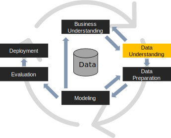
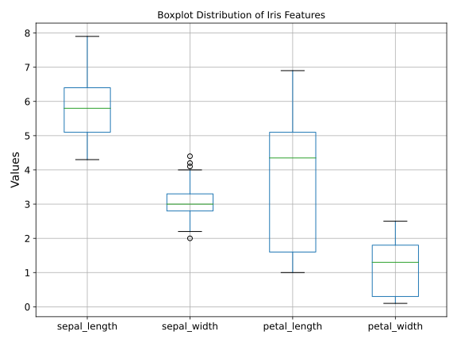
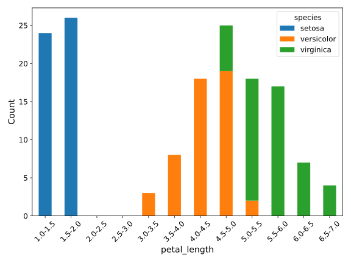

#



# Data understanding

The **data understanding** phase of CRISP-DM involves taking a closer look at the data available for mining.

- This step is critical in preventing problems during data preparation, which is typically the longest part of a project
- The data understanding phase involves four steps, including:
    1. *collection* of initial data
    1. *description* of data
    1. *exploration* of data, and
    1. *verification* of data quality

# Data collection (or acquisition)

**Data collection** is the process of *gathering information on targeted variables* in an established system

- Capture evidence that allows data analysis to formulate credible answers to the questions that have been posed
- The analyst should make sure to report problems and solutions to aid with future replications of the project.
- Data may have to be collected from several different sources, and some of these sources may have a lag time.

The analyst then proceeds to

- increase familiarity with the data,
- identify data quality problems,
- discover initial insights into the data,
- detect interesting subsets to form hypotheses about hidden information

#  **Problem**: what about biases?


# Biases

**Bias**

- Inclination or prejudice for or against one person or group, especially in a way considered to be unfair.
    - "There was evidence of bias against foreign applicants."
- A systematic distortion of a statistical result due to a factor not allowed for in its derivation.
    - "The search results are biased by the specific queries used."

:::{.fragment}
During data collection and analysis, several **biases** can occur

- *Selection*: sample used for data collection is not representative of the population being studied
- *Sampling*: certain segments of the population are more likely to be included or excluded from the sample
- *Response*: participants in a survey or study provide inaccurate or misleading responses
- *Confirmation*: refers to the tendency to favor information that confirms pre-existing beliefs or hypotheses while ignoring contradictory evidence
- *Cultural*: data collection methods, survey questions, or study designs are culturally insensitive or fail to account for cultural differences
- *Time-Interval*: the timing of data collection influences the results
- ... and many others
:::

# Confirmation bias

> "If you torture the data long enough, it will confess to anything"
>
> Ronald H. Coase

[(2023) Dati “torturati” per dare un assist al governo](https://www.ilfattoquotidiano.it/in-edicola/articoli/2023/09/14/linps-di-meloni-fa-sp-arire-il-lavoro-povero/7291305/)

# Survivorship bias

The "survivors" get studied, while the failures are excluded, leading to potentially flawed conclusions.

*Start-up Success Stories*

> People often hear stories of wildly successful companies like Apple, Amazon, or Tesla and assume that hard work and a good idea are enough to succeed. This overlooks the countless failed start-ups that had hard-working teams and great ideas but didn’t survive due to market conditions, competition, or other factors.

*Fitness and Weight Loss Programs*

> Testimonials for fitness programs often highlight people who achieved dramatic results. These "success stories" ignore the many individuals who followed the same program but didn’t achieve noticeable results, either due to differences in genetics, lifestyle, or other factors.

*Investment Portfolios*

> Financial advice often highlights top-performing stocks or mutual funds as examples of great investments. These examples focus on the "survivors" in the market, ignoring the many investments that failed or underperformed, which can lead to overestimating the likelihood of similar success in the future.

# Survivorship bias


# Selection bias


# ... and more!

*Confirmation Bias*

> A person who believes in a specific political ideology might seek out news articles or social media posts that reinforce their beliefs, while ignoring or dismissing information that contradicts their views. This selective exposure to information strengthens their pre-existing opinions.

*Anchoring Bias*

> When shopping for a new car, a person may see a car priced at $30,000, and then a second car priced at $25,000. Even if the second car is not objectively better or a great deal, the first price "anchors" their perception of the value of the second car, leading them to think it's a better deal simply because it's cheaper than the first option.

*Availability Bias*

> After watching several news reports about airplane crashes, a person might overestimate the risk of flying. They might avoid flying, despite it being statistically safer than driving, because the images and stories of crashes are more readily available in their memory.

# Biases and fairness

**Fairness** refers to the various attempts to correct algorithmic bias in automated decision processes based on ML models.

- Decisions made by such models after a learning process may be considered unfair if they were based on variables considered sensitive
- E.g., gender, ethnicity, sexual orientation, or disability

[(2018) Amazon scraps secret AI recruiting tool that showed bias against women](https://www.reuters.com/article/world/insight-amazon-scraps-secret-ai-recruiting-tool-that-showed-bias-against-women-idUSKCN1MK0AG/)

How could we approach this problem?

# Biases and fairness

[(2024) ‘We definitely messed up’: why did Google AI tool make offensive historical images?](https://www.theguardian.com/technology/2024/mar/08/we-definitely-messed-up-why-did-google-ai-tool-make-offensive-historical-images)

#  **Problem**: is data the new oil?

The more data we have, the more analysis we can do (however, more data != smarter data)

- There are several disciplines focusing on data (e.g., Data Science, Data Mining, Big Data, Business Intelligence)
- In Europe (but now in many areas of the world), there can be problems related to privacy
    - When is it "right" to protect privacy?
    - When does it become a limit?

Acquiring data is a time-consuming, investment and knowledge-intensive process

- How much data is *enough*?

#

Rule of thumb: *one in ten/twenty* [@chowdhury2020variable]

> There is no set rule as to the number of variables to include in a prediction model as it often depends on several factors. The ‘one in ten rule’, a rule that stipulates how many variables/parameters can be estimated from a data set, is quite popular in traditional clinical prediction modeling strategies (e.g., logistic regression and survival models). According to this rule, one variable can be considered in a model for every 10 events.

#  **Problem**: how can we collect data?

# Acquisition of a new dataset

Data collection is usually a costly process.

*Investment of time and money* for:

- Programming or learning to use an acquisition tool
- Handling of *large amounts of data*
- Testing to find any bugs that could compromise the success of the acquisition
    - Unfortunately, we often notice them at the end of the process
- *Acquire new hardware* for data collection and storage

It is necessary to carefully consider whether it is appropriate to acquire a new dataset.

- Considerations not only in engineering but also in management and economic aspects
- Future needs must be foreseen in advance

# Common Problems in Data Collection

Sometimes companies have a lot of "old" data in their databases or information systems:

- They don't know what to do with it
- Data re-collection on existing data (since data must be clean or something similar)

In many business processes, it is unclear:

- Which data is possible to collect (also due to privacy issues)
- Which data is (really) useful for the business

# Public Datasets

We can get data mainly in two ways.

By using *publicly available data* (datasets or databases)

- Someone collected them for us!
- They can be free or for a fee
- The quality of the data made available must be checked

By *acquiring a new set of data*, but why?

- It is not certain that public data well represents the problem we want to solve
- We want to acquire specific data and thus generate specific expertise for the company (know-how)
- We are forced to acquire data that, due to their sensitive nature, would not otherwise be available (privacy issues)
- The company we work for already has a data collection process that we can use

# Public Datasets

Many universities publicly release their datasets:

- There are no requirements related to profit or non-disclosure agreement (NDA)
- It is the basis of the scientific method, in particular for the reproducibility of the results obtained
- I release my data so that others can conduct my experiments and verify my results
- Examples: [https://www.image-net.org/](https://www.image-net.org/)

Some platforms make datasets available for competitions, such as [Kaggle](https://www.kaggle.com/datasets) and [others](https://medium.datadriveninvestor.com/kaggle-data-science-platform-alternatives-for-competitions-and-research-cbe051596e62)

# Example of a public dataset: the Iris dataset


The [Iris dataset](https://www.kaggle.com/datasets/uciml/iris) is public data that was used in R.A. Fisher's classic 1936 paper [@fisher1936use]

- It can also be found on the [UCI Machine Learning Repository](http://archive.ics.uci.edu/ml/).
- It includes 3 iris species (Setosa, Virginica, and Versicolor) with 50 samples each
- It characterizes flowers with some properties of each flower
    1. `SepalLengthCm`
    1. `SepalWidthCm`
    1. `PetalLengthCm`
    1. `PetalWidthCm`
    1. `Species`

# Data Annotation {visibility="hidden"} 

*Acquiring a new dataset does not mean acquiring only new data!*

Indeed, one of the most relevant aspects is the **annotation of the data**

> What would we do with the Iris dataset if we do not have the labels of each flower?

The specific annotation is usually called a "label" and is the (semantic) content of the data.

- A single data is therefore defined as *annotated* if it is associated with a label
- The *label* depends on the problem we want to solve and *can be numerical or categorical*
- Examples:
  - A person's height prediction → data: joint lengths, label: height (cm)
  - Pedestrian Detection → data: images, label: presence of a pedestrian (yes/no)
  - Pedestrian Localization → data: images, label: position of the pedestrian (x, y, w, h)
  - Audio classification numbers → data: audio sequences, label: number ('five')

Data collected without correct and timely annotation is often useless.

- However, it is also possible to "extract knowledge" from un-annotated data through, for instance, clustering

# Data Annotation Process {visibility="hidden"} 

The data annotation process can take place in several ways:

Here’s a more concise version of your points:

* *Manual*: Data is annotated by hand.

  * Accurate but slow and costly.
  * Not scalable for very large datasets.

* *Automatic*: Data is annotated with tools.

  * Relies on prior knowledge (e.g., dog shelter images → dogs).
  * Quality is harder to control.

* *Third-party*: Annotation done externally.

  * *Free*: Users trade platform use for annotated data (e.g., Facebook photos).
  * *Paid*: Annotations bought via platforms (e.g., Amazon Mechanical Turk).

# [Amazon Mechanical Turk](https://www.mturk.com/) {visibility="hidden"} 


# Different Ways of Learning {visibility="hidden"} 

:::: {.columns}
::: {.column width="65%"}

We define different types of learning depending on data annotation:

- *Annotated data* → Supervised Learning
  - One of the most studied types that allows for obtaining the best results

- *Not annotated data* → Unsupervised Learning
  - The results that can be obtained are usually worse than the previous case

- *Partially annotated data* → Semi-Supervised Learning

Specific algorithms correspond to each of these areas.

- Best performances are usually obtained with supervised trained algorithms
- We will mainly work on fully annotated data → Supervised Learning

:::
::: {.column width="35%"}


:::
::::

# Open and Closed Sets {visibility="hidden"}

The last aspect to be defined relating to data annotation: **do we know all annotations**?

*Closed Set*: it is assumed that the pattern to be classified belongs to one of the known classes.

- The most common case in machine learning benchmarks
- Ideal condition, but not always suitable for real-world systems

*Open Set*: the patterns to be classified can belong to none of the known classes.

- More realistic conditions, but more challenging
- Example: classify all fruits into {pears, bananas}

Two possible solutions to the open set problem:

- An additional fictitious class is added to the classes ("the rest of the world", "unknown")
  - The so-called "negative examples" are added to the training set
- You allow the system not to assign the pattern
  - A threshold is defined, and the pattern is assigned to the most likely class only when the probability is higher than the threshold

#  **Problem**: now that we have the data, what do we do?

# Describe the Data

The key question to ask is: does the data acquired satisfy the relevant requirements?

- This step also provides a basic understanding of the data on which subsequent steps will be built.
- For instance, if age is important and the data does not reflect the entire age range, it may be wise to collect a different dataset

The data analyst examines the "surface" properties of the acquired data, examining issues such as:

- the *format* of the data,
- the *quantity* of the data,
- the *number of records and fields* in each table,
- the *identities* of the fields,
- and any other *surface features of the data*.

# Iris

Plain Iris dataset

> | Id | SepalLengthCm | SepalWidthCm | PetalLengthCm | PetalWidthCm | Species     |
> |-------:|----------------:|---------------:|----------------:|---------------:|:------------|
> | 1 | 5.1 | 3.5 | 1.4 | 0.2 | Iris-setosa |
> | 2 | 4.9 | 3   | 1.4 | 0.2 | Iris-setosa |
> | 3 | 4.7 | 3.2 | 1.3 | 0.2 | Iris-setosa |
> | 4 | 4.6 | 3.1 | 1.5 | 0.2 | Iris-setosa |
> | 5 | 5   | 3.6 | 1.4 | 0.2 | Iris-setosa |
> | ... | ... | ... | ... | ... | ... |

# Iris

Example of profiling the schema of the data in Iris

> ```
> RangeIndex: 150 entries, 0 to 149
> Data columns (total 5 columns):
> #   Column             Non-Null Count  Dtype 
> --- ------             --------------  ----- 
> 0   sepal length (cm)  150 non-null    float64
> 1   sepal width (cm)   150 non-null    float64
> 2   petal length (cm)  150 non-null    float64
> 3   petal width (cm)   150 non-null    float64
> 4   species            150 non-null    object
> dtypes: float64(4), object(1)
> memory usage: 6.0+ KB
> ```

# Iris

Example of profiling the distribution of the data in Iris

> |       | Id | SepalLengthCm | SepalWidthCm | PetalLengthCm | PetalWidthCm |
> |:------|---------:|----------------:|---------------:|----------------:|---------------:|
> | count | 150      | 150        | 150        | 150       | 150        |
> | mean  | 75.5    | 5.84333  | 3.054    | 3.75867 | 1.19867  |
> | std   | 43.4454 | 0.828066 | 0.433594 | 1.76442 | 0.763161 |
> | min   | 1      | 4.3      | 2        | 1       | 0.1      |
> | 25%   | 38.25   | 5.1      | 2.8      | 1.6     | 0.3      |
> | 50%   | 75.5    | 5.8      | 3        | 4.35    | 1.3      |
> | 75%   | 112.75   | 6.4      | 3.3      | 5.1     | 1.8      |
> | max   | 150      | 7.9      | 4.4      | 6.9     | 2.5      |

# Iris

:::: {.columns}
::: {.column width="50%"}

In descriptive statistics, a **box plot** shows graphically the locality, spread, and skewness of numerical data

A boxplot is a standardized way of displaying the dataset based on the five-number summary:

1. *Minimum* ($Q_0$ or 0th percentile): the lowest data point
1. *First quartile* ($Q_1$ or 25th percentile)
1. *Median* ($Q_2$ or 50th percentile): the middle value
1. *Third quartile* ($Q_3$ or 75th percentile)
1. *Maximum* (Q4 or 100th percentile): the highest data point

*Interquartile range*: $\text{IQR}=Q_{3}-Q_{1}$

Graphical elements

- The *box* is drawn from $Q_1$ to $Q_3$
- *Whiskers* are based on the $1.5 \cdot IQR$ value
  - A whisker is drawn up to the largest/lowest observed data point from the dataset that falls within this distance
  - The whisker lengths can look unequal
- All other points outside the whiskers are plotted as *outliers*

:::
::: {.column width="50%"}

> Iris data
>
> 

:::
::::

# Explore the Data

This task tackles the data mining questions, which can be addressed using querying, visualization, and reporting.

- Create a data exploration report that outlines the first findings, or an initial hypothesis
- For instance, query the data to discover which features are correlated with the target of the analysis

# Iris

Value distribution vs `species`

:::: {.columns}
::: {.column width="50%"}

> `petal_length` vs `species`
>
> 

:::
::: {.column width="50%"}

> `sepal_length` vs `species`
>
> 

:::
::::

# Iris

> 2D visualization of the Iris dataset
>
> 

# Verify Data Quality

At this point, the analyst examines the quality of the data, addressing questions such as:

Some common data quality issues to check include:

- *missing values* or attributes;
  - E.g., unknown date of death (Is it missing? Is the person alive?)
- whether *all possible values are represented*;
  - E.g., all age groups are contained in the dataset
- the *plausibility of values*, review any attributes that may give answers that conflict with common sense;
  - E.g., teenagers with high income
- whether attributes with different values have *similar meanings*;
  - E.g., `low fat` and `diet`
- the *spelling* of values.
  - E.g., `law fat` or `low fat`?

> Nothing to worry about in Iris

# Dimensions of Data Quality [@sidi2012data]

:::: {.columns}

::: {.column width="50%"}


:::
::: {.column width="50%"}


:::
::::

# Metrics of Data Quality [@batini2009methodologies]


# References