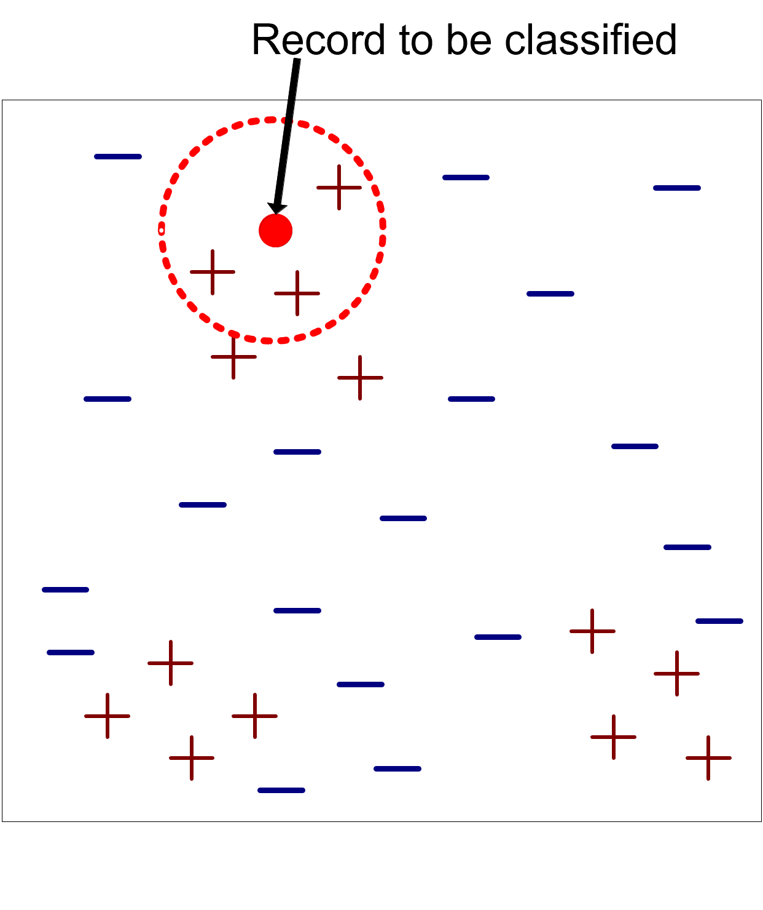
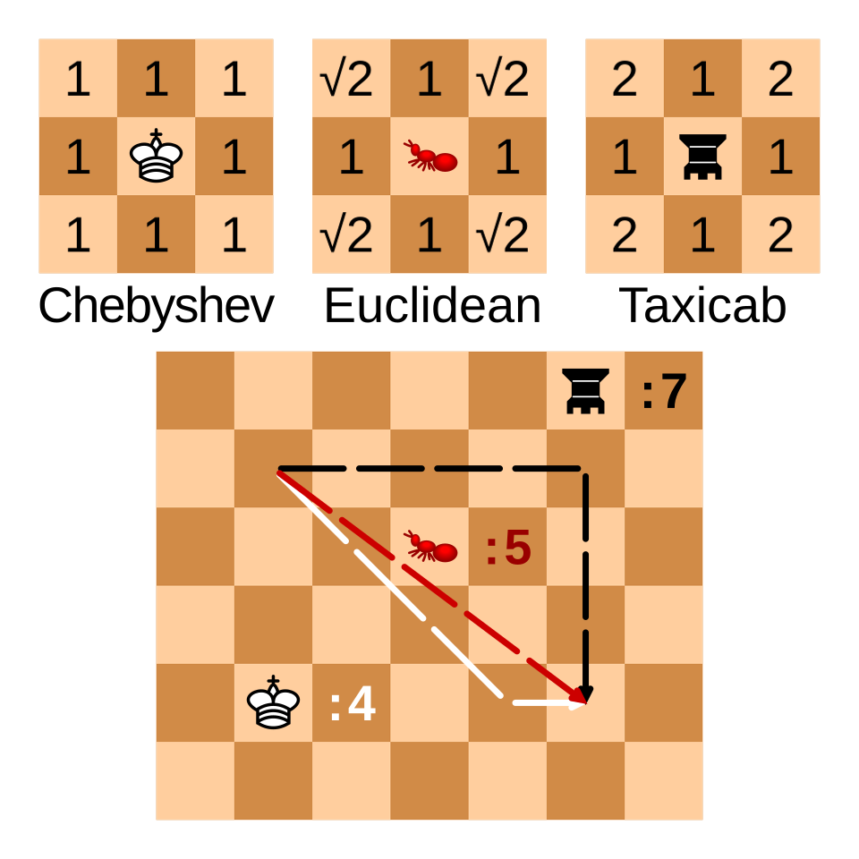

# Motivating problem: classify by similar cases

A streaming service receives a new customer with no churn label.

- We already know the behavior and outcome of many previous customers
- Customers with similar usage patterns often have similar outcomes
- Can we predict the new customer's class without learning an explicit model?

**k-NN answer:** find the most similar known customers and let their labels vote.

# Learning objectives

By the end of this lecture, you will be able to:

- **Explain** instance-based learning and the role of a distance metric
- **Compute** a k-NN prediction, with and without distance weighting
- **Select** a suitable value of $k$ using validation data
- **Recognize** why feature scaling is essential for distance-based learning
- **Diagnose** failure cases caused by irrelevant features and high dimensionality

# Learning priorities

| Priority | What students should be able to do |
|---|---|
| **Core** | Explain lazy learning, distance metrics, majority vote, and why scaling matters |
| **Practice** | Compute a k-NN prediction and select $k$ using validation data |

# If it walks like a duck and quacks like a duck, it's probably a duck


# Lazy learning

k-NN is often called a **lazy learner**.

- Eager learners, such as trees and neural networks, build a model before prediction
- Lazy learners postpone most of the work until a new query arrives
- The prediction cost can therefore be high for large training sets

K-nearest neighbors is an **instance-based** method.

- Training is mostly memorization: store the labeled examples
- Prediction is local: inspect the neighborhood of the new record
- The learned boundary can be nonlinear because each region can vote differently

# Nearest-neighbor classifier



Requirements:

- A labeled training set
- A distance or similarity measure
- A value of $k$, the number of neighbors
- A voting rule

# Prediction workflow

For a new record $z$:

1. Calculate the distance from $z$ to every training record
2. Sort the training records by distance
3. Select the first $k$ records
4. Predict the class with the largest vote

The result depends on both the **data representation** and the **distance metric**.

# Common distance metrics

For two records $x_i$ and $z$ with $d$ numeric features:

::::{.columns}
:::{.column width=50%}
Euclidean distance:

$$
dist(x_i,z)=\sqrt{\sum_{j=1}^{d}(x_{ij}-z_j)^2}
$$

Manhattan distance:

$$
dist(x_i,z)=\sum_{j=1}^{d}|x_{ij}-z_j|
$$

Both are sensitive to the units used to measure each feature.

:::
:::{.column width=50%}

:::
::::

# Manhattan and Euclidean can select different neighbors

Let the query be $z=(0,0)$ and compare two candidates:

| Candidate | Coordinates | Euclidean distance | Manhattan distance |
|:---:|:---:|:---:|:---:|
| $A$ | $(3,0)$ | $\sqrt{3^2+0^2}=3$ | $\lvert3\rvert+\lvert0\rvert=3$ |
| $B$ | $(2,2)$ | $\sqrt{2^2+2^2}\approx2.83$ | $\lvert2\rvert+\lvert2\rvert=4$ |

- **Euclidean:** $B$ is closer because diagonal movement is direct
- **Manhattan:** $A$ is closer because movement along each axis is added

The metric can therefore change the neighbor set and the prediction.

# Formal definition: majority vote

Let $D_z$ be the set of the $k$ closest training records to a query record $z$.

The predicted class is:

$$
\hat{y}=\arg\max_{y \in Y}\sum_{(x_i,y_i)\in D_z} I(y_i=y)
$$

- $Y$ is the set of possible class labels
- $I(\cdot)$ is 1 if the condition is true and 0 otherwise
- Each selected neighbor has the same vote
    - Odd values of $k$ can avoid ties in binary classification

# Worked example: majority vote

Suppose the three nearest training records to a new point $z$ are:

| Neighbor | Distance from $z$ | `churn` |
|:---:|:---:|:---:|
| $x_1$ | 0.5 | ❌ |
| $x_2$ | 1.1 | ✅ |
| $x_3$ | 1.3 | ✅ |

- With $k=1$, predict **stay ❌**
- With $k=3$, predict **churn ✅** by a 2-to-1 majority

The prediction is local: a different neighborhood may follow a different rule.

# Distance-weighted vote

Sometimes closer neighbors should count more.

A common weighted vote is:

$$
\hat{y}=\arg\max_{y \in Y}\sum_{(x_i,y_i)\in D_z} I(y_i=y) \cdot \frac{1}{dist(x_i,z)}
$$

- Very close neighbors receive a larger weight
- Distant neighbors still contribute, but less
- Implementations usually handle zero-distance cases explicitly

# Worked example: weighted vote

Using the same three neighbors:

| Neighbor | Distance from $z$ | `churn` | Weight $\frac{1}{dist}$ |
|:---:|:---:|:---:|:---:|
| $x_1$ | 0.5 | ❌ | 2.00 |
| $x_2$ | 1.1 | ✅ | 0.91 |
| $x_3$ | 1.3 | ✅ | 0.77 |

Total weighted vote:

- stay ❌: $2.0$
- churn ✅: $0.91 + 0.77$

Prediction: **stay**.

# Choosing the value of $k$

The choice of $k$ controls how local the prediction is.

- Small $k$: flexible, sensitive to noise, higher variance
- Large $k$: smoother, more stable, higher bias

```{python}
#| echo: false
#| warning: false
#| fig-align: center
#| fig-width: 10
#| fig-height: 4
#| dpi: 160

import numpy as np
import matplotlib.pyplot as plt
from matplotlib.patches import Circle
from sklearn.datasets import make_moons
from sklearn.neighbors import KNeighborsClassifier

X, y = make_moons(n_samples=160, noise=0.28, random_state=4)
class_colors = np.array(["tab:blue", "tab:orange"])
query = np.array([[0.25, 0.45]])

fig, axes = plt.subplots(1, 2, figsize=(10, 4))
for ax, k in zip(axes, [1, 25]):
    model = KNeighborsClassifier(n_neighbors=k)
    model.fit(X, y)
    distances, indices = model.kneighbors(query)
    selected = indices[0]
    radius = distances[0, -1]
    prediction = model.predict(query)[0]

    ax.scatter(X[:, 0], X[:, 1], c=class_colors[y], edgecolor="white", s=28, alpha=0.35)
    ax.scatter(
        X[selected, 0],
        X[selected, 1],
        c=class_colors[y[selected]],
        edgecolor="black",
        linewidth=1.4,
        s=72,
        label="selected neighbors",
    )
    ax.scatter(
        query[:, 0],
        query[:, 1],
        color="#D55E00",
        marker="X",
        s=160,
        edgecolor="black",
        linewidth=1,
        label="point to predict",
        zorder=4,
    )
    ax.add_patch(
        Circle(
            query[0],
            radius,
            fill=False,
            color="#D55E00",
            linestyle="--",
            linewidth=1.5,
        )
    )
    ax.set(
        title=f"k = {k}: predicted class {prediction}",
        xlabel="Feature 1",
        ylabel="Feature 2",
        xlim=(X[:, 0].min() - 0.4, X[:, 0].max() + 0.4),
        ylim=(X[:, 1].min() - 0.4, X[:, 1].max() + 0.4),
    )
    ax.set_aspect("equal", adjustable="box")
    ax.set_xticks([])
    ax.set_yticks([])
    ax.spines["top"].set_visible(False)
    ax.spines["right"].set_visible(False)

axes[1].legend(loc="upper right", fontsize=11)
fig.tight_layout()
plt.show()
```

Choose $k$ using validation data, not the test set.

# Choosing the value of $k$: visual intuition

```{python}
#| echo: false
#| warning: false
#| fig-align: center
#| fig-width: 10
#| fig-height: 4
#| dpi: 160

import numpy as np
import matplotlib.pyplot as plt
from sklearn.datasets import make_moons
from sklearn.neighbors import KNeighborsClassifier

X, y = make_moons(n_samples=160, noise=0.28, random_state=4)
class_colors = np.array(["tab:blue", "tab:orange"])

x_min, x_max = X[:, 0].min() - 0.4, X[:, 0].max() + 0.4
y_min, y_max = X[:, 1].min() - 0.4, X[:, 1].max() + 0.4
xx, yy = np.meshgrid(
    np.linspace(x_min, x_max, 250),
    np.linspace(y_min, y_max, 250),
)
grid = np.c_[xx.ravel(), yy.ravel()]

fig, axes = plt.subplots(1, 2, figsize=(10, 4))
for ax, k in zip(axes, [1, 25]):
    model = KNeighborsClassifier(n_neighbors=k)
    model.fit(X, y)
    zz = model.predict(grid).reshape(xx.shape)

    ax.contourf(xx, yy, zz, levels=[-0.5, 0.5, 1.5], colors=class_colors, alpha=0.18)
    ax.contour(xx, yy, zz, levels=[0.5], colors="#333333", linewidths=1.5)
    ax.scatter(X[:, 0], X[:, 1], c=class_colors[y], edgecolor="black", s=34)
    ax.set(title=f"k = {k}", xlabel="Feature 1", ylabel="Feature 2")
    ax.set_xticks([])
    ax.set_yticks([])
    ax.spines["top"].set_visible(False)
    ax.spines["right"].set_visible(False)

fig.tight_layout()
plt.show()
```

# Feature scaling is not optional

k-NN compares records using distances.

- If features have very different numeric ranges, large-scale features dominate the distance even when they are not more informative.

Example:

- `age`: 18 to 80
- `weekly_sessions`: 0 to 20
- `annual_income`: 10,000 to 1,000,000

Without scaling, income can dominate Euclidean distance.

# Scaling can reverse the nearest neighbor

Query customer $z$: age 40, income EUR 50,000.

| Candidate | Age | Income | Difference from query |
|:---:|:---:|:---:|:---:|
| $A$ | 42 | EUR 70,000 | $(2,\ 20{,}000)$ |
| $B$ | 60 | EUR 50,500 | $(20,\ 500)$ |

On raw values:

$$
dist(z,A)=\sqrt{2^2+20{,}000^2}\approx20{,}000
$$

$$
dist(z,B)=\sqrt{20^2+500^2}\approx500.4
$$

Income overwhelms age, so the raw distance selects **B**.

# Normalization: standardization (forward reference to Mod II)

Standardization converts each feature to:

$$
x'=\frac{x-\mu}{\sigma}
$$

- $\mu$ is the feature mean
- $\sigma$ is the feature standard deviation
- The transformed feature has mean 0 and standard deviation 1 on the training set

Fit the scaler on the **training set only**.

# After standardization, the answer changes (forward reference to Mod II)

Suppose the training-set standard deviations are:

$$
\sigma_{age}=10\text{ years},\qquad \sigma_{income}=\text{EUR }25{,}000
$$

Standardized differences and distances become:

| Candidate | Standardized difference | Euclidean distance |
|:---:|:---:|:---:|
| $A$ | $(2/10,\ 20{,}000/25{,}000)=(0.2,0.8)$ | $\sqrt{0.2^2+0.8^2}\approx0.82$ |
| $B$ | $(20/10,\ 500/25{,}000)=(2,0.02)$ | $\sqrt{2^2+0.02^2}\approx2.00$ |

After scaling, **A** is closer.

# Min-max scaling (forward reference to Mod II) {visibility="hidden"}

Min-max scaling converts each feature to:

$$
x'=\frac{x-\min(x)}{\max(x)-\min(x)}
$$

- Values are usually mapped to $[0,1]$
- It preserves the shape of the distribution
- It can be sensitive to outliers

The right scaler is a modeling choice and should be evaluated with validation data.

# Avoiding data leakage

Incorrect workflow that leaks information from the test set into preprocessing.

1. Scale the whole dataset
2. Split into train and test sets
3. Evaluate the model

Correct workflow:

1. Split into train and test sets
2. Fit the scaler on the training set
3. Transform train and test with the fitted scaler
4. Evaluate once on the test set

# Use pipelines

In scikit-learn, use a pipeline:

```python
from sklearn.pipeline import Pipeline
from sklearn.preprocessing import StandardScaler
from sklearn.neighbors import KNeighborsClassifier

model = Pipeline([
    ("scaler", StandardScaler()),
    ("knn", KNeighborsClassifier(n_neighbors=5)),
])
```

The pipeline fits preprocessing only on the training folds during cross-validation.

# High dimensionality

k-NN is sensitive to the number of features.

- each feature contributes noise to the distance
- irrelevant features can dominate the distance metric
- truly similar records may appear far apart

# A neighborhood inside the unit hypercube

The query is at the center, and "near" means within $\pm0.1$ on every feature.

- The highlighted region is the local neighborhood around the query point.
- This sparsity is the **curse of dimensionality**: k-NN needs far more data, or fewer and more informative features, to keep neighborhoods meaningful.

```{python}
#| echo: false
#| warning: false
#| fig-align: center
#| fig-width: 10
#| fig-height: 4.4
#| dpi: 160

import random
import numpy as np
import matplotlib.pyplot as plt
from matplotlib.patches import Rectangle
from mpl_toolkits.mplot3d.art3d import Poly3DCollection

rng = random.Random(1)
n_points = 1000

plt.rcParams.update({"font.size": 15})
fig = plt.figure(figsize=(10, 4.4))
ax_2d = fig.add_subplot(1, 2, 1)
ax_3d = fig.add_subplot(1, 2, 2, projection="3d")

# Two-dimensional unit square
x_2d = [rng.random() for _ in range(n_points)]
y_2d = [rng.random() for _ in range(n_points)]
inside_2d = [0.4 <= x <= 0.6 and 0.4 <= y <= 0.6 for x, y in zip(x_2d, y_2d)]

ax_2d.add_patch(Rectangle((0.4, 0.4), 0.2, 0.2, color="#E69F00", alpha=0.18))
ax_2d.scatter(
    [x for x, inside in zip(x_2d, inside_2d) if not inside],
    [y for y, inside in zip(y_2d, inside_2d) if not inside],
    color="#999999",
    alpha=0.55,
    s=18,
    label="outside neighborhood",
)
ax_2d.scatter(
    [x for x, inside in zip(x_2d, inside_2d) if inside],
    [y for y, inside in zip(y_2d, inside_2d) if inside],
    color="#E69F00",
    alpha=0.85,
    s=24,
    label="inside neighborhood",
)
ax_2d.scatter([0.5], [0.5], color="#D55E00", marker="X", s=120, label="query")
ax_2d.set(
    title="2-D square: 4% nearby",
    xlabel="Feature 1",
    ylabel="Feature 2",
    xlim=(0, 1),
    ylim=(0, 1),
)
ax_2d.set_aspect("equal", adjustable="box")
ax_2d.legend(loc="upper right", fontsize=12)

# Three-dimensional unit cube
points_3d = np.array([[rng.random(), rng.random(), rng.random()] for _ in range(n_points)])
inside_3d = np.all((0.4 <= points_3d) & (points_3d <= 0.6), axis=1)

cube_vertices = [
    (0.4, 0.4, 0.4),
    (0.6, 0.4, 0.4),
    (0.6, 0.6, 0.4),
    (0.4, 0.6, 0.4),
    (0.4, 0.4, 0.6),
    (0.6, 0.4, 0.6),
    (0.6, 0.6, 0.6),
    (0.4, 0.6, 0.6),
]
cube_faces = [
    [cube_vertices[i] for i in [0, 1, 2, 3]],
    [cube_vertices[i] for i in [4, 5, 6, 7]],
    [cube_vertices[i] for i in [0, 1, 5, 4]],
    [cube_vertices[i] for i in [2, 3, 7, 6]],
    [cube_vertices[i] for i in [1, 2, 6, 5]],
    [cube_vertices[i] for i in [0, 3, 7, 4]],
]
ax_3d.add_collection3d(
    Poly3DCollection(cube_faces, facecolors="#E69F00", edgecolors="#E69F00", alpha=0.12)
)
ax_3d.scatter(
    points_3d[~inside_3d, 0],
    points_3d[~inside_3d, 1],
    points_3d[~inside_3d, 2],
    color="#999999",
    alpha=0.25,
    s=10,
)
ax_3d.scatter(
    points_3d[inside_3d, 0],
    points_3d[inside_3d, 1],
    points_3d[inside_3d, 2],
    color="#E69F00",
    alpha=0.95,
    s=28,
)
ax_3d.scatter([0.5], [0.5], [0.5], color="#D55E00", marker="X", s=120)
ax_3d.set(
    title="3-D cube: 0.8% nearby",
    xlabel="Feature 1",
    ylabel="Feature 2",
    zlabel="Feature 3",
    xlim=(0, 1),
    ylim=(0, 1),
    zlim=(0, 1),
)
ax_3d.view_init(elev=22, azim=35)
ax_3d.set_box_aspect((1, 1, 1))

ax_2d.spines["top"].set_visible(False)
ax_2d.spines["right"].set_visible(False)

fig.tight_layout()
plt.show()
```

# Failure case: high dimensionality {visibility="hidden"}

Assume 1,000 points are uniformly distributed in $[0,1]^d$. Around a query at the center, define "near" as within $\pm0.1$ on **every** feature.

The relative neighborhood volume is $(0.2)^d$:

| Dimensions $d$ | Relative volume $(0.2)^d$ | Expected nearby points |
|:---:|:---:|:---:|
| 2 | $0.04$ | $1000\times0.04=40$ |
| 5 | $0.00032$ | $1000\times0.00032=0.32$ |
| 10 | $1.024\times10^{-7}$ | $0.0001024$ |

With the same data size and per-feature tolerance, a useful local neighborhood goes from **40 points in 2-D** to effectively **empty in 10-D**.

# Average distance grows with dimensionality

For 1,000 points uniformly distributed in $[0,1]^{10}$, select one point and measure its average Euclidean distance from all the others while using the first 1 to 10 dimensions:

```{python}
#| echo: false
#| warning: false
#| fig-align: center
#| fig-width: 10
#| fig-height: 4.4
#| dpi: 160

import matplotlib.pyplot as plt
import numpy as np

rng = np.random.default_rng(42)
n_points = 1_000
points = rng.uniform(size=(n_points, 10))
dimensions = np.arange(1, 11)

average_distances = [
    np.linalg.norm(points[1:, :d] - points[0, :d], axis=1).mean()
    for d in dimensions
]

plt.rcParams.update({"font.size": 16})
fig, ax = plt.subplots()

ax.plot(
    dimensions,
    average_distances,
    color="#0072B2",
    marker="o",
    linewidth=3,
    markersize=7,
)

ax.set(
    xlabel="Number of dimensions",
    ylabel="Average Euclidean distance",
    xticks=dimensions,
    ylim=(0, None),
)
ax.grid(axis="y", alpha=0.25)
ax.spines["top"].set_visible(False)
ax.spines["right"].set_visible(False)
fig.tight_layout()
plt.show()
```

Each additional feature contributes another nonnegative term to the Euclidean distance, so points become farther apart on average even though every feature remains in $[0,1]$.

- k-NN benefits from feature selection, dimensionality reduction, or careful feature engineering.

# Local neighborhoods quickly become empty {visibility="hidden"}

For 1,000 uniformly distributed points, using a tolerance of $\pm0.1$ on every normalized feature:

```{python}
#| echo: false
#| warning: false
#| fig-align: center
#| fig-width: 10
#| fig-height: 4.4
#| dpi: 160

import matplotlib.pyplot as plt

n_points = 1_000
dimensions = list(range(1, 13))
expected_neighbors = [n_points * 0.2**d for d in dimensions]

plt.rcParams.update({"font.size": 16})
fig, ax = plt.subplots()

ax.semilogy(
    dimensions,
    expected_neighbors,
    color="#0072B2",
    marker="o",
    linewidth=3,
    markersize=7,
)
ax.axhline(1, color="#D55E00", linestyle="--", linewidth=2)
ax.fill_between(
    dimensions,
    expected_neighbors,
    1,
    where=[value < 1 for value in expected_neighbors],
    color="#D55E00",
    alpha=0.10,
)

for d in (2, 5, 10):
    value = n_points * 0.2**d
    ax.annotate(
        f"d={d}: {value:g}",
        (d, value),
        xytext=(9, 8),
        textcoords="offset points",
        fontsize=15,
    )

ax.text(12, 1.25, "one expected neighbor", color="#D55E00", ha="right")
ax.set(
    xlabel="Number of dimensions",
    ylabel="Expected nearby points",
    xticks=dimensions,
)
ax.grid(axis="y", which="both", alpha=0.25)
ax.spines["top"].set_visible(False)
ax.spines["right"].set_visible(False)
fig.tight_layout()
plt.show()
```

# Shrinking neighborhoods make k-NN less local {visibility="hidden"}

With a fixed dataset size, the feature space becomes increasingly sparse.

- **Neighborhoods become empty:** the nearest observation may still be far away on several features
- **The search radius must grow:** finding $k$ neighbors includes increasingly dissimilar observations
- **Predictions become less local:** k-NN loses the local similarity that makes it useful

The algorithm must trade a tiny, unreliable neighborhood for a larger, less relevant one.

# Preserving density requires exponentially more data {visibility="hidden"}

To keep an expected $m$ observations in a neighborhood occupying the fraction $(0.2)^d$:

$$
n=\frac{m}{(0.2)^d}
$$

Keeping 40 expected neighbors in 10 dimensions would require:

$$
n=\frac{40}{(0.2)^{10}}=390{,}625{,}000\text{ observations}
$$

In practice, **feature selection** and **dimensionality reduction** are often more realistic than collecting exponentially more data.

# Why brute-force distance computation costs $O(nd)$

For one query, k-NN compares the query with every training record.

Computing the distance to **one** record examines all $d$ features:

$$
dist(x,z)=\sqrt{\sum_{j=1}^{d}(x_j-z_j)^2}
\quad\Longrightarrow\quad O(d)
$$

Repeating this for all $n$ training records gives:

$$
n\times O(d)=O(nd)
$$

This is the cost of the **distance-computation stage** for one prediction.

# Selecting the $k$ nearest records adds work

After computing $n$ distances, k-NN must identify the smallest $k$:

- Sort every distance: $O(n\log n)$

The complete brute-force prediction (more optimized solution exist) cost is:

$$
O(nd+n\log n)
$$

Storing the $n\times d$ training matrix also costs $O(nd)$.

- Index structures can reduce search cost.

# The R-tree index structure (Guttman, 1984) {visibility="hidden"}

R-trees are extensions of B+-trees to multi-dimensional spaces.

B+-trees organize objects into:

- A set of nonoverlapping one-dimensional intervals
- Recursively nested pages from leaves to root

R-trees organize objects into:

- Overlapping multi-dimensional rectangles
- Recursively nested bounding regions

# The R-tree index structure (Guttman, 1984)

- Recursively aggregate objects using minimum bounding rectangles (MBRs)
- Regions can overlap
- A 2-D range query can ignore regions that cannot contain relevant objects


# k-NN: practical model-selection checklist

For k-NN, validate:

- Number of neighbors: `n_neighbors`
- Weighting: uniform or distance-weighted
- Distance metric: Euclidean, Manhattan, or a domain-specific metric
- Scaling method: standardization, min-max scaling, or another transformation
- Feature set: remove irrelevant or redundant features

# k-NN: strengths

- Very simple baseline
- No expensive training phase
- Naturally supports nonlinear decision boundaries
- Easy to adapt to multiclass classification
- Can work well when the distance metric matches the domain

# k-NN: weaknesses

- Requires a meaningful distance metric
- Requires preprocessing for feature scaling
- Sensitive to noise and irrelevant features
- Prediction cost can be high for large datasets
- Performance may degrade in high-dimensional spaces

# Check your understanding

A query point has five nearest-neighbor labels:

`A, A, B, B, B`

1. What is the prediction for $k=3$? What about $k=5$?
2. Could distance weighting change either answer?
3. Which dataset split should you use to choose $k$?
4. What preprocessing must be fitted on the training set before computing distances?

# Summary: when should I use k-NN?

**Use k-NN when:**

- Similar cases are expected to have similar outputs
- The dataset is not too large, or an efficient neighbor search is available
- You want a flexible nonlinear baseline with almost no training time

**Be careful when:**

- Features use different scales
- Many features are irrelevant
- Prediction latency matters
- Data are sparse or high-dimensional
