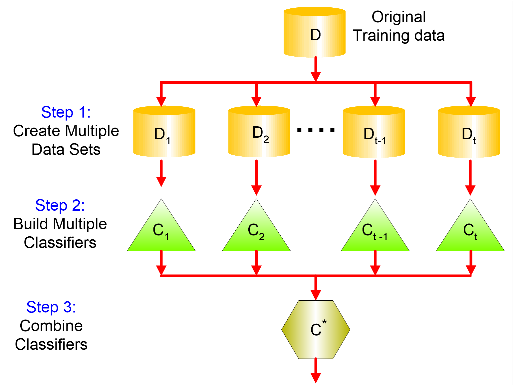
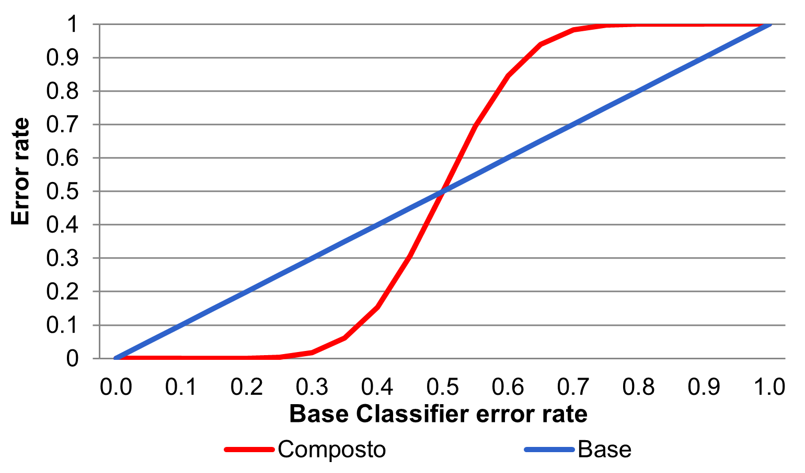
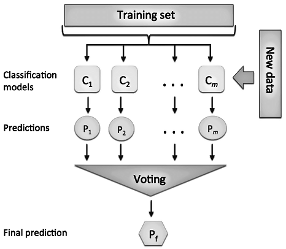
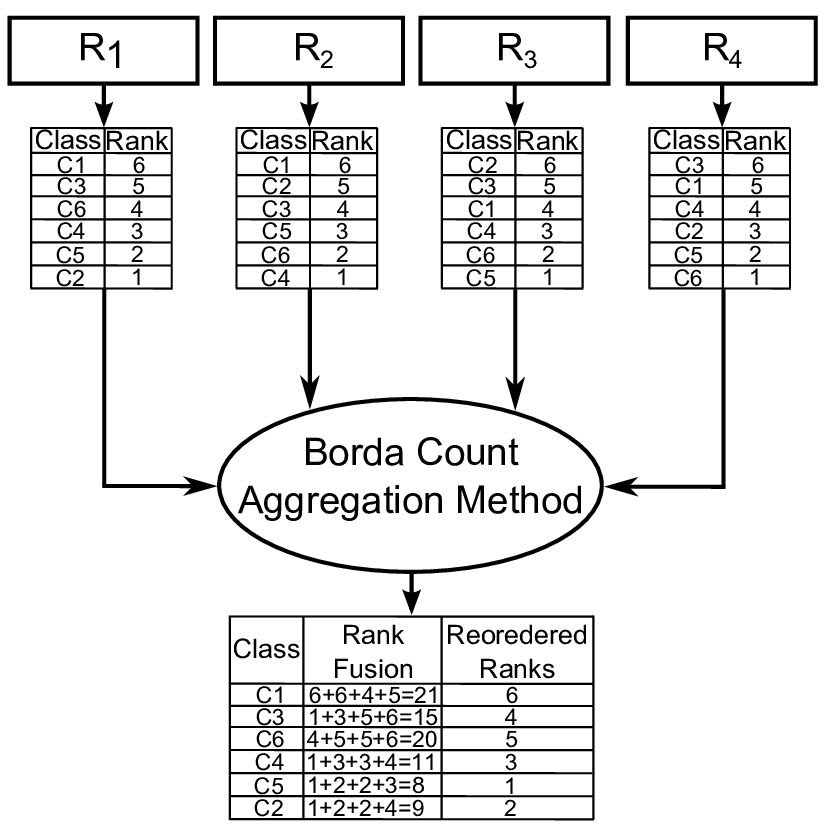
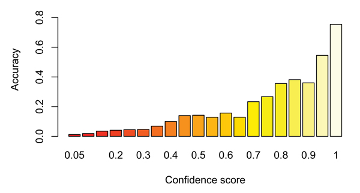
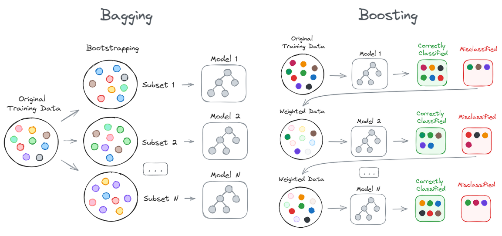
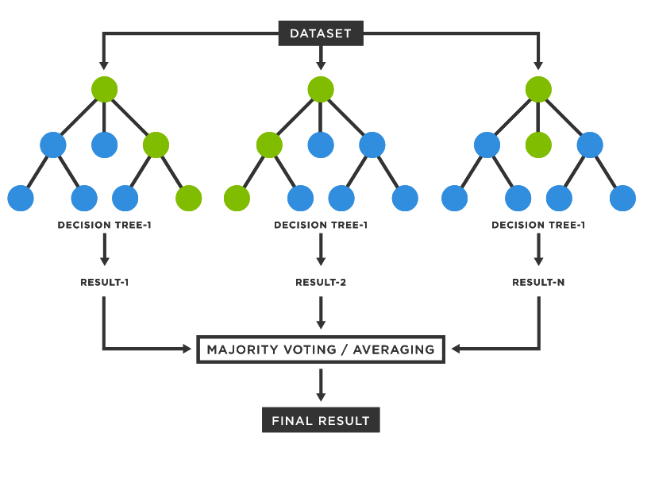
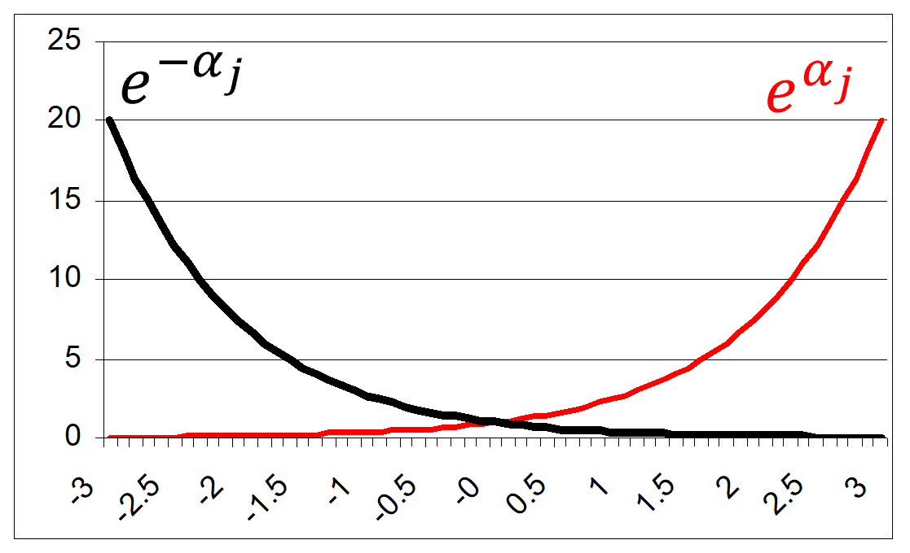

# Learning objectives

By the end of this lecture, you will be able to:

- **Explain** why combining several weak or unstable classifiers can improve prediction
- **Compare** decision-level and confidence-level fusion rules
- **Distinguish** bagging from boosting
- **Compute** the main quantities used by AdaBoost
- **Relate** AdaBoost to the original Freund and Schapire paper @freund1997decision

# Why ensemble classifiers?

An **ensemble classifier** combines the predictions of several base classifiers.

The central idea is simple:

- One classifier may be wrong on some records
- Another classifier may make different errors
- Their combination can be more reliable than each model alone



# Why diversity matters

If all classifiers make the same errors, voting repeats the same mistake.

An ensemble becomes useful when its members are both:

- **Competent**: each classifier is better than random guessing
- **Diverse**: their errors are at least partly different

Ensembles can be organized in different ways:

- **Parallel**: classifiers work independently and their outputs are merged
- **Cascade**: the output of one classifier influences the next classifier

In practice, real independence is difficult to obtain, but partial diversity can still improve performance.

# A probabilistic intuition

:::: {.columns}
::: {.column width="60%"}

Suppose we have 25 independent classifiers.

- Each classifier has error rate $\epsilon=0.35$
- The ensemble predicts by majority vote
- The ensemble is wrong only if at least 13 classifiers are wrong

$$
P(error)=\sum_{i=13}^{25} {25 \choose i}\epsilon^i(1-\epsilon)^{25-i}
$$

For $\epsilon=0.35$, this is approximately $0.06$: much smaller than the individual error.

:::
::: {.column width="40%"}



:::
::::

# Decision-level fusion

In **decision-level fusion**, each classifier outputs a class decision.

The ensemble then combines these decisions.

:::: {.columns}
::: {.column width="55%"}

Common rules:

- **Majority vote**: each classifier votes for one class
- **Weighted vote**: more reliable classifiers have larger influence
- **Borda count**: each classifier ranks classes, then ranks are converted into scores

The selected class is the one with the highest final score.

:::
::: {.column width="45%"}



:::
::::

# Majority vote

For classification, the final prediction is commonly obtained by **voting**.

- Assume three classifiers predict the class of the same record.

```{mermaid}
%%| echo: false
flowchart LR
    X["record x"] --> C1["C1: yes"]
    X --> C2["C2: no"]
    X --> C3["C3: yes"]
    C1 --> V["vote"]
    C2 --> V
    C3 --> V
    V --> Y["ensemble: yes"]

    style Y fill:#a3f7a3,stroke:#000
```

The ensemble assigns the class voted by most classifiers.

- This works best when classifiers are **accurate enough**
- It also requires their errors to be **not perfectly correlated**

# Weighted voting

Class membership can be decided by a voting mechanism.

- **Unweighted vote**: each classifier contributes one vote
- **Weighted vote**: more reliable classifiers contribute more

Example:

- Classifier $C_1$ votes for class $X$ and made 25 errors out of 100 similar training cases
- Classifier $C_2$ votes for class $Y$ and made 10 errors out of 100 similar training cases

With reliability-weighted voting, the record should be assigned to class $Y$.

# Borda count

The **Borda count** is useful when classifiers produce a ranking of classes rather than a single class.

- Each classifier orders the candidate classes
- Positions in the ranking are converted into numerical scores
- Scores are summed across classifiers
- The class with the highest score is selected

This is still a decision-level method: it merges symbolic decisions or rankings, not calibrated probabilities.



# Confidence-level fusion

In **confidence-level fusion**, each classifier outputs one confidence value per class.

These values can be merged through different functions:

- Sum, Product, Minimum, Maximum, Weighted sum

The sum is often more robust than the product. *Why?*

<details>
<summary>Suggested answer</summary>
If one classifier assigns confidence 0, a product rule forces the whole combined confidence to 0.
</details>



# How to build a composite classifier

There are several ways to build diversity among classifiers.

**Changing the training set**

- Build several datasets from the original training data
- Train one classifier on each dataset
- Examples: *bagging* and *boosting*

:::{.fragment}
**Changing the attributes**

- Train each classifier on a subset of features
- Useful when features are redundant or highly correlated
- Example: random forests
:::

:::{.fragment}
**Changing the learning algorithm or its parameters**

- Combine different model families, such as decision trees and $k$-NN
- Change neural-network topology, initialization, or training parameters
- Randomize split policies in decision trees
:::

# Multi-class decomposition

Another way to build an ensemble is to transform a multi-class problem into several binary problems.

- Partition the classes into two groups, $A_0$ and $A_1$
- Train a binary classifier to separate the two groups
- Repeat with different class partitions
- Aggregate the binary decisions into scores for the original classes

This idea appears in **Error-Correcting Output Coding**.

The final class is the one with the highest accumulated score.

# Bias, variance, and noise

Prediction error can be discussed through three components.

- **Bias**: error due to model assumptions that are too simple
- **Variance**: error due to sensitivity to the specific training set
- **Noise**: irreducible randomness or ambiguity in the data

Different ensemble strategies target different parts of the problem.

- *Bagging* mainly reduces **variance**
- *Boosting* can reduce **bias** and variance, but may become sensitive to noise

# Bias and variance intuition

Different classifiers have different abilities to model decision boundaries.

- A model with high **bias** is too restricted to represent the true boundary
- A model with high **variance** changes too much when the training set changes
- A model affected by **noise** cannot remove ambiguity already present in the data

For example:

- A very shallow decision tree may have high bias
- A 1-NN classifier may have low bias but high variance
- Mislabeled records can hurt any classifier

# Bagging and boosting



# Bagging

**Bagging** means **bootstrap aggregating** @breiman1996bagging.

It builds many classifiers by repeatedly sampling the training set **with replacement**.

```{mermaid}
%%| echo: false
flowchart LR
    D["training set D"] --> B1["bootstrap sample D1"]
    D --> B2["bootstrap sample D2"]
    D --> B3["bootstrap sample D3"]
    B1 --> C1["train C1"]
    B2 --> C2["train C2"]
    B3 --> C3["train C3"]
    C1 --> V["majority vote"]
    C2 --> V
    C3 --> V
    V --> Y["prediction"]
```

# Bootstrap sampling

Given a training set $D$ with $N$ records, each bagging round creates a new dataset $D_j$:

- $|D_j|=N$
- Records are sampled from $D$ with replacement
- Some records appear more than once
- Some records do not appear at all

For large $N$, a bootstrap sample contains about $63.2\%$ of the distinct original records:

$$
1-\left(1-\frac{1}{N}\right)^N \approx 1-e^{-1}=0.632
$$

# Bagging algorithm

For $j=1,\dots,T$:

1. Create a bootstrap sample $D_j$ from $D$
2. Train a classifier $C_j$ on $D_j$
3. Store the classifier

For a new record $\boldsymbol{x}$:

$$
C^*(\boldsymbol{x})=\arg\max_y \sum_{j=1}^{T} I(C_j(\boldsymbol{x})=y)
$$

where $I(\cdot)$ is 1 when the condition is true and 0 otherwise.

# Bagging with a decision stump

Consider a one-level binary decision tree, also called a **decision stump**.

It can only make rules such as:

$$
x \le s \rightarrow -1,\qquad x>s \rightarrow +1
$$

where $s$ is the split point.

| $x$ | 0.1 | 0.2 | 0.3 | 0.4 | 0.5 | 0.6 | 0.7 | 0.8 | 0.9 | 1.0 |
| :-: | :-: | :-: | :-: | :-: | :-: | :-: | :-: | :-: | :-: | :-: |
| $y$ | +1 | +1 | +1 | -1 | -1 | -1 | -1 | +1 | +1 | +1 |

A single stump cannot perfectly model this pattern.

# What bagging changes

With bootstrap samples, different stumps may choose different split points.

Some samples emphasize the left boundary:

$$
x \le 0.3 \rightarrow +1,\qquad x>0.3 \rightarrow -1
$$

Other samples emphasize the right boundary:

$$
x \le 0.7 \rightarrow -1,\qquad x>0.7 \rightarrow +1
$$

The ensemble vote can approximate a more expressive classifier than one stump alone.

# When bagging helps

Bagging is useful when the base learner is **unstable**.

An unstable learner changes its decision boundary noticeably when the training set changes slightly.

Typical examples:

- Decision trees
- Neural networks trained from random initialization
- High-variance models trained on small datasets

Bagging is less useful for very stable models, because bootstrap samples produce very similar classifiers.

# Random forest

::::{.columns}
:::{.column width="60%"}
A **random forest** is a bagging ensemble of decision trees [@breiman2001random].

It introduces randomness in two places:

- **Rows**: each tree is trained on a bootstrap sample
- **Features**: each split considers only a random subset of features

This second mechanism prevents all trees from repeatedly choosing the same dominant feature.

Typical choice for classification:

$$
d' \approx \sqrt{d}
$$

where $d$ is the number of features and $d'$ is the number considered at each split.
:::
:::{.column width="40%"}

:::
::::

# Boosting

**Boosting** builds classifiers sequentially.

Each new classifier focuses more strongly on the records that previous classifiers handled badly.

```{mermaid}
%%| echo: false
flowchart LR
    D1["weighted data"] --> C1["train C1"]
    C1 --> U1["increase weight of mistakes"]
    U1 --> C2["train C2"]
    C2 --> U2["increase weight of mistakes"]
    U2 --> C3["train C3"]
    C1 --> V["weighted vote"]
    C2 --> V
    C3 --> V
    V --> Y["prediction"]
```

Unlike bagging, boosting classifiers are not independent: each round depends on the previous one.

# Bagging vs boosting

| Aspect | Bagging | Boosting |
|---|---|---|
| Training | Parallel | Sequential |
| Data distribution | Bootstrap samples | Reweighted records |
| Main goal | Reduce variance | Improve weak learners |
| Combination | Usually equal vote | Weighted vote |
| Sensitivity | Robust to noise | Can emphasize noisy records |

# Weak learners

Boosting starts from a **weak learner**.

A weak learner is not required to be highly accurate. It only needs to perform slightly better than random guessing.

For binary classification:

$$
\epsilon_j < 0.5
$$

AdaBoost turns a sequence of weak classifiers into a strong classifier by:

- Increasing the influence of hard examples
- Giving more voting power to more accurate classifiers

# AdaBoost in the original paper

Freund and Schapire introduced AdaBoost as an adaptive boosting method that does not need prior knowledge of the weak learner's accuracy @freund1997decision.

The paper connects boosting to a broader **decision-theoretic** setting.

Key idea:

- Maintain a distribution of weights over training examples
- Train a weak classifier on the weighted data
- Increase the weights of misclassified examples
- Combine classifiers using weights based on their error

# AdaBoost notation

Training set:

$$
D=\{(\boldsymbol{x}_1,y_1),\dots,(\boldsymbol{x}_N,y_N)\}
$$

For binary classification:

$$
y_i \in \{-1,+1\}
$$

At round $j$:

- $w_i^{(j)}$ is the weight of record $i$
- $C_j$ is the classifier trained at round $j$
- $\epsilon_j$ is its weighted error
- $\alpha_j$ is its voting weight

# Weighted error

The weighted error of classifier $C_j$ is:

$$
\epsilon_j=\sum_{i=1}^{N} w_i^{(j)} I(C_j(\boldsymbol{x}_i)\ne y_i)
$$

Interpretation:

- Misclassifying a high-weight record is expensive
- Correctly classifying a high-weight record is important
- The next classifier is pushed toward the current mistakes

The weights satisfy:

$$
\sum_{i=1}^{N} w_i^{(j)}=1
$$

# Classifier weight

AdaBoost assigns classifier $C_j$ the weight:

$$
\alpha_j=\frac{1}{2}\ln\left(\frac{1-\epsilon_j}{\epsilon_j}\right)
$$

If $\epsilon_j$ is small, $\alpha_j$ is large.

If $\epsilon_j=0.5$, then $\alpha_j=0$.

If $\epsilon_j>0.5$, the classifier is worse than random guessing and should not help the vote.

# Weight update

After round $j$, AdaBoost updates record weights as:

$$
w_i^{(j+1)}=\frac{w_i^{(j)}\exp(-\alpha_j y_i C_j(\boldsymbol{x}_i))}{Z_j}
$$

where $Z_j$ normalizes the weights so they sum to 1.

For binary labels:

- If $C_j(\boldsymbol{x}_i)=y_i$, then $y_iC_j(\boldsymbol{x}_i)=1$ and the weight decreases
- If $C_j(\boldsymbol{x}_i)\ne y_i$, then $y_iC_j(\boldsymbol{x}_i)=-1$ and the weight increases



# Final AdaBoost classifier

The final prediction is a weighted vote:

$$
C^*(\boldsymbol{x})=\operatorname{sign}\left(\sum_{j=1}^{T}\alpha_j C_j(\boldsymbol{x})\right)
$$

Each classifier contributes according to its reliability.

- More accurate classifiers have larger $\alpha_j$
- Less accurate classifiers have smaller $\alpha_j$
- The ensemble decision depends on the total weighted support for each class

# AdaBoost algorithm

1. Initialize all record weights: $w_i^{(1)}=\frac{1}{N}$
2. For each round $j=1,\dots,T$:
    - Train classifier $C_j$ using weights $w^{(j)}$
    - Compute weighted error $\epsilon_j$
    - Compute classifier weight $\alpha_j$
    - Update the record weights
3. Return the weighted vote of all classifiers

The process is adaptive because each round changes the learning problem faced by the next classifier.

# AdaBoost algorithm in pseudocode

```text
Initialize weights w_i = 1/N for i = 1, ..., N

for j = 1, ..., T:
    Train classifier C_j on the weighted training set
    Compute weighted error epsilon_j

    if epsilon_j >= 0.5:
        stop or discard the classifier
    else:
        alpha_j = 1/2 * ln((1 - epsilon_j) / epsilon_j)
        Increase the weights of misclassified records
        Decrease the weights of correctly classified records
        Normalize weights so that their sum is 1

Return the weighted vote of C_1, ..., C_T
```

The condition $\epsilon_j<0.5$ is important: each base classifier must be better than random guessing.

# Worked mini-example

Suppose a weak classifier has weighted error:

$$
\epsilon_1=0.20
$$

Then:

$$
\alpha_1=\frac{1}{2}\ln\left(\frac{0.80}{0.20}\right)=\frac{1}{2}\ln(4)\approx0.693
$$

Correctly classified records are multiplied by $e^{-0.693}=0.50$.

Misclassified records are multiplied by $e^{0.693}=2.00$.

After normalization, the next round pays more attention to the mistakes.

# AdaBoost with decision stumps

AdaBoost is often introduced with decision stumps.

Using the same dataset:

| $x$ | 0.1 | 0.2 | 0.3 | 0.4 | 0.5 | 0.6 | 0.7 | 0.8 | 0.9 | 1.0 |
| :-: | :-: | :-: | :-: | :-: | :-: | :-: | :-: | :-: | :-: | :-: |
| $y$ | +1 | +1 | +1 | -1 | -1 | -1 | -1 | +1 | +1 | +1 |

Each stump is simple, but the weights make later stumps focus on the regions earlier stumps misclassified.

After several rounds, the weighted combination can behave like a deeper tree.

# Geometric intuition

:::: {.columns}
::: {.column width="60%"}

Boosting can be viewed as repeatedly correcting the current decision boundary.

- With decision stumps, each individual classifier is simple, but their weighted sum can express a more flexible boundary.

:::
::: {.column width="40%"}

```{mermaid}
%%| echo: false
flowchart TD
    A["simple rule"] --> B["errors receive higher weight"]
    B --> C["new rule focuses on hard region"]
    C --> D["weighted combination of rules"]
    D --> E["stronger boundary"]

    style E fill:#a3f7a3,stroke:#000
```
:::
::::

# Practical cautions

Boosting is powerful, but it is not magic.

Be careful when:

- Labels are noisy
- Outliers are mislabeled
- The weak learner overfits the reweighted data
- The number of rounds is too large

Validation data should be used to tune:

- Number of boosting rounds
- Base learner complexity
- Learning rate, when using modern boosting variants

# Summary

Ensembles improve classification by combining multiple predictors.

- **Bagging** trains models on bootstrap samples and combines them by voting
- **Random forests** add random feature selection to bagged decision trees
- **Boosting** trains models sequentially, focusing on previous errors
- **AdaBoost** uses exponential weight updates and a weighted vote

The key question is always the same:

**How do we create useful diversity among classifiers?**

# References

::: {#refs}
:::
