# Learning objectives

By the end of this lecture, you will be able to:

- **Explain** why different notions of a cluster can produce different answers
- **Execute** the main steps of k-means, hierarchical clustering, and DBSCAN
- **Select** an algorithm based on cluster shape, density, noise, and interpretability
- **Evaluate** clustering results without assuming that every partition is meaningful

# Roadmap

We will separate three questions:

1. **What is a cluster?** Separation, shape, density, and ambiguity
2. **How does the algorithm define clusters?** Centroids, linkages, or density reachability
3. **Can we trust the result?** Validation, stability, and domain usefulness

# Motivating problem: discover customer segments

A company has customer behavior data but no segment labels.

- Some customers buy frequently but spend little
- Others purchase rarely but place large orders
- Some may not fit any stable segment

The business question is not just "how many groups exist?"

- Can we design different offers for different behaviors?
- Are the groups stable enough to act on?
- Which customers should be treated as exceptions rather than forced into a segment?

Clustering proposes candidate groups; the domain question decides whether they are useful.

# Intuition: similar objects form groups

Finding groups of objects such that objects that belong to the same group are more "similar" to each other than objects belonging to different groups.

- Inter-cluster distances are maximized
- Intra-cluster distances are minimized

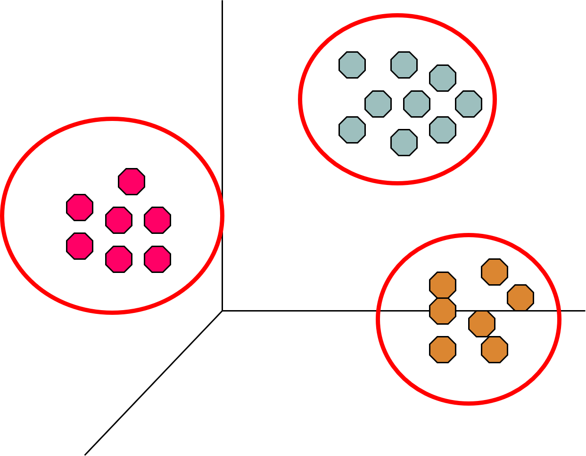

# Formal definition: clustering

Given observations $X=\{x_1,\ldots,x_n\}$ and a notion of similarity, clustering seeks a structure $\mathcal{C}$ that groups related observations.

For a partitioning clustering:

- $\mathcal{C}=\{C_1,\ldots,C_K\}$
- $C_i \cap C_j=\emptyset$ for $i\neq j$
- $\bigcup_{i=1}^{K}C_i=X$

The definition does **not** determine the right similarity, number of clusters, or cluster shape. Those are modeling choices.

# What is NOT Clustering analysis?

Supervised classification

* It assumes classes to be known

Segmentation

* Partitioning students alphabetically by last name
* The partitioning rule is given

Querying a database

* The selection and grouping criteria are given

How many clusters?

# Cluster notion can be ambiguous


# Cluster notion can be ambiguous

::::{.columns}
:::{.column width="33%"}
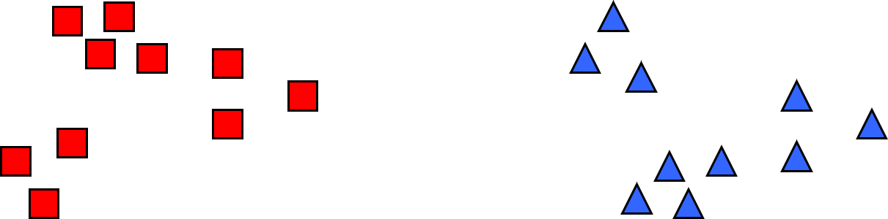
:::
:::{.column width="33%"}
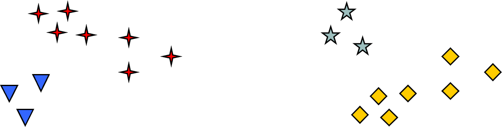
:::
:::{.column width="33%"}
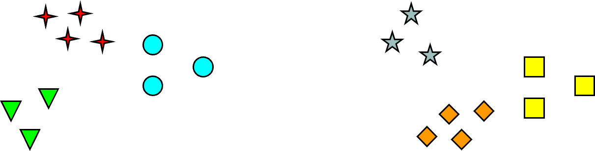
:::
::::

# Type of clustering

__Partitioning clustering__: a division of objects into non-overlapping subsets (clusters). Each object belongs exactly to a cluster.

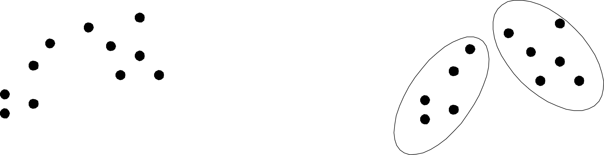

# Type of clustering

__Hierarchical clustering__: a set of nested clusters organized as a hierarchical tree


# Further cluster classification

__Exclusive vs non-exclusive__

* In a non-exclusive clustering, points can belong to multiple clusters.
* Useful for representing border points and points belonging to several classes

__Fuzzy vs non-fuzzy__

* In a fuzzy clustering, a point belongs to all clusters with a weight between 0 and 1.
* For each point, weights sum up to 1.

__Partial vs complete__

* In a partial clustering, some points may not belong to any of the clusters.

__Heterogeneous vs homogeneous__

* In a heterogeneous cluster, clusters can have very different sizes, shapes, and densities

# Cluster types: Well-Separated

Well-Separated Cluster:

* A cluster is a set of points such that each point in the cluster is closer (more similar to) any other point in the cluster than any other point that does not belong to the cluster.

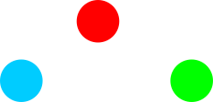

# Cluster types: Center-based

Center-based

* A cluster is a set of points such that a point in the cluster is closer (or more similar) to the "center" of the cluster, rather than to the center of each other cluster
* Cluster center is called the centroid if it is computed as the average of all the cluster's points, or the medoid if it is computed as the "more representative" cluster point


# Cluster types: Contiguity-Based

Contiguous cluster (Nearest neighbor or Transitive)

* A cluster is a set of points such that a point in a cluster is closer (or more similar) to one or more other points in the cluster than to any point not in the cluster

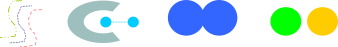

# Cluster types: Density-Based

Density-based

* A cluster is a dense region of points, which is separated by low-density regions from other regions of high density.

* Used when the clusters are irregular or twisted, and when noise and outliers are present.


# Cluster types: Conceptual cluster

Clusters with shared properties or in which the shared property derives from the whole set of points (that models a particular concept)

* Specific techniques are needed to express the underlying concept.


# K-means Clustering

::::{.columns}
:::{.column width="50%"}
Partitional clustering approach

- Number of clusters, K, must be specified
- Each cluster is associated with a centroid (center point)
- Each point is assigned to the cluster with the closest centroid
:::
:::{.column width="50%"}
```
kmeans(k, points):
    // Initialize centroids
    centroids ← list of k starting centroids
    converged ← false
    while converged == false do
        // Create empty clusters
        clusters ← list of k empty lists
        // Assign each point to the nearest centroid
        for i ← 0 to length(points) - 1 do
            point ← points[i]
            closestIndex ← 0
            minDistance ← distance(point, centroids[0])
            for j ← 1 to k - 1 do
                d ← distance(point, centroids[j])
                if d < minDistance THEN
                    minDistance ← d
                    closestIndex ← j
            clusters[closestIndex].append(point)
        // Recalculate centroids as the mean of each cluster
        newCentroids ← empty list
        for i ← 0 to k - 1 do
            newCentroid ← calculateCentroid(clusters[i])
            newCentroids.append(newCentroid)
        // Check for convergence
        if newCentroids == centroids THEN
            converged ← true
        else
            centroids ← newCentroids
    return clusters
```
:::
::::

# Worked example: one k-means iteration

Let the one-dimensional observations be $\{1,2,3,8,9\}$, with $K=2$ and initial centroids $m_1=2$, $m_2=8$.

1. **Assign:** $\{1,2,3\}\rightarrow C_1$ and $\{8,9\}\rightarrow C_2$
2. **Update:** $m_1=\frac{1+2+3}{3}=2$ and $m_2=\frac{8+9}{2}=8.5$
3. **Repeat** assignment and update until assignments stop changing

K-means monotonically reduces its objective, but the final solution can still depend on the initial centroids.

# Convergence and optimality

::::{.columns}
:::{.column width="33%"}
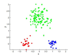
:::
:::{.column width="33%"}
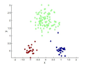
:::
:::{.column width="33%"}
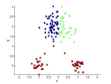
:::
::::

# Convergence to optimality

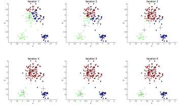

# K-means Clustering: details

Initial centroids are often chosen randomly.

* Clusters produced vary from one run to another.

The centroid is (typically) the mean of the points in the cluster.

- *Closeness* is measured by Euclidean distance, cosine similarity, correlation, etc.

K-means will converge for common similarity measures mentioned above, and most of the convergence happens in the first few iterations.

* The algorithm can converge to sub-optimal
* Often, the stopping condition is relaxed to "Until relatively few points change clusters."

Algorithm complexity is $O(n \cdot K \cdot I \cdot d )$

* $n$ = number of points, $K$ = number of clusters, $I$ = number of iterations, $d$ = number of attributes

# Evaluating k-means clusters

The most common measure is the Sum of Squared Error (SSE)

* For each point, the error is the distance to the nearest cluster
* To get SSE, we square these errors and sum them.

$SSE = \sum_{i=1}^K\sum_{x \in C_i} dist(x, m_i)^2$

* $x$ is a data point in cluster $C_i$ and $m_i$ is the representative point for cluster $C_i$
* The centroid  $m_i$ that minimizes the SSE when  $dist$ is the Euclidean distance is the average of the cluster points.

$m_i = \frac{1}{|C_i|} \sum_{x \in C_i} x$

One easy way to reduce SSE is to increase  $K$, the number of clusters.

* A good clustering with a smaller $K$ can have a lower SSE than a poor clustering with a higher $K$

# Convergence and optimality

There is only a finite number of ways to partition  $n$ records into  $k$ groups. So there is only a finite number of possible configurations in which all the centers are centroids of the points they possess.

If the configuration changes in an iteration, the distortion must be improved. So every time the configuration changes, it must lead to a state never visited before

* The reassignment of records to centroids is done based on smaller distances
* The calculation of the new centroids minimizes the value of SSE for the cluster

Therefore, the algorithm must stop due to the unavailability of further configurations to visit.

It is not necessarily true that the final configuration is the one that has the minimum value of SSE, as shown in the following slide.

# Convergence to sub-optimality

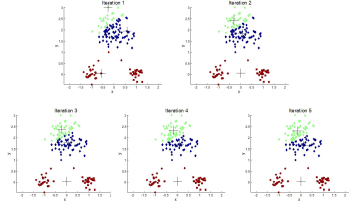

# Importance of Choosing Initial Centroids

If there are real $K$ clusters, the probability of choosing a centroid from each cluster is very limited.

* Assuming the clusters have the same cardinality  $n$ :

$P=\frac{\text{\# ways of choosing a centroid by cluster}}{\text{\# ways of choosing K centroids}}=\frac{(n)^K \cdot K!}{(n \cdot K)^K}=\frac{K!}{K^K}$

* $K$ = 10, probability is $\frac{10!}{10^{10}} \approx 0.00036$

Sometimes the centroids will reposition themselves correctly, sometimes not...

# 10 clusters example

```{python}
#| echo: false
#| warning: false
#| fig-align: center
#| fig-width: 11
#| fig-height: 6
#| dpi: 160

import matplotlib.pyplot as plt
import numpy as np

rng = np.random.default_rng(42)

# Ten natural clusters arranged as 5 columns and 2 rows.
true_centers = np.array(
    [(col * 4.0, row * 3.0) for row in range(2) for col in range(5)]
)
points_per_cluster = 45
X = np.vstack([
    rng.normal(loc=center, scale=0.38, size=(points_per_cluster, 2))
    for center in true_centers
])
true_labels = np.repeat(np.arange(10), points_per_cluster)

# Bad but plausible initialization: the 10 initial centroids are sampled
# from only 5 of the natural clusters, leaving the other 5 uncovered.
initial_source_clusters = [0, 0, 1, 1, 2, 2, 3, 3, 4, 4]
centroids = np.vstack([
    X[np.flatnonzero(true_labels == cluster)[rng.integers(points_per_cluster)]]
    for cluster in initial_source_clusters
])

fig, axes = plt.subplots(2, 2, figsize=(11, 6), sharex=True, sharey=True)
colors = plt.cm.tab10(np.arange(10))

for iteration, ax in enumerate(axes.ravel(), start=1):
    distances = np.linalg.norm(X[:, None, :] - centroids[None, :, :], axis=2)
    assignments = distances.argmin(axis=1)

    for cluster in range(10):
        pts = X[assignments == cluster]
        if len(pts) > 0:
            ax.scatter(
                pts[:, 0], pts[:, 1],
                s=13, color=colors[cluster], alpha=0.65, edgecolors="none"
            )

    ax.scatter(
        centroids[:, 0], centroids[:, 1],
        s=120, c="black", marker="x", linewidths=2.2
    )
    ax.set_title(f"Iteration {iteration}")
    ax.set_aspect("equal", adjustable="box")
    ax.set_xticks([])
    ax.set_yticks([])

    next_centroids = centroids.copy()
    for cluster in range(10):
        pts = X[assignments == cluster]
        if len(pts) > 0:
            next_centroids[cluster] = pts.mean(axis=0)
    centroids = next_centroids

fig.suptitle("K-means with K=10: first four iterations", y=0.98)
fig.tight_layout()
plt.show()
```

# Solution to the problems induced by the choice of initial centroids

Run the algorithm several times with different initial centroids.

* It can help, but the probability is not on our side!

Perform a sampling of the points and use a hierarchical clustering technique to identify $k$ initial centroids.

Select more than $k$ initial centroids and then select from these to use

* The selection criterion is to keep those more "separated."

Use post-processing techniques to eliminate the identified erroneous cluster.

Bisecting K-means

* Less affected by the problem

# Handling empty clusters

The K-means algorithm can determine empty clusters if, during the assignment phase, no element is assigned to a centroid.

* This case can cause a high SSE as one of the clusters is not "used."

Different strategies are possible to identify an alternative centroid.

* Choose the item that most contributes to the value of SSE

* Choose an item of the cluster with the highest SSE. Normally, this causes the cluster to split into two clusters that include the closest elements.

# Handling empty clusters

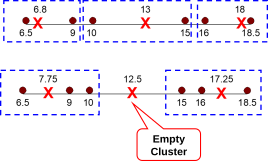

# Handling outlier

The goodness of clustering can be negatively influenced by the presence of outliers that tend to "shift" the cluster centroids, so that to reduce the increase in the SSE, they determine

* Since SSE is the square of a distance, the far points heavily affect its value

Outliers, if identified, can be eliminated during pre-processing.

* Outlier concepts depend on the application domain

# K-means: limits

The k-means algorithm does not achieve good results when natural clusters have:

* Different sizes
* Different density
* Non-globular shape
* Data contains outliers

# K-means limits: different dimension

The value of SSE leads to the identification of centroids to have clusters of the same size if the clusters are not well-separated

::::{.columns}
:::{.column width="50%"}

:::
:::{.column width="50%"}
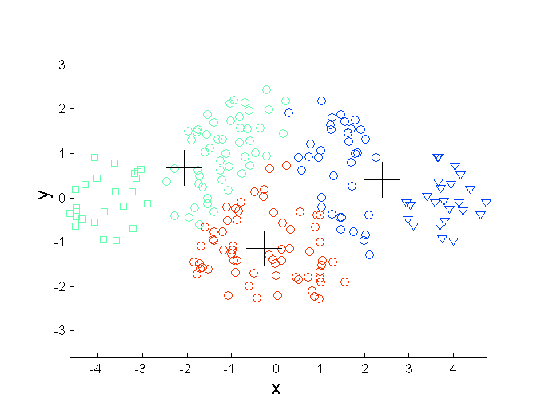
:::
::::

# K-means limits: different density

More dense clusters lead to smaller intra-cluster distances, so less dense areas require more medians to minimize the total value of SSE.

::::{.columns}
:::{.column width="50%"}

:::
:::{.column width="50%"}
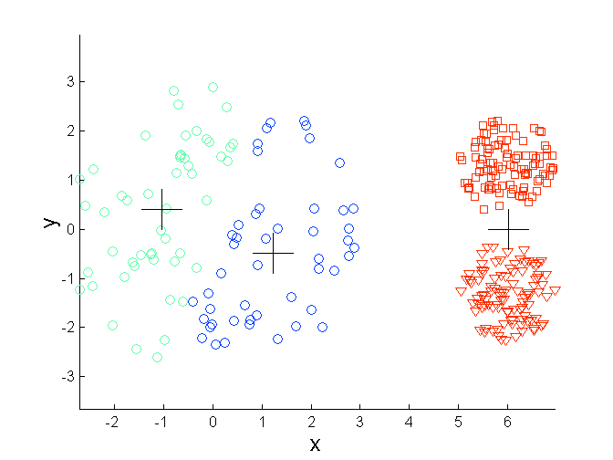
:::
::::

# Failure case: non-globular clusters

SSE is based on an Euclidean distance that does not take into account the shape of objects

```{python}
#| echo: false
#| warning: false
#| fig-align: center
#| fig-width: 10
#| fig-height: 4.5
#| dpi: 160

import matplotlib.pyplot as plt
import numpy as np

rng = np.random.default_rng(7)
n = 180
theta = np.linspace(0, np.pi, n // 2)

upper = np.column_stack([np.cos(theta), np.sin(theta)])
lower = np.column_stack([1 - np.cos(theta), 0.45 - np.sin(theta)])
X = np.vstack([upper, lower])
X += rng.normal(scale=0.06, size=X.shape)
natural_labels = np.repeat([0, 1], n // 2)

centroids = X[[20, 130]].copy()
for _ in range(8):
    distances = np.linalg.norm(X[:, None, :] - centroids[None, :, :], axis=2)
    kmeans_labels = distances.argmin(axis=1)
    for cluster in range(2):
        centroids[cluster] = X[kmeans_labels == cluster].mean(axis=0)

fig, axes = plt.subplots(1, 2, figsize=(10, 4.5), sharex=True, sharey=True)
for ax, labels, title in [
    (axes[0], natural_labels, "Natural non-globular clusters"),
    (axes[1], kmeans_labels, "K-means with K=2"),
]:
    ax.scatter(X[:, 0], X[:, 1], c=labels, cmap="Set2", s=20, edgecolors="none")
    ax.set_title(title)
    ax.set_aspect("equal", adjustable="box")
    ax.set_xticks([])
    ax.set_yticks([])

axes[1].scatter(
    centroids[:, 0], centroids[:, 1],
    c="black", marker="x", s=130, linewidths=2.2
)
fig.tight_layout()
plt.show()
```

# K-means: possible solutions

Use a higher $k$ value, thus identifying portions of clusters.

The definition of "natural" clusters then requires a technique to bring together the identified clusters.

::::{.columns}
:::{.column width="50%"}
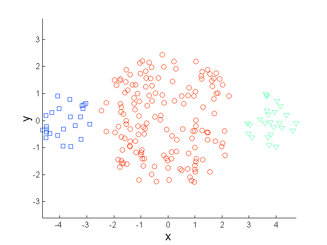
:::
:::{.column width="50%"}
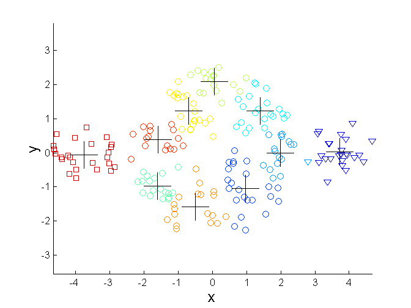
:::
::::

# K-means: possible solutions

Use a higher $k$ value, thus identifying portions of clusters.

The definition of "natural" clusters then requires a technique to bring together the identified clusters.

::::{.columns}
:::{.column width="50%"}
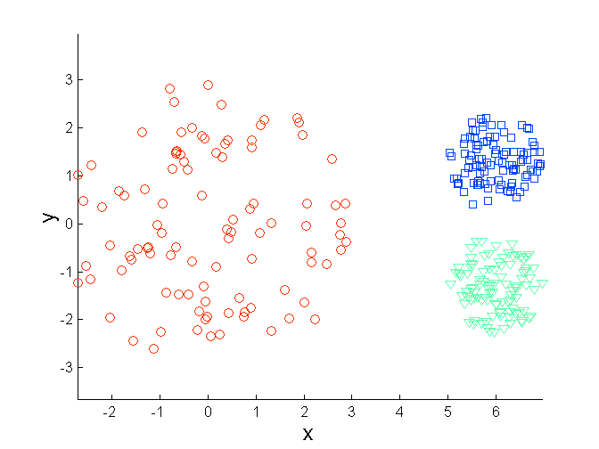
:::
:::{.column width="50%"}
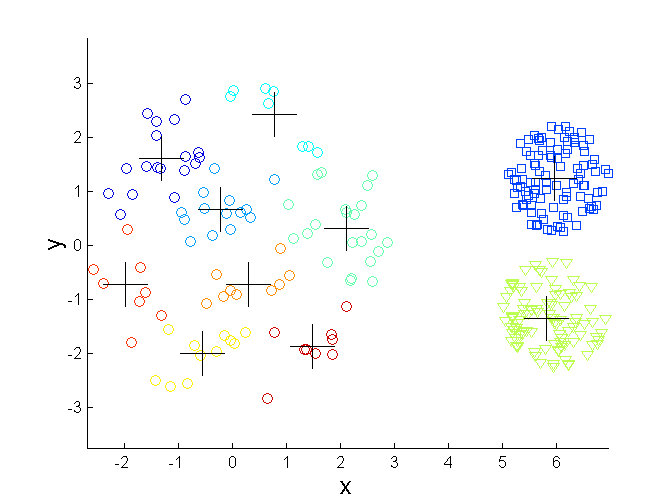
:::
::::

# K-means: possible solutions

Use a higher $k$ value, thus identifying portions of clusters.

The definition of "natural" clusters then requires a technique to bring together the identified clusters.

::::{.columns}
:::{.column width="50%"}
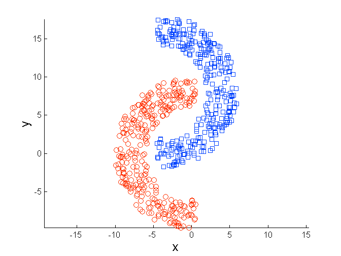
:::
:::{.column width="50%"}
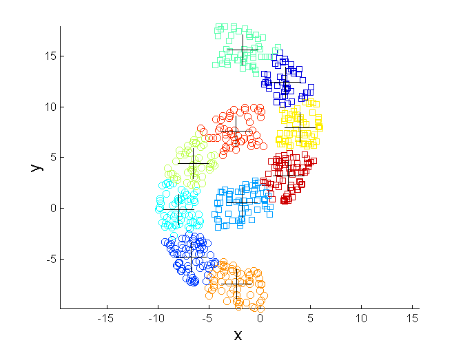
:::
::::

# Choosing K: the elbow method

It consists of executing k-means several times with increasing values for k

* SSE value will decrease
* $k < \#NaturalCluster$: SSE includes inter-cluster distances
* $k \ge \#NaturalCluster$: SSE includes intra-cluster distances
* The "elbow" occurs when SSE starts decreasing more slowly since it is generated only by intra-cluster distances

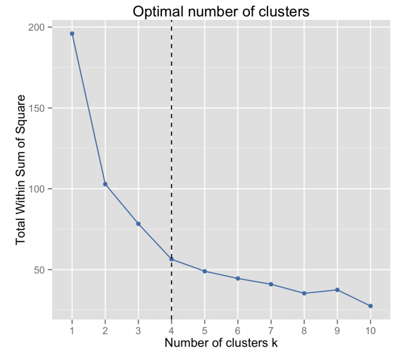

# Check your understanding

Draw the cluster partitioning and the approximate position of the centroids chosen by the k-means algorithm, assuming that:

* The points are equally distributed
* The distance function is SSE
* The value of $k$ is shown below the figures

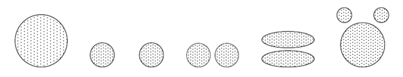

# Hierarchical Clustering

Produces a set of nested clusters organized as a hierarchical tree

Can be visualized as a dendrogram

* A tree-like diagram that records the sequences of merges or splits

Different values on the Y-axis correspond to different clusterings.

* Higher Y-axis values imply fewer clusters with more items

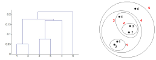

# Hierarchical Clustering: pros and cons

Pros:

* The cluster number must not be defined a priori
    * The desired number of clusters can be obtained by 'cutting' the dendrogram to the appropriate level
* It can identify a taxonomy (hierarchical classification) of concepts
    * The most similar elements will be fused before the less similar elements

Cons:

* Once a decision is made (merge), it can no longer be canceled
* In many configurations, it is sensitive to noise and outliers
* A global optimization function is missing

# Hierarchical Clustering approaches

There are two approaches to building a hierarchical clustering.

* Agglomerative:
  * Start with the points as individual clusters
  * At each step, merge the closest pair of clusters until only one cluster (or $k$ clusters) is left
* Divisive:
  * Start with one, all-inclusive cluster
  * At each step, split a cluster until each cluster contains an individual point (or there are $k$ clusters)

Traditional hierarchical algorithms use a similarity or distance matrix.

* A  $n \cdot n$ matrix storing the similarities/distances between pairs of points/clusters

# Hierarchical Clustering algorithms

The basic algorithm is straightforward.

```
Compute the proximity matrix
Let each data point be a cluster
Repeat
    Merge the two closest clusters
    Update the proximity matrix
Until only a single cluster remains
```

The key operation is the computation of the proximity of two clusters.

* Different approaches to defining the distance between clusters distinguish the different algorithms

# Hierarchical Clustering flow

Start with clusters of individual points and a proximity matrix.

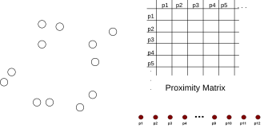

# Hierarchical Clustering flow

After some merging steps, we have some clusters.

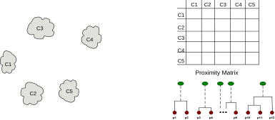

# Merging step

We want to merge the two closest clusters (C2 and C5) and update the proximity matrix.

* The affected cells are only those related to C2 and C5

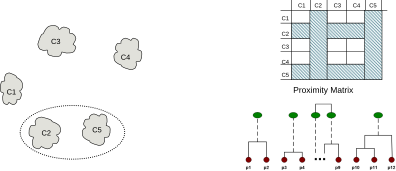

# Inter-Cluster Distances

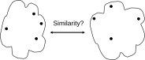

- MIN or Single link
- MAX or Complete link
- Group Average
- Centroid's distance
- Other methods driven by an objective function
    - Ward's Method uses squared error

# Inter-Cluster Distances

__MIN or Single link__: is the minimum distance between two cluster points

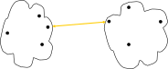

# Inter-Cluster Distances

__MAX or Complete link__: is the maximum distance between all cluster points

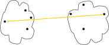

# Inter-Cluster Distances

__Group Average__: is the average distance between all the cluster points

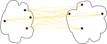

# Inter-Cluster Distances

__Centroids distance__

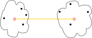

# Hierarchical clustering: MIN

::::{.columns}
:::{.column width="33%"}
|  | p1 | p2 | p3 | p4 | p5 | p6 |
| :-: | :-: | :-: | :-: | :-: | :-: | :-: |
| p1 | 0.00 | 0.24 | 0.22 | 0.37 | 0.34 | 0.23 |
| p2 | 0.24 | 0.00 | 0.15 | 0.20 | 0.14 | 0.25 |
| p3 | 0.22 | 0.15 | 0.00 | 0.15 | 0.28 | 0.11 |
| p4 | 0.37 | 0.20 | 0.15 | 0.00 | 0.29 | 0.22 |
| p5 | 0.34 | 0.14 | 0.28 | 0.29 | 0.00 | 0.39 |
| p6 | 0.23 | 0.25 | 0.11 | 0.22 | 0.39 | 0.00 |
:::
:::{.column width="33%"}
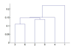
:::
:::{.column width="33%"}
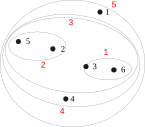
:::
::::

After step 2: $Dist(\{3,6\}, \{2,5\})=min\bigl(dist(\{2,3\}), dist(\{2,6\}), dist(\{5,3\}), dist(\{5,6\})\bigr) = min(0.15,0.25,0.28,0.39)=0.15$

# MIN: pros and cons

It allows for managing non-spherical clusters too.

::::{.columns}
:::{.column width="50%"}
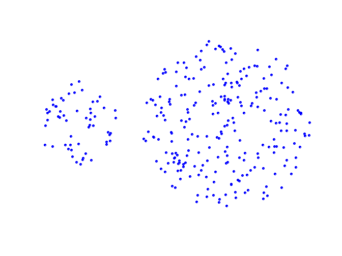
:::
:::{.column width="50%"}
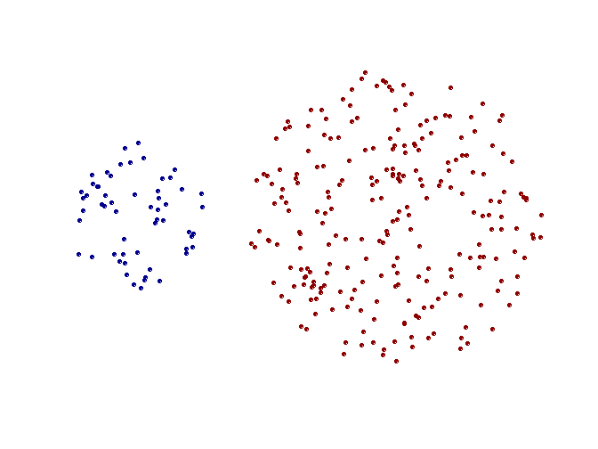
:::
::::

# MIN: pros and cons

It is subject to outliers and noise.

::::{.columns}
:::{.column width="50%"}

:::
:::{.column width="50%"}
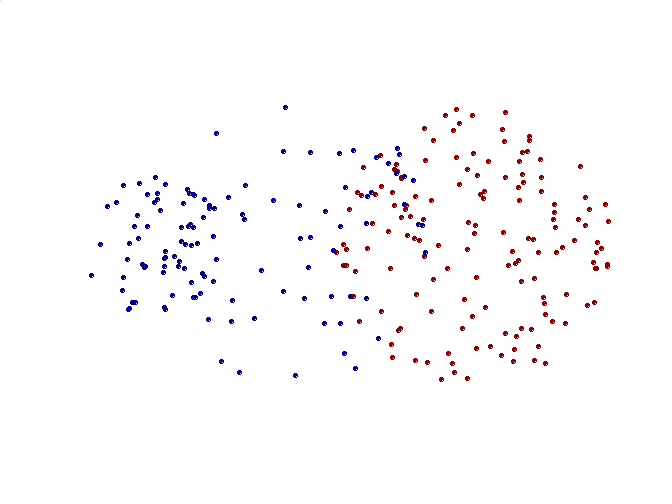
:::
::::

# Hierarchical clustering: MAX

::::{.columns}
:::{.column width="33%"}
|  | p1 | p2 | p3 | p4 | p5 | p6 |
| :-: | :-: | :-: | :-: | :-: | :-: | :-: |
| p1 | 0.00 | 0.24 | 0.22 | 0.37 | 0.34 | 0.23 |
| p2 | 0.24 | 0.00 | 0.15 | 0.20 | 0.14 | 0.25 |
| p3 | 0.22 | 0.15 | 0.00 | 0.15 | 0.28 | 0.11 |
| p4 | 0.37 | 0.20 | 0.15 | 0.00 | 0.29 | 0.22 |
| p5 | 0.34 | 0.14 | 0.28 | 0.29 | 0.00 | 0.39 |
| p6 | 0.23 | 0.25 | 0.11 | 0.22 | 0.39 | 0.00 |
:::
:::{.column width="33%"}
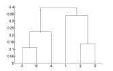
:::
:::{.column width="33%"}
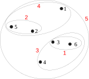
:::
::::

After step 2...

- $Dist\bigl(\{3,6\}, \{4 \}\bigr)=max\bigl(dist(\{3,4\}), dist(\{6,4\})\bigr) = max(0.15,0.22)=0.22$
- $Dist\bigl(\{3,6\}, \{2,5\}\bigr)=max\bigl(dist(\{3,2\}), dist(\{3,5\}\bigr), dist(\{6,2\}), dist(\{6,5\})) = max(0.15,0.25,0.28,0.39)=0.39$
- $Dist\bigl(\{3,6\}, \{1 \}\bigr)=max\bigl(dist(\{3,1\}), dist(\{6,1\})\bigr) = max(0.22,0.23)=0.23$

# MAX: pros and cons

Less affected by noise

::::{.columns}
:::{.column width="50%"}
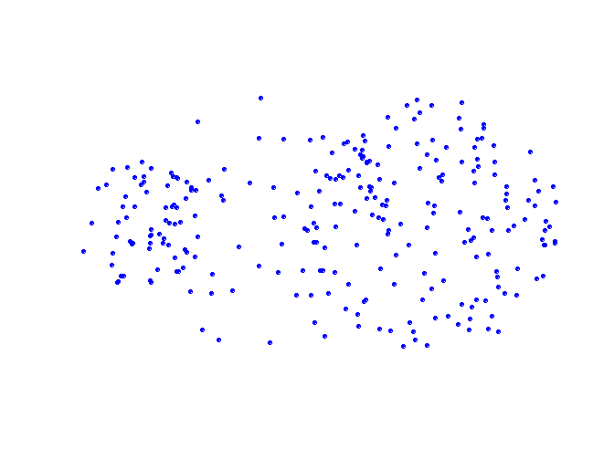
:::
:::{.column width="50%"}
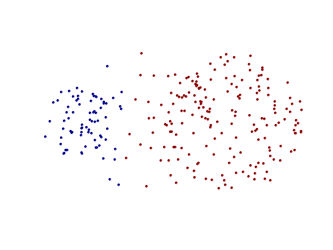
:::
::::

It tends to separate large clusters.

# MAX: pros and cons

Favor globular clusters

::::{.columns}
:::{.column width="50%"}
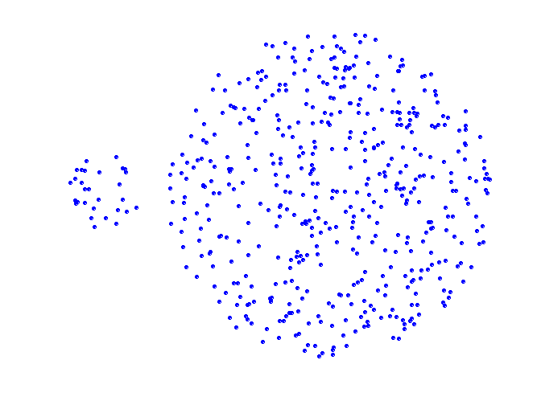
:::
:::{.column width="50%"}
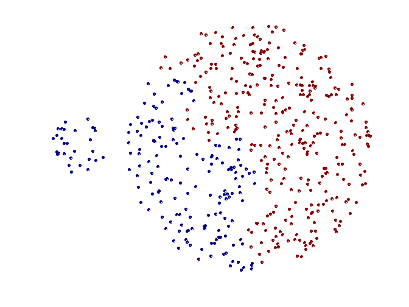
:::
::::

# Hierarchical clustering: Group Average

The similarity between two clusters is the average of the similarity of the cluster pairs of points.

$proximity(c_i, c_j) = \frac{1}{|c_i| \cdot |c_j|} \sum_{p \in c_i} \sum_{q \in c_j} proximity(p, q)$

It is a compromise between MIN and MAX.

* PROs: less affected by noise than MIN
* CONS: Biased towards globular clusters

# Hierarchical clustering: Group Average

::::{.columns}
:::{.column width="33%"}
|  | p1 | p2 | p3 | p4 | p5 | p6 |
| :-: | :-: | :-: | :-: | :-: | :-: | :-: |
| p1 | 0.00 | 0.24 | 0.22 | 0.37 | 0.34 | 0.23 |
| p2 | 0.24 | 0.00 | 0.15 | 0.20 | 0.14 | 0.25 |
| p3 | 0.22 | 0.15 | 0.00 | 0.15 | 0.28 | 0.11 |
| p4 | 0.37 | 0.20 | 0.15 | 0.00 | 0.29 | 0.22 |
| p5 | 0.34 | 0.14 | 0.28 | 0.29 | 0.00 | 0.39 |
| p6 | 0.23 | 0.25 | 0.11 | 0.22 | 0.39 | 0.00 |
:::
:::{.column width="33%"}
:::
:::{.column width="33%"}
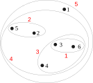
:::
::::

After step 3...

- $Dist(\{3,6,4\}, \{1 \}) = (0.22+0.37+0.23)/(3 \cdot 1) = 0.28$
- $Dist(\{2,5 \}, \{1 \}) = (0.2357+0.3421)/(2 \cdot 1) = 0.2889$
- $Dist(\{3,6,4\}, \{2,5\}) =(0.15+0.28+0.25+0.39+0.20+0.29)/(3\cdot 2) = 0.26$

# Hierarchical clustering: Ward's Method

Similarity of two clusters is based on the increase in squared error when two clusters are merged.

* Similar to group average if the distance between points is the distance squared

- PROS: Less susceptible to noise and outliers
 CONS: Biased towards globular clusters

It uses the same objective function as the K-means algorithm.

* It can be used to initialize k-means: since it allows identifying the correct value of $k$ and an initial subdivision of the points
    * Please note that, due to not being able to cancel the choices made, the solutions found by the hierarchical methods are often sub-optimal.

# Hierarchical clustering: Comparison

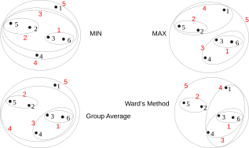

# Hierarchical clustering: computational complexity

Space: $O(N^2)$ is the space occupied by the proximity matrix when the number of points is $N$

Time: $O(N^3)$

* $N$ steps are needed to build the dendrogram. At each step, the proximity matrix must be updated and read
* Prohibitive for large datasets

# Hierarchical clustering: exercise

Given the following similarity matrix, represent the dendrograms deriving from the hierarchical clustering obtained by

* Single link
* Complete link

| simil | p1 | p2 | p3 | p4 | p5 |
| :-: | :-: | :-: | :-: | :-: | :-: |
| p1 | 1.00 | 0.10 | 0.41 | 0.55 | 0.35 |
| p2 | 0.10 | 1.00 | 0.64 | 0.47 | 0.98 |
| p3 | 0.41 | 0.64 | 1.0 | 0.44 | 0.85 |
| p4 | 0.55 | 0.47 | 0.44 | 1.00 | 0.76 |
| p5 | 0.35 | 0.98 | 0.85 | 0.76 | 1.00 |

# DBSCAN

DBSCAN is a density-based approach

* Density = number of points within a specified radius ($Eps$)
* A point is a __core point__ if it has at least a specified number of points ($MinPts$) within $Eps$
  * These are points that are within a cluster
* A __border point__ is not a core point, but is in the neighborhood (i.e., within a $Eps$ radius) of a core point
* A __noise point__ is any point that is not a core point or a border point

# DBSCAN: Core, Border, and Noise Points

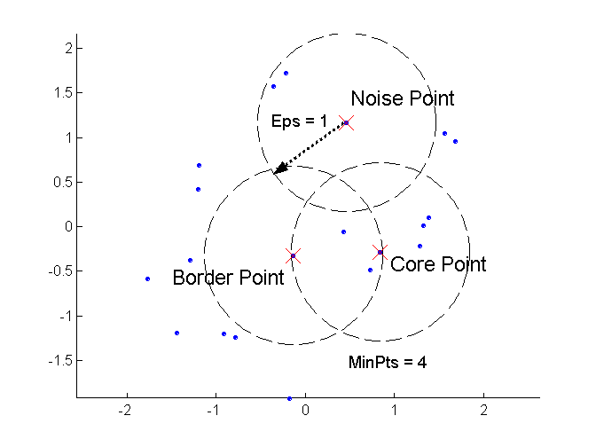

# DBSCAN algorithm

```
dbscan(Dataset D, MinPts, Eps):
    1. Label points in D as core, border or noise
    2. Drop all noise points
    3. Assign to cluster Ci core points with dist < Eps from one of the other points assigned to the same cluster
    4. Assign border points to one of the clusters that the corresponding core points belong to
    5. Output set of cluster C
```

# DBSCAN: Core, Border, and Noise Points

$Eps = 10$, $MinPts = 4$

::::{.columns}
:::{.column width="50%"}
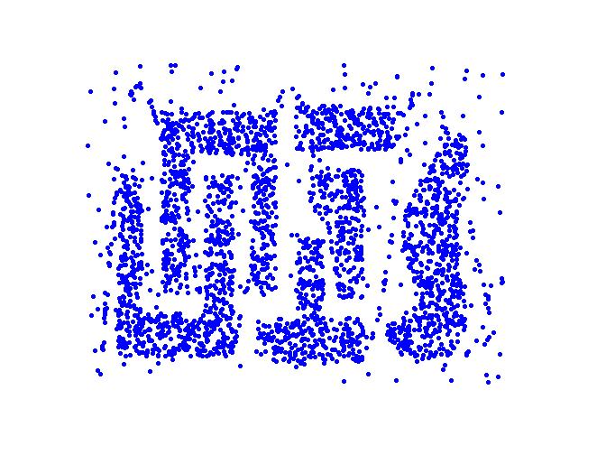
:::
:::{.column width="50%"}
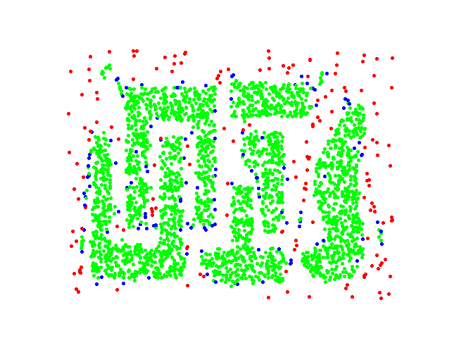
:::
::::

# DBSCAN: pros and cons

Pro

* Resistant to noise
* It can generate clusters with different shapes and sizes

Cons

* Data with high dimensionality
  * The key point is to properly define the density (i.e., choosing $Eps$ and $MinPts$)
  * Does not handle dataset variable density

<div></div>

::::{.columns}
:::{.column width="33%"}
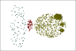
:::
:::{.column width="33%"}
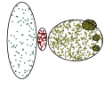
:::
:::{.column width="33%"}

:::
::::

# DBSCAN: choosing Eps and MinPts

The idea is that for points in a cluster, their kth nearest neighbors are at roughly the same distance.

Noise points have the kth nearest neighbor at a farther distance.

So, plot the sorted distance of every point to its kth nearest neighbor.

* $Eps$ value is given by the y-axis in $p$
* $MinPts$ value is given by  $k$
* The result depends on the value of $k$, but the trend of the curve remains similar for reasonable values of $k$
* A value of $k$ normally used for two-dimensional datasets is 4


# Cluster validity

For supervised classification techniques, there are several measures to evaluate the validity of the results based on the comparison between the known labels of the test set and those calculated by the algorithm.

* Accuracy, precision, recall

This is not the case of clustering. So why evaluate clustering validity?

* To avoid finding patterns in noise
* To compare clustering algorithms
* To compare two sets of clusters
* To compare two clusters

# Cluster validity


# Validity measures

Numerical measures that are applied to judge various aspects of cluster validity are classified into the following three types.

* Internal Index: Used to measure the goodness of a clustering structure without respect to external information.
  * Sum of Squared Error (SSE)
* External Index: Used to measure the extent to which cluster labels match externally supplied class labels.
  * Entropy
* Relative Index: Used to compare two different clusterings or clusters.
  * Often an external or internal index is used for this function, e.g., SSE or entropy

# Internal measures

Cluster Cohesion: Measures how closely related the objects in a cluster are.

* Cohesion is measured by the Within cluster Sum of Squares (WSS or SSE)
* $SSE = WSS = \sum_{i=1}\sum_{x \in C_i} dist(x, m_i)^2$

Cluster Separation: Measure how distinct or well-separated a cluster is from other clusters

* Separation is measured by the Between cluster Sum of Squares (BSS)
* $BSS = \sum_{i=1} |C_i| \cdot dist(m_i, m)^2$

# Internal Measures: Cohesion and Separation

Cohesion and separation can be calculated both for graph-based representations...

* Cohesion is the sum of the weights of the arcs between the nodes belonging to a cluster
* The separation is the sum of the weights of the arcs between the nodes belonging to distinct clusters


- $cohesion(C_i) = \sum_{u,v \in C_i} proximity(u,v)$
- $separation(C_i, C_j) = \sum_{u \in C_i, v \in C_j} proximity(u,v)$

# Internal Measures: Cohesion and Separation

... both for representations based on centroids

* Cohesion is the sum of the weights of the arcs between the nodes belonging to a cluster $C_i$ and the relative centroid $m_i$
* The separation is the sum of the weights of the arches between the centroids


- $cohesion(C_i) = \sum_{u \in C_i} proximity(u, m_i)$
- $separation(C_i, C_j) = proximity(m_i, m_j)$

# Measuring Cluster Validity Via Correlation

Two matrices are used.

* *Proximity* Matrix
  * Distance matrix between elements
* *Incidence* Matrix
  * One row and one column for each data point
  * An entry is 1 if the associated pair of points belongs to the same cluster
  * An entry is 0 if the associated pair of points belongs to different clusters

Compute the correlation between the two matrices.

High correlation indicates that points that belong to the same cluster are close to each other.

Not a good measure for some density or contiguity-based clusters (such as those obtained with density-based algorithms or contiguity measures)

* In this case, the distances between the points are not correlated with their membership in the same cluster

# Measuring Cluster Validity Via Correlation

Correlation between the incidence matrix and the proximity matrix on the result of the k-means algorithm on two different data sets.

* The correlation is negative because at small distances in the proximity matrix, they correspond to large values (1) in the incidence matrix
* Obviously, if the distance matrix had been used instead of the similarity matrix, the correlation would have been positive


# Measuring Cluster Validity Via Correlation

The visualization is obtained by ordering the similarity matrix based on the groupings defined by the clusters.


# Measuring Cluster Validity Via Correlation

If the data is uniformly distributed, the matrix is more "shaded."


# Measuring Cluster Validity Via Correlation

If the data is uniformly distributed, the matrix is more "shaded."


# Measuring Cluster Validity Via Correlation

If the data is uniformly distributed, the matrix is more "shaded."


# Exercise

Associate similarity matrices with the data set

::::{.columns}
:::{.column width="50%"}

:::
:::{.column width="50%"}

:::
::::

# Cophenetic distance

The previous measures represent validity indices for partitioning clustering algorithms.

In the case of hierarchical clustering, a measure often used is the cophenetic distance, that is, given two elements, it is the proximity to which they are placed together by an agglomerative clustering algorithm.

* In the underlying dendrogram, the pairs of points (3,4), (6,4) have a distance of 0.15 because the clusters to which they belong are merged at that value of the proximity matrix

Calculating the cophenetic distance for all pairs of points, we obtain a matrix that allows us to calculate the CoPhenetic Correlation Coefficient (CPCC)

* The term Cophenetic comes from biology: phenetics (Greek: phainein – to appear), also known as taximetrics, is an attempt to classify organisms based on overall similarity, usually in morphology or other observable traits, regardless of their phylogeny or evolutionary relation.
* The CPCC is the correlation index between the cophenetic distance matrix and the dissimilarity matrix of the points
* A high correlation indicates that the clustering algorithm has respected the dissimilarity between the elements

::::{.columns}
:::{.column width="50%"}
| Distance | CPCC |
| :-: | :-: |
| Single link | 0.44 |
| Complete link | 0.63 |
| Group average | 0.66 |
| Ward's | 0.64 |
:::
:::{.column width="50%"}

:::
::::

# Statistical framework for clustering validation

Internal measures often return measurements that must be interpreted.

* _Is a value of 10 good or bad?_

Statistics can provide a suitable methodology for assessing the goodness of a measurement.

* We are looking for non-random patterns, so the more "atypical" the result we get, the more likely it is to represent a non-random pattern in the data
* Therefore, the idea is to compare the value of the measure with that obtained from random data.
  * If the value of the measure obtained on the data is unlikely for random data, then clustering is valid

The issue of interpreting the measure value is less pressing when comparing the results of two clusters.

# Cluster in random data

::::{.columns}
:::{.column width="50%"}

:::
:::{.column width="50%"}

:::
::::

::::{.columns}
:::{.column width="50%"}

:::
:::{.column width="50%"}

:::
::::

# Clustering Tendency

One obvious way to check whether a dataset has clusters is to cluster it

* Clustering algorithms will still find clusters in the data

* There could be types of clusters not identified by the chosen algorithm

Alternatively, statistical indices, such as the Hopkins statistic, could be used to estimate how evenly distributed the data are

* Applicable mainly with low dimensionality and in Euclidean spaces

# Clustering Tendency: Hopkins statistic

Given a dataset $Q$ of $n$ real points, we generate a dataset $P$ of $m$ points ($m$ << $n$) by randomly distributing them in the data space.

For each point $p_i \in P$, the distance $u_i$ from the point to its nearest-neighbor in the real dataset $Q$ is calculated.

Other $m$ points from the real dataset $q_i \in Q$ are sampled, and for each of them, the distance $w_i$ from the point to its nearest-neighbor in the real dataset $Q$ is calculated.
The Hopkins statistic is defined as:

$H = \frac{\sum_{i=1}^{m} u_i}{\sum_{i=1}^{m} u_i + \sum_{i=1}^{m} w_i}$

* If the distance to the nearest neighbor is about the same for both generated and sampled points, then $H \approx 0.5$. Then the data set has a random distribution.
* If $H \approx 1$ (very small values of $w_i$) the data are well clustered
* If $H \approx 0$ (very small values of $u_i$), the data are evenly distributed (equally spaced).

# Clustering Tendency: Hopkins statistic


# Clustering Tendency: Hopkins statistic


# Clustering Tendency: Hopkins statistic


# Clustering Tendency: Hopkins statistic


# Clustering Tendency: Hopkins statistic


# External measures for clustering validation

External information is usually the class labels of the objects on which clustering is performed.

* They allow you to measure the correspondence between the computed label of the cluster and the class label

If class labels are available, why perform clustering?

* Compare the results of different clustering techniques

* Evaluate the possibility of automatically obtaining an otherwise manual classification

Two approaches are possible.

* Classification-oriented: evaluate the extent to which clusters contain objects belonging to the same class

  * Entropy, purity, F-measure

* Similarity-oriented: they measure how often two objects that belong to the same cluster belong to the same class

  * They use similarity measures for binary data: Jaccard

# External measures for clustering validation: Entropy and Purity

Entropy: for each cluster $i$ let $p_{ij} = \frac{m_{ij}}{m_i}$ the probability that a member of cluster $i$ belongs to class $j$

* $m_i = \text{\# of objects in cluster i}$
* $m_{ij} = \text{\# of objects of class j in cluster i}$

Cluster $i$ entropy is $e_i$ while whole clustering entropy is $e$

- $e_i = - \sum_{j=1}^{L} p_{ij} \cdot log_2(p_{ij})$
- $e = -\sum_{i=1}^{K} \frac{m_i}{m} \cdot e_i$
    - $L=$# class $K=$# clusters

Purity is computed as:

* $p_i$ measures how "strong" the relationship is between cluster and class
  * It is minimal when the points belonging to the cluster are equally distributed among the classes

- $p_i = max_j(p_{ij})$
- $p = \sum_{i=1}^{K} \frac{m_i}{m} \cdot p_i$

# A final comment

> "The validation of clustering structures is the most difficult and frustrating part of cluster analysis. Without a strong effort in this direction, cluster analysis will remain a black art accessible only to those true believers who have experience and great courage."
>
> cit. Algorithms for Clustering Data, Jain and Dubes

# Practical workflow

1. Define what "similar" should mean for the problem
2. Scale numeric features before using distance-based methods
3. Start with simple baselines and visualize when possible
4. Compare algorithms using the same data representation
5. Test sensitivity to parameters, samples, and initializations
6. Validate the result against the domain question
7. Check whether random data would produce a similar structure

# Summary: when should I use each method?

| Situation | Useful starting point |
|---|---|
| Compact, roughly spherical groups | **k-means** |
| A hierarchy or dendrogram is useful | **Hierarchical clustering** |
| Irregular shapes, noise, and unknown $K$ | **DBSCAN** |

Before trusting any result:

- Scale features and justify the distance or similarity measure
- Compare stability across parameters, samples, and initializations
- Inspect whether the groups answer a meaningful domain question
- Remember that every clustering algorithm can find structure in random data
