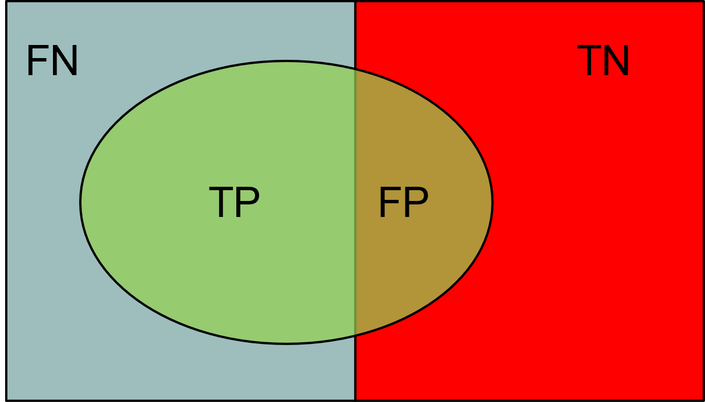
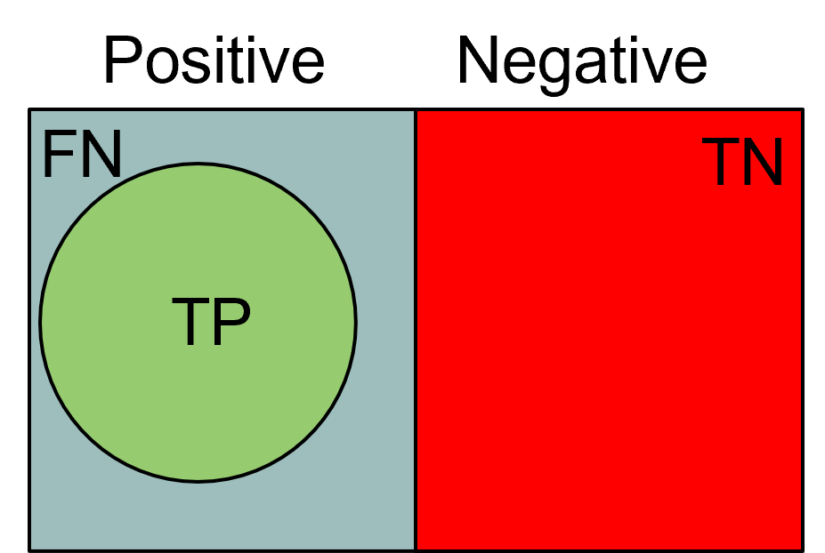
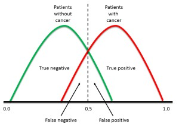
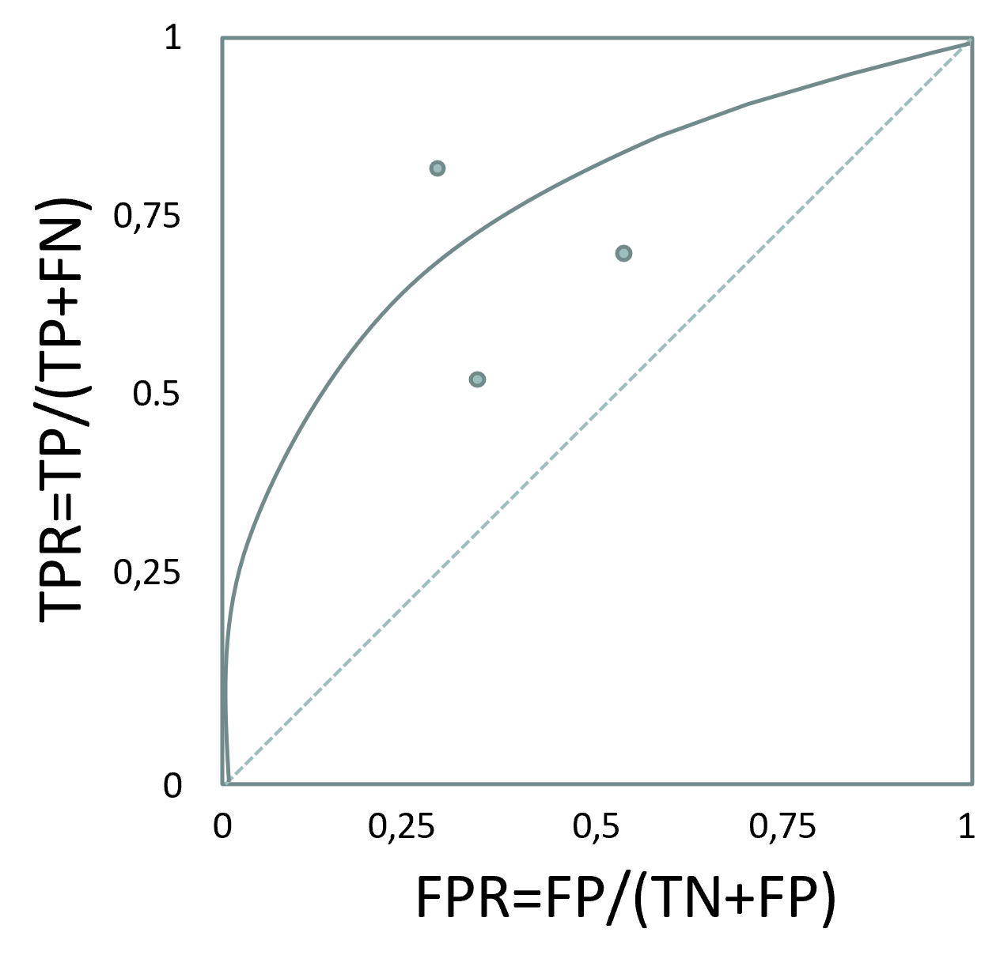
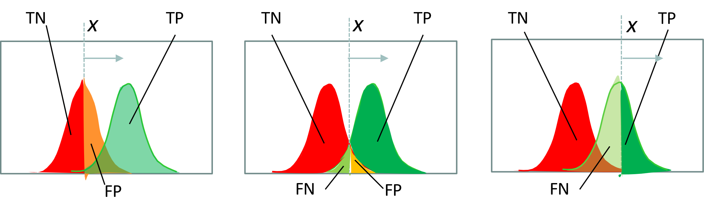
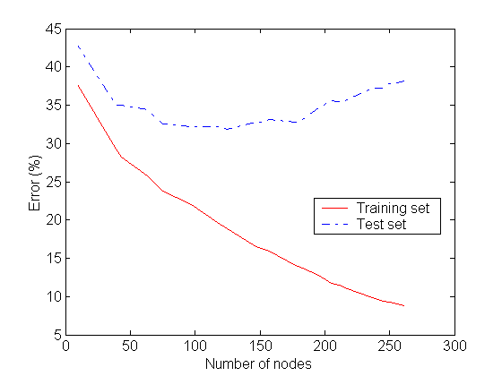
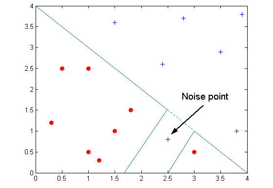
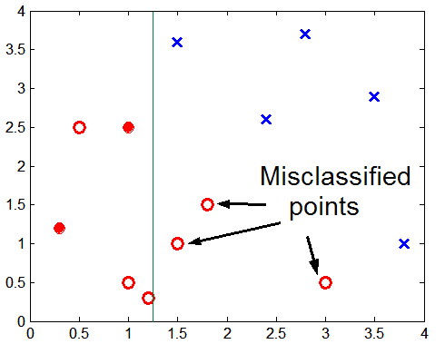

# Learning objectives

By the end of this lecture, you will be able to:

- **Explain** why training, validation, and test data have different roles
- **Read** a confusion matrix and compute the main classification metrics
- **Choose** a metric from the consequences of false positives and false negatives
- **Use** cross-validation for model selection without contaminating the final test
- **Recognize** common forms of data leakage

# Learning priorities

| Priority | What students should be able to do |
|---|---|
| **Core** | Explain train/validation/test splits, confusion matrix, accuracy, precision, recall, F-measure, overfitting, and underfitting |
| **Practice** | Compute metrics from a small confusion matrix and choose a metric for a business or safety objective |
| **Extension** | Cost matrices, ROC curves, AUC, bootstrap estimates, and threshold optimization |

# Why evaluation comes before algorithms

A model is useful only if it generalizes beyond the data used to build it.

- Algorithms learn patterns from training data
- Evaluation estimates whether those patterns will survive on future data
- Validation supports model selection and hyperparameter tuning
- The final test set estimates performance only after choices have been made

The same evaluation vocabulary will return in decision trees, k-NN, neural networks, ensembles, and the final assignment.

# Training, validation, and test sets

| Split | Main use | Typical mistake |
|---|---|---|
| **Training** | Fit model parameters | Reporting training performance as final performance |
| **Validation** | Choose models, hyperparameters, thresholds, or preprocessing choices | Reusing it until it becomes an implicit training set |
| **Test** | Estimate final generalization once | Looking at it before the workflow is fixed |

The test set should answer: **how well does the chosen workflow perform on unseen data?**

# Model evaluation

```{mermaid}
%%| echo: false
flowchart LR
    A[("Training set")]
    G[("Test set")]
    F[("Predicted class")]
    A -->|Induction| B[Learn Model]
    C(Learning Algorithm) --> B
    B --> D[Model]

    G -->D
    D -->|Deduction| F
    F --> I[Evaluation]
    H[(Real Class)] --> I
    I --> J((Performance))

    style I fill:#f78c8c,stroke:#000
    style J fill:#f78c8c,stroke:#000
```

# Metrics for model evaluation

The confusion matrix compares the predicted class with the actual class.

- $TP$ (true positive): actual positive, predicted positive
- $FN$ (false negative): actual positive, predicted negative
- $FP$ (false positive): actual negative, predicted positive
- $TN$ (true negative): actual negative, predicted negative

| Predicted $\downarrow$ / Actual $\rightarrow$ | **Class=+** | **Class=-** |
| :-: | :-: | :-: |
| **Class=+** | TP | FP |
| **Class=-** | FN | TN |

For $n$ classes, the confusion matrix has size $n\times n$.

# Real-world example: card-payment fraud

Define **positive** as a fraudulent payment and **negative** as a legitimate payment.

| Example | Actual class | Model prediction | Result |
|:---:|:---:|:---:|:---:|
| A stolen-card payment is correctly flagged | Fraud | Fraud | **True positive** |
| A legitimate payment is incorrectly blocked | Legitimate | Fraud | **False positive** |
| A fraudulent payment is incorrectly approved | Fraud | Legitimate | **False negative** |
| A normal grocery payment is correctly approved | Legitimate | Legitimate | **True negative** |

- **True** means that the prediction matches reality
- **False** means that the prediction does not match reality
- **Positive** and **negative** name the classes; they do not mean good and bad

TP and TN are correct predictions; FP and FN are errors with potentially different costs.

# Accuracy

Accuracy is the most widely used metric to synthesize the information of a confusion matrix.

$Accuracy=\frac{TP + TN}{TP + TN + FP + FN}$

Equally, the frequency of the error could be used.

$Error~rate=\frac{FP + FN}{TP + TN + FP + FN}$

# Accuracy limitations

Accuracy is not an appropriate metric if the classes contain a very different number of records. Consider a binary classification problem in which

- #Record of class 0 = 9990
- #Record of class 1 = 10

A model that always returns class 0 will have an accuracy of $\frac{9990}{10000}$ = 99.9%

In the case of binary classification problems, the class "rare" is also called a positive class.

# Precision and recall

Precision and recall answer different questions about the positive class:

- **Precision** ($Precision = \frac{TP}{TP + FP}$): among predicted positives, how many are actually positive?
    - High precision means few false positives.
- **Recall** ($Recall = \frac{TP}{TP + FN}$): among actual positives, how many did the model detect?
    - High recall means few false negatives.



# Prioritize precision when false positives are costly

Precision asks: **when the model predicts positive, how often is it correct?**

Prefer higher precision when a positive prediction triggers an expensive, disruptive, or irreversible action.

Examples:

- A spam filter that automatically deletes messages
- A fraud system that automatically blocks card payments
- A moderation system that automatically removes content

These systems should hesitate before taking positive action against a negative case.

# Prioritize recall when false negatives are costly

Recall asks: **of all real positive cases, how many did the model find?**

Prefer higher recall when missing a positive case creates danger or a major loss.

Examples:

- Cancer or infectious-disease screening
- Fraud alerts sent to a human investigator
- Fire, intrusion, or safety-defect detection

The same domain can differ: **automatic fraud blocking favors precision**, while a **fraud-review queue favors recall**. Choose the metric and threshold from the consequences of FP and FN.

# Precision and recall

::::{.columns}
:::{.column width=50%}
$Precision = 1$ if there are no false positives: every predicted positive is actually positive.


:::
:::{.column width=50%}
$Recall = 1$ if there are no false negatives: every actual positive is detected.


:::
::::

If both equal 1, the model makes neither false-positive nor false-negative errors.

# F-measure

A metric that summarizes precision and recall is called the F-measure ($\text{F-measure} = \frac{2 \cdot Precision \cdot Recall}{Precision + Recall} = \frac{2 \cdot TP}{2 \cdot TP + FP + FN}$).

F-measure represents the harmonic mean of precision and recall.

- The harmonic average between two x and y numbers tends to be close to the smallest of the two numbers.
- So if the harmonic average is high, it means both precision and recall are.
- ... so there have been no false negatives or false positives

# Cost-based evaluation {visibility="hidden"}

Accuracy, Precision, Recall, and F-measure classify an instance as positive if $P(+, i)>P(-, i)$.

- They assume that FN and FP have the same weight, thus they are Cost-Insensitive
- In many domains, this is not true!
    - For a cancer screening test, for example, we may be prepared to put up with a relatively high false positive rate in order to get a high true positive; it is most important to identify possible cancer sufferers
    - For a follow-up test after treatment, however, a different threshold might be more desirable, since we want to minimize false negatives; we don't want to tell a patient they're clear if this is not actually the case.



# The cost matrix {visibility="hidden"}

The cost matrix encodes the penalty that a classifier incurs in classifying a record in a different class.

A negative penalty indicates the "prize" that is obtained for a correct classification.

$C(M)=TP \cdot C(+|+) + FP \cdot C(+|- ) + FN \cdot C(- |+) + TN \cdot C(- |- )$

| Predicted $\downarrow$ / Expected $\rightarrow$ | **Class=+** | **Class=-** |
| :-: | :-: | :-: |
| **Class=+** | C(+\|+) | C(+\|-) |
| **Class=-** | C(-\|+) | C(-\|-) |

A model constructed by structuring, as a purity function, a cost matrix, will tend to provide a model with a minimum cost over the specified weights.

# Computing the cost {visibility="hidden"}

::::{.columns}
:::{.column width=33%}

Costs

| Predicted $\downarrow$ / Expected $\rightarrow$ | **Class=+** | **Class=-** |
| :-: | :-: | :-: |
| **Class=+** | -1 | 100 |
| **Class=-** | 1 | 0 |
:::
:::{.column width=33%}

:::{.fragment}
Predictions of Model M1

| Predicted $\downarrow$ / Expected $\rightarrow$ | **Class=+** | **Class=-** |
| :-: | :-: | :-: |
| **Class=+** | 150 | 40 |
| **Class=-** | 60 | 250 |

- Accuracy = 80%
- Cost = 3910
:::

:::
:::{.column width=33%}

:::{.fragment}
Predictions of Model M2

| Predicted $\downarrow$ / Expected $\rightarrow$ | **Class=+** | **Class=-** |
| :-: | :-: | :-: |
| **Class=+** | 250 | 45 |
| **Class=-** | 5 | 200 |

- Accuracy = 90%
- Cost = 4255
:::

:::
::::

# ROC curves compare sensitivity with false alarms {visibility="hidden"}

::::{.columns}
:::{.column width=55%}
A ROC curve plots:

$$
\mathrm{TPR}=\frac{TP}{TP+FN}
\qquad
\mathrm{FPR}=\frac{FP}{FP+TN}
$$

- **True-positive rate (TPR):** fraction of positives correctly detected
- **False-positive rate (FPR):** fraction of negatives incorrectly classified as positive
- One classifier threshold produces one point $(\mathrm{FPR},\mathrm{TPR})$
:::
:::{.column width=45%}

:::
::::

# Changing the threshold traces the ROC curve {visibility="hidden"}

Many classifiers output a **score** rather than only a class.

Predict positive when:

$$
\operatorname{score}(i)\geq x
$$

- Lowering $x$ usually detects more positives but also creates more false alarms
- Raising $x$ usually reduces both true positives and false positives
- Varying $x$ traces the complete ROC curve



# Better curves approach the upper-left corner {visibility="hidden"}

::::{.columns}
:::{.column width=45%}

:::
:::{.column width=55%}
- $(0,1)$ represents perfect classification
- The diagonal represents random ranking: $\mathrm{TPR}=\mathrm{FPR}$
- **AUC** summarizes performance across all thresholds
    - $1.0$: perfect ranking
    - $0.5$: random ranking
- Greater class overlap makes discrimination harder
:::
::::

# Compare models where the operating point matters {visibility="hidden"}

::::{.columns}
:::{.column width=55%}

:::
:::{.column width=45%}
- A curve above another performs better across those thresholds
- If curves cross, the best model depends on the tolerated FPR and required TPR
- AUC is useful as a summary, but it does not select the operating threshold
- ROC rates are normalized within each class; precision and cost can still change with class prevalence
:::
::::

# Cross validation

- Partition the records into $k$ folds of similar size
- For each fold:
  - train on the other $k-1$ folds
  - evaluate on the held-out fold
- Cross-validation is often used for **hyperparameter tuning**:
  - repeat the same $k$-fold procedure for each candidate configuration
  - compare configurations by their average validation performance
  - prefer configurations that perform well **and** have acceptable variability across folds
- The final test set is still kept aside and used only once, after the hyperparameters have been selected

# Cross validation


- CAUTION: cross-validation creates $k$ different classifiers
  - validation indicates whether the classifier type and its parameters are appropriate for the problem
- Built models can differ depending on the records in each training fold

# Cross validation


- This gives $k$ performance values, one for each held-out fold
- Report the **average** performance to estimate how well the model configuration generalizes
- Also report the **standard deviation** across folds:
  - low standard deviation means the result is stable across different train/test splits
  - high standard deviation means performance depends strongly on which records end up in the fold

# Cross validation


# Classification errors

- **Training error:** are mistakes that are made on the training set
- **Generalization error:** errors are made on the test set (i.e., records that have not been trained on the system).
- **Underfitting:** The model is too simple and does not allow a good classification of the training set or test set
- **Overfitting:** The model is too complex, it allows a good classification of the training set, but a poor classification of the test set
    - The model fails to generalize because it is based on the specific peculiarities of the training set that are not found in the test set

# Underfitting and overfitting

::::{.columns}
:::{.column width=50%}

:::
:::{.column width=50%}

:::
::::

- A model that is too simple misses real structure
- A model that is too flexible can memorize noise
- The goal is not perfect training performance, but useful generalization

# Failure case: overfitting to noise



# Failure case: insufficient training coverage

Lack of points at the bottom of the chart makes it difficult to find a proper classification for that portion of the region.



# Bootstrap {visibility="hidden"}

Unlike previous approaches, the extracted records are replaced. If the initial dataset consists of $N$records, you can create an $N$-record set in which each record has approximately a 63.2% probability of appearing (with $N$sufficiently large)

$1 - (1 - \frac{1}{N})^N = 1 - e^{-1} = 0.632$

- Records that are not used even once in the current training set form the validation set

The procedure is repeated $b$ times. Commonly, the model's accuracy is calculated as:

$Acc_{boot} = \frac{1}{b} \sum_{i=1}^b 0.632 \cdot Acc_i + 0.368 \cdot Acc_s$

where $Acc_i$ is the accuracy of the $i$-th bootstrap, $Acc_s$ is the accuracy of the complete dataset

The bootstrap does not create a (new) dataset with more information, but it can stabilize the obtained results of the available dataset. It is therefore particularly useful for small datasets.

# Data leakage

Data leakage happens when information unavailable at prediction time influences training or model selection.

Common examples:

- Scaling or imputing using the full dataset before splitting
- Selecting features using the test labels
- Using future information to predict the past
- Repeatedly tuning decisions after inspecting the test set

**Rule:** fit preprocessing and model choices inside the training/validation workflow, then evaluate once on the untouched test set.

# Project lifecycle checkpoint

| Project question | Evaluation answer |
|---|---|
| Business question | Which errors are costly, and for whom? |
| Data requirements | Are labels reliable, representative, and available at prediction time? |
| Preprocessing | Is every transformation fitted without looking at the test set? |
| Modeling | Which hyperparameters or thresholds must be selected? |
| Evaluation | Which metric matches the objective and error costs? |
| Failure modes | Class imbalance, leakage, overfitting, and unstable validation results |
| Assignment angle | Defend why your metric, split, and validation workflow match the problem |

# Summary

Before asking which algorithm is best, define how "best" will be measured.

- Keep training, validation, and test roles separate
- Choose metrics from the consequences of FP and FN
- Use cross-validation for model selection, not for final proof
- Treat leakage as a workflow error, not as a small technical detail
- Report final performance only on untouched test data
