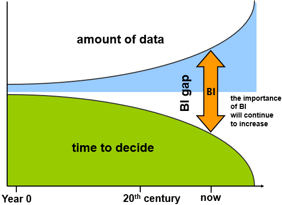
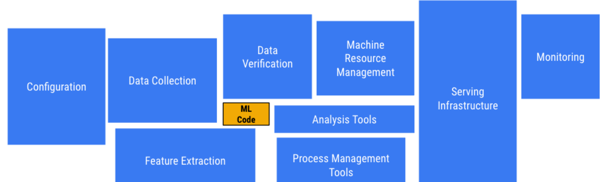
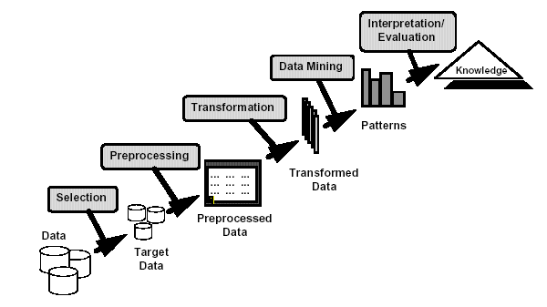
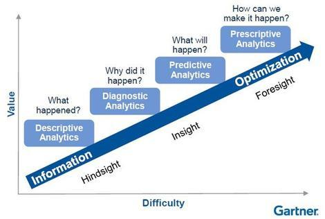
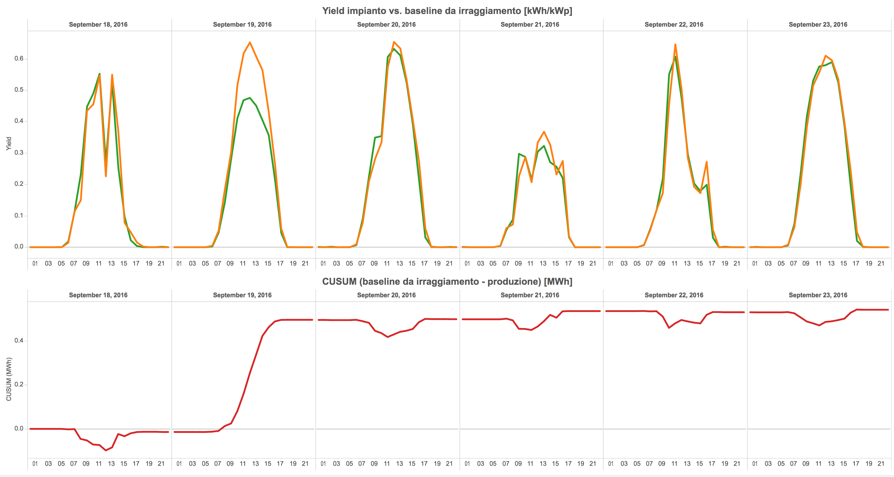
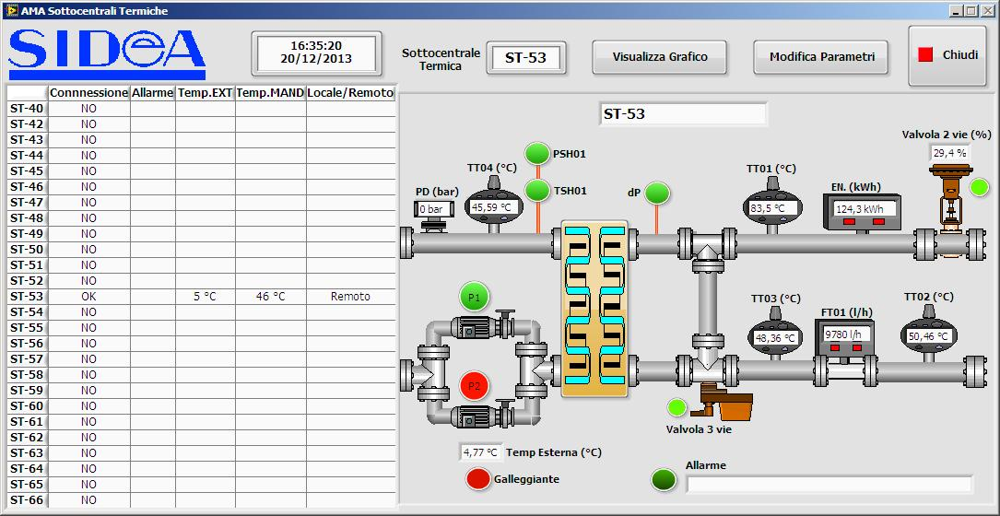
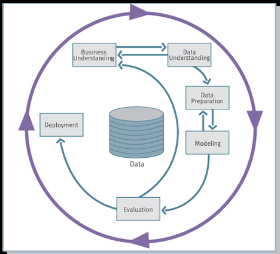

# Data Mining

# Introduction

__Matteo Golfarelli__

# Modules

Teaching methods: Classroom and laboratory lessons using Python and Weka

__Module__  __ I: Data Mining - ISI + DTM – 36h - (Prof. Golfarelli)__

1. Introduction to Data Mining: areas of applicability

2. The knowledge discovery process

3. Understanding and preparing data

4. Data mining techniques

5. Data understanding and validation

6. The Weka software

7. Case studies analysis

__Module__  __ II: Text Mining – ISI – 18h - (Prof. Moro)__

Text Mining techniques

Information Retrieval for Text Mining

Text categorization

Opinion Mining

__Module II: Machine Learning -  DTM – 18h - (Prof. Francia)__

Data Science Pipelines

Neural Network

Data science Lab in Python

# Course Goals

* Creating/Broadening a tool box of machine learning algorithms
  * ML algorithms related to structured data (e.g. association rules)
  * Studying techniques strictly related to textual data
* Gain sensitivity in applying ML techniques in real business contexts
  * Case studies and Exercises
* Being able to carry out the whole data mining process, that is more complex than just  running ML algorithms

# Teaching methods and material

* All course topics are covered by downloadable slides from the teacher's site
* (DTM/ISI) The  __textbook__  __ __ for the  __data mining __ module is:
  * Pang-Ning Tan, Michael Steinbach, Vipin Kumar  _Introduction_  _ to Data _  _Mining_ . Pearson International, 2006.
* (DTM/ISI) More details on the Weka software can be found in:
  * Ian H. Witten and Eibe Frank. Data Mining: Practical Machine Learning Tools and Techniques, IInd Ed. Morgan Kaufmann, 2005.
* (ISI) The  __textbook__  __ __ for the  __text mining __ module is:
  * Christopher Manning, Hinrich Schutze, Prabhakar Raghavan. Introduction to Information Retrieval. Cambridge University Press, 2008. ( _available on line_ )
* (DTM) The  __machine learning __ module is covered by slides

# Assessment Method

* Exam consists in an oral exam on all the subjects of the course and an elaborate
* The exam dates can be defined with the teachers along the whole academic year
* The two modules must be discussed within 15 days
* The choice of the elaborate must be agreed with the teacher
* How to choose an elaborate:
  * Choose a module (Data Mining or Text Mining/Machine Learning)
  * Choose a type of elaborate
    * Study of an algorithm among those in the literature
    * Analysis of a data set with mining techniques

# Data & Knowledge Engineering Profile

* The DKE profile studies the modeling and algorithms needed to build and exploit knowledge for advanced business and scientific applications.
* The reference applications are:
  * Business Intelligence
  * Semantic Web
  * Internet-of-Things
* The reference professional figures are:
  * Data Scientists
  * Data Architects
  * Designers and Consultants in Business Intelligence and Analytics
  * Semantic web and IoT systems experts
  * Technology experts in Big Data
  * Project managers of high-tech projects

# More Courses in the DKE Profile

  * Big Data (Prof. Gallinucci)
  * Business Intelligence (Prof. Rizzi)
  * Project Management (Prof. Boschetti)
  * Operational Analytics (Prof. Maniezzo)
  * Semantic Web (Prof. Carbonaro)
* There is a specific Erasmus agreement with the Universidad Politecnica de Catalunya (Barcelona) including a master specialized on the DKE subjects
* Possibilities of carrying out:
  * Research theses
  * Project theses (in a company)

# The Data Mining Module

* The goal of the DM module is twofold:
  * Acquire practical skills for data analysis
    * Overview on Weka
    * Case studies and Exercises
  * Review and broaden the toolbox of the techniques acquired during the Machine Learning course
    * Most of the techniques studied in Machine Learning are well-suited for real-valued attributes, but in data mining large part of the features are categorical (i.e. nominal or ordinal)

# The Data Mining Module (cont.)

* The goal of the DM module is twofold:
  * Acquire practical skills for data analysis
    * Overview on Weka
    * Case studies and Exercises
  * Review and broaden the toolbox of the techniques acquired during the Machine Learning course
    * __DATA MINING__
    * Classification
      * Naive-Bayes
      * Decision Tree
      * Rule-based
    * Clustering
      * Hierarchical
      * DBScan
    * Association Rules
    * Outlier Detection
    * __MACHINE LEARNING ISI__
    * Classification
      * Bayes
      * K-NN
      * SVM
    * Clustering
      * K-means
      * Expectation Maximization
    * Dimensionality Reduction
    * Neural Network
    * Deep Learning

# Why Mining Data?

* The amount of data stored on computer is constantly increasing
  * IoT data
  * Social data
  * Data on purchases / tax receipts
  * Banking and credit card transactions
* Hardware becomes more powerful and cheaper each day
* Competitive pressure is constantly growing
  * The information resource is a precious asset to overcoming competitors

# Why Mining Data? (cont.)

Most of the information on the data is not directly apparentMen's guided analysis can take weeks to find useful informationMost of the data has never been analyzed

# AI, Machine Learning & Data Mining

Although strongly interrelated, the term machine learning is formally distinct from the term Data Mining which indicates the computational process of pattern discovery in large datasets using machine learning methods, artificial intelligence, statistics and databases.

Apart from the actual analysis phase, data mining covers aspects of:

Data management and pre-processing

Modeling

Identification of metrics of interest

Visualization

# AI, Machine Learning & Data Mining (cont.)

The role of Machine Learning in a real project is shown by the picture that lists all the typical activities. The larger the size, the longer the time taken by ana activity

# Data Mining Definitions

Complex extraction of implicit, previously unknown and potentially useful data from the information.Exploration and analysis, using automated and semi-automatic systems, of large amounts of data in order to find significant patterns

# Analytics

__Analytics__  refers to software used to discovery, understanding and sharing of relevant patternin data. Analytics are based on the concurrent use of statistics, machine learning and operational research techniques. Analytics often exploit advanced visualization techniques

__Analytics__  in BI 2.0 play the same role data mining played in BI 1.0

Data Mining solutions have spread much less than DW ones due to the:

Complexity and costs

Needs of an expert for results understanding

lack of certainty of meeting the project goals

# The BI 1.0 pyramid

WHAT-IF analyses

_simulations_

DATA MINING

_Learning _  _models_

OLAP analyses

_data _  _warehouse_

MANAGEMENT APPLICATIONS

_Data _  _sources_

# The BI 2.0 pyramid (cont.)

SOCIAL BI

_user-generated_  _ _  _content_

WHAT-IF analyses

_simulations_

DATA MINING

_Learning _  _models_

OLAP analyses

_data _  _warehouse_

MANAGEMENT APPLICATIONS

_Data _  _sources_

SOCIAL, SENSORS, TEXT sources

_Big data_

# The BI 2.0 pyramid (cont.)

Automatic system

Human contribution

As a function of the level of automation of decision

Descriptive

_What_  _ _  _happened_  _?_

Diagnostic

_Why_  _ _  _did_  _ _  _it_  _ _  _happen_  _?_

Predictive

_What_  _ _  _will_  _ _  _happen_  _?_

Prescriptive

_What to do to make it happen?_

Prescriptive

_What to do when it happens?_

# The BI 2.0 pyramid (cont.)

Automatic system

Human contribution

As a function of the level of automation of decision

Descriptive

_What_  _ _  _happened_  _?_

Diagnostic

_Why_  _ _  _did_  _ _  _it_  _ _  _happen_  _?_

Predictive

_What_  _ _  _will_  _ _  _happen_  _?_

Prescriptive

_What to do to make it happen?_

_Which_  _ _  _is_  _ the best _  _solution_  _ to be _  _adopted_  _?_

Prescriptive

_What to do when it happens?_

# The BI 2.0 pyramid (cont.)

As a function of the level of automation of decision

_The _  _simplest_  _ _  _bringing_  _ _  _value_  _ to the company_

# Descriptive Analytics

  * Historical/past data is used to describe the system
  * Dashboards and OLAP are the main visualization types

Energy baselines

cumulated difference

ALERT! (0.5 MWh)

# Diagnostic Analytics

  * Use the data to understand the causes
  * Fault diagnosis
  * Preventive alerting systems
* Plant data (from sensors) + fault data: Identify (i.e. classify) time series that lead to a fault
  * Identify (i.e. classify) time series that lead to a fault by fault type
  * Identify the sensors and engineer the features that bring more information (i.e. are strongly correlated with fault)

© 2016 National Instruments Corporation

# Predictive Analytics

  * Use the data to predict future values
  * Simulation systems
  * Time series prediction
  * Failure prediction
  * Sales predictions
  * __Gas __  __consumption__  __ __  __forecast__  __ for HERA__
  * __Input__
    * 1 year consumption time series
    * 1 day meteo forecast
    * Day of the week
  * __Output__
  * 24 hours consumption forecast

# Prescriptive Analytics

  * Mono and multi goals optimization systems
  * Tests alternative scenarios
  * Decisional systems
  * Optimize energy acquisition mix depending on needs, market and meteo
  * _Photovoltaic_  _ _  _is_  _ _  _enough_  _?_
  * _Buy_  _ from the network?_
  * _Biomass_  _?_
  * Decide watering given an optimal terrain humidity profile
  * _Watering_  _ _  _now_  _ _  _even_  _ _  _if_  _ _  _it_  _ _  _will_  _ _  _rain_  _ _  _tomorrow_  _?_
  * _Watering_  _ _  _many_  _ _  _times_  _ for short _  _periods_  _, or _  _watering_  _ _  _abbundatly_  _ _  _few_  _ _  _times_  _?_

# The BI adoption path

* The adoption of BI solutions is incremental and rarely allows steps to be skipped
* This is because it is  _risky_ ,  _costly_  and  _useless_  to adopt advanced solutions before completely exploiting simple ones
* Managers are not ready
  * _Not in the right mindset_
* Data are not ready
  * _Not of enough quality_
* Company processes are not ready
  * _Not defined to rely on and to be reactive to data_
* Beware of consultants and software vendors who offer advanced analytics if you barely exploit the corporate data warehouse

# Turning your company in a data-driven one

* The term  _data-driven company _ refers to companies where decisions and processes are supported by data
* Decisions are based on quantitative rather than qualitative knowledge
* Processes & Knowledge are an asset of the company and are not lost if managers change
* The gap between a data-driven decision and a  _good _ decision is a  _good _ manager
* Adopting a data-driven mindset goes far beyond adopting a business intelligence solution and entails:
  * _Create a data culture_
  * _Change the mindset of managers_
  * _Change processes_
  * _Improve the quality of all the data_

# Turning your company in a data-driven one (cont.)

Digitalization is a journey that involves three main dimensions. Moving from  A to B is a multi-year process made of intermediate goals each of wich must be feasible

Solves a company pain and brings value

Can be accomplished in a limited time range (typically less than one year)

Costs must be economically related to gains

…..

Are processes extensively digitalized and produces reliable data?

Technologicalinfrastructure

Do we have the right persons to drive the project and exploit the results?

Data quality

& quantity

Is the technogical infrastructure appropriate to support data collection and analysis?

# Pattern

* A pattern is a synthetic representation rich in semantics of a set of data; usually expresses a recurring pattern in data, but can also express an exceptional pattern
* A pattern must be:
  * Valid on data with a certain degree of confidence
  * It can be understood from the syntax and semantic point of view, so that the user can interpret it
  * Previously unknown and potentially useful, so that the user can take actions accordingly

# Example

People who received a loan

x: missed to return a rate

o: met the deadlines

* Pattern:
  * IF  salary < k  THEN  missed rate

# Pattern Types

* Association rules
  * Let you determine the logical implications of the dataset, and then identify the groups of affinity between objects
* Classifiers
  * Allow you to derive a model for classifying data according to a set of a priori assigned classes
  * Decision trees
  * Are special type of classifiers that allow to identify, in order of importance, the causes that lead to an event occurring
* Clustering
* Groups elements in a set, depending on their characteristics, of apriori unknow classes
* Time series
* They allow the detection of recurring or atypical patterns in complex data sequences

# What is NOT Data Mining

* What is not Data Mining
  * Look for a number in the phone book
  * Query a search engine to search for information on "Amazon“
* What Data Mining is
  * Discover that some surnames are more common in certain regions (eg Casadei, Casadio, ... in Romagna)
  * Group documents returned by a search engine based on context information (eg "Amazon rainforest", "Amazon.com")

# What is NOT Data Mining (cont.)

We look for correlation between surnames and  all the person attributes

* What is not Data Mining
  * Look for a number in the phone book
  * Query a search engine to search for information on "Amazon“
* What Data Mining is
  * Discover that some surnames are more common in certain regions (eg Casadei, Casadio, ... in Romagna)
  * Group documents returned by a search engine based on context information (eg "Amazon rainforest", "Amazon.com")

SQL is sufficient

# What is NOT Data Mining (cont.)

We look for correlation between surnames and  all the person attributes

* What is not Data Mining
  * Look for a number in the phone book
  * Query a search engine to search for information on "Amazon“
* What Data Mining is
  * Discover that some surnames are more common in certain regions (eg Casadei, Casadio, ... in Romagna)
  * Group documents returned by a search engine based on context information (eg "Amazon rainforest", "Amazon.com")

SQL is sufficient

It is a typical information retrieval task

Requires a semantic understanding of the text through NPL and onthologies

# Where Data Mining Comes from?

* This discipline stands in the middle between several areas
  * Machine learning / artificial intelligence
  * Pattern recognition
  * Statistics
  * Databases
  * Traditional analytical techniques are unsuitable for many reasons
  * Quantity of data
  * High dimensionality of data
  * Heterogeneity of data

# Data Mining Applications

* __Predictive__  __ __  __systems__
  * Exploit some features to predict the unknown values of other features
    * Classification
    * Regression
    * Outlier detection
* __Descriptive__  __ __  __systems__
  * Find user-readable patterns that can be understood by human users
    * Clustering
    * Association rules
    * Sequential pattern

# A Definition for Classification

* Given a record set ( _training set_  _ _ )
  * Each record is composed by a set of  _attributes_ , where one ot them represents the  _class _ of the record.
* Find a  _model _ for the class attribute expressing the attribute value as a function of the remaining attributes/features
* Goal: unclassified record must be assigned to a class in the most accurate way
  * A  _test set_  is used to determine the model accuracy. Typically, the data set is split in training set and test set. The first one is used to build the model, the second one to validate it.

# An Example

Learn

Classifier

# Classification: Application 1

* Direct Marketing
  * Goal: Reduce the cost of email marketing by  _defining_  _ _ the set of customers that, with the highest probability, will buy a new product
  * Technique:
    * Exploit the data collected during the launch of similar products
    * We know which  customers bought and which one did not buy
    * Such information  _{buy, not buy}_  becomes the  _class attribute_
    * Collect all the available information about each customers: demographics, life style, previous contact with the company
      * Job, Income, age, gender, etc.
      * Use such information as an input to as input attributes to train the model

# Classification: Application 2 (cont.)

* Fraud detection
  * Goal: predict the fraudulent use of credit cards
  * Approach:
    * Use past transactions and information about their owners as attributes
      * When a user buy, what does she buy, does she pay late, etc.
    * Label past transactions as  _fraudulent_  or  _legitimate_
    * This information is the classification attribute
    * Build a model for the two classes of transactions
    * Use the model to detect fraudolent behaviors of the next transactions for a specific credit card

# Classification: Application 2 (cont.)

* Fraud detection
  * Goal: predict the fraudulent use of credit cards
  * Approach:
    * Use past transactions and information about their owners as attributes
      * When a user buy, what does she buy, does she pay late, etc.
    * Label past transactions as  _fraudulent_  or  _legitimate_
    * This information is the classification attribute
    * Build a model for the two classes of transactions
    * Use the model to detect fraudolent behaviors of the next transactions for a specific credit card

# Classification: Application 3 (cont.)

* Churn detection
  * Goal: Predict customers who are willing to go to a competitor.
  * Approach:
    * Use the purchasing data of individual users (present and past) to find the relevant attributes
    * How often does the user contact the company, where he calls, at what times of day he calls more frequently, what is his financial situation, is married, etc.
    * Label users as  _loyal_  or  _not loyal_
    * Find a pattern that defines loyalty

# A Definition for Clustering

* Given a set of points, each featuring a set of attributes, and having a similarity measure between points, find subset (i.e. cluster) of points such that:
* Points belonging to a cluster are more similar to each other than those belonging to other clusters
  * Similarity measures
  * Euclidean distance is applicable if point attributes assume continuous values
  * Many other measures are available or can be defined for each specific domain

# Cluster representation

A 3D clustering found using the Euclidean distance

Inter-cluster distances are maximized

Intra-cluster distances are minimized

# Clustering: Application 1

* Market Segmentation:
  * Goal: Split customers into distinct subsets to target specific marketing activities
  * Approach:
    * Gather information about customer lifestyle and geographic location
    * Find clusters of similar customer
    * Measure cluster quality by verifying whether the purchasing patterns of customers belonging to the same cluster are more similar to those of distinct clusters

# Clustering: Application 2 (cont.)

* Document Clustering
  * Goal: Find clusters of documents that are similar on the basis of the most relevant terms that they contain
  * Approach:
    * Identify the terms that occur most frequently in the different documents.
    * Define a frequency-based similarity measure and use it to create clusters.

# Clustering: Application 2 (cont.)

Points to be clustered: 3204 Los Angeles Times articles

Similarity measure: number of common words between two documents (excluding some common words).

# A Definition for Association Rules

Given a set of records each consisting of multiple elements belonging to a given collection

It produces rules of dependence that predict the occurrence of one of the elements in the presence of others.

Rule:

{Milk} --> {Coke}

{Diapers, Milk} --> {Beer}

# Association Rules: Application 1

* Marketing and sales promotion:
  * Suppose you have discovered the association rule
  * _{_  _Bagels_  _, … } --> {Potato Chips}_
  * _Potato Chips _  _as_  _ a _  _consequent_ : the information can be used to understand what actions to take to increase its sales
  * Bagels as an antecedent: the information can be used to understand which products might be affected if the store interrupts the sale of Bagels

# Association Rules: Application 2 (cont.)

* Arrangement of the goods.
  * Goal: Identify products purchased together from a sufficiently large number of customers.
  * Approach: uses data from tax receipts to find dependencies between products.
  * A famous association rule
    * If a customer buys diapers and milk then they will most likely buy bee
    * So do not be surprised if you find the beers beside the diapers!

# Association Rules: Application 3 (cont.)

* Inventory management:
  * Goal: A household repair company wants to study the relationship between reported malfunctions and spare parts required to properly equip their vehicles and reduce visits to their homes.
  * Approach: Processes the data about the spare parts used in the previous assistances to look for co-occurrence patterns.

# A Definition for Regression

* Predict the value of a continuous variable based on values of other variables assuming a linear / nonlinear dependency pattern.
* Examples:
  * Predict the sales revenue of a new product based on advertising investments.Predict the wind speed depending on temperature, humidity, atmospheric pressure
  * Prediction of the stock market trend.

# A Definition for Outlier Detection

* Identify deviations from normal behavior
* Applications:
  * Identification of fraud in the use of credit cards
  * Identification of network intrusions

# Data Mining Bets

  * Scalability
  * Run on the edge (devices with limited computational capabilities)
  * Multidimensionality of the data set
  * Complexity and heterogeneity of the data
  * Data quality
  * Data Properties
  * Privacy Keeping
  * Processing in real-time

# A Methodology for Data Mining: CRISP-DM

A Data mining project requires a structured approach; choosing the best algorithm is only one of the success factors

The  __CRISP-DM __ methodology is one of the most structured proposals to define the fundamental steps of a Data Mining project

The six stages of the life cycle are not strictly sequential.

Turning back on activities already done it is often necessary

http://www.crisp-dm.org/

# CRISP-DM steps

__Understanding the Application Domain: __ understanding project goals from the user's point of view, translate the user's problem into a data mining problem, and define a project plan

__Understanding the data: __ preliminary data collection aimed at identifying quality problems and conducting preliminary analyzes to identify the salient characteristics

__Data Preparation: __ includes all the tasks needed to create the final dataset: selecting attributes and records, transforming and cleaning data

# CRISP-DM steps (cont.)

__Model Creation: __ Several data mining techniques are applied to the dataset also with different parameters in order to identify what makes the model more accurate

__Evaluation of Model and Results: __ The model(s) obtained from the previous phase are analyzed to verify that they are sufficiently precise and robust to respond adequately to the user's objectives

__Deployment: __ The built-in model and acquired knowledge must be made available to users. This phase can therefore simply lead to the creation of a report or may require implementation of a user-controlled controllable data mining system

