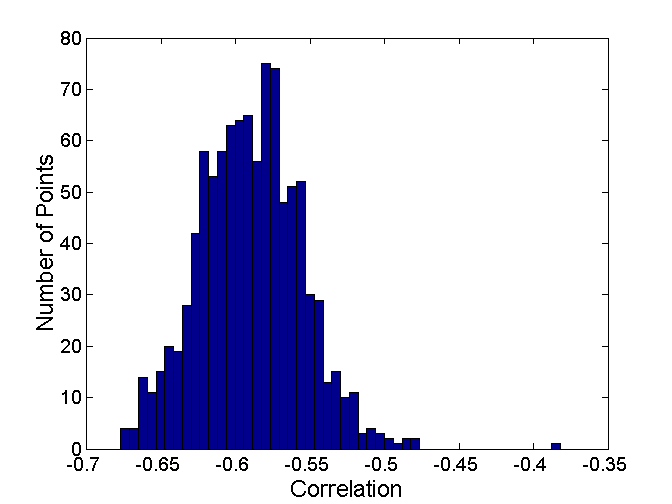

# Data Mining

# CLUSTERING

__Matteo Golfarelli__

Inter-cluster distances are maximized

Intra-cluster distances are minimized

# What is Clustering analysis?

Finding groups of objects such that objects that belong to the same group are more "similar" to each other than objects belonging to different groups

# What is NOT Clustering analysis? (cont.)

* Supervised classification
  * It assumes classes to be known
* Segmentation
  * Partitioning students alphabetically by last name
  * The partitioning rule is given
* Querying a database
  * The selection and grouping criteria are given

How many clusters?

# Cluster notion can be ambiguous

# Type of clustering

* A clustering is a set of clusters. we distinguish between:
  * __Partitioning clustering__ : a division of objects into non-overlapping subsets (clusters). Each object belongs exactly to a cluster.
  * __Hierarchical clustering__ : a set of nested clusters organized as a hierarchical tree

hierarchical clustering

# Further cluster classification

* __Exclusive vs non-exclusive__
  * In a non-exclusive clustering, points can belong to multiple clusters.
  * Useful for representing border points and points belonging to several classes
* __Fuzzy vs non-fuzzy__
  * In a fuzzy clustering a point belongs to all clusters with a weight between 0 and 1.
  * For each point, weights sum up to 1.
* __Partial vs complete__
  * In a partial clustering some points may not belong to any of the clusters.
* __Heterogeneous vs homogeneous__
  * In a heterogeneous cluster, clusters can have very different sizes, shapes and densities __.__

# Cluster types: Well-Separated

* Well-Separated Cluster:
  * A cluster is a set of points such that each point in the cluster is closer (more similar to) any other point in the cluster than any other point that does not belong to the cluster.
    * An itemset containing k-elements

3 well-separated cluster

# Cluster types: Center-based

* Center-based
  * A cluster is a set of points such that a point in the cluster is closer (or more similar to) to the "center" of the cluster, rather than to the center of each other cluster
  * Cluster center is called centroid if it is computed as the average of all the cluster’s points, or medoid if it is computed as the “more representative” cluster point

4 center-based cluster

# Cluster types: Contiguity-Based

* Contiguous cluster (Nearest neighbor or Transitive)
  * A cluster is a set of points such that a point in a cluster is closer (or more similar) to one or more other points in the cluster than to any point not in the cluster

8 contiguous clusters

# Cluster types: Density-Based

* Density-based
  * A cluster is a dense region of points, which is separated by low-density regions, from other regions of high density.
  * Used when the clusters are irregular or twisted, and when noise and outliers are present.

6 density-based clusters

# Cluster types: Conceptual cluster

* Clusters with shared properties or in which the shared property derives from the whole set of points (that models a particular concept)
  * Specific techniques are needed to express the underlying concept.

2 overlapped circles

# K-means Clustering

Partitional clustering approach

Number of clusters, K, must be specified

Each cluster is associated with a centroid (center point)

Each point is assigned to the cluster with the closest centroid

Optimal clusters

Sub-ottimal clusters

# Convergence and optimality

Original points and natural clusters

# Convergence to optimality animated

# Convergence to optimality

# K-means Clustering: details

* Initial centroids are often chosen randomly.
  * Clusters produced vary from one run to another.
* The centroid is (typically) the mean of the points in the cluster.
* ‘Closeness’ is measured by Euclidean distance, cosine similarity, correlation, etc.
* K-means will converge for common similarity measures mentioned above and most of the convergence happens in the first few iterations.
  * The algorithm can converge to sub-optimal
  * Often the stopping condition is relaxed to ‘Until relatively few points change clusters’
* Algorithm complexity is O( n * K * I * d )
  * n = number of points, K = number of clusters, I = number of iterations, d = number of attributes

# Evaluating k-means clusters

* Most common measure is Sum of Squared Error (SSE)
  * For each point, the error is the distance to the nearest cluster
  * To get SSE, we square these errors and sum them.
  * _x_  is a data point in cluster  _C_  _i_  and  _m_  _i_  is the representative point for cluster  _C_  _i_
    * The centroid  _m_  _i_  that minimizes the SSE when  _dist_  _ _ is the Euclidean distance is the average of the cluster points.
  * One easy way to reduce SSE is to increase  _K_ , the number of clusters
    * A good clustering with smaller K can have a lower SSE than a poor clustering with higher  _K_

# Convergence and optimality

* There is only a finite number of ways to partition  _n_  records into  _k_  groups. So there is only a finite number of possible configurations in which all the centers are centroids of the points they possess.
* If the configuration changes in an iteration, the distortion must get be improved. So every time the configuration changes, it must lead to a state never visited before
  * The reassignment of records to centroids is done on the basis of smaller distances
  * The calculation of the new centroids minimizes the value of SSE for the cluster
* Therefore the algorithm must stop due to the unavailability of further configurations to visit
* It is not necessarily true that the final configuration is the one that in absolute has the minimum value of SSE as shown in the following slide

# Convergence to sub-optimality animated

# Convergence to sub-optimality animated (cont.)

# Importance of Choosing Initial Centroids

* If there are real K clusters the probability of choosing a centroid from each cluster is very limited
  * Assuming the clusters have the same cardinality  _n_ :
  * K = 10, probability is 10!/1010 = 0.00036
  * Sometimes the centroids will reposition themselves correctly, sometimes not ...

# 10 clusters example

Starting with clusters with 2 centroids and clusters with 0 centroids

# 10 clusters example (cont.)

Starting with clusters with 2 centroids and clusters with 0 centroids

# 10 clusters example (cont.)

Starting with a couple of clusters with 3 centroids and couple of clusters with 1 centroids

# 10 clusters example (cont.)

Starting with a couple of clusters with 3 centroids and couple of clusters with 1 centroids

# Solution to the problems induced by the choice of initial centroids

* Run the algorithm several times with different initial centroids
  * It can help, but the probability is not on our side!
* Perform a sampling of the points and use a hierarchical clustering technique to identify k initial centroids
* Select more than k initial centroids and then select from these to use
  * The selection criterion is to keep those more "separated"
* Use post-processing techniques to eliminate the identified erroneous cluster
* Bisecting K-means
  * Less affected by the problem

# Handling empty clusters

* The K-means algorithm can determine empty clusters if, during the assignment phase, no element is assigned to a centroid.
  * This case can cause a high SSE as one of the clusters is not "used"
* Different strategies are possible to identify an alternative centroid
  * Choose the item that most contributes to the value of SSE
  * Choose an item of the cluster with the highest SSE. Normally this causes the cluster to split into two clusters that include the closest elements.

# Handling empty clusters (cont.)

# Handling outlier

* The goodness of clustering can be negatively influenced by the presence of outliers that tend to “shift" the cluster centroids so that to reduce the increase in the SSE they determine
  * Since SSE is a square of a distance, the far points heavily affect its value
* Outliers, if identified, can be eliminated during preprocessing
  * Outlier concepts depends on the application domain

# K-means: limits

* The k-means algorithm does not achieve good results when natural clusters have:
  * Different sizes
  * Different density
  * Non-globular shape
  * Data contains outliers

# K-means limits: different dimension

The value of SSE leads to the identification of centroids so as to have clusters of the same size if the clusters are not well-separated

K-means (3 Cluster)

Unclustered points & natural clusters

# K-means limits: different density

More dense clusters lead to smaller intra-cluster distances, so less dense areas require more medians to minimize the total value of SSE

K-means (3 Cluster)

Unclustered points & natural clusters

# K-means limits: non-globular shape

SSE is based on an Euclidean distance that does not take into account the shape of objects

K-means (3 Cluster)

Unclustered points & natural clusters

# K-means: possible solutions

Use a higher k value, thus identifying portions of clusters.

The definition of "natural" clusters then requires a technique to bring together the identified clusters

Unclustered points & natural clusters

K-means (3 Cluster)

# K-means: possible solutions (cont.)

Use a higher k value, thus identifying portions of clusters.

The definition of "natural" clusters then requires a technique to bring together the identified clusters

Unclustered points & natural clusters

K-means (3 Cluster)

# K-means: possible solutions (cont.)

Use a higher k value, thus identifying portions of clusters.

The definition of "natural" clusters then requires a technique to bring together the identified clusters

Unclustered points & natural clusters

K-means (3 Cluster)

# Choosing K: the elbow method

* It consists in executing k-means several times with increasing values for k
  * SSE value will decrease
  * k< #NaturalCluster SSE includes inter-cluster distances
  * k>= # NaturalCluster SSE includes intra-cluster distances
  * The "elbow" occurs when SSE starts decreasing slowersince it is generated only by intra-cluster distances

# Exercise

* Draw the cluster partitioning and the approximate position of the centroids chosen by the k-means algorithm assuming that:
  * The points are equally distributed
  * The distance function is SSE
  * The value of K is shown below the figures

K=2	K=3	K=3	K=2	K=3

# Hierarchical Clustering

* Produces a set of nested clusters organized as a hierarchical tree
* Can be visualized as a dendrogram
  * A tree like diagram that records the sequences of merges or splits
* Different values on the Y-axis correspond to different clusterings
  * Higher Y-axis values imply less clusters with more items

# Hierarchical Clustering: pros and cons

*  The cluster number must not be defined priori
  * The desired number of clusters can be obtained by 'cutting' the dendrogram to the appropriate level
*  It can identify a taxonomy (hierarchical classification) of concepts
  * The most similar elements will be fused before less similar elements
*  Once a decision is made (merge) it can no longer be canceled
*  In many configurations it is sensitive to noise and outliers
*  A global optimization function is missing

# Hierarchical Clustering approaches

* There are two approaches to building a hierarchical clustering
  * Agglomerative:
    * Start with the points as individual clusters
    * At each step, merge the closest pair of clusters until only one cluster (or k clusters) left
  * Divisive:
    * Start with one, all-inclusive cluster
    * At each step, split a cluster until each cluster contains an individual point (or there are k clusters)
* Traditional hierarchical algorithms use a similarity or distance matrix
  * A  _n _ x  _n_  matrix storing the similarities/distances between couples of point/clusters

# Hierarchical Clustering algorithms

* Basic algorithm is straightforward
  * Compute the proximity matrix
  * Let each data point be a cluster
  * __Repeat__
  * Merge the two closest clusters
  * Update the proximity matrix
  * __Until__  only a single cluster remains
* Key operation is the computation of the proximity of two clusters
  * Different approaches to defining the distance between clusters distinguish the different algorithms

# Hierarchical Clustering flow

Start with clusters of individual points and a proximity matrix

Proximity Matrix

# Hierarchical Clustering flow (cont.)

After some merging steps, we have some clusters

Proximity Matrix

# Merging step

* We want to merge the two closest clusters (C2 and C5)  and update the proximity matrix.
  * The affected cells are only those related to C2 e C5

Proximity Matrix

# Inter-Cluster Distances

* MIN or Single link
* MAX or Complete link
* Group Average
* Centroids distance
* Other methods driven by an objective function
  * Ward’s Method uses squared error

# Inter-Cluster Distances (cont.)

* __MIN or Single link__ : is the minimum distance between two cluster points
* MAX or Complete link
* Group Average
* Centroids distance
* Other methods driven by an objective function
  * Ward’s Method uses squared error

# Inter-Cluster Distances (cont.)

* MIN or Single link: is the minimum distance between two cluster points
* __MAX or Complete link: __ is the maximum distance between all cluster points
* Group Average
* Centroids distance
* Other methods driven by an objective function
  * Ward’s Method uses squared error

# Inter-Cluster Distances (cont.)

* MIN or Single link: is the minimum distance between two cluster points
* MAX or Complete link: is the maximum distance between two cluster points
* __Group Average__ : is the average distance between all the cluster points
* Centroids distance
* Other methods driven by an objective function
  * Ward’s Method uses squared error

# Inter-Cluster Distances (cont.)

* MIN or Single link: is the minimum distance between two cluster points
* MAX or Complete link: is the maximum distance between two cluster points
* Group Average: is the average distance between all the cluster points
* __Centroids distance__
* Other methods driven by an objective function
  * Ward’s Method uses squared error

# Hierarchical clustering: MIN

|  | p1 | p2 | p3 | p4 | p5 | p6 |
| :-: | :-: | :-: | :-: | :-: | :-: | :-: |
| p1 | 0.00 | 0.24 | 0.22 | 0.37 | 0.34 | 0.23 |
| p2 | 0.24 | 0.00 | 0.15 | 0.20 | 0.14 | 0.25 |
| p3 | 0.22 | 0.15 | 0.00 | 0.15 | 0.28 | 0.11 |
| p4 | 0.37 | 0.20 | 0.15 | 0.00 | 0.29 | 0.22 |
| p5 | 0.34 | 0.14 | 0.28 | 0.29 | 0.00 | 0.39 |
| p6 | 0.23 | 0.25 | 0.11 | 0.22 | 0.39 | 0.00 |

After step 2…

Dist({3,6}, {2,5})=min(dist({2,3}), dist({2,6}), dist({5,3}), dist({5,6})) = min(0.15,0.25,0.28,0.39)=0.15

# MIN: pros and cons

It allows to manage non-spherical clusters too

It is subject to outliers and noises

# Hierarchical clustering: MAX

|  | p1 | p2 | p3 | p4 | p5 | p6 |
| :-: | :-: | :-: | :-: | :-: | :-: | :-: |
| p1 | 0.00 | 0.24 | 0.22 | 0.37 | 0.34 | 0.23 |
| p2 | 0.24 | 0.00 | 0.15 | 0.20 | 0.14 | 0.25 |
| p3 | 0.22 | 0.15 | 0.00 | 0.15 | 0.28 | 0.11 |
| p4 | 0.37 | 0.20 | 0.15 | 0.00 | 0.29 | 0.22 |
| p5 | 0.34 | 0.14 | 0.28 | 0.29 | 0.00 | 0.39 |
| p6 | 0.23 | 0.25 | 0.11 | 0.22 | 0.39 | 0.00 |

After step 2…

Dist({3,6}, {4})=max(dist({3,4}), dist({6,4})) = max(0.15,0.22)=0.22

Dist({3,6}, {2,5})=max(dist({3,2}), dist({3,5}), dist({6,2}) dist({6,5})) = max(0.15,0.25,0.28,0.39)=0.39

Dist({3,6}, {1})=max(dist({3,1}), dist({6,1})) = max(0.22,0.23)=0.23

# MAX: pros and cons

Less affected by noise

It tends to separate large clusters

Favor globular clusters

# Hierarchical clustering: Group Average

* The similarity between two clusters is the average of the similarity of the cluster pairs of points
* It is a compromise between MIN and MAX
  * PROs: less affected by noise than MIN
  * CONS: Biased towards globular clusters

# Hierarchical clustering: Group Average (cont.)

|  | p1 | p2 | p3 | p4 | p5 | p6 |
| :-: | :-: | :-: | :-: | :-: | :-: | :-: |
| p1 | 0.00 | 0.24 | 0.22 | 0.37 | 0.34 | 0.23 |
| p2 | 0.24 | 0.00 | 0.15 | 0.20 | 0.14 | 0.25 |
| p3 | 0.22 | 0.15 | 0.00 | 0.15 | 0.28 | 0.11 |
| p4 | 0.37 | 0.20 | 0.15 | 0.00 | 0.29 | 0.22 |
| p5 | 0.34 | 0.14 | 0.28 | 0.29 | 0.00 | 0.39 |
| p6 | 0.23 | 0.25 | 0.11 | 0.22 | 0.39 | 0.00 |

After step 3…

Dist({3,6,4}, {1}) = (0.22+0.37+0.23)/(31) = 0.28

Dist({2,5}, {1}) = (0.2357+0.3421)/(21) = 0.2889

Dist({3,6,4}, {2,5}) =(0.15+0.28+0.25+0.39+0.20+0.29)/(32) = 0.26

# Hierarchical clustering: Ward’s Method

* Similarity of two clusters is based on the increase in squared error when two clusters are merged
  * Similar to group average if distance between points is distance squared
* PROS: Less susceptible to noise and outliers
* CONS: Biased towards globular clusters
* It uses the same objective function as the K-means algorithm
  * It can be used to initialize k-means: since it allows identifying the correct value of k and an initial subdivision of the points
    * Please note that not being able to cancel the choices made, the solutions found by the hierarchical methods are often sub-optimal.

# Hierarchical clustering: Comparison

# Hierarchical clustering: computational complexity

* Space: O(N2) is the space occupied by the proximity matrix when the number of points is N
* Time: O(N3)
  * N steps are needed to build the dendrogram. At each step the proximity matrix must be updated and read
  * Prohibitive for large datasets

# Hierarchical clustering: exercise

* Given the following similarity matrix, represent the dendrograms deriving from the hierarchical clustering obtained by
  * Single link
  * Complete link

| simil | p1 | p2 | p3 | p4 | p5 |
| :-: | :-: | :-: | :-: | :-: | :-: |
| p1 | 1.00 | 0.10 | 0.41 | 0.55 | 0.35 |
| p2 | 0.10 | 1.00 | 0.64 | 0.47 | 0.98 |
| p3 | 0.41 | 0.64 | 1.0 | 0.44 | 0.85 |
| p4 | 0.55 | 0.47 | 0.44 | 1.00 | 0.76 |
| p5 | 0.35 | 0.98 | 0.85 | 0.76 | 1.00 |

# DBSCAN

* DBSCAN is a density based approach
  * Density = number of points within a specified radius (Eps)
  * A point is a  __core point __ if it has at least a specified number of points (MinPts) within Eps
    * These are points that are at the interior of a cluster
  * A  __border point __ is not a core point, but is in the neighborhood (i.e. within a Eps radius) of a core point
  * A  __noise point __ is any point that is not a core point or a border point

# DBSCAN: Core, Border and Noise Points

# DBSCAN algorithm

// Input:Dataset  __D__ , MinPts, Eps

// Output set of cluster  __C__

Label points in  __D__  as core, border or noise

Drop all noise points

Assign to cluster ci the core points with a distance < Eps from one of the other points assigned to the same cluster

Assign border points to one of the clusters the corresponding core points belong to

# DBSCAN: Core, Border and Noise Points

Eps = 10, MinPts = 4

Point types: core, border and noise

# DBSCAN: pros e cons

* Pro
  * Resistant to noise
  * It can generate clusters with different shapes and sizes
* Cons
  * Data with high dimensionality
    * The key point is to properly define the density (i.e. choosing Eps and MinPts)
    * Does not handle dataset variable density

MinPts = 4 Eps = 9.75

MinPts = 4

Eps=9.92

# DBSCAN: choosing Eps and MinPts

* Idea is that for points in a cluster, their kth nearest neighbors are at roughly the same distance
* Noise points have the kth nearest neighbor at farther distance
* So, plot sorted distance of every point to its kth nearest neighbor
  * Eps value is given by y-axis in p
  * MinPts value is given by  k
  * The result depends on the value of k, but the trendof the curve remains similar for reasonable values of k
  * A value of k normally used for two-dimensional datasets is 4

# Cluster validity

* For supervised classification techniques there are several measures to evaluate the validity of the results based on the comparison between the known labels of the test set and those calculated by the algorithm
  * Accuracy, precision, recall
* This is not the case of clustering. So why evaluating clustering validity?
  * To avoid finding patterns in noise
  * To compare clustering algorithms
  * To compare two sets of clusters
  * To compare two clusters

# Cluster validity (cont.)

* For supervised classification techniques there are several measures to evaluate the validity of the results based on the comparison between the known labels of the test set and those calculated by the algorithm
  * Accuracy, precision, recall
* This is not the case of clustering. So why evaluating clustering validity?
  * To avoid finding patterns in noise
  * To compare clustering algorithms
  * To compare two sets of clusters
  * To compare two clusters

# Validity measures

* Numerical measures that are applied to judge various aspects of cluster validity, are classified into the following three types.
  * Internal Index:  Used to measure the goodness of a clustering structure without respect to external information.
    * Sum of Squared Error (SSE)
  * External Index: Used to measure the extent to which cluster labels match externally supplied class labels.
    * Entropy
  * Relative Index: Used to compare two different clusterings or clusters.
    * Often an external or internal index is used for this function, e.g., SSE or entropy

# Internal measures

* Cluster Cohesion: Measures how closely related are objects in a cluster
  * Example: SSE
* Cluster Separation: Measure how distinct or well-separated a cluster is from other clusters
  * Example: Squared Error
  * Cohesion is measured by the  __W__ ithin cluster  __S__ um of  __S__ quares (WSS or SSE)
  * Separation is measured by the  __B__ etween cluster  __S__ um of  __S__ quares (BSS)
      * Where | _C_  _i_ | is the size of cluster  _i_

# Internal Measures: Cohesion and Separation

* Cohesion and separation can be calculated both for graph-based representations ...
  * Cohesion is the sum of the weights of the arcs between the nodes belonging to a cluster
  * The separation is the sum of the weights of the arcs between the nodes belonging to distinct clusters
* … both for representations based on centroids
  * Cohesion is the sum of the weights of the arcs between the nodes belonging to a cluster and the relative centroid
  * The separation is the sum of the weights of the arches between the centroids

# Internal Measures: Cohesion and Separation (cont.)

* Cohesion and separation can be calculated both for graph-based representations ...
  * Cohesion is the sum of the weights of the arcs between the nodes belonging to a cluster
  * The separation is the sum of the weights of the arcs between the nodes belonging to distinct clusters
* … and for representations based on centroids
  * Cohesion is the sum of the weights of the arcs between the nodes belonging to a cluster and the relative centroid
  * The separation is the sum of the weights of the arches between the centroids

# Measuring Cluster Validity Via Correlation

* Two matrices are used
  * Proximity Matrix
    * Distance matrix between elements
  * “Incidence” Matrix
    * One row and one column for each data point
    * An entry is 1 if the associated pair of points belong to the same cluster
    * An entry is 0 if the associated pair of points belongs to different clusters
* Compute the correlation between the two matrices
* High correlation indicates that points that belong to the same cluster are close to each other.
* Not a good measure for some density or contiguity based clusters (such as those obtained with density based algorithms or contiguity measures)
  * In this case the distances between the points are not correlated with their membership of a same cluster

# Measuring Cluster Validity Via Correlation (cont.)

* Correlation between the incidence matrix and the proximity matrix on the result of the k-means algorithm on two different data sets.
  * The correlation is negative because at small distances in the proximity matrix they correspond to large values (1) in the incidence matrix
  * Obviously, if the distance matrix had been used instead of the similarity matrix the correlation would have been positive

# Measuring Cluster Validity Via Correlation (cont.)

The visualization is obtained by ordering the similarity matrix based on the groupings defined by the clusters.

# Measuring Cluster Validity Via Correlation (cont.)

If the data is uniformly distributed, the matrix is more “shaded"

# Exercise

Associate similarity matrices to data set

# Cophenetic distance

* The previous measures represent validity indices for partitioning clustering algorithms.
* In the case of hierarchical clustering a measure often used is the cophenetic distance, that is, given two elements, is the proximity to which they are placed together by an agglomerative clustering algorithm
  * In the underlying dendrogram, the pairs of points (3,4), (6,4) have a distance of 0.15 because the clusters to which they belong are merged at that value of the proximity matrix
* Calculating the cophenetic distance for all pairs of points, we obtain a matrix that allows us to calculate the CoPhenetic Correlation Coefficient (CPCC)
  * The CPCC is the correlation index between the cophenetic distance matrix and the dissimilarity matrix of the points
  * A high correlation indicates that the clustering algorithm has respected the dissimilarity between the elements

| __Distance__ | CPCC |
| :-: | :-: |
| Single link | 0.44 |
| Complete link | 0.63 |
| Group average | 0.66 |
| Ward’s | 0.64 |

# Cophenetic distance (cont.)

The term  __Cophenetic__  comes from biology: phenetics (Greek: phainein – to appear), also known as taximetrics, is an attempt to classify organisms based on overall similarity, usually in morphology or other observable traits, regardless of their phylogeny or evolutionary relation.

* The previous measures represent validity indices for partitioning clustering algorithms.
* In the case of hierarchical clustering a measure often used is the cophenetic distance, that is, given two elements, is the proximity to which they are placed together by an agglomerative clustering algorithm
  * In the underlying dendrogram, the pairs of points (3,4), (6,4) have a distance of 0.15 because the clusters to which they belong are merged at that value of the proximity matrix
* Calculating the cophenetic distance for all pairs of points, we obtain a matrix that allows us to calculate the CoPhenetic Correlation Coefficient (CPCC)
  * The CPCC is the correlation index between the cophenetic distance matrix and the dissimilarity matrix of the points
  * A high correlation indicates that the clustering algorithm has respected the dissimilarity between the elements

| __Distance__ | CPCC |
| :-: | :-: |
| Single link | 0.44 |
| Complete link | 0.63 |
| Group average | 0.66 |
| Ward’s | 0.64 |

# Statistical framework for clustering validation

* Internal measures often return measurements that must be interpreted
  * _Is a value of 10 good or bad?_
* Statistics can provide a suitable methodology for assessing the goodness of a measurement
  * We are looking for non-random patterns, so the more "atypical" the result we get, the more likely it is to represent a non-random pattern in the data
  * Therefore, the idea is to compare the value of the measure with that obtained from random data.
    * If the value of the measure obtained on the data is unlikely on random data then clustering is valid
* The issue of interpreting the measure value is less pressing when comparing the result of two clustering

# Cluster in random data

# Clustering Tendency

* One obvious way to check whether a dataset has clusters is to cluster it
  * Clustering algorithms will still find clusters in the data
  * There could be types of clusters not identified by the chosen algorithm
* Alternatively, statistical indices, such as the Hopkins statistic, could be used that estimate how evenly distributed the data are
  * Applicable mainly with low dimensionality and in Euclidean spaces

# Clustering Tendency: Hopkins statistic

* Given a dataset  __Q__  of  _n_  real points, we generate a dataset  __P__  of  _m_  points ( _m_ << _n_ ) by randomly distributing them in the data space.
* For each point  _p_  _i_    __P__ , the distance  _u_  _i_  from the point to its nearest-neighbor in the real dataset  __Q__  is calculated.
* Other  _m_  points from the real dataset  _q_  _i_    __Q__  are sampled and for each of them the distance w _i_  from the point to its nearest-neighbor in the real dataset  __Q__  is calculated.
* The Hopkins statistic is defined as:
  * If the distance to the nearest neighbor is about the same for both generated and sampled points then H  0.5. Then the data set has a random distribution.
  * If H  1 (very small values of  _w_  _i_ ) the data are well clustered
  * If H  0 (very small  _u_  _i_  values) the data are evenly distributed (equally spaced).

# Clustering Tendency: Hopkins statistic (cont.)

* Given a dataset  __Q__  of  _n_  real points, we generate a dataset  __P__  of  _m_  points ( _m_ << _n_ ) by randomly distributing them in the data space.
* For each point  _p_  _i_    __P__ , the distance  _u_  _i_  from the point to its nearest-neighbor in the real dataset  __Q__  is calculated.
* Other  _m_  points from the real dataset  _q_  _i_    __Q__  are sampled and for each of them the distance w _i_  from the point to its nearest-neighbor in the real dataset  __Q__  is calculated.
* The Hopkins statistic is defined as:
  * If the distance to the nearest neighbor is about the same for both generated and sampled points then H  0.5. Then the data set has a random distribution.
  * If H  1 (very small values of  _w_  _i_ ) the data are well clustered
  * If H  0 (very small  _u_  _i_  values) the data are evenly distributed (equally spaced).

# Clustering Tendency: Hopkins statistic (cont.)

* Given a dataset  __Q__  of  _n_  real points, we generate a dataset  __P__  of  _m_  points ( _m_ << _n_ ) by randomly distributing them in the data space.
* For each point  _p_  _i_    __P__ , the distance  _u_  _i_  from the point to its nearest-neighbor in the real dataset  __Q__  is calculated.
* Other  _m_  points from the real dataset  _q_  _i_    __Q__  are sampled and for each of them the distance w _i_  from the point to its nearest-neighbor in the real dataset  __Q__  is calculated.
* The Hopkins statistic is defined as:
  * If the distance to the nearest neighbor is about the same for both generated and sampled points then H  0.5. Then the data set has a random distribution.
  * If H  1 (very small values of  _w_  _i_ ) the data are well clustered
  * If H  0 (very small  _u_  _i_  values) the data are evenly distributed (equally spaced).

# Clustering Tendency: Hopkins statistic (cont.)

* Given a dataset  __Q__  of  _n_  real points, we generate a dataset  __P__  of  _m_  points ( _m_ << _n_ ) by randomly distributing them in the data space.
* For each point  _p_  _i_    __P__ , the distance  _u_  _i_  from the point to its nearest-neighbor in the real dataset  __Q__  is calculated.
* Other  _m_  points from the real dataset  _q_  _i_    __Q__  are sampled and for each of them the distance w _i_  from the point to its nearest-neighbor in the real dataset  __Q__  is calculated.
* The Hopkins statistic is defined as:
  * If the distance to the nearest neighbor is about the same for both generated and sampled points then H  0.5. Then the data set has a random distribution.
  * If H  1 (very small values of  _w_  _i_ ) the data are well clustered
  * If H  0 (very small  _u_  _i_  values) the data are evenly distributed (equally spaced).

# Clustering Tendency: Hopkins statistic (cont.)

* Given a dataset  __Q__  of  _n_  real points, we generate a dataset  __P__  of  _m_  points ( _m_ << _n_ ) by randomly distributing them in the data space.
* For each point  _p_  _i_    __P__ , the distance  _u_  _i_  from the point to its nearest-neighbor in the real dataset  __Q__  is calculated.
* Other  _m_  points from the real dataset  _q_  _i_    __Q__  are sampled and for each of them the distance w _i_  from the point to its nearest-neighbor in the real dataset  __Q__  is calculated.
* The Hopkins statistic is defined as:
  * If the distance to the nearest neighbor is about the same for both generated and sampled points then H  0.5. Then the data set has a random distribution.
  * If H  1 (very small values of  _w_  _i_ ) the data are well clustered
  * If H  0 (very small  _u_  _i_  values) the data are evenly distributed (equally spaced).

# Clustering Tendency: Hopkins statistic (cont.)

* Given a dataset  __Q__  of  _n_  real points, we generate a dataset  __P__  of  _m_  points ( _m_ << _n_ ) by randomly distributing them in the data space.
* For each point  _p_  _i_    __P__ , the distance  _u_  _i_  from the point to its nearest-neighbor in the real dataset  __Q__  is calculated.
* Other  _m_  points from the real dataset  _q_  _i_    __Q__  are sampled and for each of them the distance w _i_  from the point to its nearest-neighbor in the real dataset  __Q__  is calculated.
* The Hopkins statistic is defined as:
  * If the distance to the nearest neighbor is about the same for both generated and sampled points then H  0.5. Then the data set has a random distribution.
  * If H  1 (very small values of  _w_  _i_ ) the data are well clustered
  * If H  0 (very small  _u_  _i_  values) the data are evenly distributed (equally spaced).

# Clustering Tendency: SSE Comparison

* The value for SSE of the three clusters below is 0.005
* The histogram shows the distribution of SSE for random data
  * 500 random points with x and y values between 0.2 and 0.8
  * The data are clustered into 3 clusters with K-means

# Clustering Tendency: through correlation

* The correlation value of the three clusters below is -0.9235
* The histogram shows the distribution of the correlation index between the incidence matrix and the proximity matrix for random data
  * 500 random points with x and y values between 0.2 - 0.8
  * The data are clustered into 3 clusters with K-means

# External measures for clustering validation

* External information is usually the class labels of the objects on which clustering is performed
  * They allow you to measure the correspondence between the computed label of the cluster and the class label
* If class labels are available, why perform clustering?
  * Compare the result of different clustering techniques
  * Evaluate the possibility of automatically obtaining an otherwise manual classification
* Two approaches are possible
  * Classification-oriented: evaluate the extent to which clusters contain objects belonging to the same class
    * Entropy, purity, F-measure
  * Similarity-oriented: they measure how often two objects that belong to the same cluster belong to the same class
    * They use similarity measures for binary data: Jaccard

# External measures for clustering validation: Entropy and Purity

* Entropy: for each cluster  _i_  let  _p_  _ij_  _ _ =  _m_  _ij_  _ _ /  _m_  _i_  the probability that a member of cluster  _i_  belongs to class  _j_
  * _m_  _i _ = # of objects in cluster  _i_
  * _m_  _ij_  =#of objects of class  _j_  in cluster  _i_
* Cluster  _i_  entropy is  _e_  _i_  while whole clustering entropy is  _e_
  * _L=# class	K=# cluster_
* Purity is computed as:
  * _p_  _i_  _  measures how “strong” is the relationship between cluster and class_
    * It is minimal when the points belonging to the cluster are equally distributed among the classes

# A final comment

“ _The validation of clustering structures is the most difficult and frustrating part of cluster analysis. _

_   Without a strong effort in this direction, cluster analysis will remain a black art accessible only to those true believers who have experience and great courage_ .”

cit. Algorithms for Clustering Data, Jain and Dubes

