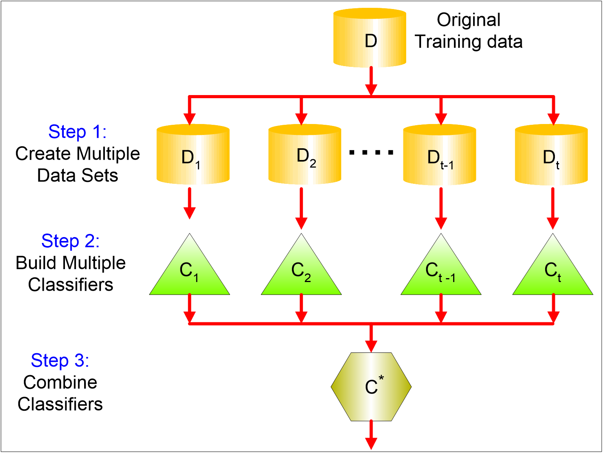
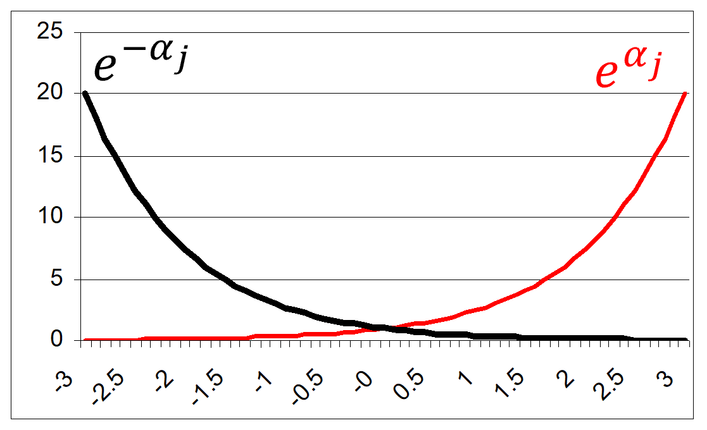

# Basics

Construct multiple base classifiers and predict the class to which a record belongs by aggregating the classifications obtained.

* The result of the compound classifier is defined by means of a function that, for example, assigns the record to the class that was "voted" by the largest number of classifiers



# Bayes' Theorem: an example

Suppose we have 25 simple classifiers.

* Each classifier has an error-rate of $\epsilon$ = 0.35
* Assume that the classifiers are independent

There is no correlation between the error rates of the classifiers.

The probability that the compound classifier gives an incorrect result is:

$\sum_{i=13}^25 = \binom{25}{i} \epsilon^i(1-\epsilon)^(25-i)=0.06$

Necessary conditions for the compound classifier to give better results than the simple classifiers are:

* That the classifiers are independent
* That the error rate of the single classifier is less than 0.5


# How to build a composite classifier

__Changing the training set: building more training sets from the given data set__

* Bagging and Boosting

:::{.fragment}
__By changing the attributes used, individual classifiers are based on a subset of the attributes__

* Useful when attributes are highly redundant $\rightarrow$ Random Forest
:::

:::{.fragment}
__Changing the classes considered:__

* One partitions the classes into two groups, A0 and A1, and transforms the given problem into a binary problem. The classes that belong to A0 are classified as 0, the remaining ones as 1.
* The different classifiers are constructed by resubdividing the classes into different subsets
* The classification of the composite classifier is obtained by increasing the score of the classes that belong to the chosen subset by 1.
* The record is finally assigned to the class that obtains the highest score
* Error-Correcting Output Coding: translates a multi-class classification problem into a binary classification one
:::

:::{.fragment}
__Changing the parameters of the learning algorithm:__

* Topology and weights of a neural network
* Decision trees with random choice policies of the attributes to be used
:::

# Error Decomposition: Bias, Variance & Noise

A formal model for analyzing the errors made by a classifier

* Probability of a classifier making a mistake in its prediction

The error committed by a classifier depends on:

* __BIAS__ : ability of the chosen classifier in modeling events and extending the prediction to events not in the training set
  * Different types of classifiers have different capabilities in defining the decision boundary between classes
  * For example, different decision trees may have different capabilities

::::{.columns}
:::{.column width=50%}

:::
:::{.column width=50%}

:::
::::

* __VARIANCE__ : capability of the training set in representing the actual data set
  * Different training sets may result in different decision boundaries
* __NOISE__ : non-determinism of the classes to be determined
  * Set instances with the same attribute values may result in different classes

# Error Decomposition: Bias, Variance & Noise

Different types of classifiers have inherently different capabilities in modeling the edges of regions.

* 100 training sets, each containing 100 examples obtained from a predefined region partition (dashed line)
* The black line represents the average true line of separation obtained from the 100 classifiers

The difference between the true separation line and the average separation line represents the classifier bias.

* The bias of the 1-NN is lower
* However, k-NNs are more sensitive to the composition of the training set and therefore will exhibit greater variance


# Multi classifier

Different classifiers (e.g., Decision trees + k-nearest neighbor) are used to reduce error bias.

* Classifiers must be independent: no (or little) correlation between errors made by two classifiers
* Different classifiers can operate on distinct subsets of  _attributes _ on which they have ideal performance

Class membership is decided by a voting mechanism.

* Class voted on by the largest number of classifiers
* Voting can be weighted according to the confidence of the classifier in case the classifier provides it
* Ex. C1 classifier votes for class X. In training, C1 made 25 out of 100 errors for class X. Classifier C2 votes for class Y. In the training phase, C2 committed 10 out of 100 errors for class Y.
    * __The record is assigned to class Y__

# Bagging

Allows the construction of compound classifiers that associate an event with the highest rated class from the base classifiers

Each classifier is constructed by __bootstrapping__ the same training set.

- In statistics: any test or metric that uses random sampling with replacement


```
// k = number of boostrap cycles N = training set cardinality
 // \sigma()=1 if the argument is TRUE, 0 otherwise

 for i=1 to k do
 Create a training set Di such that |Di|=N
 Train a classifier Ci using Di
 end for
```

$C^*(\boldsymbol{x})=argmax_y \sum_i \sigma(C_i(\boldsymbol{x})=y)$

Bagging improves generalization error by reducing the  __variance__ component.

* Thus, bagging will be particularly useful for those types of classifiers that are sensitive to changes in the training set

# Bagging: an example

Basic classifier: one-level binary decision tree

* Can only make choices of the type $x \le s \rightarrow -1$, if $x>s \rightarrow 1$, where $s$ is the split point

The data set

| _x_ | 0.1 | 0.2 | 0.3 | 0.4 | 0.5 | 0.6 | 0.7 | 0.8 | 0.9 | 1 |
| :-: | :-: | :-: | :-: | :-: | :-: | :-: | :-: | :-: | :-: | :-: |
| _y_ | 1 | 1 | 1 | -1 | -1 | -1 | -1 | 1 | 1 | 1 |

The accuracy of the basic classifier cannot exceed 70%

* $x \le 0.3 \rightarrow 1 $, $ x>0.3\rightarrow -1$
* $x \le 0.7 \rightarrow -1$, $x>0.7 \rightarrow 1$

# Bagging cycles


# Bagging result

Bagging determines the behavior of a two-level decision tree.


- Exercise: Draw the two-level decision tree corresponding to the result of bagging

# Random Forest

It is a bagging method.

- Random sampling with replacement of the training set $D_i$
- Train of the classifier $C_i$ on the training set $D_i$
- Combine classifiers through majority voting

Random forest base classifiers are Decision Trees.

- For each node in the decision tree, the split attribute is chosen on a random subset of $d'$ features rather than on the entire set of $d$ features (pattern dimensionality). Typical value of $d' =\sqrt{d}$
- In the absence of this expedient (known as feature bagging), many trees would choose with high probability the same (most discriminating) features

Random forest performs two types of bagging: one on the training set and one on the feature set.

# Boosting

An iterative approach to progressively adjust the composition of the training set to focus on incorrectly classified records

* Initially, all $N$ records have the same weight ($1/N$)
* Unlike bagging, the weights can change at the end of the boosting round to increase the probability of the record being selected in the training set
  * The probability of records that are difficult to classify, i.e. that were classified incorrectly in the previous boosting round, is increased

The final result is obtained by combining the predictions made by the different classifiers.

Boosting techniques differ based on how:

* The weights of the training set records are updated
* The predictions of the classifiers are combined

# AdaBoost

Let $C_1, C_2 ,..., C_T$ be the basic $T$ classifiers each used at a boost cycle $j \in [1, T]$, and $\epsilon_j$ be the error rate:

$\epsilon_j=\frac{1}{N}\sum_{i=1}^Nw_i\sigma(C_j(\boldsymbol{x}_i)\nw y_i)$

* $(x_i,y_i)$, $i=1, ..., N$ records of the training set
* $w_i$ is the weight of the $i$-th element of the training set
* $\sigma()=1$ if the argument is TRUE, 0 otherwise

The relevance of a classifier is defined as: $\alpha_j=\frac{1}{2}ln(\frac{1-\epsilon_j}{\epsilon_j})$

* $\alpha_j$ takes positive values when the error rate is close to 0
* $\alpha_j$ takes negative values when the error rate is close to 1


# AdaBoost

The weight updating rule for record $i$ at boosting cycle $j$ is

$w_i^{(j+1)}\frac{w_i^j}{Z_j}\begin{cases}e^{-\alpha_j} if C_i(x_i)=y_i\\ e^{\alpha_j} else \end{cases}$

* $Z_j$ is a normalization factor to ensure that $\sum_i w_i^{j+1}=1$
* The weight of correctly classified records is reduced, and that of weights classified incorrectly increases

* If a boost cycle produces a classifier with an error rate greater than 50%, the weights are reported 1/n
* The record is assigned to the class that maximizes the weighted sum: $C^*(x)=argmax_y \sum_{j=1}^T \alpha_j sign (C_i(x)=y)$



# AdaBoost

```
w={wi=1/N i=1..N}
for j=1 to T do // boost cycle number
 Build a training set Dj by sampling with replacement based on w
 Train a classifier Cj on Dj
 Apply Cj to D
 j=1/N iwi(Cj(xi)yi)  // compute the weighted error
 if j > 0.5 then
 w={wi=1/N|i=1,2,…,N};  // reset!
 else
 j=1/2 ln((1-j)/j);
 Update the weight w;
 end if;
end for;
$C^*(x)=argmax_y \sum_{j=1}^T \alpha_j sign (C_i(x)=y)$ // sign return 1/-1 if the classification is correct/wrong
```

# AdaBoost: an example

Basic classifier: one-level binary decision tree

* Can only make choices of the type $x \le s \rightarrow -1$, if $x>s \rightarrow 1$, where $s$ is the split point

The data set

| _x_ | 0.1 | 0.2 | 0.3 | 0.4 | 0.5 | 0.6 | 0.7 | 0.8 | 0.9 | 1 |
| :-: | :-: | :-: | :-: | :-: | :-: | :-: | :-: | :-: | :-: | :-: |
| _y_ | 1 | 1 | 1 | -1 | -1 | -1 | -1 | 1 | 1 | 1 |

The accuracy of the basic classifier cannot exceed 70%

* $x \le 0.3 \rightarrow 1 $, $ x>0.3\rightarrow -1$
* $x \le 0.7 \rightarrow -1$, $x>0.7 \rightarrow 1$

# AdaBoost: cycles


# AdaBoost: cycles


Boosting round 1

- Split point: 0.75
- $\epsilon_1$=0.03
- $\alpha_1  $=1.738

Boosting round 2

- Split point: 0.05
- $\epsilon_2$=0.004
- $\alpha_2  $=2.7784

Boosting round 3

- Split point: 0.30
- $\epsilon_3$=0.00027
- $\alpha_3  $=4.1195

# AdaBoost: an example

The dataset

| _x_ | 0.1 | 0.2 | 0.3 | 0.4 | 0.5 | 0.6 | 0.7 | 0.8 | 0.9 | 1 |
| :-: | :-: | :-: | :-: | :-: | :-: | :-: | :-: | :-: | :-: | :-: |
| _y_ | 1 | 1 | 1 | -1 | -1 | -1 | -1 | 1 | 1 | 1 |

The result


- 5.16 = -1.738 + 2.7784 + 4.1195
- The classifier does not make errors adopting a behavior compatible with a two-level decision tree
- $\alpha_1=1.738$
- $\alpha_2=2.7784$
- $\alpha_3=4.1195$