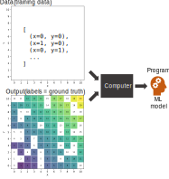
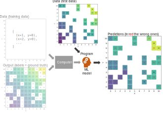

# Data Mining

> **Data mining** [@chakrabarti2006data]
>
> - ... Is the process of extracting and discovering patterns in large data sets
> - ... Involving methods at the intersection of machine learning, statistics, and database systems.
> - It is an interdisciplinary subfield of computer science and statistics

# Machine Learning

Machine learning (ML) is a field of study in artificial intelligence

- The development and study of statistical algorithms that can learn from data
- ... and generalize to unseen data and thus perform tasks without explicit (coding) instructions

> **Machine Learning** [@mitchell1997machine] is the study of algorithms that
>
> - Improve their performance $P$
> - At some task $T$
> - With experience $E$
> - A well-defined learning task is given by $<P, T, E>$

# Classical Programming vs Machine Learning

# A Simple Example: Calculator

Create a calculator that computes the sum of two numbers

**T**ask: $Z = X + Y$

# Classical Programming

# Machine Learning

(Supervised) Machine learning is usually divided into two steps:

- Train with **E**xperience (training set)
- Generalize to unseen data (test set) and evaluate the **P**erformance
- Training and test sets are not overlapping (they do not share the same data)

# Training the model

**E**xperience: training data

# Testing the Model

**P**erformance: checking accurate predictions

#

# Implementing a Machine Learning Algorithm

# Example of a Decision Tree

#

> Computer science is no more about computers than astronomy is about telescopes.
>
> [@fellows1991computer]