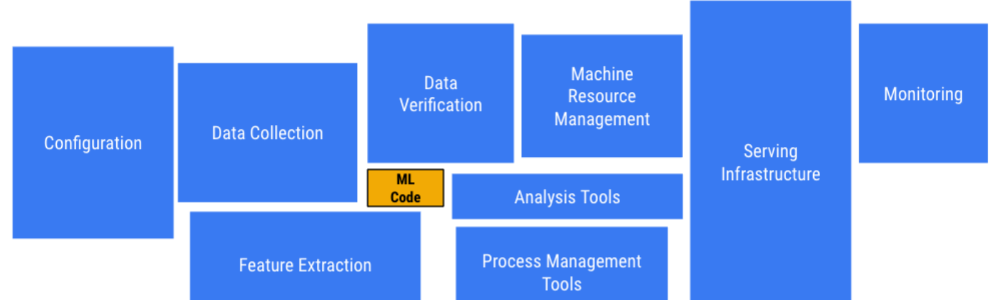
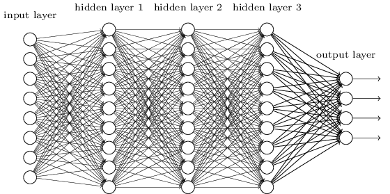
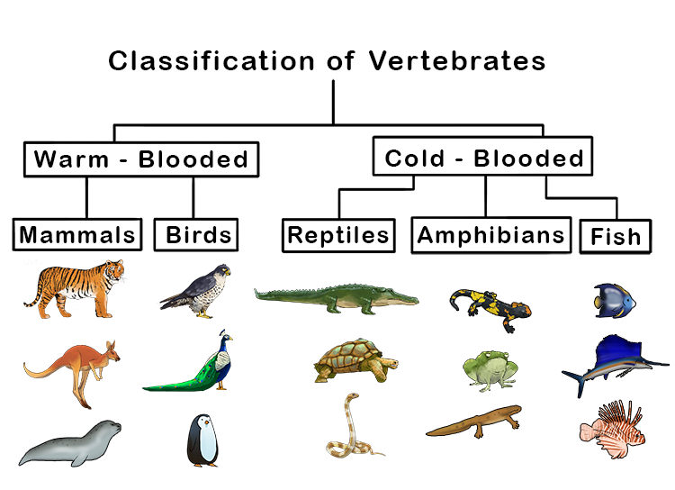

# AI is already changing technology, work, and society

- [(Mar 2, 2026) Anthropic's AI model Claude gets popularity boost after US military feud](https://www.theguardian.com/technology/2026/mar/02/claude-anthropic-ai-pentagon)
- [(May 29, 2025) IA e Lavoro Gen-Z](https://www.ilsole24ore.com/art/l-intelligenza-artificiale-gia-ruba-lavoro-giovani-gen-z-AHgfnmz)
- [(Apr 1, 2025) Ghibli effect: ChatGPT usage hits record after rollout of viral feature](https://www.reuters.com/technology/artificial-intelligence/ghibli-effect-chatgpt-usage-hits-record-after-rollout-viral-feature-2025-04-01/)
- [(Jan 28, 2025) DeepSeek sparks AI stock selloff; Nvidia posts record market-cap loss](https://www.reuters.com/technology/chinas-deepseek-sets-off-ai-market-rout-2025-01-27/)
- [(Jan 2, 2025) Nvidia's market value gets $2 trillion boost in 2024 on AI rally](https://www.reuters.com/technology/artificial-intelligence/global-markets-marketcap-pix-2025-01-02/)
- [(Oct 15, 2024) Google turns to nuclear to power AI data centres](https://www.bbc.com/news/articles/c748gn94k95o)
- [(Mar 22, 2024) The A.I. Boom Makes Millions for an Unlikely Industry Player](https://www.nytimes.com/2024/03/22/business/artificial-intelligence-anguilla.html)
- [(Mar 8, 2024) ‘We definitely messed up’: why did Google AI tool make offensive historical images?](https://www.theguardian.com/technology/2024/mar/08/we-definitely-messed-up-why-did-google-ai-tool-make-offensive-historical-images)
- [(Feb 28, 2024) Why Google's 'woke' AI problem won't be an easy fix](https://www.bbc.com/news/technology-68412620)
- [(Sep 11, 2023) These Prisoners Are Training AI](https://www.wired.com/story/prisoners-training-ai-finland/)
- [(Aug 31, 2023) The Tropical Island With the Hot Domain Name](https://www.bloomberg.com/news/articles/2023-08-31/ai-startups-create-digital-demand-for-anguilla-s-website-domain-name)
- [(Oct 15, 2024) Google turns to nuclear to power AI data centres](https://www.bbc.com/news/articles/c748gn94k95o)
- ... and many others

#

The headlines change; the recurring questions do not: **what can AI do, how does it learn, and where does value come from?**

# A foundational question: can machines think?


> “Can machines think?”
>
> - Alan Turing, 1950

::: {.notes}
[Sources]

- [Alan Turing, *Computing Machinery and Intelligence* (1950)](https://academic.oup.com/mind/article/LIX/236/433/986238)
- John McCarthy later defined AI as “the science and engineering of making intelligent machines”: [Stanford HAI](https://hai.stanford.edu/ai-definitions/what-is-artificial-intelligence-ai)
:::

# What is Artificial Intelligence?

Artificial intelligence (AI) is the capability of *computational systems* to perform tasks typically associated with *human intelligence*, such as learning, reasoning, problem-solving, perception, and decision-making.

::::{.columns}
:::{.column width=50%}
AI is an interdisciplinary field involving computer science, statistics, psychology, philosophy, linguistics, and other areas.

Applications:

- Computer vision
- Natural language processing
- Robotics and motion
- Planning and optimization
- Knowledge representation
:::
:::{.column width=50%}

:::
::::

::: {.notes}
[Sources]

- [OECD.AI - updated definition of an AI system](https://oecd.ai/en/wonk/definition-)
:::

# AI capabilities range from narrow to general

**Narrow AI** is designed for a bounded capability, such as:

- Image recognition
- Language processing
- Recommendation
- Planning and optimization

**Artificial general intelligence (AGI)** refers to a hypothetical system able to perform a broad range of intellectual tasks at a human level.

The distinction concerns the **scope of capabilities**, not one specific algorithm.

#


# Data mining turns large datasets into useful patterns

**Data mining** is the process of discovering useful **patterns** in large datasets [@chakrabarti2006data].

- It combines machine learning, statistics, and database systems
- It includes the preparation, analysis, interpretation, and communication of data
- Its goal is not only to find patterns, but to turn them into useful knowledge

# Useful patterns support understanding and action

A **pattern** is a compact, meaningful description of something recurring-or unexpectedly absent-in the data.

- **Valid:** supported by the data with sufficient confidence
- **Interpretable:** understandable to the intended user
- **Novel:** not already obvious or known
- **Actionable:** capable of informing a decision or action

# A decision rule is a compact pattern


# Which tasks actually require data mining? {visibility="hidden"}

Look for a number in the phone book.

:::{.fragment}
- SQL is sufficient
:::

Query a search engine to search for information on "Amazon".

:::{.fragment}
- It is a typical information retrieval task
:::

Discover that some surnames are more common in certain regions.

:::{.fragment}
- We look for co-occurrences between surnames and regions in people's attributes
:::

Group documents based on context information (e.g., "Amazon rainforest", "Amazon.com")

:::{.fragment}
- Requires a semantic understanding of the text through NLP and ontologies
:::

# More data creates more analysis work

The amount of stored **data** continues to grow:

- Digital business processes and transactions
- Internet of Things devices
- Social and communication platforms

At the same time:

- Computing and storage make large-scale analysis feasible
- Organizations compete on how effectively they use information

# Data does not become information by itself

:::: {.columns}
::: {.column width="50%"}

**The amount of data** stored on computers is constantly increasing.

- Digitalization of business processes
- IoT data
- Social data

**Hardware** becomes more powerful and "cheaper" each day

**Competitive pressure** is constantly growing, however:

- Information is not directly accessible from data
- Manual analysis does not scale with data volume and variety (most of the data has never been analyzed)
- Automated methods help prioritize patterns for human interpretation
:::
::::

# Machine learning learns patterns that generalize

:::: {.columns}
::: {.column width="50%"}
Machine learning (ML) is a field of study in artificial intelligence.

- ML algorithms learn patterns from data
- The learned patterns are used to make predictions or decisions on unseen data
- Performance on new data-not memorization of training examples-is the central goal (i.e., generalize to unseen data)
:::
::: {.column width="50%"}

:::
::::

# Learning connects task, experience, and performance

> **Machine Learning** [@mitchell1997machine] is the study of algorithms that
>
> - Improve their performance $P$
> - At some task $T$
> - With experience $E$
>
> A well-defined learning problem is therefore described by $\langle T, E, P \rangle$.

# Machine learning is one tool within data mining

:::: {.columns}
::: {.column width="50%"}
**Machine learning** is a subset of AI and is distinct from **data mining**.

- Data mining is pattern discovery in large datasets using ML, AI, statistics, and databases.
- Apart from the actual analysis phase, it covers:
    - Data management and pre-processing
    - Modeling
    - Identification of metrics of interest
    - Visualization
:::
::: {.column width="50%"}

:::
::::

# Machine learning is only one part of a real project



# Classical programs (without ML) apply rules written by people


# Classical programming works when the rules are known

Create a calculator that computes the sum of two numbers.

**T**ask: $Z = X + Y$

# The programmer supplies the decision logic


# Machine learning derives decision logic from examples

Supervised machine learning has two distinct phases:

- **Training:** learn from experience in the training set
- **Testing:** estimate performance on unseen examples
- The training and test sets must not contain the same records (they must not share data)


# Training fits the model to examples

**E**xperience: training data


# Testing checks generalization

**P**erformance: measure prediction quality on unseen data


# Machine learning is powerful-not magic


# The task determines the learning setup

# Three learning setups organize the field {background-color="#121011"}

- **Supervised Learning**: models are trained using labeled data to learn a mapping from inputs to labels
- **Unsupervised Learning**: algorithms find patterns, structures, and insights in unlabeled data without predefined answers
- **Reinforcement Learning**: an agent improves its decisions by interacting with an environment and learning from feedback

# Supervised learning learns from labeled examples

- *Supervised Learning*: models are trained using labeled data to learn a mapping from inputs to *labels*
    - **Classification**: the label is nominal; spam detection (`yes`/`no`), diagnosis (`healthy`/`sick`)
    - **Regression**: the label is continuous; house price, temperature
- Unsupervised Learning
- Reinforcement Learning

# Supervised learning recognizes visual patterns


# Supervised learning filters unwanted messages


# Supervised learning predicts customer behavior


# Classification predicts a categorical label

- *Supervised Learning*
    - *Classification*: the label is nominal; spam detection (`yes`/`no`), diagnosis (`healthy`/`sick`)
        - **Model-Based Methods**: learn an explicit model to generalize from training data
            - Decision Trees
            - Neural Networks
        - **Instance-Based Methods**: store training examples and compare new inputs to known cases
            - k-Nearest Neighbors
    - Regression
        - Model-Based Methods
        - Instance-Based Methods
- Unsupervised Learning
- Reinforcement Learning

# Model-based classifiers learn a decision function


::::{.columns}
:::{.column width=60%}

A **dataset** is a collection (e.g., a table) of records:

- Each record (aka instance, example, or observation) has a set of **features** (aka attributes, or variables) that describe it (e.g., `months_subscribed`)
- During training, one feature provides the known **class** or **label** (e.g., `churn`)
- The schema of a dataset is the set of features that defines the structure of the data (e.g., `months_subscribed`, `monthly_watch_hours`, `churn`)

Goal:

- Learn a **model** that maps features to a class
  - A [model](https://en.wikipedia.org/wiki/Model) is an informative, simplified representation of an object or system.
- Use that model to predict the class of unseen records accurately
:::
:::{.column width=40%}

| `months_subscribed` | `monthly_watch_hours` | `churn` |
| :-----------------: | :-------------------: | :-----: |
| 2                 | 3                       | *yes*   |
| 4                 | 6                       | *yes*   |
| 6                 | 15                      | *no*    |
| 12                | 22                      | *no*    |
| 3                 | 4                       | *yes*   |
| 8                 | 18                      | *no*    |
| 5                 | 7                       | *no*    |
| 1                 | 2                       | *yes*   |
| 10                | 20                      | *no*    |

:::
::::

# Training and testing serve different purposes

1. Split the original dataset into non-overlapping training and test sets
1. Learn the model from the training set
1. Use the test set only to evaluate performance on unseen records

# Training learns a model from labeled examples

*Training*: learn a model to generalize from training data

```{mermaid}
%%| echo: false
flowchart LR
    A[(Training Data)] --> B[Training / Model Learning]
    B --> C[Trained Model]
```

# Testing estimates performance on unseen examples

*Testing*: verify the generalization of the model on unseen data

- Use the trained model to make predictions on new data
- Compare predictions to ground truth for performance evaluation

```{mermaid}
%%| echo: false
flowchart LR
    A[(Test Data)] --> B[Trained Model]
    B --> C[(Predicted Class)]
    C --> D[Evaluation]
    E[(Real Class)] --> D
    D --> F(Performance Metric)
```

# Decision trees learn explicit decision rules


# A tree predicts by following one decision path


# Neural networks compose learned transformations



# Instance-based methods predict from similar examples

Instance-based methods store training examples and compare new inputs with known cases.

- No explicit training phase
- Rely on similarity or distance measures
- Can be sensitive to noise and data size

```{mermaid}
%%| echo: false
flowchart LR
    A[(Test Data)] --> B[Compare]
    C[(Training Data)] --> B
    B --> D[(Predicted Class)]
    D --> E[Evaluation]
    F[(Real Class)] --> E
    E --> G(Performance Metric)
```

# k-NN predicts from nearby training examples


# Ensembles combine multiple models {visibility="hidden"}

Ensemble methods combine multiple models to improve predictive performance.


# Unsupervised learning finds structure without labels {background-color="#121011"}

- Supervised Learning
- *Unsupervised Learning*: algorithms to find patterns and insights in unlabeled data
    - **Clustering**: group similar data points together (e.g., customer segmentation)
    - **Association rules**: discover relationships between attributes (e.g., market basket analysis)
- Reinforcement Learning

# Unsupervised learning segments customers


# Unsupervised learning reveals communities


# Unsupervised learning discovers co-occurrence


# Clustering groups points by similarity

Given a dataset, a **similarity measure**, and a **cluster model**, find groups such that:

- Points belonging to a cluster are more similar to each other
- Points in different clusters are less similar

The choices depend on the data:

- **Similarity measure:** Euclidean distance is one option for continuous features (but many other exist)
- **Cluster model:**
  - *partitioning* creates separate groups;
  - *hierarchical* creates nested groups

# Clustering can be partitioning or hierarchical

- Supervised Learning
- *Unsupervised Learning*
    - *Clustering*: group similar data points together (e.g., customer segmentation)
        - **Partitioning**: divide data points into non-overlapping groups (clusters)
        - **Hierarchical**: build a tree of nested clusters, showing relationships between data points at different levels
    - Association rules
- Reinforcement Learning

# Partitioning can use centers or density

- Supervised Learning
- *Unsupervised Learning*
    - *Clustering*
        - *Partitioning*: divide data points into non-overlapping groups (clusters)
            - **Centroid-Based**: group data points that are similar to a central point
                - k-Means
            - **Density-Based**: group data points that are closely packed together and mark outliers as noise based on their density
                - DBSCAN
        - Hierarchical
    - Association rules
- Reinforcement Learning

# Centers and density produce different cluster shapes

::::{.columns}
::: {.column width="50%"}


*Centroid-Based*: group data points that are similar to a central point
:::
::: {.column width="50%"}
:::{.fragment}


*Density-Based*: group data points that are closely packed together

:::
:::
::::

# Hierarchical clustering builds nested groups

- Supervised Learning
- *Unsupervised Learning*
    - *Clustering*
        - Partitioning
        - *Hierarchical*: build a tree of nested clusters, showing relationships between data points at different levels
            - **Agglomerative clustering** (bottom-up approach)
    - Association rules
- Reinforcement Learning

# Agglomerative clustering merges the closest groups

::::{.columns}
::: {.column width="70%"}
*Agglomerative clustering* ("bottom-up" approach)

- Begin with each data point as an individual cluster.
- At each step, merge the two most similar clusters based on a chosen distance metric
:::
::: {.column width="30%"}

:::
::::

# Association rules describe co-occurrence patterns

- Supervised Learning
- *Unsupervised Learning*
    - Clustering
        - Partitioning
        - Hierarchical
    - **Association rules**: discover relationships between attributes (e.g., market basket analysis)
- Reinforcement Learning

# Association rules start from transaction data

|ID| milk| bread| butter| beer| diapers| eggs| fruit|
|:--:|:--:|:--:|:--:|:--:|:--:|:--:|:--:|
|1| 1| 1| 0| 0| 0| 0| 1|
|2| 0| 0| 1| 0| 0| 1| 1|
|3| 0| 0| 0| 1| 1| 0| 0|
|4| 1| 1| 1| 0| 0| 1| 1|
|5| 0| 1| 0| 0| 0| 0| 0|

Which items occur together often enough to form a useful rule?

# Support measures how often an itemset occurs

For an itemset $A$:

$$
\operatorname{support}(A)
=P(A)
=\frac{\text{transactions containing }A}
{\text{total transactions}}
$$

Example:

$$
\operatorname{support}(\{\text{milk, bread}\})=\frac{2}{5}=0.40
$$

# Confidence measures how reliably a rule holds

For the rule $X\Rightarrow Y$:

$$
\operatorname{confidence}(X\Rightarrow Y)
=P(Y\mid X)
=\frac{\operatorname{support}(X\cup Y)}
{\operatorname{support}(X)}
$$

| Rule | Support | Confidence |
|:---:|:---:|:---:|
| milk $\Rightarrow$ bread | $2/5=0.40$ | $2/2=1.00$ |
| milk $\Rightarrow$ eggs | $1/5=0.20$ | $1/2=0.50$ |
| bread $\Rightarrow$ fruit | $2/5=0.40$ | $2/3=0.67$ |
| milk, bread $\Rightarrow$ fruit | $2/5=0.40$ | $2/2=1.00$ |

# Reinforcement learning improves decisions with feedback {background-color="#121011"}

- Supervised Learning
- Unsupervised Learning
- **Reinforcement Learning**: an agent learns to make optimal decisions by interacting with a dynamic environment through trial-and-error

# An agent learns by acting and observing rewards


# Agentic AI connects models to goals and tools {background-color="#121011"}

An **agentic AI system** can plan multi-step work, call tools, observe results, and adapt its next action toward a goal.

- **Generative model:** produces content from learned patterns
- **Agentic system:** uses models and tools to complete a workflow
- More autonomy increases the importance of evaluation, oversight, and traceability

::: {.notes}
[Sources]

- [NIST - Building Evaluation Probes into Agentic AI](https://www.nist.gov/programs-projects/building-evaluation-probes-agentic-ai)
:::

# Computer science is about ideas, not machines

> Computer science is no more about computers than astronomy is about telescopes.
>
> [@fellows1991computer]


