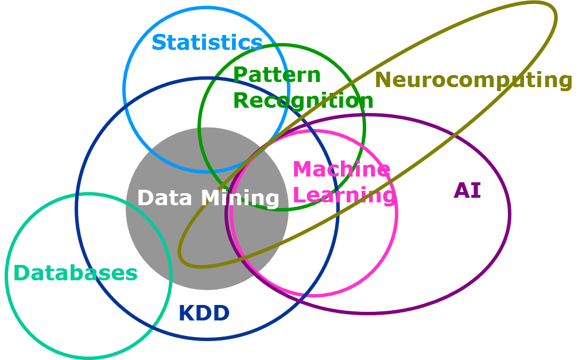
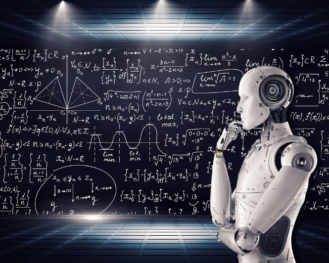
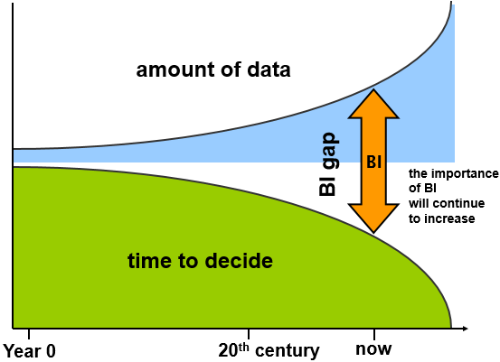
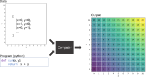
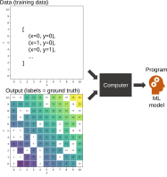
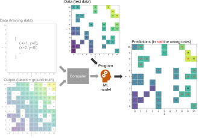
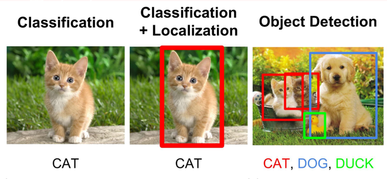
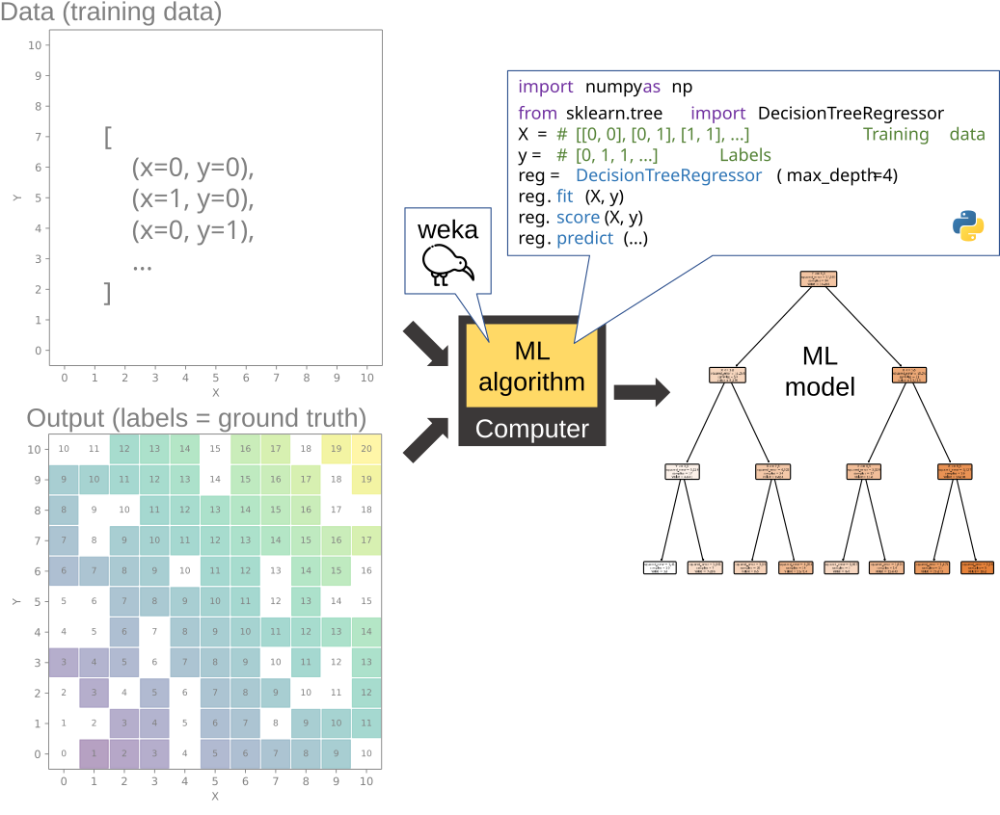
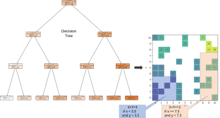
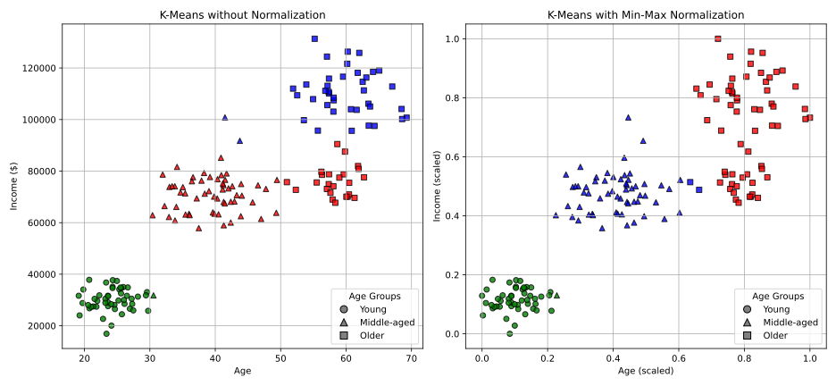

#

- [(Mar 2, 2026) Anthropic's AI model Claude gets popularity boost after US military feud](https://www.theguardian.com/technology/2026/mar/02/claude-anthropic-ai-pentagon)
- [(May 29, 2025) IA e Lavoro Gen-Z](https://www.ilsole24ore.com/art/l-intelligenza-artificiale-gia-ruba-lavoro-giovani-gen-z-AHgfnmz)
- [(Apr 1, 2025) Ghibli effect: ChatGPT usage hits record after rollout of viral feature](https://www.reuters.com/technology/artificial-intelligence/ghibli-effect-chatgpt-usage-hits-record-after-rollout-viral-feature-2025-04-01/)
- [(Jan 28, 2025) DeepSeek sparks AI stock selloff; Nvidia posts record market-cap loss](https://www.reuters.com/technology/chinas-deepseek-sets-off-ai-market-rout-2025-01-27/)
- [(Jan 2, 2025) Nvidia's market value gets $2 trillion boost in 2024 on AI rally](https://www.reuters.com/technology/artificial-intelligence/global-markets-marketcap-pix-2025-01-02/)
- [(Oct 15, 2024) Google turns to nuclear to power AI data centres](https://www.bbc.com/news/articles/c748gn94k95o)
- [(Mar 22, 2024) The A.I. Boom Makes Millions for an Unlikely Industry Player](https://www.nytimes.com/2024/03/22/business/artificial-intelligence-anguilla.html)
- [(Mar 8, 2024) ‘We definitely messed up’: why did Google AI tool make offensive historical images?](https://www.theguardian.com/technology/2024/mar/08/we-definitely-messed-up-why-did-google-ai-tool-make-offensive-historical-images)
- [(Feb 28, 2024) Why Google's 'woke' AI problem won't be an easy fix](https://www.bbc.com/news/technology-68412620)
- [(Sep 11, 2023) These Prisoners Are Training AI](https://www.wired.com/story/prisoners-training-ai-finland/)
- [(Aug 31, 2023) The Tropical Island With the Hot Domain Name](https://www.bloomberg.com/news/articles/2023-08-31/ai-startups-create-digital-demand-for-anguilla-s-website-domain-name)
- ... and many others

#



# What is Artificial Intelligence?

Artificial intelligence (AI) is the capability of *computational systems* to perform tasks typically associated with *human intelligence*, such as learning, reasoning, problem-solving, perception, and decision-making.
​

::::{.columns}
:::{.column width=50%}
AI refers to a broad field of science encompassing _not only_ computer science but _also psychology_, _philosophy_, _linguistics_ and other areas.

Applications:

- Computer Vision  ​
- Natural language processing (NLP)  ​
- Robotics & Motion  ​
- Planning and optimization  ​
- Knowledge capture
:::
:::{.column width=50%}

:::
::::

# AI: definition and types

According to the Computer Science view: __"Intelligent (software) agents"__ perceiving their environment and taking __actions__ to achieve a __goal__.

_Narrow or Weak AI_ performs some __traditional goals__

* Reasoning, planning, learning, natural language processing, image recognition...

_Artificial general intelligence (AGI)_, also _called Strong AI_ performs a full range of human abilities

* Some predict it will be 2050 before we can achieve this
* _We are not sure if we will ever understand consciousness_

# Artificial Intelligence (AI)


> "AI is the science and engineering of making intelligent machines, especially intelligent computer programs."

# Data Mining

> **Data mining** [@chakrabarti2006data]
>
> - Is the process of extracting and discovering *patterns* in large datasets
> - ... Involving methods at the intersection of machine learning, statistics, and database systems.
> - It is an interdisciplinary field, including computer science and statistics


# Pattern

A *pattern* is a synthetic representation rich in semantics of a subset of data.

- Something recurring in the data that can be described in a compact way
- ... or an anomaly!

A pattern must be:

* Valid on data with a certain degree of confidence
* Understood from the syntax and semantic point of view, so that the user can interpret it
* Previously unknown and potentially useful, so that the user can take actions accordingly

# Pattern: Example


# What Data Mining is/is not? {visibility="hidden"}

Look for a number in the phone book.

:::{.fragment}
- SQL is sufficient
:::

Query a search engine to search for information on "Amazon".

:::{.fragment}
- It is a typical information retrieval task
:::

Discover that some surnames are more common in certain regions.

:::{.fragment}
- We look for co-occurrences between surnames and regions in people's attributes
:::

Group documents based on context information (e.g., "Amazon rainforest", "Amazon.com")

:::{.fragment}
- Requires a semantic understanding of the text through NLP and ontologies
:::

# Why Mining Data?

The amount of **data** stored on computers is constantly increasing.

* Digitalization of business processes
    * Purchases, tax receipts, banking, and credit card transactions, etc.
* IoT data
* Social data

**Hardware** becomes more powerful and "cheaper" each day

**Competitive pressure** is constantly growing:

* The information resource is a precious asset in overcoming competitors

# Why Mining Data?

:::: {.columns}
::: {.column width="50%"}

:::
::: {.column width="50%"}
- Information is not directly accessible from data
- Human analysis can take weeks to find useful information
- Most of the data has never been analyzed
:::
::::

# Machine Learning

Machine learning (ML) is a field of study in artificial intelligence.

- The development and study of statistical algorithms that can learn from data
- ... and generalize to unseen data and thus perform tasks without explicit (coding) instructions


# Machine Learning

> **Machine Learning** [@mitchell1997machine] is the study of algorithms that
>
> - Improve their performance $P$
> - At some task $T$
> - With experience $E$
> - A well-defined learning task is given by $<P, T, E>$

# AI, Machine Learning & Data Mining

:::: {.columns}
::: {.column width="50%"}
*Machine learning* is a subset of AI and is distinct from *data mining*"*

- Data mining is pattern discovery in large datasets using ML, AI, statistics, and databases.
- Apart from the actual analysis phase, it covers:
    - Data management and pre-processing
    - Modeling
    - Identification of metrics of interest
    - Visualization
:::
::: {.column width="50%"}

:::
::::

# AI, Machine Learning & Data Mining

![The role of Machine Learning in a real project. The larger the size, the longer the time taken by an activity (img/intro/1-Introduction_8.png)

# Before Machine Learning: Classical Programming


# A Simple Example: Calculator

Create a calculator that computes the sum of two numbers.

**T**ask: $Z = X + Y$

# Classical Programming



# Machine Learning

(Supervised) Machine learning is usually divided into two steps:

- Train with **E**xperience (training set)
- Generalize to unseen data (test set) and evaluate the **P**erformance
- Training and test sets are not overlapping (they do not share the same data)


# Training the model

**E**xperience: training data



# Testing the Model

**P**erformance: checking accurate predictions



#


# Depending (also) on the task, there are many types of machine learning algorithms!

# Taxonomy of Machine Learning {background-color="#121011"}

- **Supervised Learning**: models are trained using labeled data to learn a mapping from inputs to labels
- **Unsupervised Learning**: algorithms find patterns, structures, and insights in unlabeled data without predefined answers
- **Reinforcement Learning**: an agent learns to make optimal decisions by interacting with a dynamic environment through trial-and-error

# Taxonomy of Machine Learning

- *Supervised Learning*: models are trained using labeled data to learn a mapping from inputs to *labels*
    - **Classification**: the label is nominal; spam detection (`yes`/`no`), diagnosis (`healthy`/`sick`)
    - **Regression**: the label is continuous; house price, temperature
- Unsupervised Learning
- Reinforcement Learning

# Real-world applications of supervised learning



# Real-world applications of supervised learning


# Real-world applications of supervised learning


# Taxonomy of Machine Learning

- *Supervised Learning*
    - *Classification*: the label is nominal; spam detection (`yes`/`no`), diagnosis (`healthy`/`sick`)
        - **Model-Based Methods**: learn an explicit model to generalize from training data
            - Decision Trees
            - Neural Networks
        - **Instance-Based Methods**: store training examples and compare new inputs to known cases
            - k-Nearest Neighbors
    - Regression
        - Model-Based Methods
        - Instance-Based Methods
- Unsupervised Learning
- Reinforcement Learning

# Classification > Model-Based Methods

Given a *dataset* (i.e., a collection of data points/records)

* Each record is composed of a set of _attributes_ (aka features), where one ot them represents the _class_ (aka label) of the record.

Goal:

* Find a  _model_ to express the class attribute as a function of the other attributes
    * A [model](https://en.wikipedia.org/wiki/Model) is an informative, simplified representation of an object or system.
* ... so that new unseen records can be assigned to the right class in the most accurate way

# Classification > Model-Based Methods

How?

1. The original dataset is split into two subsets: the training set and the test set.
    * A _training set_ is used to learn the model.
    * A _test set_ is used to determine the model accuracy when generalizing on unseen data.
    * They are not overlapping! (they do not share the same data)
2. Learn the model on the training set
3. Evaluate the model performance on the test set.

# Classification > Model-Based Methods

*Training*: learn a model to generalize from training data

```{mermaid}
%%| echo: false
flowchart LR
    A[(Training Data)] --> B[Training / Model Learning]
    B --> C[Trained Model]
```
```{mermaid}
%%| echo: false
flowchart LR
    JSx-->J2APd
    JDx-->J2APr
    J2APd-->AAPd
    J2APr-->AAPr
```

```{mermaid}
%%| echo: false
flowchart LR
    JSx-->J2APd
    JSx-->J2APr
    J2APd-->AAPd
    J2APr-->AAPr
    JDx
```
# Classification > Model-Based Methods

*Testing*: verify the generalization of the model on unseen data

- Use the trained model to make predictions on new data
- Compare predictions to ground truth for performance evaluation

```{mermaid}
%%| echo: false
flowchart LR
    A[(Test Data)] --> B[Trained Model]
    B --> C[(Predicted Class)]
    C --> D[Evaluation]
    E[(Real Class / Ground Truth)] --> D
    D --> F(Performance Metric)
```

# Classification > Model-Based Methods > Decision Trees



# Classification > Model-Based Methods > Decision Trees



# Classification > Model-Based Methods > Neural Networks


# Classification > Instance-Based Methods

Instance-based methods: store training examples and compare new inputs to known cases

* No explicit training phase
* Rely on similarity or distance measures
* Can be sensitive to noise and data size

```{mermaid}
%%| echo: false
flowchart LR
    A[(Test Data)] --> B[Compare]
    C[(Training Data)] --> B
    B --> D[(Predicted Class)]
    D --> E[Evaluation]
    F[(Real Class / Ground Truth)] --> E
    E --> G(Performance Metric)
```

# Classification > Instance-Based Methods > k-Nearest Neighbors


# Classification > Ensemble Methods {visibility="hidden"}

Ensemble Methods: combine multiple models to improve performance


# Taxonomy of Machine Learning {background-color="#121011"}

- Supervised Learning
- *Unsupervised Learning*: algorithms to find patterns and insights in unlabeled data
    - **Clustering**: group similar data points together (e.g., customer segmentation)
    - **Association Rule**: discover relationships between attributes (e.g., market basket analysis)
- Reinforcement Learning

# Real-world applications of unsupervised learning



# Real-world applications of unsupervised learning


# Real-world applications of unsupervised learning


# Clustering

Given a dataset, a *similarity measure* between data points, and a *cluster model*, find subsets (aka clusters) of points such that:

- Points belonging to a cluster are more similar to each other
- ... than those belonging to other clusters

Similarity measures

- Euclidean distance is applicable if point attributes assume continuous values
- Many other measures are available or can be defined for each specific domain

Cluster models

- Partitioning: divide data points into non-overlapping groups (clusters)
- Hierarchical: build a tree of nested clusters

# Taxonomy of Machine Learning

- Supervised Learning
- *Unsupervised Learning*
    - *Clustering*: group similar data points together (e.g., customer segmentation)
        - **Partitioning**: divide data points into non-overlapping groups (clusters)
        - **Hierarchical**: build a tree of nested clusters, showing relationships between data points at different levels
    - Association Rule
- Reinforcement Learning

# Taxonomy of Machine Learning

- Supervised Learning
- *Unsupervised Learning*
    - *Clustering*
        - *Partitioning*: divide data points into non-overlapping groups (clusters)
            - **Centroid-Based**: group data points that are similar to a central point
                - k-Means
            - **Density-Based**: group data points that are closely packed together and mark outliers as noise based on their density
                - DBSCAN
        - Hierarchical
    - Association Rule
- Reinforcement Learning

# Clustering > Partitioning

::::{.columns}
::: {.column width="50%"}


*Centroid-Based*: group data points that are similar to a central point
:::
::: {.column width="50%"}
:::{.fragment}


*Density-Based*: group data points that are closely packed together

:::
:::
::::

# Taxonomy of Machine Learning

- Supervised Learning
- *Unsupervised Learning*
    - *Clustering*
        - Partitioning
        - *Hierarchical*: build a tree of nested clusters, showing relationships between data points at different levels
            - **Agglomerative clustering** (bottom-up approach)
    - Association Rule
- Reinforcement Learning

# Clustering > Hierarchical > Agglomerative

*Agglomerative clustering* ("bottom-up" approach)

- Begin with each data point as an individual cluster.
- At each step, merge the two most similar clusters based on a chosen distance metric


# Taxonomy of Machine Learning

- Supervised Learning
- *Unsupervised Learning*
    - Clustering
        - Partitioning
        - Hierarchical
    - **Association Rule**: discover relationships between attributes (e.g., market basket analysis)
- Reinforcement Learning

# Association Rule Mining

|ID| milk| bread| butter| beer| diapers| eggs| fruit|
|--| --| --| --| --| --| --| --|
|1| 1| 1| 0| 0| 0| 0| 1|
|2| 0| 0| 1| 0| 0| 1| 1|
|3| 0| 0| 0| 1| 1| 0| 0|
|4| 1| 1| 1| 0| 0| 1| 1|
|5| 0| 1| 0| 0| 0| 0| 0|

:::{.fragment}
$\text{support}(A)=P(A)={\frac {({\text{number of transactions containing }}A)}{\text{ (total number of transactions)}}}$

$\mathrm {conf} (X\Rightarrow Y)=P(Y|X)={\frac {\mathrm {supp} (X\cup Y)}{\mathrm {supp} (X)}}={\frac {{\text{number of transactions containing }}X{\text{ and }}Y}{{\text{number of transactions containing }}X}}$
:::

:::{.fragment}
|if Antecedent then Consequent|support |support $\cdot$ confidence|
|--| --| --|
|if buy milk, then buy bread |$\frac{2}{5}= 0.4$ |$0.4\cdot1.0= 0.4$|
|if buy milk, then buy eggs |$\frac{1}{5}= 0.2$ |$0.2\cdot0.5= 0.1$|
|if buy bread, then buy fruit |$\frac{2}{5}= 0.4$ | $0.4\cdot0.66= 0.264$|
|if buy milk and bread, then buy fruit| $\frac{2}{5}= 0.4$| $0.4\cdot1.0= 0.4$ |
:::


# Taxonomy of Machine Learning {background-color="#121011"}

- Supervised Learning
- Unsupervised Learning
- **Reinforcement Learning**: an agent learns to make optimal decisions by interacting with a dynamic environment through trial-and-error

# Reinforcement Learning


# Agentic AI {background-color="#121011"}

*Agentic AI* builds on *generative AI* (gen AI) techniques by using large language models (LLMs) to function in dynamic environments.

- The term "agentic" refers to these models' agency, or their capacity to act independently and purposefully.
- Generative models focus on creating content based on learned patterns
    - A generative AI model like OpenAI's ChatGPT might produce text, images, or code
- Agentic AI extends this capability by applying generative outputs toward specific goals
    - An agentic AI system can use that generated content to complete complex tasks autonomously by calling external tools.

# {background-color="#121011"}

> Computer science is no more about computers than astronomy is about telescopes.
>
> [@fellows1991computer]
