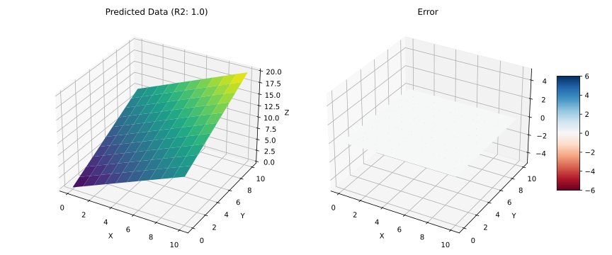
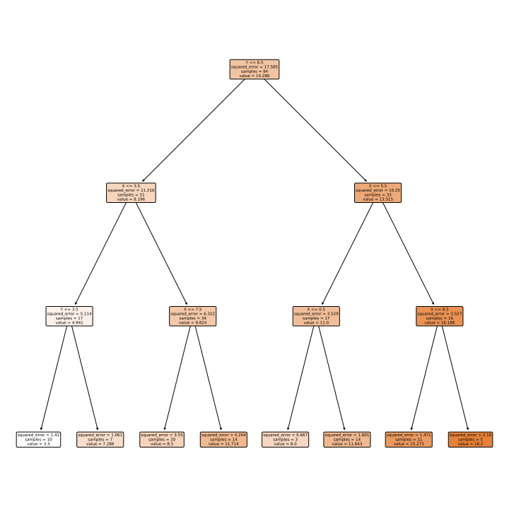
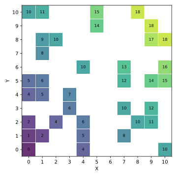
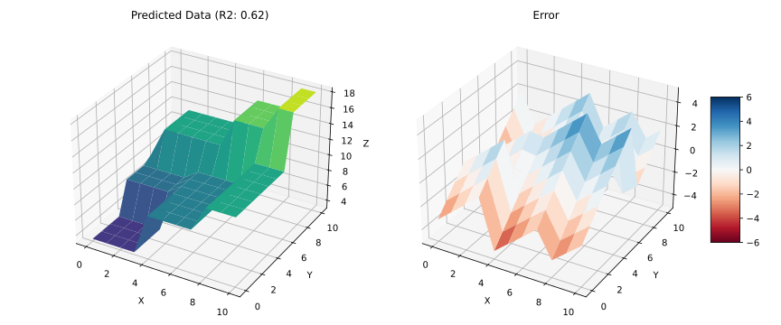
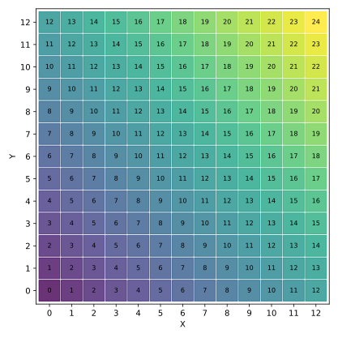
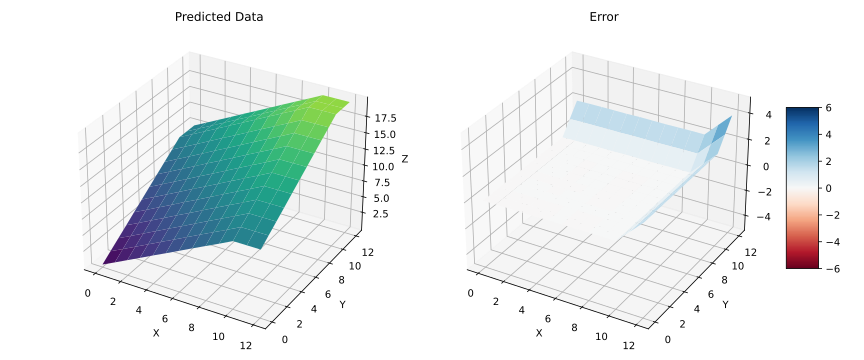

# Choosing the "Right" ML model

# The Perfect Model ... in 2D

$Z = X + Y$

# The Perfect Model ... in 3D

$Error = Z - Z'$ (if blue, $Z > Z'$)

- $Z = X + Y$
- $Z' = model(X, Y)$

# (Small) Decision Tree

# (Small) Decision Tree... in 2D

:::: {.columns}

::: {.column width="50%"}

Predicting the test data

:::
::: {.column width="50%"}

Predicting the whole data

:::
::::

# (Small) Decision Tree... in 3D

# (Bigger) Decision Tree

# (Bigger) Decision Tree... in 3D

# Linear Regression

**Model**: $Z = \alpha X + \beta Y + \epsilon$

- $\alpha$ and $\beta$ can be fitted (learned) using *[ordinary least squares (OLS)](https://en.wikipedia.org/wiki/Ordinary_least_squares)*
- Best fit?

# Best fit?

$Z = X + Y$

- $\alpha = 1$
- $\beta = 1$
- $\epsilon = 0$

# Neural Network

:::: {.columns}

::: {.column width="60%"}

**Model** (of a single perceptron): $Z = w_1 X + w_2 Y + b$

- More formally, $f(x) = h(W \cdot X + b)$
    - $h$: activation function (e.g., *linear*, relu, and sigmoid)
    - $W = (w_1, w_2, ...)$: vector of weights
    - $X = (x_1, x_2, ...)$: vector of inputs, $b$: bias (shift)
- The model is generally fitted (learned) using [Gradient Descent](https://en.wikipedia.org/wiki/Gradient_descent)
    - Best fit? $w_1 = 1, w_2 = 1, b=0$
    - The model fits to: $w_1 = 1.27, w_2 = 0.62, b=0.56$

:::
::: {.column width="40%"}

:::
::::

# AutoML (FLAML)

    [flaml.automl.logger: 09-11 15:38:38] {2219} INFO - iteration 79, current learner lgbm
    [flaml.automl.logger: 09-11 15:38:38] {2392} INFO -  at 9.6s,	estimator lgbm's best error=0.0017,	best estimator lgbm's best error=0.0017
    [flaml.automl.logger: 09-11 15:38:38] {2219} INFO - iteration 80, current learner rf
    [flaml.automl.logger: 09-11 15:38:38] {2392} INFO -  at 9.8s,	estimator rf's best error=0.0661,	best estimator lgbm's best error=0.0017
    [flaml.automl.logger: 09-11 15:38:38] {2219} INFO - iteration 81, current learner lgbm
    [flaml.automl.logger: 09-11 15:38:39] {2392} INFO -  at 9.9s,	estimator lgbm's best error=0.0017,	best estimator lgbm's best error=0.0017
    [flaml.automl.logger: 09-11 15:38:39] {2219} INFO - iteration 82, current learner xgb_limitdepth
    [flaml.automl.logger: 09-11 15:38:39] {2392} INFO -  at 10.0s,	estimator xgb_limitdepth's best error=0.6172,	best estimator lgbm's best error=0.0017
    [flaml.automl.logger: 09-11 15:38:39] {2628} INFO - retrain lgbm for 0.0s
    [flaml.automl.logger: 09-11 15:38:39] {2631} INFO - retrained model: LGBMRegressor(colsample_bytree=0.5101095085840595,
                learning_rate=0.8020558621295225, max_bin=511,
                min_child_samples=2, n_estimators=1, n_jobs=-1, num_leaves=19,
                reg_alpha=0.015771773712678253, reg_lambda=0.0009765625,
                verbose=-1)
    [flaml.automl.logger: 09-11 15:38:39] {1931} INFO - fit succeeded
    [flaml.automl.logger: 09-11 15:38:39] {1932} INFO - Time taken to find the best model: 9.509054183959961

    R^2 score on training data: 1.0000

# Generalization

What if we ask the models the result of 12 + 12?

:::: {.columns}

::: {.column width="50%"}

:::
::: {.column width="50%"}

:::
::::

# Generalization: Decision Tree in 2D

:::: {.columns}

::: {.column width="50%"}

:::
::: {.column width="50%"}

:::
::::

# Generalization: Decision Tree in 3D

# Generalization: ANN

# Generalization: AutoML

# Generalization: Linear Regression

# References