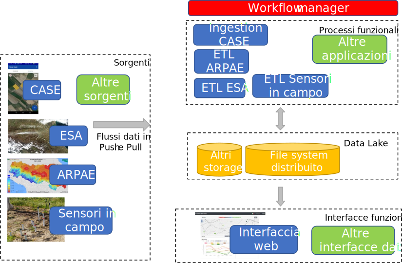
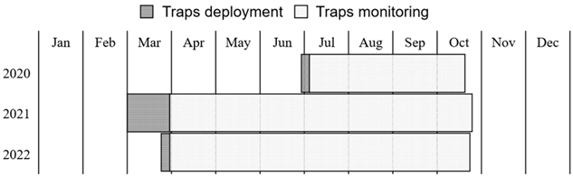
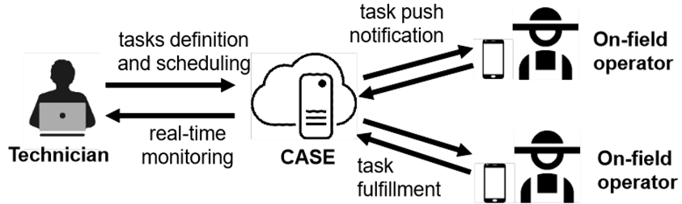
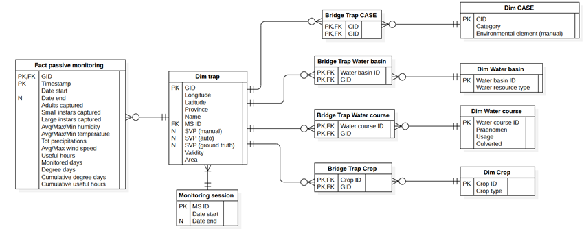

# A telemetry system for precision agriculture

The impacts of climate change are so rapid that what happened last year is no longer true today.

- We need to act quickly and make decisions based on evidence, not just history.

:::: {.columns}
::: {.column width="55%"}

:::
::: {.column width="45%"}

:::
::::

*ABDS*: A modular platform for collecting, analyzing, and visualizing heterogeneous data from the field and the post-harvest phase.

# Cimice.Net

:::: {.columns}

::: {.column width="50%"}

The brown marmorated stink bug (Halyomorpha halys) is an insect pest species causing economic damage to several agricultural commodities

- We want to build a data-driven approach to support the application of Integrated Pest Management strategies
- We want to monitor the spread of H. Halys
- And learn the most important environmental factors

Three years-long project

:::
::: {.column width="50%"}

:::
::::

# Cimice.Net

Goal: help farmers protect crops

- A network of monitoring traps has been deployed in Emilia-Romagna
- Monitoring 145, 168, and 101 farms in 2020-2022 (also in 2023 and 2024)

:::: {.columns}
::: {.column width="50%"}

:::
::: {.column width="50%"}

:::
::::

# Collaborative Agro SEnsing

The acquisition of data concerning the installation and monitoring of traps have been aided by *CASE* (*Collaborative Agro SEnsing*)

- Dynamic questionnaire application for on-field data crowdsourcing in the agricultural domain
- Facilitate and standardize the communications between on-field operators with first-hand visuals of a given field/orchard and the technicians needing a 360-degree view of all fields

:::: {.columns}
::: {.column width="50%"}

:::
::: {.column width="50%"}

:::
::::

#

#

#

#

#

:::: {.columns}

::: {.column width="50%"}

:::
::: {.column width="50%"}

:::
::::

# [Live!](https://big.csr.unibo.it/projects/cimice/monitoring.php?lan=en)