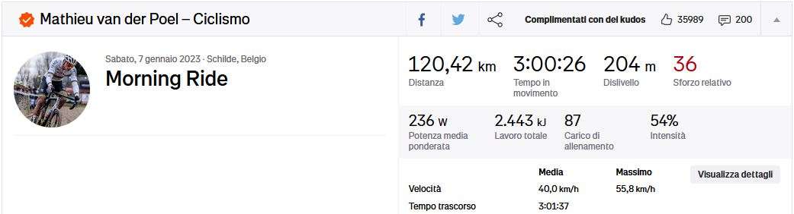

# Training KPIs

We are preparing for a race and we need to create a proper plan.

Risks of Poor Planning:

- Overtraining
- Underperformance
- Increased risk of injury

How can we exploit *data-driven* planning?

# Training KPIs

Key Performance Indicators (KPIs) are measurable values that track performance and progress toward a goal.

- Objectively measure improvements
- Balance training intensity and recovery
- Prevent overtraining or undertraining

We need to optimize *performance readiness*: achieved when *fitness* is high, and *fatigue* is low

- We need to minimize *fatigue* (i.e., short-term stress from recent training)
- Maximize the *fitness* (i.e., long-term training adaptations)

# How can we quantify all these aspects?

# *Training Load*

*Training Load* ($TL$): a measure of the stress placed on the body during exercise.

- $TL = Duration \times Intensity$
- Units: $TSS$ (Training Stress Score)

# How do we quantify *Intensity*?

# How do we quantify *Intensity*?

Let's focus on a specific sport, cyclism

- We can measure the *current* rider's effort (= power) using *power meters*

Cycling *power meters* measure torque using strain gauges.

- The strain gauges measure *a rider's force on a given component* (pedal, crank, etc.).
- This torque is later converted to power by multiplying it by that component’s cadence (angular velocity).

# *Normalized Power*

*Normalized Power* $\text{NP} = \sqrt[4]{\frac{\sum_{i=1}^{n} P_{\text{30-sec}, i}^4}{n}}$ quantifies the physiological demands of a cycling activity with variable intensity.

1. Divide the ride into 30-second moving average and calculate the average power for every 30-second interval.

   - Smooth out short-term power fluctuations.

2. Raise each 30-second average to the fourth power

   - Emphasize higher power outputs, as intense efforts contribute disproportionately to physiological stress.

3. Take the average of all fourth powers
4. Take the fourth root of the Result

# *Normalized Power*

Unlike average power, NP accounts for the variability in effort during a ride, reflecting how the body responds to the stress.

- High-intensity intervals are more stressful than steady-state efforts, even if the average power is the same.

:::: {.columns}
::: {.column with=65%}

:::
::: {.column with=34%}

> |   Time |   Interval |   Avg Power |   Avg HR |
> |------------------:|---------------:|------------:|---------:|
> |              ... |             ... |         ... |      ... |
> |              2285 |             28 |         242 |      130 |
> |              2313 |             32 |         103 |      134 |
> |              2345 |             27 |         253 |      135 |
> |              2372 |             32 |          97 |      136 |
> |              2404 |             28 |         278 |      139 |
> |              2432 |             32 |         104 |      147 |
> |              2464 |             28 |         290 |      145 |
> |              2492 |             71 |         107 |      140 |
> |              ... |             ... |         ... |      ... |

:::
::::

Given the 8 intervals from the table

- Average power = 184
- Normalized power = 226

# Towards *Intensity*

Is $NP=200W$ a hard or an easy ride?

The Normalized Power is an *absolute* measurement.

- *Absolute* measurements provide information on volume, size, or magnitude.
- *Relative* measurements provide a comparative gauge of how well the work has been executed.

# *Intensity Factor*

*Intensity Factor* $IF = \frac{\text{Normalized Power (NP)}}{\text{FTP}}$ measures workout intensity relative to the *Functional Threshold Power* ($FTP$).

$FTP$: the highest average power (measured in watts with sensors) a cyclist can sustain for 60 minutes.

- Testing Methods:
  - 20-minute time trial: $FTP = 95\%$ of average power.
  - Ramp or step tests with smart trainers.

$IF$ ranges:

- Easy recovery: $IF < 0.65$
- Moderate endurance: $IF \in [0.65, 0.85]$
- High-intensity intervals: $IF > 0.85$

Use $IF$ to adjust the training load:

- Too high = risk of overtraining.
- Too low = insufficient stimulus for improvement.

# Now that we have defined the *Training Load*, what about *Fitness* and *Fatigue*?

Key Problems in quantification:

- *Subjectivity*: Perceived exertion varies by individual.
- *External Factors*: Sleep, nutrition, and stress influence fatigue but are hard to measure precisely.
- *Delayed Effects*: Fatigue may appear days after intense training.
    - How do we distinguish *Fatigue* from *Fitness*?
    - As of today, yesterday's activity provokes fatigue but will increase fitness in the long run

# Quantifying *Fatigue*: *Acute Training Load*

*Acute Training Load* $ATL = \frac{\text{Sum of daily TL over 7 days}}{7}$

- Short-term training stress, typically measured over the past 7 days.
- Reflects recent training intensity and fatigue.

# Quantifying *Fitness*: *Chronic Training Load*

*Chronic Training Load* $CTL = \frac{\text{Sum of daily TL over 42 days}}{42}$

- Long-term training stress, measured over the past 42 days.
- Reflects the overall fitness level.

# Quantifying *Performance Readiness*

*Training Stress Balance* $TSB = \text{Fitness (CTL)} - \text{Fatigue (ATL)}$

- Positive $TSB$: Indicates readiness.
- Negative $TSB$: Indicates fatigue.

Training Adjustments:

- If $CTL$ is low, focus on increasing training volume or intensity.
- If $ATL$ is high, incorporate rest days or low-intensity sessions.

# Planning to Optimize Performance Readiness

Monitor Key Metrics:

- $CSS$: *Single* training load
- $ATL$: *Short-term* fatigue
    - Lower $ATL$ during taper to avoid carrying excessive stress.
- $CTL$: *Long-term* fitness
    - Maintain a high $CTL$ relative to past races.
- $TSB$: Recovery and readiness
    - Aim for a positive balance (e.g., +10 to +20) before race day.

Adjust Based on Feedback:

- Reduce intensity or volume if fatigue accumulates.
- Focus on recovery activities (e.g., yoga, massage).

Tapering Before the Race:

- Gradual reduction in training volume to reduce fatigue while maintaining fitness.
- Reduce training volume by 40–60% over 1–3 weeks.
- Maintain intensity to preserve fitness.

# Training Zones {visibility="hidden"}

Training Zones Based on $FTP$:

1. Active Recovery: <55% of $FTP$
2. Endurance: 56–75% of $FTP$
3. Tempo: 76–90% of $FTP$
4. Threshold: 91–105% of $FTP$
5. VO₂ Max: 106–120% of $FTP$
6. Anaerobic Capacity: >120% of $FTP$

# Training Zones {visibility="hidden"}

Heart rate (HR) training zones are commonly used to structure workouts based on intensity.

These zones are typically calculated as percentages of your maximum heart rate (HRmax) or heart rate reserve (HRR). Here's an overview of the zones:

- *Zone 1*: Active Recovery (50–60% HRmax)
  - Purpose: Promote recovery after intense workouts. Build a strong aerobic foundation.
  - Effort Level: Very light; easy conversation possible.

- *Zone 2*: Endurance (60–70% HRmax)
  - Purpose: Improve fat metabolism and aerobic efficiency. Ideal for long-duration, steady-state activities.
  - Effort Level: Comfortable; conversation is sustainable.

- *Zone 3*: Tempo (Moderate; 70–80% HRmax)
  - Purpose:  Increase aerobic capacity. The transition zone between endurance and threshold training.
  - Effort Level: Moderate; conversation is more challenging.

- *Zone 4*: Lactate Threshold (Threshold; 80–90% HRmax)
  - Purpose: Improve lactate clearance and sustain high-intensity efforts. Enhance race-specific endurance.
  - Effort Level: Hard; limited conversation possible.

- *Zone 5*: VO₂ Max (90–95% HRmax)
  - Purpose: Increase maximum aerobic capacity (VO₂ Max). Develop speed and power.
  - Effort Level: Very hard; speaking is difficult.

- *Zone 6*: Anaerobic Capacity (95–100% HRmax)
  - Purpose: Develop short bursts of power and speed. Improve sprinting ability and neuromuscular coordination.
  - Effort Level: Maximum effort; no conversation possible.

# Calculating Heart Rate Zones {visibility="hidden"}

Based on HRmax

- $\text{HRmax} = 220 - \text{age}$ (or test it during a maximum effort session).
- Multiply HRmax by the percentage for each zone.

Based on HR Reserve (HRR)

- Karvonen Formula: $\text{Target HR} = \text{Resting HR} + (\text{HRmax} - \text{Resting HR}) \times \text{Zone %}$

Example: For a 40-year-old athlete

- HRmax = 220 - 40 = 180 bpm
- Resting HR = 60 bpm
- Zone 2 (60–70% of HRR): $60 + (180 - 60) \times 0.60 = 132 \, \text{to} \, 60 + (180 - 60) \times 0.70 = 144 \, \text{bpm}$

# Critical Swim Speed (CSS) {visibility="hidden"}

- Definition: The speed a swimmer can maintain continuously without exhaustion.
- Calculation:
 From time trials:
 $\text{CSS} = \frac{\text{400m time} - \text{200m time}}{200m}$
- Purpose: Optimize race pacing and aerobic capacity.

# VO₂ Max {visibility="hidden"}

- Definition: Maximum rate of oxygen consumption during intense exercise.
- Units: mL/kg/min
- Purpose:
  - Indicator of aerobic capacity
  - Improves with endurance training

# Heart Rate Variability (HRV) {visibility="hidden"}

- Definition: Variations in the time interval between heartbeats.
- Purpose:
  - Higher HRV = Better recovery
  - Lower HRV = Possible fatigue or stress