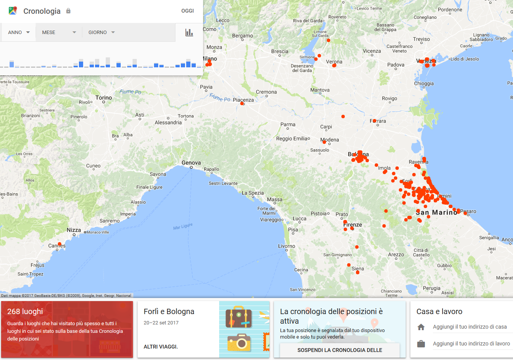
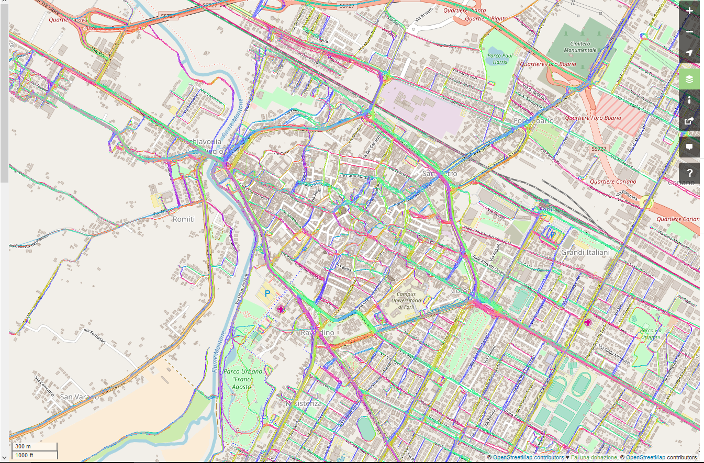
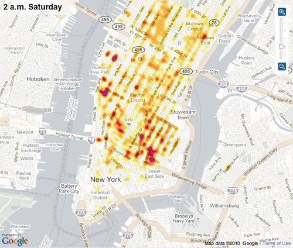
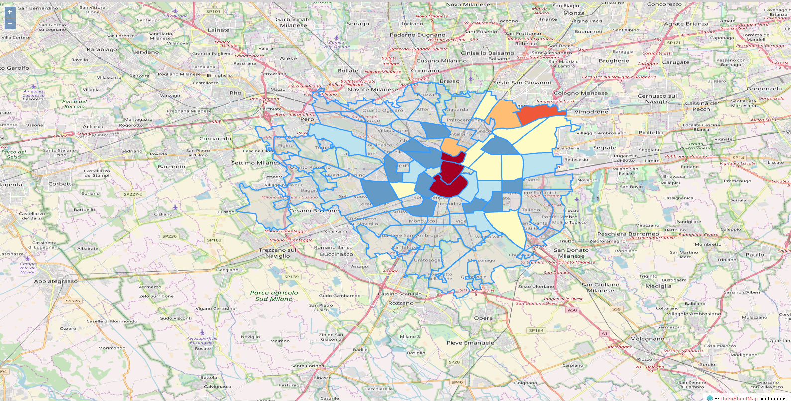
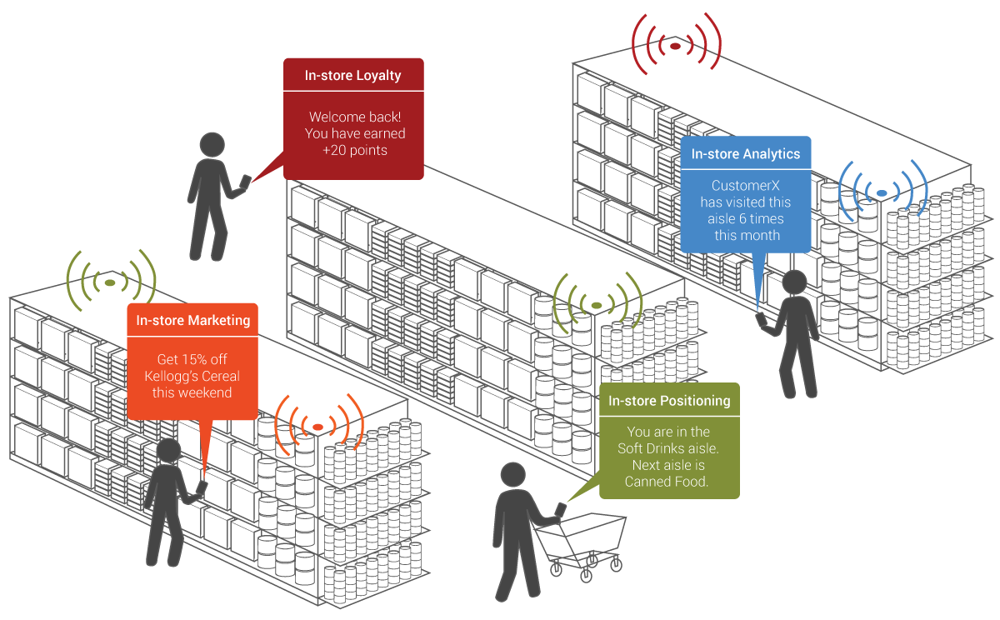
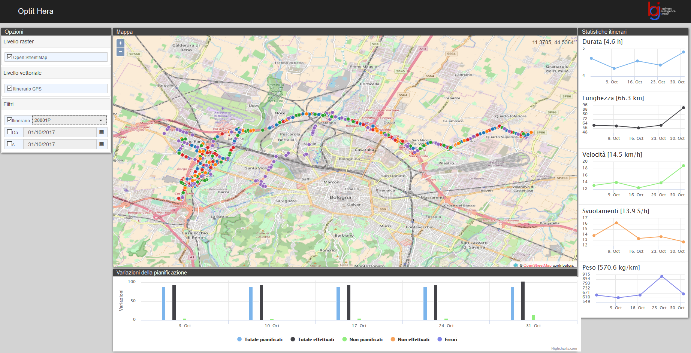

# Social Habits: La Città Intorno

_Lacittàintorno_ is a programme for urban regeneration promoted by Fondazione Cariplo

- Designed to foster well-being and quality of life in urban areas
- Enhancing the functions and services in place in the following target neighbourhoods: Adriano, Via Padova, Corvetto, and Chiaravalle
- 10 million euros investment over a three-year timeframe

**Question**: what is the profile of users in these neighborhoods?

# Location Intelligence and Mobility Data

::::{.columns}
::: {.column width="75%"}

_More than 80% of companies_ take decisions on the basis of information characterized by a spatial component.

* **Geo-referenced data**: are data that contain a spatial position, they are typically static
* **Trajectory data**: describe objects moving in the environment
* The main providers of trajectory data are:
    * Apps collecting data from GPS
    * Telco that trace connection to Base Transceiver Stations
    * Fleets of trucks, cars and ships
    * …

_Location Intelligence_ is a set of tools that allow  __a geographic dimension__ to be integrated within a  __BI platform__.

- The goal is to increase the  __monitoring ability__ and the capability of understanding  __business events__.
- Location intelligence supports  __data visualization and interaction with maps__ in  __BI contexts__.

:::
::: {.column width="15%"}

:::
::::

# Google Timeline

::::{.columns}
::: {.column width="50%"}

:::
::: {.column width="50%"}
:::{.fragment}

:::
:::
::::

# Open Street Map

::::{.columns}
::: {.column width="50%"}

:::
::: {.column width="50%"}
:::{.fragment}

:::
:::
::::

# How do you identify relevant places?

::::{.columns}
::: {.column width="50%"}
**Personal gazetteer** is a personalized, digital record of significant locations (stay points) to an individual, similar to a geographical fingerprint

- *Staypoints* are places of interest for a user
- How can extract staypoints with the following semantics?
    - *Frequented* places?
    - *Home*?
    - *Work*?
:::
::: {.column width="50%"}

:::
::::

# How do you identify relevant places?

::::{.columns}
::: {.column width="50%"}

Staypoints vs Trajectories

* **Trajectories** describe mobility behaviors/patterns
  * USE CASE: understand where people going to an event come from?
  * *Frequent trajectories*: an end-to-end cluster of trajectories that are:
    * Compact enough
    * Frequent enough
    * Long enough
* **Staypoints** identify places of interest for a user
    - *Home*: the place where a user frequently stops between 1 and 5
    - *Work*: the place where a user frequently stops between 9 and 17
    - *Attend*: a place where the user stands at least 20 minutes and where at least one commercial activity is situated

:::
::: {.column width="50%"}

:::
::::

# Social Habits: LiveIn vs WorksIn

# Social Habits: LiveIn vs Attend

# Social Habits: LivesIn Adriano vs WorksIn *

# Social Habits: LivesIn * vs WorksIn Adriano

# Defining attractiveness [@DBLP:journals/eswa/FranciaGG24]

The previous figures provide *qualitative* results.

- How can we *quantitatively* measure the attractiveness of neighborhood?

:::{.fragment}

- $Attractiveness(n) = \frac{LiveIn_n + WorkIn_n + Frequent_n}{LiveIn_n}$
- $Attractiveness'(n) = \frac{MovementPattern_n}{\sum_i (MovementPattern_i)}$

:::

:::{.fragment}

|Neighborhood           | Distinct users  | WorkIn + Frequent | LiveIn  | $Attractiveness$  |$Attractiveness'$|
|-----------------------|-----------------|-------------------|---------|-------------------|-----------------|
|Brera                  | 2779            | 2396              | 440     | 545%              | 83%             |
|Duomo                  | 4607            | 4203              | 464     | 906%              | 83%             |
|Buenos Aires - Venezia | 3840            | 2644              | 1484    | 178%              | 82%             |
|XXII Marzo             | 1790            | 1202              | 681     | 177%              | 82%             |
|...                    | ...             | ...               | ...     | ...               |...              |
|Gallaratese            | 1508            | 929               | 752     | 124%              | 5%              |
|Lodi - Corvetto        | 1627            | 993               | 795     | 125%              | 4%              |
|Padova                 | 1628            | 996               | 753     | 132%              | 3%              |
|Adriano                | 636             | 316               | 385     | 82%               | 1%              |

:::

# Exploitation of Trajectory Data

::::{.columns}
::: {.column width="50%"}
* **Social habits and behaviors**
  * Identify relevant places
  * Identify communities
* **Urban mobility optimization**
  * Historical analysis of traffic flows
  * Early identification of accidents
  * Dynamic and real-time traffic management
  * Car pooling
- **Mobility/Movement mining** identification of the mode of transport \(car/foot\) along a trajectory
- **Reverse geocoding** it is the process by which an address or the name of a place is associated with a spatial datum \(latitude, longitude\)
- **Layer integration** it is the process by which several information layers are superimposed and interrogated
* **Proximity marketing \(indoor\)**
* … and many others
:::
::: {.column width="50%"}

:::
::::

# Proximity marketing

::::{.columns}
::: {.column width="50%"}

:::
::: {.column width="50%"}

:::
::::

# Social habits and behaviors: Ubiquitous User Profiling – Reality Mining

Create a **synthetic profile** of the community that transits at a point / place starting  **from anonymous trajectory data**

_Who are the customers of the shopping center?_

* 50% live within 5km from the shopping center
* 20% attend the shopping center X too
* On Saturday, 20% of customers go to the cinema after being at the shopping center
* On Saturday, 30% of customers go to restaurant Y after being at the shopping center

_Who comes on vacation to Cesenatico?_

* In July 70% of the customers come from Emilia Romagna
* 27% of customers live in neighborhoods with an average income above 30K €
* In August, 25% of customers come from Milan
* 40% of the tourists have children

_How do the people who use the Freccia Rossa Milan-Rome behave?_

* 30%, once in Rome, moves less than 10km from the station
* 20%, once in Rome, take the subway

# Urban mobility optimization: traffic flows

**Flow**: is defined by a sequence of overlapping trajectories that are not necessarily end-to-end compact

# Urban mobility optimization: traffic flows

**Flow**: is defined by a sequence of overlapping trajectories that are not necessarily end-to-end compact

USE CASE: identify crowded routes

::::{.columns}
::: {.column width="50%"}

:::
::: {.column width="50%"}

:::
::::

# Urban mobility optimization: garbage collection paths for HERA

# Urban mobility optimization: garbage collection paths for HERA

