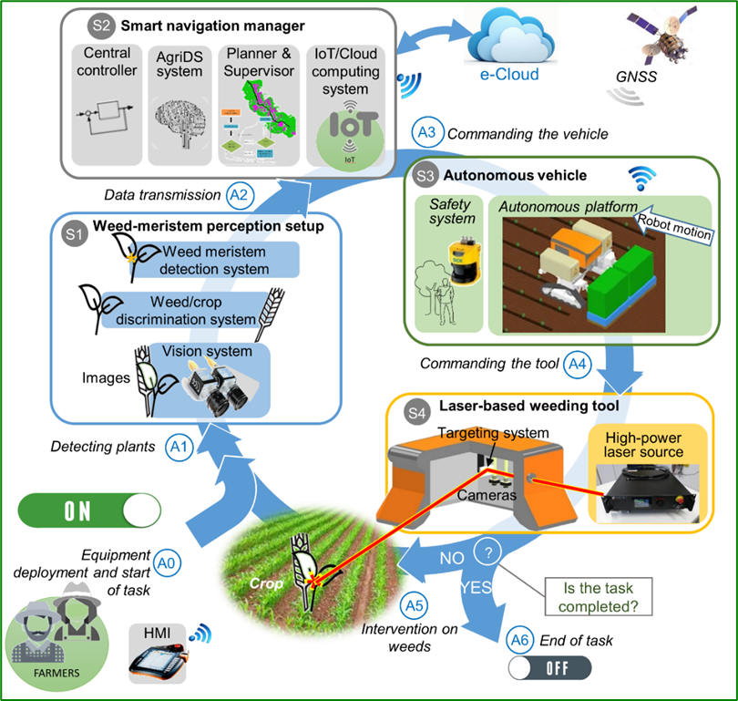
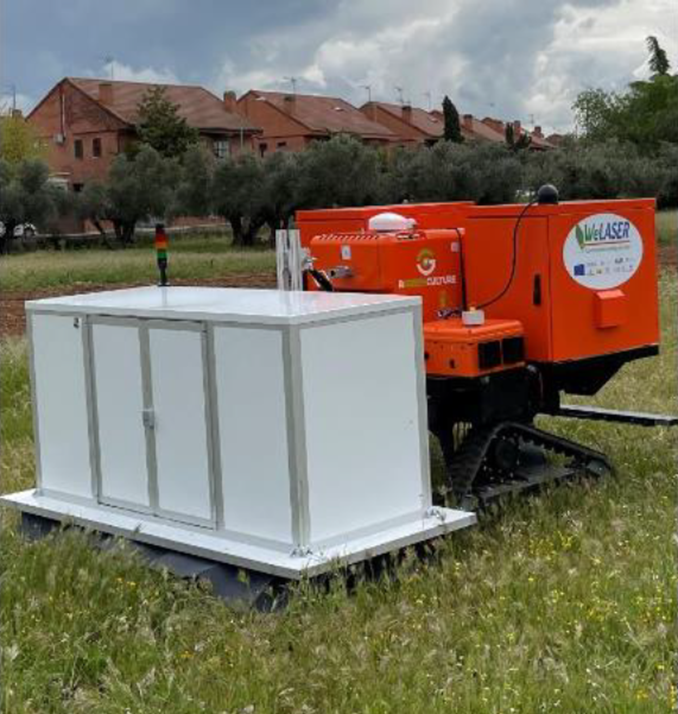
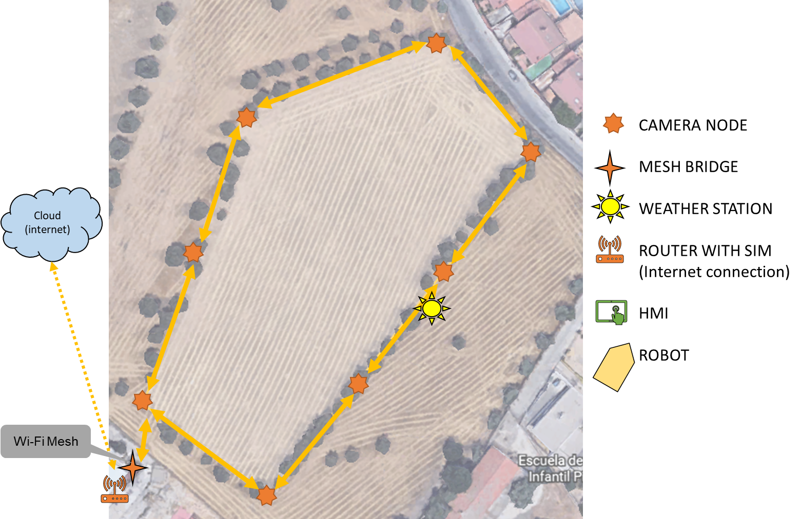
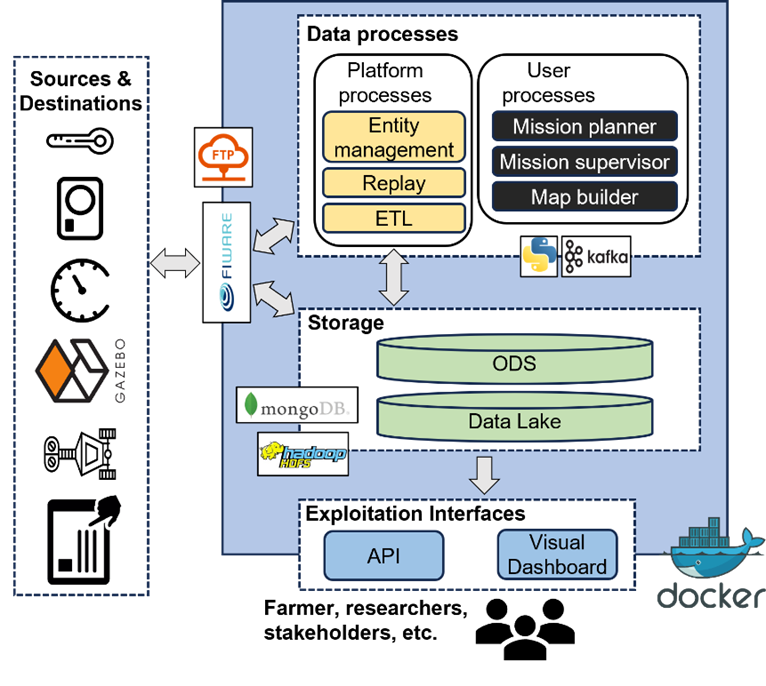
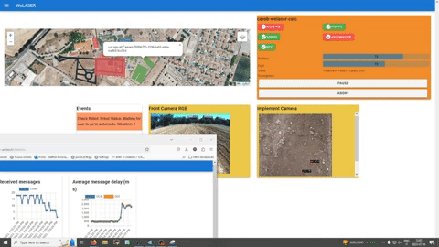

# [WeLASER](https://cordis.europa.eu/project/id/101000256)

:::: {.columns}
::: {.column width="50%"}

:::
::: {.column width="50%"}

The increased use of pesticides and fertilizers damages the environment, destroys non-target plants and beneficial insects for the soil and harms human and animal health. Most seeds develop herbicide-resistant properties, rendering pesticides ineffective. Mechanical automatic systems that are studied as alternatives to pesticides deteriorate soil features, damage beneficial soil organisms and offer limited results for in-row weeding. The EU-funded WeLASER project will develop a non-chemical solution for weed management based on pioneering technology consisting of the application of lethal doses of energy on the weed meristems through a high-power laser source. An AI-vision system separates crops from weeds, identifying the weed meristems and pointing the laser at them. A smart controller based on IoT and cloud computing techniques coordinates the system, which is transferred all over the field by an autonomous vehicle.

:::
::::

# The "Carob" Robot

# The IoT Ecosystem

# The IoT Ecosystem

# Data Platform

:::: {.columns}
::: {.column width="50%"}

A modular **data platform** for precision agriculture

- *Collecting data* from heterogeneous sources (e.g., MQTT devices and robots)
- *Augmenting data* with externally available knowledge (e.g., Open Street Map open data)
- Maintaining *digital twins*
- *Building a unifying data model* supporting precision agriculture
- *Managing meta-data* supporting effective data access and management (e.g., access data depending on the geographical location)
- Enabling *heterogenous data fruition*
    - Querying the collected data through well-known languages and APIs
    - Dashboards of KPIs
- ...

:::
::: {.column width="50%"}

:::
::::

# AI and Machine Learning

:::: {.columns}

::: {.column width="50%"}

Several applications of AI an machine learning

- Autonomous robot navigation and planning
    - Simultaneous localization and mapping (SLAM)
    - Constructing or updating a map of an unknown environment while simultaneously keeping track of an agent's location within it
- Identifying and tracking weeds
    - Distinguish weeds from crops
    - Track weeds while moving to aim them with the laser

:::
::: {.column width="50%"}

<iframe width="560" height="315" src="https://www.youtube-nocookie.com/embed/zyl3KP8lHD4?si=ghjWTI0uT-2lk7pE" title="YouTube video player" frameborder="0" allow="accelerometer; autoplay; clipboard-write; encrypted-media; gyroscope; picture-in-picture; web-share" referrerpolicy="strict-origin-when-cross-origin" allowfullscreen></iframe>

:::
::::

# Copenhagen

