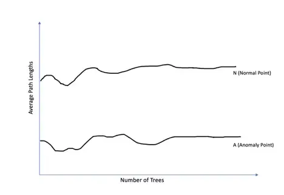

# What is an Anomaly?

An __anomaly__ is a pattern in the data that does not conform to expected behavior.

* It is also referred to as exceptions, peculiarities, surprises, etc.

Alternative more formal definitions:

* Given a database $D$, find all points  $x \in D$ with an anomaly level above a threshold $t$
* Given a database $D$, find all points  $x \in D$ having the top-n levels of anomaly
* Given a database $D$, containing mainly "normal" points (but not classified as such), and a test point $x$, calculate the level of anomaly for  $x$ with respect to $D$

Historically, the field of statistics has sought to find and remove outliers to improve analysis

- Today there are many fields in which outliers/anomalies are the objects of greatest interest

# Causes of Anomalies

__Data from different classes__: an object may be different because it belongs to a different class

* The fraudster who stole a credit card follows a different purchase pattern from that of the legitimate owner
* Anomalies of this kind are often the object of research

__Natural variations__: many phenomena can be modeled with probabilistic distributions in which there is, although very small, a probability that a phenomenon with very different characteristics from others will occur

* A person who is 210cm tall is not anomalous because he or she belongs to a different class, but because his or her characteristic height takes on an "extreme" value relative to the population
* Anomalies of this kind are often of interest and the subject of study

__Measurement errors__: due to human or device errors

* The search for this type of anomaly is aimed at exclusion from the data set since it represents noise that may impair the quality of analysis results

# Anomaly Types: spot or punctual

An individual data instance is anomalous with respect to data

Anomalous points

# Anomaly Types: contextual

A single instance of data is anomalous within a context

* Requires a notion of context
* It is also referred to as conditional anomalies

# Anomaly Types: collective

A set of related data instances is anomalous

Requires a relationship between data instances

* Sequential data
* Spatial data
* Graph data

Individual instances within a collective anomaly are not anomalous by themselves

# Examples of Application

__Data from different classes__

* The fraudster who stole a credit card follows a different purchase pattern from that of the legitimate owner
* Anomalies of this kind are often the object of research

__Intrusion detection__

* Monitor events occurring in a computer system or network and analyze them for intrusion

__Fraud detection__

* Credit card fraud, insurance fraud, cellular fraud, insider trading, etc.

__Healthcare/medical diagnosis__

* Detection of abnormal data in Electronic Health Records (EHRs)
* Detection of disease outbreaks, instrumentation errors, etc.

__Industrial damage detection__

* Detecting failures and malfunctions in complex industrial systems, structural damage, intrusions in electronic security systems, suspicious events in video surveillance, abnormal energy consumption, etc.

# Anomaly Detection Approaches

Supervised anomaly detection

* Labels are available for both normal and anomaly data
* Similar to classification with high class imbalance

Semi-supervised anomaly detection

* Labels are only available for "normal" data

Unsupervised anomaly detection

* Labels are not available
* Validation is complex since the real anomaly number is unknown

# Anomaly Detection Outputs

Label

* Each test instance is assigned a normality (normal) or abnormality (anomaly) label.
* Typical outcome of classification-based approaches

Score

* Each test instance is assigned an anomaly score
* Allows the instances to be sorted
* Requires an additional threshold parameter

Anomalies are the rare events, and this makes it very difficult to label these with high accuracy.

* __Swamping__ is the error of labelling normal events as anomalies.
* __Masking__ is the error of labelling anomalous events as normal.

# Statistical-based Approaches

Assume the existence of a parametric model that describes the distribution of the data (e.g., Gaussian Distribution)

A statistical test is performed in which the following are set.

* The parameters of the distribution (e.g., Mean and StdDev)
* The expected number of outliers or equivalently a probability threshold value
* Points that have a sufficiently small probability are considered outliers

Limitations: Data distributions are very complex or unknown

::::{.columns}
:::{.column width="50%"}

:::
::: {.column width="50%"}

:::
::::

# Distance-based Approaches

Data are represented by feature vectors

A point is an outlier if it is distant from the majority of other points

* PROS: a distance function is easier to define with respect to a data distribution function

__In a distance-based approach__: the outlier score of a point $x$ is calculated as the distance of its k-nearest neighbor

* The score depends on the value of $k$
  * If $k$ is too small a set of neighboring outliers may result in a low outlier score and be considered a normal cluster (_masking_)
  * If $k$ is too large on the contrary all points in a normal cluster can become outliers (_swamping_)
* To make the approach more robust with respect to the value of $k$ it is convenient to use the average distance of the point from the first k-nearest neighbors as the score

# Distance-based Approaches

::::{.columns}
:::{.column width="33%"}

:::
::: {.column width="33%"}

:::
::: {.column width="33%"}

:::
::::

Using the average distance over the first 5 neighbor would determine a lower outlier score for $c$

# Distance-based Approaches

::::{.columns}
:::{.column width="33%"}

:::
::: {.column width="33%"}

:::
::: {.column width="33%"}

:::
::::

# Distance-based Approaches: considerations

Have $O(N^2)$ complexity where $N$ is the dataset cardinality

- Are sensible to the $k$ value
- Cannot handle datasets with variable density

$C$ is properly identified, but what about $D$?

# Density-based Approaches

In a density-based approach: an outlier is an element of the data set located in an area of very low density

* Density-based approaches are similar to distance-based approaches since density is defined in terms of the distance of a point from its neighbors
* The density of an element $x$ of a dataset $D$ is calculated as the inverse of the average of the distances to its $k$-nearest neighbors

$density(x) = \frac{|N(x, k)|}{\sum_{y \in N(x, k)} dist(x, y)}$

* where $N(x, k)$ is the set of $k$-NN of $x$ and $|...|$ denotes the cardinality of the set
* Alternatively, the concept of density used in DBSCAN could be used

# Density-based Approaches

The previous definition of density has the same limitations as techniques based on the distance/proxy concept: it does not allow handling datasets with heterogeneous densities

- To overcome this limitation, it is necessary to define the concept of relative density defined as a function of the density of its neighbors

$AVGRelDensity(x,k) = \frac{density(x, k)}{\frac{1}{|N(x, k)|} \sum_{y \in N(x, k)} density(y, k)}$

Using the concept of relative density, outliers can be effectively identified even for data sets with varying densities

Relative density is used to locally measure the tendency of a point to be an oulier __Local Outlier Factor__ (LOF)

# Isolation Forest

Isolation Tree (iTree): binary tree in which each node in the tree has exactly zero or two child nodes

* The goal is to create partitions each including one point
* It uses the observation that outliers are more likely to be isolated with fewer steps than normal points.

Isolation Forest (iForest) Algorithm: __Unsupervised__ machine learning algorithm inspired by random forest.

* There is _no need to profile normal instances_ and _compute distances_ based on the points
* Constructs a set of _random trees_ based on a mechanism called "isolation," an iterative process of (_random_) partitioning to separate outliers from normal points.
* __NOTE__: differently from decision trees split attributes and split values are randomly chosen. This makes iTree fast to be computed because we do not have to test all the attributes and all the values at each iteration.

# Isolation Forest: iTree example

2-dimensional example $(d = 2)$, the outlier point $H$ is isolated in one step

# Isolation Forest: iTree example

# Isolation Forest: iTree example

# Isolation Forest: iTree example

# From iTree to iForest

Ensemble method: generate multiple iTrees → iForest

Path length of an observation obtained as the sum of:

- Total number of divisions needed to isolate it
- Adjustment term to be added if the observation ends at an external node. (Takes into account an unbuilt subtree beyond a tree height limit L → saves computation time)

# From iTree to iForest

Calculates average path lengths $(\bar{h}(x_i))$ for each observation $x_i$

- Calculation of anomaly scores: $s(x_i) = 2^{-\frac{\bar{h}(x_i)}{L}} \in [0, 1]$
- Normalization for the average (universal) path length L in a binary tree

# From iTree to iForest

# iForest Subsampling

Most of the anomaly detection algorithms work well with large number of data instances. Large training data helps in profiling the normal instances better and the instances not aligned to these profiles are labelled as outliers.

Isolation forests _are not required to grow the tree to isolate every normal data instance_ as the anomaly data points are isolated much earlier than the normal data instances. Normal data instances constitute the majority of the training data points.

* iTrees are grown to a $L$ depth

__Isolation forests works best when small sampling size is used__. When the sample size is large, the normal instances are too close to the anomalies.

* The subsamples used have less densely populated data points making it easier for detecting the anomalous points.
* As each tree uses different subsamples, each individual tree also identifies different sets of anomalies.

# iForest Subsampling

::::{.columns}
:::{.column width="50%"}

:::
::: {.column width="50%"}

:::
::::