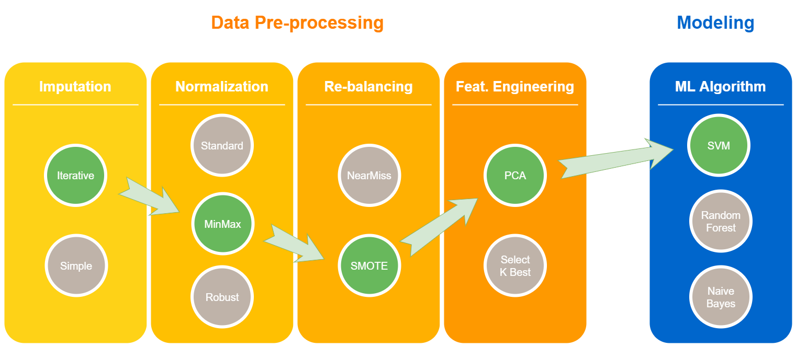
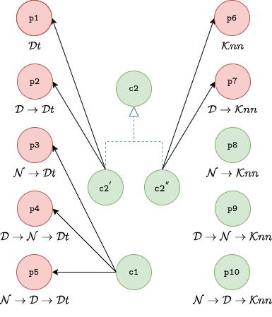
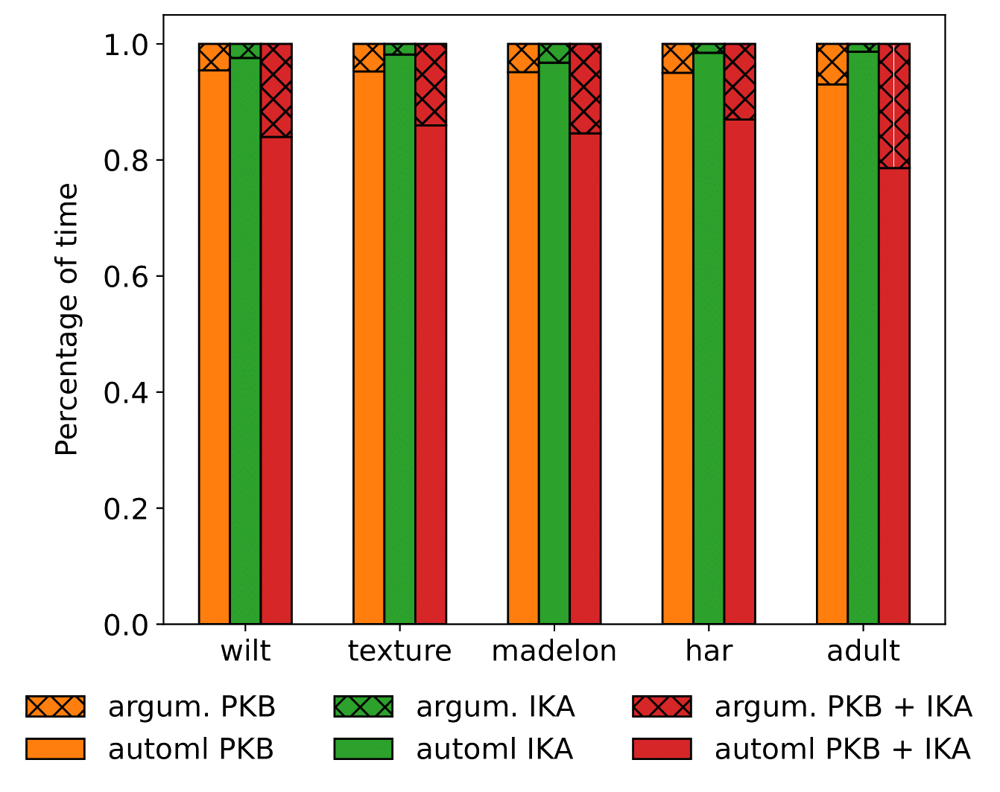

# Tuning Data Pipelines

# CRISP-DM

::::{.columns}
:::{.column width="50%"}
The **CR**oss **I**ndustry **S**tandard **P**rocess for **D**ata **M**ining (_CRISP-DM_) is a process model that serves as the base for a [data science process](https://www.datascience-pm.com/data-science-process/). 

It has six sequential phases:

1. *Business understanding* -- What does the business need?
1. *Data understanding* -- What data do we have / need? Is it clean?
1. *Data preparation* -- How do we organize the data for modeling?
1. *Modeling* -- What modeling techniques should we apply?
1. *Evaluation* -- Which model best meets the business objectives?
1. *Deployment* -- How do stakeholders access the results?
:::
:::{.column width="50%"}

:::
::::

# Pipelines for ML tasks



# Pipelines for ML tasks

::::{.columns}
:::{.column width="50%"}
Tuning pipelines is hard

* At each **step**, a technique must be selected
* For each technique, a set of **hyper-parameters** must be set
* Each **hyper-parameter has its own search space**
:::
:::{.column width="50%"}

:::
::::

# Pipelines for ML tasks

![HAMLET: [@francia2023hamlet]](img/tuningdp/phdslides_217.png)

# AutoML

::::{.columns}
:::{.column width="50%"}
AutoML aims at automating the ML pipeline instantiation:

* it is difficult to consider all the constraints together;
* it is not transparent;
* it doesn't allow a proper knowledge augmentation.

Examples of AutoML tools:

- Auto-WEKA [@thornton2013auto]
- Auto-sklearn [@feurer2022auto]
:::
:::{.column width="50%"}
![HAMLET: [@francia2023hamlet]](img/tuningdp/phdslides_217.png)
:::
::::

# HAMLET

::::{.columns}
:::{.column width="50%"}
[HAMLET](https://github.com/QueueInc/HAMLET): Human-centric AutoML via Logic and Argumentation

* Logic to give a structure to the knowledge;
* Argumentation to deal with inconsistencies, and revise the results.
:::
:::{.column width="50%"}
![HAMLET: [@francia2023hamlet]](img/tuningdp/phdslides_221.png)
:::
::::

# HAMLET

::::{.columns}
:::{.column width="50%"}
The LogicalKB enables:

* the Data Scientist to structure the ML constraints;
* the AutoML tool to encode the explored results

:::
:::{.column width="50%"}
![HAMLET: [@francia2023hamlet]](img/tuningdp/phdslides_222.png)
:::
::::

# HAMLET

::::{.columns}
:::{.column width="50%"}
The Problem Graph allows to:

* consider all the ML constraints together;
* set up the AutoML search space;
* discuss and argument about the results.
:::
:::{.column width="50%"}
![HAMLET: [@francia2023hamlet]](img/tuningdp/phdslides_223.png)
:::
::::

# HAMLET

::::{.columns}
:::{.column width="50%"}
The Data Scientist iterates on:

* editing the LogicalKB;
* consulting the Problem Graph;
* running the AutoML tool;
* discussing the AutoML insights.
:::
:::{.column width="50%"}
![HAMLET: [@francia2023hamlet]](img/tuningdp/phdslides_224.png)
:::
::::

# KB and Problem Graph

::::{.columns}
:::{.column width="50%"}
```java
// Declare steps pipeline
s1 : ⇒ step(D).
s2 : ⇒ step(N).
s3 : ⇒ step(Cl).

// Declare classification algorithms
a1 : ⇒ algorithm(Cl, Dt).
a2 : ⇒ algorithm(Cl, Knn).
```
:::
:::{.column width="50%"}

:::
::::

# KB and Problem Graph

::::{.columns}
:::{.column width="50%"}
```java
// Declare steps pipeline
s1 : ⇒ step(D).
s2 : ⇒ step(N).
s3 : ⇒ step(Cl).

// Declare classification algorithms
a1 : ⇒ algorithm(Cl, Dt).
a2 : ⇒ algorithm(Cl, Knn).

// Forbid Normalization when using DT
c1 : ⇒ forbidden(⟨N⟩, Dt).
```
:::
:::{.column width="50%"}

:::
::::

# KB and Problem Graph

::::{.columns}
:::{.column width="50%"}
```java
// Declare steps pipeline
s1 : ⇒ step(D).
s2 : ⇒ step(N).
s3 : ⇒ step(Cl).

// Declare classification algorithms
a1 : ⇒ algorithm(Cl, Dt).
a2 : ⇒ algorithm(Cl, Knn).

// Forbid Normalization when using DT
c1 : ⇒ forbidden(⟨N⟩, Dt).

// Mandatory Normalization in Classification Pipelines
c2 : ⇒ mandatory(⟨N⟩, Cl).
```
:::
:::{.column width="50%"}

:::
::::

# KB and Problem Graph

::::{.columns}
:::{.column width="50%"}
```java
// Declare steps pipeline
s1 : ⇒ step(D).
s2 : ⇒ step(N).
s3 : ⇒ step(Cl).

// Declare classification algorithms
a1 : ⇒ algorithm(Cl, Dt).
a2 : ⇒ algorithm(Cl, Knn).

// Forbid Normalization when using DT
c1 : ⇒ forbidden(⟨N⟩, Dt).

// Mandatory Normalization in Classification Pipelines
c2 : ⇒ mandatory(⟨N⟩, Cl).
```

**Conflict** between c1 and c2!
:::
:::{.column width="50%"}

:::
::::

# KB and Problem Graph

::::{.columns}
:::{.column width="50%"}
```java
// Declare steps pipeline
s1 : ⇒ step(D).
s2 : ⇒ step(N).
s3 : ⇒ step(Cl).

// Declare classification algorithms
a1 : ⇒ algorithm(Cl, Dt).
a2 : ⇒ algorithm(Cl, Knn).

// Forbid Normalization when using DT
c1 : ⇒ forbidden(⟨N⟩, Dt).

// Mandatory Normalization in Classification Pipelines
c2 : ⇒ mandatory(⟨N⟩, Cl).

// Resolve conflict between c1 and c2
sup(c1, c2).
```
:::
:::{.column width="50%"}

:::
::::

# Evaluation

Settings:

* **Baseline**: 1 optimization it. of 60 mins;
* **PKB** (Preliminary Knowledge Base):  1 optimization it. of 60 mins with non-empty LogicalKB;
* **IKA** (Iterative Knowledge Augmentation): 4 optimization it. of 15 mins with empty LogicalKB;
* **PKB \+ IKA:** 4 optimization it. of 15 mins  with non-empty LogicalKB.


# Evaluation


Settings:

* **Baseline**: 1 optimization iteration of 60 mins;
* **PKB** (Preliminary Knowledge Base): 1 optimization iteration of 60 mins with non-empty LogicalKB;
* **IKA** (Iterative Knowledge Augmentation): 4 optimization iterations of 15 mins with empty LogicalKB;
* **PKB \+ IKA:** 4 optimization iterations of 15 mins with non-empty LogicalKB.



Comparison with AutoML tools

# Evaluation


# HAMLET

::::{.columns}
:::{.column width="50%"}
Key features:

* knowledge injection;
* representation via an human- and
* machine-readable medium;
* insight discovery;
* dealing with possible arising inconsistencies.

Future directions:

* make constraints fuzzy;
* improve recommendation algorithm;
* enhance HAMLET with meta-learning;
* manage cross-cutting constraints  (e.g., ethic, legal).
:::
:::{.column width="50%"}
![HAMLET: [@francia2023hamlet]](img/tuningdp/phdslides_233.png)
:::
::::

# References