# Decision Tree


::::{.columns}
:::{.column width=60%}
One of the most widely used classification techniques

- It represents a set of classification rules with a *tree*.
- A hierarchical structure consisting of *nodes* connected by labeled and oriented *arcs*.

There are two types of nodes:

- *Leaf nodes* (i.e., nodes with no children) identify classes
- The remaining nodes are labeled based on the attribute that partitions the records.
    - The partitioning criterion represents the label of the arcs

Each root-leaf path represents a classification rule.
:::
:::{.column width=40%}
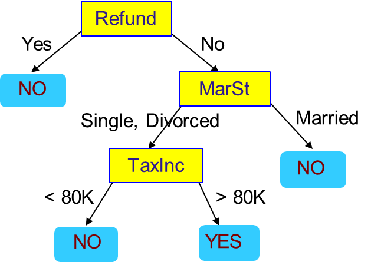
:::
::::

# Decision Tree: an Example

::::{.columns}
:::{.column width=50%}
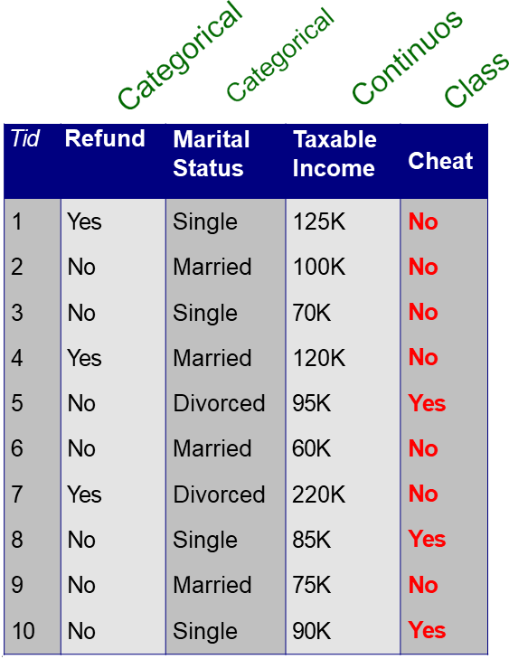
:::
:::{.column width=50%}

:::
::::

For each dataset, several decision trees could be defined.

# Decision Tree: an Example

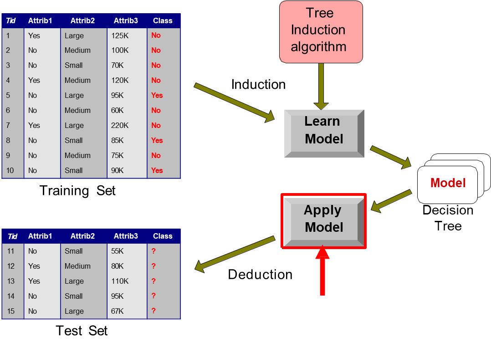

# Applying the model

::::{.columns}
:::{.column width=50%}
Test Data

| Refund | Marital Status | Taxable Income | Cheat |
| :-: | :-: | :-: | :-: |
| No | Married | 80K | __?__ |
:::
:::{.column width=50%}
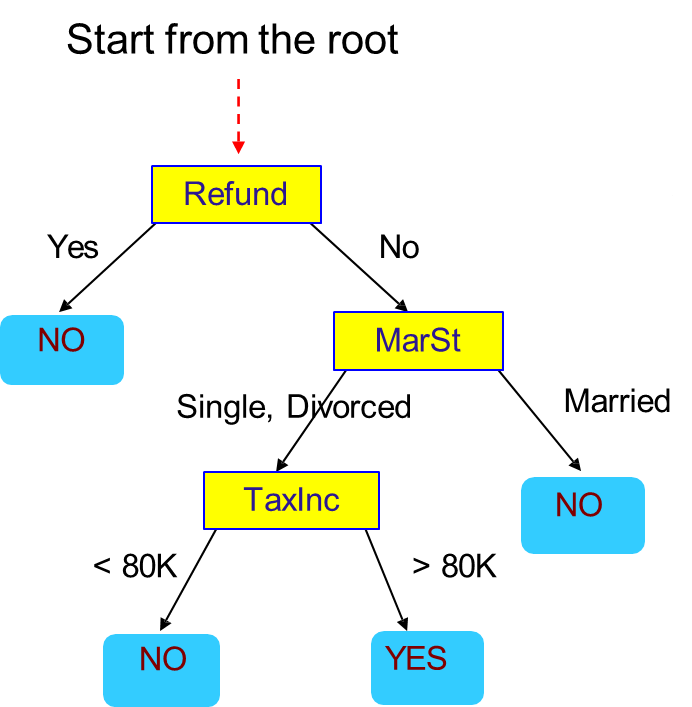
:::
::::

# Applying the model

::::{.columns}
:::{.column width=50%}
Test Data

| _Refund_ | Marital Status | Taxable Income | Cheat |
| :-: | :-: | :-: | :-: |
| No | Married | 80K | __?__ |
:::
:::{.column width=50%}

:::
::::

# Applying the model

::::{.columns}
:::{.column width=50%}
Test Data

| _Refund_ | Marital Status | Taxable Income | Cheat |
| :-: | :-: | :-: | :-: |
| _No_ | Married | 80K | __?__ |
:::
:::{.column width=50%}
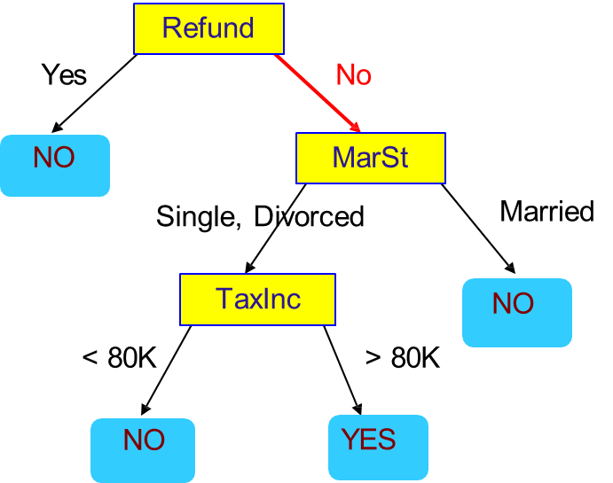
:::
::::

# Applying the model

::::{.columns}
:::{.column width=50%}
Test Data

| _Refund_ | _Marital Status_ | Taxable Income | Cheat |
| :-: | :-: | :-: | :-: |
| _No_ | Married | 80K | __?__ |
:::
:::{.column width=50%}

:::
::::

# Applying the model

::::{.columns}
:::{.column width=50%}
Test Data

| _Refund_ | _Marital Status_ | Taxable Income | Cheat |
| :-: | :-: | :-: | :-: |
| _No_ | _Married_ | 80K | __?__ |
:::
:::{.column width=50%}

:::
::::

# Applying the model

::::{.columns}
:::{.column width=50%}
Test Data

| _Refund_ | _Marital Status_ | Taxable Income | Cheat |
| :-: | :-: | :-: | :-: |
| _No_ | _Married_ | 80K | **No** |
:::
:::{.column width=50%}

:::
::::

# Learning the model

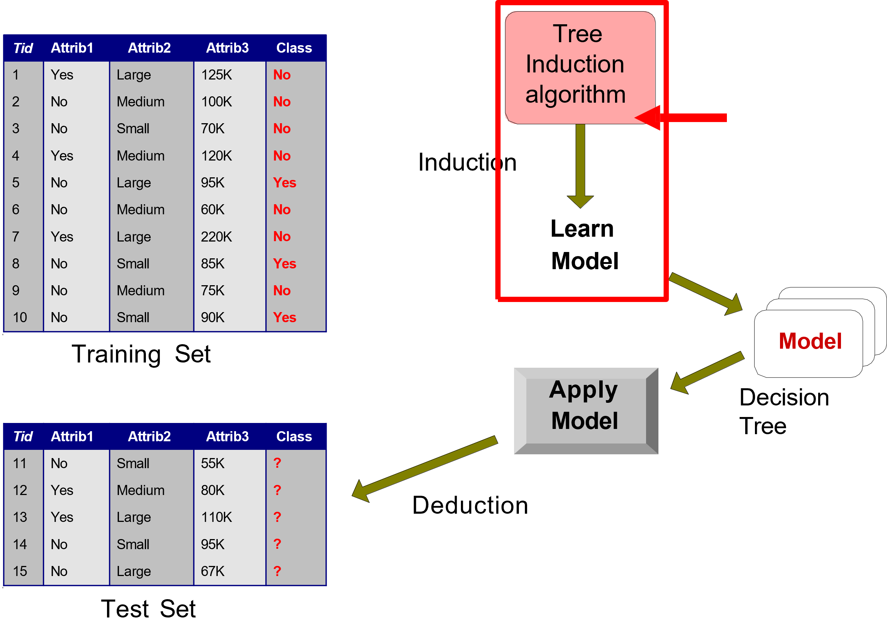

# Learning the model

The decision tree grows exponentially with the number of attributes. Algorithms generally use greedy techniques that locally make the "best" choice.

Many algorithms are available:

- Hunt's Algorithm
- CART
- ID3, **C4.5**
- Sliq, SPRINT

Different issues have to be addressed.

- Data Fragmentation
- Search Criteria
- Expression
- Choice of the split policy
- Choice of the stop policy
- Underfitting/Overfitting
- Replication of trees

# The Hunt's Algorithm

::::{.columns}
:::{.column width=20%}


:::
:::{.column width=80%}

Recursive approach that progressively subdivides a set of $D_t$ records into pure record sets

- Let $D_t$ be the set of records of the training set corresponding to $node_t$ and $y_t = \{y_1, ..., y_k\}$ the possible class labels

Overall procedure:

- If $D_t$ contains records belonging to the $y_j$ class only, then $node_t$ is a leaf with label $y_j$
- If $D_t$ is an empty set, then $node_t$ is a leaf node to which a parent node class is assigned
- If $D_t$ contains records belonging to several classes, you choose an _attribute_ and a _split policy_ to partition the records into multiple subsets.
- Apply the current procedure for each subset recursively
:::
::::

# Pseudocode

```
// Let E be the training set and F the attributes
result=PostPrune(TreeGrowth(E,F));
TreeGrowth(E,F)
    if StoppingCond(E,F)= TRUE then
        leaf=CreateNode();
        leaf.label=Classify(E);
        return leaf;
    else
        root = CreateNode();
        root.test_cond  = FindBestSplit(E,F);
        let V = {v | v is a possible outcome of root.test_cond}
        for each v $\in$ V do
            Ev = {e | root.test_cond (e)=v and e  E}
            child = TreeGrowth(Ev,F);
            add child as descendants of root and label edge (rootchild) as v
        end for
    end if
    return root;
end;
```

# Further Remarks…

Finding an optimal decision tree is an NP-Complete problem, but many heuristic algorithms are available and very efficient.

- Most approaches run a top-down recursive partition based on greedy criteria

Classification using a decision tree is extremely fast and provides easy interpretation of the criteria.

- The worst case is $O(w)$ where $w$ is the depth of the tree

Decision trees are robust enough to handle strongly correlated attributes.

- One of the two attributes will not be considered
- It is also possible to try to discard one of the preprocessing attributes through appropriate feature selection techniques

# Further Remarks…

Decision tree expressivity is limited to the possibility of performing search space partitions with conditions that involve only one attribute at a time.

- Decision boundary parallel to the axes


# Further Remarks…

Decision tree expressivity is limited to the possibility of performing search space partitions with conditions that involve only one attribute at a time.

- This split is not feasible with traditional decision trees


This split is not feasible with traditional decision trees.

# Characteristic features {background-color="#121011"}

Starting from the basic logic to completely define an algorithm for building decision trees, it is necessary to define:

- **The split condition**
- The criterion defining the best split
- The criterion for interrupting splitting
- Methods for evaluating the goodness of a decision tree

# Defining the Split Condition

Depends on the type of attribute

- Nominal
- Ordinal
- Continuous

Depends on the number of splits applicable to attribute values

- Binary splits
- N-ary splits

# Splitting Nominal Attributes

::::{.columns}
:::{.column width=50%}
*N-ary split*: creates as many partitions as there are attribute values


:::
:::{.column width=50%}
*Binary split*: creates two partitions only. The attribute value that optimally splits the dataset must be found.


:::
::::

# Splitting Ordinal Attributes

::::{.columns}
:::{.column width=50%}
*N-ary split*: creates as many partitions as there are attribute values


:::
:::{.column width=50%}
*Binary split*: creates two partitions only. The attribute value that optimally splits the dataset must be found.


:::
::::

# Splitting Continuous Attributes

::::{.columns}
:::{.column width=50%}
*N-ary split*: The split condition can be expressed as a Boolean test that results in multiple ranges of values. The algorithm must consider the entire possible range of values as possible split points

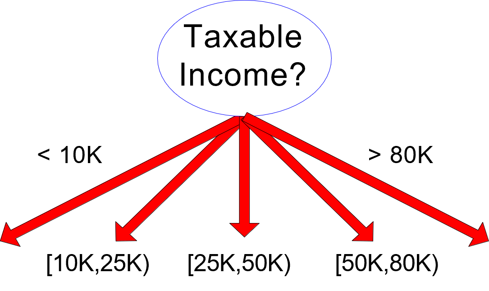
:::
:::{.column width=50%}
*Binary split*: The split condition can be expressed as a binary comparison test. The algorithm must consider all values as possible split points


:::
::::

# Splitting Continuous Attributes

A discretization technique can be used to manage the complexity of the search for optimal split points.

- __Static:__ discretization takes place only once before applying the algorithm
- __Dynamic:__ discretization takes place at each recursion step by exploiting information about the distribution of input data to the Dt node.

# Characteristic features {background-color="#121011"}

Starting from the basic logic to completely define an algorithm for building decision trees, it is necessary to define:

- The split condition
- **The criterion defining the best split**
- The criterion for interrupting splitting
- Methods for evaluating the goodness of a decision tree

# How to determine the best split value?

Before splitting a single class with 10 records in the C0 class and 10 records in the C1 class


The split criterion must allow you to determine more pure classes. It needs a measure of purity.

* Gini index
* Entropy
* Misclassification error

# How to determine the best split value?


# Impurity Measures

Given a node $p$ with records belonging to $k$ classes and its partitioning into $n$ child nodes

* $M$ = record number in father node $p$
* $M_i$ = number of records in son node $i$

__ATTENTION: do not confuse the number of classes (k) and that of child nodes (n)__

Several indices can be adopted.

* $GINI (i) = 1 - \sum_{j=1}^k[ p( j | i)]^2$ (adopted in CART, SLIQ, and SPRINT)
* $Entropy(i) = - \sum_{j=1}^k p(j | i) log(p(j | i))$ (adopted in ID3 e C4.5)
* $Misclassification~Error(i) = 1 - max_{j \in K} p(j|i)$

The total impurity of the split is given by the following formula, where meas () is one of the measures introduced so far.

* $Impurity_{split} = \sum_{i=1}^{n}\frac{m_i}{m}meas(i)$

# Comparing Impurity Measures


# Computing Gini for Binary Attributes

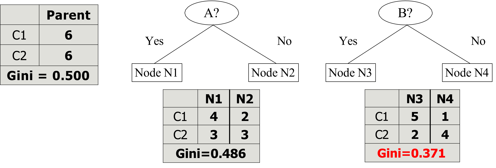

- $Gini(N3) = 1 - (\frac{5}{7})^2 - (\frac{2}{7})^2 = 0.408$
- $Gini(N4) = 1 - (\frac{1}{5})^2 - (\frac{4}{5})^2 = 0.320$
- $Impurity= \frac{7}{12} \cdot 0.408 + \frac{5}{12} \cdot 0.320= 0.371$

# Computing Gini for Categorical Attributes

It is usually more efficient to create a "count matrix" for each distinct value of the classification
attribute and then perform calculations using that matrix

| | CarType | |
| :-: | :-: | :-: |
| | __{Sports, Luxury}__ | __{Family}__ |
| __C1__ | 3 | 1 |
| __C2__ | 2 | 4 |
| Gini | __0.400__ | |

| | CarType | |
| :-: | :-: | :-: |
| | __{Sports}__ | __{Family, Luxury}__ |
| __C1__ | 2 | 2 |
| __C2__ | 1 | 5 |
| Gini | __0.419__ | |

| | CarType | | |
| :-: | :-: | :-: | :-: |
| | __Family__ | __Sports__ | __Luxury__ |
| __C1__ | 1 | 2 | 1 |
| __C2__ | 4 | 1 | 1 |
| Gini | __0.393__ | | |

# Computing Gini for Continuous Attributes

::::{.columns}
:::{.column width=20%}


:::
:::{.column width=80%}

It requires defining the split point using a binary condition. The number of possible conditions is equal to the number of distinct values of the attribute.

You can calculate a matrix count for each split value. The array will count the elements of each class for attribute values greater than or less than the split value.

A naive approach:

- For each split $v$ value, read the DB (with $N$ records) to build the count matrix and calculate the Gini index
- Computationally inefficient $O(N^2)$:
    - Scan DB: $O(N)$
    - Repeat for each value of $v$: $v \cdot O(N)$
:::
::::

# Computing Gini for Continuous Attributes

A more efficient solution is to:

- Sort records by attribute value
- Read the values sorted and update the count matrix, then calculate the Gini index
- Choose as the split point the value that minimizes the index


Further optimizations?

# Gain-based Split

Using class impurity measures such as Gini and Entropy requires choosing the split value that maximizes the "gain" in terms of reducing the impurity of the classes after the split.

For example, considering entropy, the gain of partitioning of a node into child nodes is:

$GAIN_{split}=Entropy(p)-(\sum_{i=1}^{n}\frac{m_i}{m}Entropy(i))$

Selecting the split value that maximizes GAIN tends to determine split criteria that generate a very large number of very pure classes, but with few records.

- Partitioning students according to their enrollment guarantees that all classes (formed by only one student) are totally pure

# Split based on split info

To avoid the problem of spraying classes, it is preferable to maximize the Gain Ratio:

- $N$ = number of child nodes
- $M$ = record number in father $p$
- $m_i$ = number of records in child node $i$

$GainRATIO_{split}=\frac{GAIN_{split}}{SplitINFO}$

$SplitINFO=-\sum_{i=1}^n\frac{m_i}{m}log\frac{m_i}{m}$

The higher the number of children, the greater the value of SplitInfo, with a consequent  reduction in the GainRatio

- For example, assuming that each child node contains the same number of records, SplitInfo = log n.
- C4.5 uses the SplitINFO-based criterion

# Split based on split info

To avoid the problem of spraying classes, it is preferable to maximize the Gain Ratio:

- $n \in [2, 64]$
- $m = 100$
- $m_i = \frac{m}{n}$

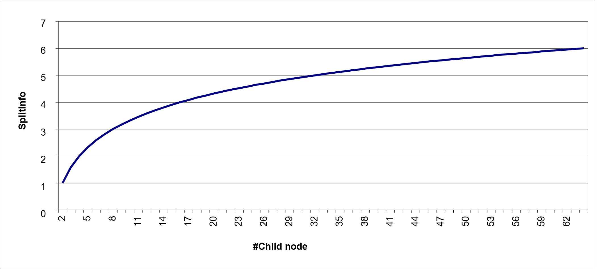

# Exercise

Compute the Gini index and information gain for the following binary problem and comment on the results.

| A | B | Clas | |
:-: | :-: | :-: | :-: | :-: |
| T | F | + | |
| T | T | + | |
| T | T | + | |
| T | F | - | |
| T | T | + | |
| F | F | - | |
| F | F | - | |
| F | F | - | |
| T | T | - | |
| T | F | - | |

# Characteristic features {background-color="#121011"}

Starting from the basic logic to completely define an algorithm for building decision trees, it is necessary to define:

- The split condition
- The criterion defining the best split
- **The criterion for interrupting splitting**
- Methods for evaluating the goodness of a decision tree

# Stop Criteria for Decision Tree Induction

- Stop splitting a node when all its records belong to the same class
- Stop splitting a node when all its records have similar values on all attributes
    - Classification would be unimportant and dependent on small fluctuations in values
- Stop splitting when the number of records in the node is below a certain threshold (data fragmentation)
    - The selected criterion would not be statistically relevant

# Characteristic features {background-color="#121011"}

Starting from the basic logic to completely define an algorithm for building decision trees, it is necessary to define:

- The split condition
- The criterion defining the best split
- The criterion for interrupting splitting
- **Methods for evaluating the goodness of a decision tree**

# Metrics for model evaluation

The Confusion Matrix evaluates the ability of a classifier based on the following indicators.

- $TP$ (true positive): records correctly classified as the Yes class
- $FN$ (false negative): Incorrectly classified records as class No
- $FP$ (false positive): Incorrectly classified records as class Yes
- $TN$ (true negative) records correctly classified as class No

| Predicted $\downarrow$ / Expected $\rightarrow$ | **Class=+** | **Class=-** |
| :-: | :-: | :-: |
| **Class=+** | TP | FN |
| **Class=-** | FP | TN |

If the classification uses n classes, the confusion matrix will be $n \cdot n$

# Accuracy

Accuracy is the most widely used metric to synthesize the information of a confusion matrix.

$Accuracy=\frac{TP + TN}{TP + TN + FP + FN}$

Equally, the frequency of the error could be used.

$Error~rate=\frac{FP + FN}{TP + TN + FP + FN}$

# Accuracy limitations

Accuracy is not an appropriate metric if the classes contain a very different number of records. Consider a binary classification problem in which

- #Record of class 0 = 9990
- #Record of class 1 = 10

A model that always returns class 0 will have an accuracy of $\frac{9990}{10000}$ = 99.9%

In the case of binary classification problems, the class "rare" is also called a positive class, while the class that includes most of the records is called a negative class.

# Precision and Recall

Precision and Recall are two metrics used in applications where _the correct classification of positive class records is more important_

- __Precision__ ($Precision = \frac{TP}{TP + FP}$) measures the fraction of record results that are actually positive among all those who were classified as such.
    - High values indicate that few negative class records were incorrectly classified as positive.
- __Recall__ ($Recall = \frac{TP}{TP + FN}$) measures the fraction of positive records correctly classified
    - High values indicate that few records of the positive class were incorrectly classified as negatives.


# Precision and Recall

::::{.columns}
:::{.column width=50%}
$Precision = 1$ if all the positive records were actually detected

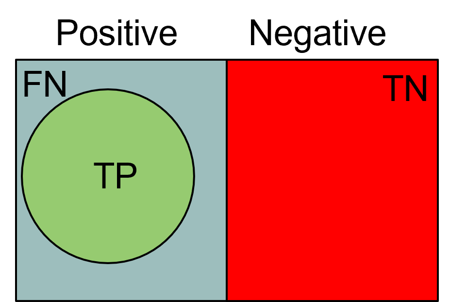
:::
:::{.column width=50%}
$Recall = 1$ if there are no false negatives


:::
::::

If both are valid 1, the predetermined classes coincide with the real ones.

# F-measure

A metric that summarizes precision and recall is called the F-measure ($\text{F-measure} = \frac{2 \cdot Precision \cdot Recall}{Precision + Recall} = \frac{2 \cdot TP}{2 \cdot TP + FP + FN}$).


F-measure represents the harmonic mean of precision and recall.

- The harmonic average between two x and y numbers tends to be close to the smallest of the two numbers.
- So if the harmonic average is high, it means both precision and recall are.
- ... so there have been no false negatives or false positives

# Cost-Based Evaluation

Accuracy, Precision, Recall, and F-measure classify an instance as positive if $P(+, i)>P(-, i)$.

- They assume that FN and FP have the same weight, thus they are Cost-Insensitive
- In many domains, this is not true!
    - For a cancer screening test, for example, we may be prepared to put up with a relatively high false positive rate in order to get a high true positive; it is most important to identify possible cancer sufferers
    - For a follow-up test after treatment, however, a different threshold might be more desirable, since we want to minimize false negatives; we don't want to tell a patient they're clear if this is not actually the case.


# The Cost Matrix

The cost matrix encodes the penalty that a classifier incurs in classifying a record in a different class.

A negative penalty indicates the "prize" that is obtained for a correct classification.

$C(M)=TP \cdot C(+|+) + FP \cdot C(+|- ) + FN \cdot C(- |+) + TN \cdot C(- |- )$


| Predicted $\downarrow$ / Expected $\rightarrow$ | **Class=+** | **Class=-** |
| :-: | :-: | :-: |
| **Class=+** | C(+\|+) | C(+\|-) |
| **Class=-** | C(-\|+) | C(-\|-) |

A model constructed by structuring, as a purity function, a cost matrix, will tend to provide a model with a minimum cost over the specified weights.

# Computing the Cost

::::{.columns}
:::{.column width=33%}

Costs

| Predicted $\downarrow$ / Expected $\rightarrow$ | **Class=+** | **Class=-** |
| :-: | :-: | :-: |
| **Class=+** | -1 | 100 |
| **Class=-** | 1 | 0 |
:::
:::{.column width=33%}

:::{.fragment}
Predictions of Model M1

| Predicted $\downarrow$ / Expected $\rightarrow$ | **Class=+** | **Class=-** |
| :-: | :-: | :-: |
| **Class=+** | 150 | 40 |
| **Class=-** | 60 | 250 |

- Accuracy = 80%
- Cost = 3910
:::

:::
:::{.column width=33%}

:::{.fragment}
Predictions of Model M2

| Predicted $\downarrow$ / Expected $\rightarrow$ | **Class=+** | **Class=-** |
| :-: | :-: | :-: |
| **Class=+** | 250 | 45 |
| **Class=-** | 5 | 200 |

- Accuracy = 90%
- Cost = 4255
:::

:::
::::

# ROC Space

ROC graphs are two-dimensional graphs that depict relative tradeoffs between benefits (true positives) and costs (false negatives) induced by a classifier. We distinguish between:

_Probabilistic classifiers_ return a score that is not necessarily a _sensu stricto_ probability but represents the degree to which an object is a member of one particular class rather than another one (e.g., Decision tree, Naïve Bayes)

- In a decision tree, an instance in a leaf is associated with the class + if the number of positive training instances in the leaf (_pos_) is greater than the number of negative instances (_neg_). The ratio _pos_/(_pos + neg_) can be used as a score showing the likelihood of an instance to be of class + or -

A _discrete classifier_ predicts only the classes to which a test object belongs (e.g., SVM)

The ROC curve characterizes a probabilistic classifier, and each point of this curve corresponds to a discrete classifier.

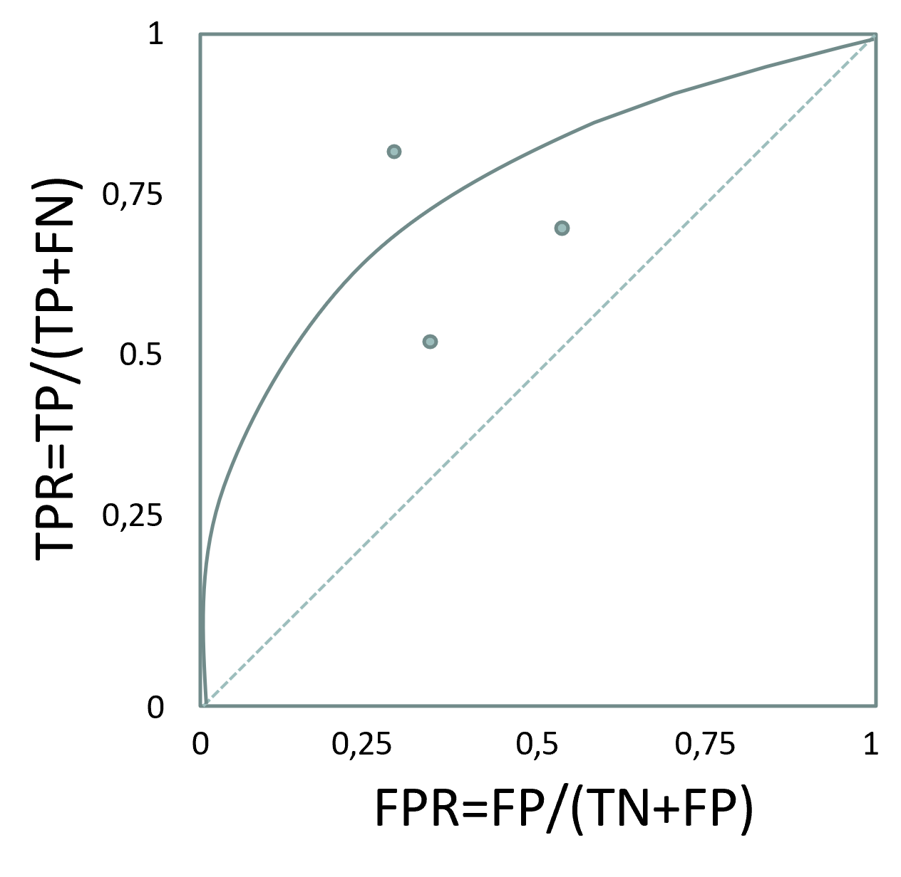

# ROC Space

A ROC graph for a probabilistic classifier is obtained by varying the threshold (or the probability if available) used to assign an instance $i$ to a class (+/-).

- Instead of: if $P(+,i) > P(-, i)$ than $i$ is $+$
- We have: if $P(+,i)> x$ than $i$ is $+$ (with $x \in [0, 1]$)

Each $x$ value determines a different TPR and FPR.

- The ROC curve shape depends both on the classifier capabilities and on the dataset features.

::::{.columns}
:::{.column width=50%}

:::
:::{.column width=50%}

:::
::::

# Understanding the ROC Space

::::{.columns}
:::{.column width=30%}
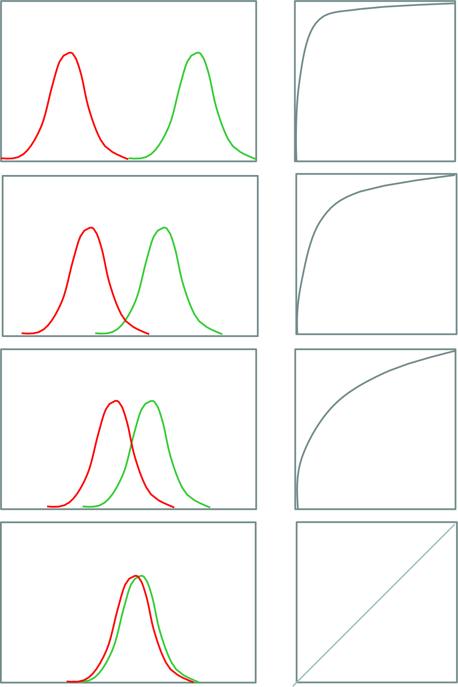
:::
:::{.column width=70%}
A good classifier tends to have performance close to the upper-left corner of the ROC graph, that is: High TPR and Low FPR

- The __Area Under the Curve__ (AUC) provides an overall rating of the classifier, while segments of the curve provide a rating in specific TPR - FPR settings.
- The larger the overlap between $+$ and $-$ instances' distributions, the harder it is for the classifier to distinguish between positive and negative instances.
- A dummy classifier performs on the ROC graph diagonal: the TPR is equal to the FPR since the classifier's answers are random
:::
::::

# Comparison of Classifiers via ROC curve


A classifier comparison based on ROC curves or AUC values can be either graphical or numerical.

- A ROC curve running above another is an indicator of better classifier performance, and by the same token, the bigger the AUC, the better the overall performance of the test.
- However, this reasoning is meaningful only if the two ROC curves do not cross at any point. If they do, then it makes intuitive sense to point out the region in which one classifier outperforms the other, but the comparison of the complete AUC values is not very informative.

* DALI is better than SW when a low FP rate is needed
* BLAST is always worse than DALI & SW

# ROC space properties

ROC curves are insensitive to changes in class distribution. If the proportion of positive to negative instances changes in a test set, the ROC curves will not change.

The class distribution is the relationship of the left (P) column to the right (N) column. Any performance metric that uses values from __both columns__ will be _inherently sensitive to class _skews_. Metrics such as accuracy, precision, and F-score use values from both columns of the confusion matrix. As a class distribution changes, these measures will change as well, even if the fundamental classifier performance does not.

ROC graphs are based upon TPR and FPR, in which each dimension is a strict columnar ratio, so they do not depend on class distributions.


# Where do ROC curves come from?

ROC stands for _Receiver Operator Characteristic_. The term has its roots in World War II. ROC curves were originally developed by the British as part of the “Chain Home” radar system. ROC analysis was used to analyze radar data to differentiate between enemy aircraft and signal noise (e.g., flocks of geese).


# Classification Errors

- __Training error:__ are mistakes that are made on the training set
- __Generalization error:__ errors are made on the test set (i.e., records that have not been trained on the system).
- __Underfitting:__ The model is too simple and does not allow a good classification of the training set or test set
- __Overfitting:__ The model is too complex, it allows a good classification of the training set, but a poor classification of the test set

    - The model fails to generalize because it is based on the specific peculiarities of the training set that are not found in the test set (e.g., noise present in the training set)

# Underfitting and Overfitting

::::{.columns}
:::{.column width=50%}

:::
:::{.column width=50%}

:::
::::

- 500 circles and 500 triangles
- Circular points: $0.5 < sqrt(x12+x22) \le 1$
- Triangular points: $sqrt(x12+x22) > 0.5~or~sqrt(x12+x22) < 1$

# Overfitting Due to Noise


# Overfitting due to the reduced size of the training set

Lack of points at the bottom of the chart makes it difficult to find a proper classification for that portion of the region.


# How to handle the Overfitting: pre-pruning (Early stopping rule)

Stop splitting before you reach a deep tree.

A node can not be split further if:

- Node does not contain instances
- All instances belong to the same class
- All attributes have the same values

More restrictive conditions potentially applicable are:

- Stop splitting if the number of instances in the node is less than a fixed amount
- Stop splitting if the distribution of instances between classes is independent of attribute values
- Stop splitting if you do not improve the purity measure (e.g., Gini or information gain).

# How to handle the Overfitting: post-pruning (Reduced Error Pruning)

- Run all possible splits
- Examine the decision tree nodes obtained with a bottom-up logic
- Collate a sub tree in a leaf node if this allows to reduce the generalization error (i.e., on the validation set)
    - Choose to collapse the sub-tree that determines the maximum error reduction (N.B. greedy choice)

Instances in the new leaf can be tagged.

- Based on the label that appears most frequently in the sub-trees
- According to the label that occurs most frequently in the instances of the training set that belong to the sub-tree

Post-pruning is more effective but involves more computational cost. It is based on the evidence of the result of a complete tree.

# Notes on Overfitting

Overfitting results in more complex decision-making trees than necessary

The classification error done on the training set does not provide accurate estimates about tree behavior on unknown records.

It requires new techniques to estimate generalization errors.

# Estimate generalization errors

A decision tree should minimize the error on the real data set; unfortunately, during construction, only the training set is available.

Then the real-time data error must be estimated.

- __Re-substitution error:__ number of errors in the training set
- __Generalization error:__ number of errors in the real data set

The methods for estimating the generalization error are:

- __Optimistic approach:__ $e'(t) = e(t)$
- __Pessimistic approach__
- __Minimum Description Length (MDL)__
- __Using the test set:__ The generalization error is equal to the error on the test set.

    - Normally, the test set is obtained by extracting from the initial training set 1/3 of the records
    - It offers good results, but the risk is to work with a too small training set

# Occam's Razor

Given two models with a similar generalization error, always choose the simplest one.

- For complex models, it is more likely that errors are caused by accidental data conditions

It is therefore useful to consider the complexity of the model when evaluating the goodness of a decision tree.

Note: The methodological principle was expressed in the 14th century by the English Franciscan philosopher and friar William of Ockham

# Minimum Description Length

Given two models, choose the one that minimizes the cost to describe a classification. To describe the model, I can:

- Sequentially send class $O(n)$
- Build a classifier, and send the description along with a detailed description of the mistakes it makes

$Cost(model, data)=Cost(model)+Cost(data|model)$

# Minimum Description Length


Datasets with n records described by 16 binary attributes and 3 class values

- Each inner node is modeled with the ID of the used attribute: $log_2(16)=4$ bits
- Each leaf is modeled with the ID of the class: $log_2(3)=2$ bits
- Each error is modeled with its position in the training set, considering n record: $log_2(n)$

Cost:

- Cost(Tree1)= $4 \cdot 2 + 2 \cdot 3 + 7 \cdot log_2(n) = 14 + 7  \cdot log_2(n)$
- Cost(Tree2)= $4 \cdot 4 + 2 \cdot 5 + 4 \cdot log_2(n) = 26 + 4  \cdot log_2(n)$
- Overall: Cost(Tree1) < Cost(Tree2) if n < 16

# Pessimistic approach

The generalization error is estimated by adding to the error on the training set a penalty related to the complexity of the model.

- $e(t_i)$: classification errors on leaf $i$

    - $\Sigma(t_i)$: leaf-related penalty $i$
    - $n(t_i)$ number of records in the training set belonging to leaf $i$

$E(T)=\frac{\sum_{i=1}^k e(t_i)+\Sigma(t_i)}{\sum_{i=1}^k n(t_i)}$

For binary trees, a penalty equal to 0.5 implies that a node should always be expanded into the two child nodes if it improves the classification of at least one record.

# Post Pruning: an example

::::{.columns}
:::{.column width=50%}
| Class | Instances|
| :-: | :-: |
| Class = Yes | 20 |
| Class = No | 10 |

:::
:::{.column width=50%}
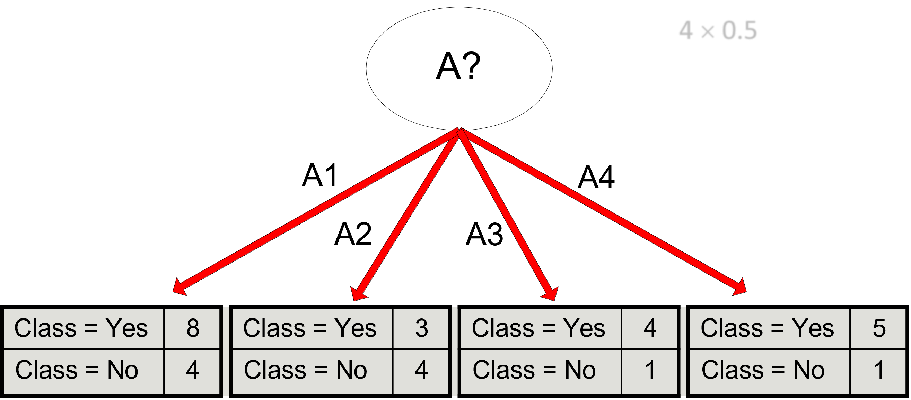
:::
::::

- Training error (before split) = $\frac{10}{30}$
- Pessimistic error = $\frac{10 + 0.5}{30} = \frac{10.5}{30}$
- Training error (after split) = $\frac{9}{30}$
- Pessimistic error (after splitting) = $\frac{9 + 4 \cdot 0.5}{30} = \frac{11}{30}$

PRUNE!

# Post Pruning: an example

::::{.columns}
:::{.column width=50%}
Optimistic error?

- Do not cut in any of the cases

Pessimistic error (penalty 0.5)?

- Do not cut in case 1, cut in case 2

Pessimistic error (penalty 1)?
:::
:::{.column width=50%}

:::
::::

# Building the Test Set

__Holdout__

Use $\frac{2}{3}$ of the training records and $\frac{1}{3}$ for validation.

Disadvantages:

* It works with a reduced set of training
* The result depends on the composition of the training set and test set

__Random subsampling__

It consists of a repeated execution of the holdout method, in which the training dataset is randomly selected.

# Building the Test Set

__Cross validation__

- Partition the records into separate k subdivisions
- Run the training on k-1 partitions and test the remainder
- Repeat the test k times and calculate the average accuracy
- CAUTION: cross-validation creates k different classifiers. Thus, validation indicates how much the type of classifier and its parameters are appropriate for the specific problem
- Built decision trees can have different split attributes and conditions depending on the character of the k-th training set

# Bootstrap

Unlike previous approaches, the extracted records are replaced. If the initial dataset consists of N records, you can create an N-record set in which each record has approximately a 63.2% probability of appearing (with N sufficiently large)

$1 - (1 - \frac{1}{N})^N = 1 - e^{-1} = 0.632$

- Records that are not used even once in the current training set form the validation set

The procedure is repeated $b$ times. Commonly, the model's accuracy is calculated as:

$Acc_{boot} = \frac{1}{b} \sum_{i=1}^b 0.632 \cdot Acc_i + 0.368 \cdot Acc_s$

where $Acc_i$ is the accuracy of the $i$-th bootstrap, $Acc_s$ is the accuracy of the complete dataset

The bootstrap does not create a (new) dataset with more information, but it can stabilize the obtained results of the available dataset. It is therefore particularly useful for small datasets.

# C4.5

Widely used Decision Tree algorithm. It extends ID3 and the Hunt Algorithm.

__Features:__

- Use GainRatio as a criterion for determining the split attribute
- It manages the continuous attributes by determining a split point that divides the range of values into two
- It manages data with missing values. Missing attributes are not considered to calculate GainRatio.
- It can handle attributes that are associated with different weights
- Run post-pruning of the created tree

__The tree construction stops when:__

- The node contains records belonging to a single class
- No attribute allows for determining a positive GainRatio
- Node does not contain records.

# Exercise

Using the classification error as a measure, identify which attribute should be chosen first, and which one per second.

- Compute contingency matrices
- Compute the information gain

How do the results change if you use the worst attribute as the split attribute?

Comment on the result.

| A | B | C | \# instances | |
| :-: | :-: | :-: | :-: | :-: |
| | | | + | - |
| T | T | T | 5 | 0 |
| F | T | T | 0 | 20 |
| T | F | T | 20 | 0 |
| F | F | T | 0 | 5 |
| T | T | F | 0 | 0 |
| F | T | F | 25 | 0 |
| T | F | F | 0 | 0 |
| F | F | F | 0 | 25 |
