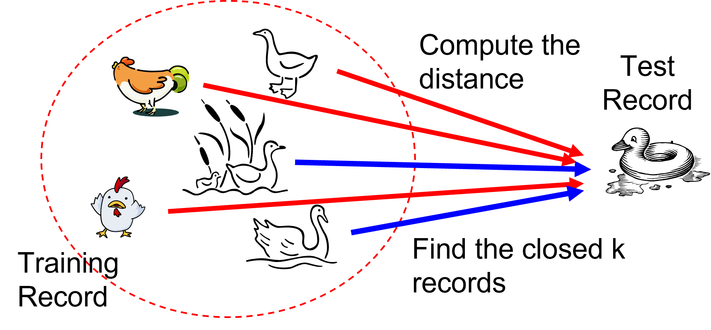
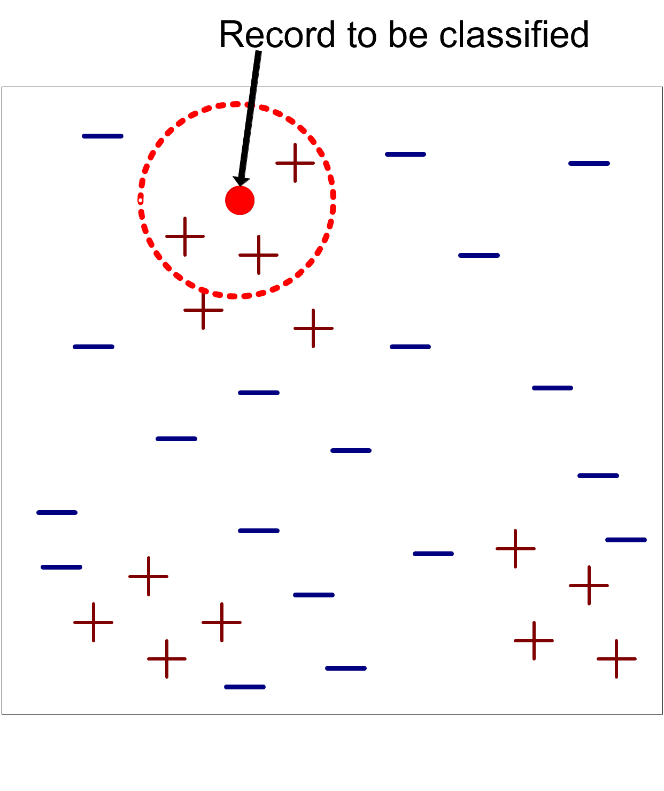

# K-nearest neighbors

K-nearest neighbors do not build models but classify new records based on their similarity to the examples in the training set.

They are called lazy-diligent learners as opposed to eager-diligent, impatient learners (rule-based, decision trees, neural networks, etc.).

* Nearest-Neighbor: ranks the record based on the most similar ones in the training set
* _If it walks like a duck, quacks like a duck, then it's probably a duck_

# Nearest Neighbor Classifier

Requirement:

* A training set
* A metric to calculate the distance between records
* The value of $k$, i.e., the number of neighbors to be used

The classification process:

* Calculates the distance to the records in the training set
* Identifies $k$ nearest neighbors
* Uses nearest neighbor class labels to determine the class of the unknown record (e.g., choosing the one that appears most frequently)

# Formal Definition

A record $z$ is classified according a _majority voting process_ using the $k$ elements $D_z$ of the training set $D$ that are closest/most similar to $z$

$\hat{y}=argmax_{y \in Y}\sum_{(x_i, y_i) \in D_z} I(y_i=y)$

* $Y$ is the set of class labels
* $I()$ returns 1 if its argument is TRUE, 0 otherwise

All the neighbors have the same weight.

* The algorithm is very sensitive to the value of $k$
* This risk can be reduced by weighing the contribution of neighbors by distance $w = \frac{1}{d(z,x_i)}$

# The $k$ value

The choice of $k$ is important because:

* If $k$ is too small, the approach is sensitive to noise
* If $k$ is too large, the surround may include examples belonging to other classes

Remember that to operate correctly, the attributes must have the same scale of values and thus must be normalized in pre-processing.

* Example: on which attribute is a difference of 0.5 worth more?
  * The height of an adult ranges from 1.5m to 2.1m
  * The weight of an adult varies from 40kg to 150kg
  * A person's salary ranges from 10K€ to 1M€.

# K-Nearest Neighbor: Pro & Cons

Pro

* Do not require the construction of a model
* Compared with rule-based or decision tree systems, they allow the construction of nonlinear class "contours" and are therefore more flexible

Cons

* Require a similarity or distance measure to assess closeness
* Require a pre-processing step to normalize the range of variation of attributes
* Class is locally determined and therefore susceptible to data noise
* Are very sensitive to the presence of irrelevant or related attributes that will distort distances between objects
* Classification cost can be high and depends linearly on the size of the training set in the absence of appropriate __index structures__

# The R-Tree Index Structure (Guttman, 1984)

R-trees are extensions of B+-trees to multi-dimensional spaces.

B+-trees organize objects into

* A set of nonoverlapping one-dimensional intervals
* They apply this principle recursively from the leaves to the root

R-trees organize objects into

* A set of overlapping multi-dimensional intervals (hyper-rectangles)
* They apply this principle recursively from the leaves to the root

R-trees are available in many commercial DBMSs, such as Oracle DMMS, since version 9

# R-Tree basic idea

- Recursive aggregation of objects based on minimum bounding rectangle - MBR
- Regions can overlap
- The 2-D range query must check objects in G/H/L MBRs only

